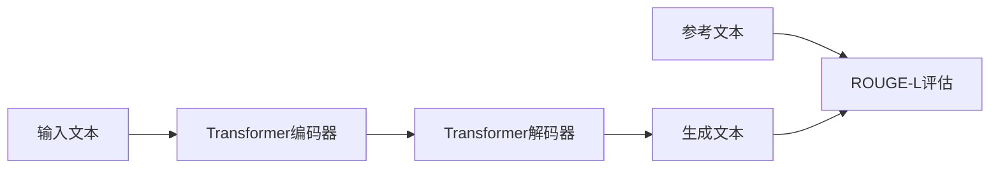

# Transformer大模型实战 理解ROUGE-L 指标

作者：禅与计算机程序设计艺术 / Zen and the Art of Computer Programming 

关键词：Transformer、大模型、ROUGE-L、评估指标、自然语言生成

## 1. 背景介绍
### 1.1  问题的由来
随着自然语言处理技术的飞速发展，特别是Transformer架构的提出，基于Transformer的大规模预训练语言模型如GPT、BERT等在多项NLP任务上取得了突破性进展。这些模型在文本生成、机器翻译、问答系统等领域展现出了令人瞩目的性能。然而，如何客观、准确地评估这些大模型生成文本的质量，一直是一个亟待解决的问题。传统的BLEU、METEOR等指标存在一定局限性，难以全面反映生成文本的流畅性、连贯性、信息完整性等特点。

### 1.2  研究现状
为了更好地评估自然语言生成系统的性能，研究者们提出了多种评估指标。其中，ROUGE (Recall-Oriented Understudy for Gisting Evaluation)系列指标因其简单、快速、与人工评估结果高度相关等优点，在文本摘要、机器翻译等任务中得到了广泛应用。ROUGE-L作为ROUGE家族的一员，通过计算生成文本与参考文本之间最长公共子序列(Longest Common Subsequence, LCS)的F1值来评估生成文本的质量。相比其他指标，ROUGE-L能更好地捕捉生成文本在句子层面的结构相似性。

### 1.3  研究意义
深入理解ROUGE-L指标的原理和计算方法，对于优化和改进基于Transformer的大模型在自然语言生成任务中的表现具有重要意义。通过分析ROUGE-L与其他评估指标的异同，研究者可以更全面地认识不同指标的适用场景和局限性，为选择合适的评估方案提供参考。此外，探索提升ROUGE-L指标的方法，如引入语义相似度、优化解码策略等，有助于进一步提高生成文本的质量，推动自然语言生成技术的发展。

### 1.4  本文结构 
本文将围绕Transformer大模型和ROUGE-L指标展开深入探讨。首先，我们将介绍Transformer架构和ROUGE-L指标的核心概念与联系。然后，重点阐述ROUGE-L指标的算法原理和计算步骤，并通过数学模型和案例分析加深理解。接着，我们将给出ROUGE-L指标的代码实现，并详细解释关键代码。此外，本文还将讨论ROUGE-L指标在实际应用中的场景和局限性，推荐相关的工具和学习资源。最后，我们将总结ROUGE-L指标的研究现状，展望其未来发展趋势和面临的挑战。

## 2. 核心概念与联系
Transformer是一种基于自注意力机制(Self-Attention)的神经网络架构，已成为当前自然语言处理领域的主流模型。与传统的RNN、CNN等模型不同，Transformer通过引入多头自注意力机制和位置编码，能够更好地捕捉文本中的长距离依赖关系，在并行计算效率和训练稳定性方面也有显著优势。基于Transformer的大规模预训练语言模型，如GPT、BERT、XLNet等，在多项NLP任务上取得了state-of-the-art的表现。

ROUGE-L作为一种无需人工标注的自动评估指标，常用于评估由Transformer等模型生成的文本摘要、机器翻译结果等的质量。它通过计算生成文本与参考文本之间最长公共子序列(LCS)的F1值来衡量两个文本在句子层面的结构相似性。直观地说，如果生成文本与参考文本的LCS越长，说明二者在语法结构、词序等方面越接近，生成文本的质量也越高。与BLEU、METEOR等基于n-gram匹配的指标相比，ROUGE-L对生成文本的连贯性和流畅性更敏感。

下图展示了Transformer模型与ROUGE-L指标在自然语言生成任务中的关系：

可以看出，Transformer模型根据输入文本生成摘要、翻译等结果，而ROUGE-L指标则用于评估生成文本与参考文本之间的相似度，为优化模型性能提供依据。二者相互配合，共同推动自然语言生成技术的发展。

## 3. 核心算法原理 & 具体操作步骤
### 3.1  算法原理概述
ROUGE-L指标的核心是计算两个文本序列的最长公共子序列(LCS)。LCS问题是一个经典的动态规划问题，可以在O(mn)的时间复杂度内求解，其中m和n分别为两个序列的长度。

### 3.2  算法步骤详解
计算ROUGE-L指标的具体步骤如下：

1. 将生成文本和参考文本分别转换为单词序列 $X=\{x_1,x_2,...,x_m\}$ 和 $Y=\{y_1,y_2,...,y_n\}$。

2. 构建二维动态规划表 $dp$，其中 $dp[i][j]$ 表示 $X$ 的前 $i$ 个单词和 $Y$ 的前 $j$ 个单词的LCS长度。初始化 $dp[0][j]=0$，$dp[i][0]=0$。

3. 遍历动态规划表，填充每个状态的值：
$$
dp[i][j]=\begin{cases}
dp[i-1][j-1]+1, & \text{if}\ x_i=y_j \\
max(dp[i-1][j],dp[i][j-1]), & \text{otherwise}
\end{cases}
$$

4. LCS长度即为 $dp[m][n]$。记 $lcs(X,Y)=dp[m][n]$。

5. 计算ROUGE-L的Precision、Recall和F1值：
$$
P_{lcs}=\frac{lcs(X,Y)}{m},\quad R_{lcs}=\frac{lcs(X,Y)}{n} \\
F_{lcs}=\frac{(1+\beta^2)P_{lcs}R_{lcs}}{R_{lcs}+\beta^2P_{lcs}}
$$
其中，$\beta$ 是调和平均的参数，常取2，即Recall的权重是Precision的2倍。

### 3.3  算法优缺点
ROUGE-L算法的优点包括：
- 计算简单、速度快，适合大规模评估
- 能够较好地衡量生成文本在句子层面的结构相似性
- 与人工评估结果具有较高的相关性

但ROUGE-L也存在一些局限性：
- 无法考虑语义相似性，对同义词、反义词等缺乏区分
- 对于词序变化较大的文本，如同样意思的句子表述方式不同，评估结果可能偏低
- 没有考虑语法、句法等因素，难以全面评价生成文本的流畅性和可读性

### 3.4  算法应用领域
ROUGE-L指标广泛应用于以下领域：
- 文本摘要：评估自动摘要与人工摘要的相似度
- 机器翻译：评估机器翻译结果与参考翻译的相似度
- 对话系统：评估生成回复与参考回复的相似度
- 问答系统：评估生成答案与标准答案的相似度

## 4. 数学模型和公式 & 详细讲解 & 举例说明
### 4.1  数学模型构建
我们可以将寻找两个序列的LCS问题建模为一个二维动态规划问题。定义状态 $dp[i][j]$ 表示序列 $X$ 的前 $i$ 个元素和序列 $Y$ 的前 $j$ 个元素的LCS长度，其中 $0 \leq i \leq m$，$0 \leq j \leq n$。

状态转移方程为：
$$
dp[i][j]=\begin{cases}
0, & \text{if}\ i=0\ \text{or}\ j=0 \\
dp[i-1][j-1]+1, & \text{if}\ i,j>0\ \text{and}\ x_i=y_j \\
max(dp[i-1][j],dp[i][j-1]), & \text{if}\ i,j>0\ \text{and}\ x_i \neq y_j
\end{cases}
$$

### 4.2  公式推导过程
我们可以这样理解状态转移方程：

- 当 $i=0$ 或 $j=0$ 时，其中一个序列为空，LCS长度为0。
- 当 $i,j>0$ 且 $x_i=y_j$ 时，说明两个序列的最后一个元素相等，可以加入LCS，故 $dp[i][j]=dp[i-1][j-1]+1$。
- 当 $i,j>0$ 且 $x_i \neq y_j$ 时，说明两个序列的最后一个元素不等，不能同时加入LCS，此时LCS长度等于 $dp[i-1][j]$ 和 $dp[i][j-1]$ 的较大值。

根据以上状态转移方程，可以通过动态规划算法自底向上地填充二维表格，最终得到 $lcs(X,Y)=dp[m][n]$。

### 4.3  案例分析与讲解
举一个具体的例子，假设生成文本 $X=$"I have a dream that one day" ，参考文本 $Y=$"I have a dream that all men are created equal"。

首先将两个文本转换为单词序列：
- $X=${"I", "have", "a", "dream", "that", "one", "day"}
- $Y=${"I", "have", "a", "dream", "that", "all", "men", "are", "created", "equal"}

然后构建动态规划表，填充每个状态的值：

|   | 0 | I | have | a | dream | that | all | men | are | created | equal |
|---|---|---|------|---|-------|------|-----|-----|-----|---------|-------|
| 0 | 0 | 0 | 0    | 0 | 0     | 0    | 0   | 0   | 0   | 0       | 0     |
| I | 0 | 1 | 1    | 1 | 1     | 1    | 1   | 1   | 1   | 1       | 1     |
| have | 0 | 1 | 2 | 2 | 2 | 2 | 2 | 2 | 2 | 2 | 2 |
| a | 0 | 1 | 2 | 3 | 3 | 3 | 3 | 3 | 3 | 3 | 3 |
| dream | 0 | 1 | 2 | 3 | 4 | 4 | 4 | 4 | 4 | 4 | 4 |
| that | 0 | 1 | 2 | 3 | 4 | 5 | 5 | 5 | 5 | 5 | 5 |
| one | 0 | 1 | 2 | 3 | 4 | 5 | 5 | 5 | 5 | 5 | 5 |
| day | 0 | 1 | 2 | 3 | 4 | 5 | 5 | 5 | 5 | 5 | 5 |

可以看出，$lcs(X,Y)=dp[7][10]=5$，最长公共子序列为"I have a dream that"。

根据公式计算ROUGE-L的Precision、Recall和F1值：
$$
P_{lcs}=\frac{5}{7}=0.714,\quad R_{lcs}=\frac{5}{10}=0.500 \\
F_{lcs}=\frac{2 \times 0.714 \times 0.500}{0.714 + 0.500}=0.588
$$

### 4.4  常见问题解答
**Q**: ROUGE-L与BLEU、METEOR等指标相比有何优劣？

**A**: 与基于n-gram匹配的BLEU、METEOR等指标相比，ROUGE-L对生成文本的连贯性和流畅性更敏感，能够较好地衡量句子层面的结构相似性。但ROUGE-L也有其局限性，如无法考虑语义相似性，对词序变化较大的文本评估结果可能偏低。在实践中，通常需要综合多个指标进行评估。

**Q**: 如何提高ROUGE-L指标的值？

**A**: 提高ROUGE-L指标的一些思路包括：
- 优化模型架构和训练方法，如引入注意力机制、增大模型容量、使用更多训练数据等，提高生成文本的整体质量。
- 改进解码策略，如使用Beam Search、引入长度惩罚项等，生成更流畅、连贯的文本。
- 在