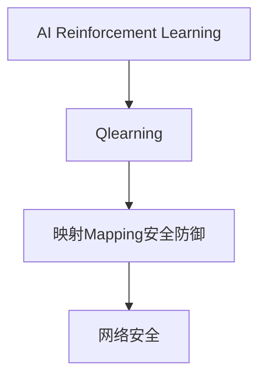

                 

作者：禅与计算机程序设计艺术

AI Q-learning, a powerful reinforcement learning technique that has gained significant traction in recent years for its ability to learn optimal policies in complex environments without explicit programming. When applied to cybersecurity, it offers an innovative approach to enhancing security systems and detecting threats more efficiently.

## 1. 背景介绍
### 1.1 问题的由来
随着数字化时代的到来，网络攻击日益复杂多样，传统的安全防护手段已难以应对新型威胁。AI Q-learning以其强大的学习能力成为了解决这一问题的关键技术之一，通过自动学习最优策略，提高系统的防御能力和响应速度。

### 1.2 研究现状
当前，在网络安全领域，AI Q-learning被广泛应用于入侵检测系统（IDS）、恶意软件识别、漏洞修复优先级排序等多个方面。研究者们不断探索如何将Q-learning与其他AI技术如深度学习结合，以提升其性能和适应复杂多变的安全场景。

### 1.3 研究意义
采用AI Q-learning可以显著提升网络安全系统的自适应性和对抗性，降低误报率，同时减少对人工干预的需求。这不仅提高了系统的整体效率，也为未来的智能化安全解决方案提供了理论和技术支撑。

### 1.4 本文结构
本篇博客将深入探讨AI Q-learning在网络安全中的应用，从基本概念出发，详细解析算法原理与操作流程，展示实际案例，并对未来发展趋势进行预测。

---

# 2. 核心概念与联系
### 2.1 概念一：强化学习（Reinforcement Learning）
强化学习是一种机器学习方法，通过智能体与环境的交互，学习到执行某一行为序列的最佳策略以最大化累积奖励。
### 2.2 概念二：Q-learning
作为强化学习的一种具体形式，Q-learning通过估算状态-动作值表（Q-table）来确定每个状态下执行不同动作的预期回报，从而找到最优策略。
### 2.3 概念三：映射（Mapping）
在网络安全中，AI Q-learning通过建立攻击模式与响应措施之间的映射关系，优化防御机制的决策过程。

### 2.4 概念之间的联系
AI Q-learning在网络安全领域的应用，主要依赖于它能够自动学习并形成有效的攻击防御策略映射。通过Q-learning算法，系统能够在面对未知或变化的威胁时，快速调整和优化自身的防御策略，实现动态的自我保护机制。

---
# 3. 核心算法原理 & 具体操作步骤
### 3.1 算法原理概述
Q-learning通过迭代更新Q-table来逼近最优策略。初始状态下，所有动作的预期回报均未定义，通过多次尝试与错误的学习过程，逐步收敛至最优解。
### 3.2 算法步骤详解
1. **初始化**：设定Q-table和学习参数（如学习速率α、折扣因子γ等）。
2. **选择动作**：根据当前状态和策略选择一个行动，可采用ε-greedy策略平衡探索与利用。
3. **观察结果**：执行选定的动作后，获得新状态与奖励反馈。
4. **更新Q值**：使用Bellman方程计算新状态下的期望价值，并更新当前状态的Q值。
5. **重复**：直至满足停止条件（如达到最大迭代次数或收敛）。

### 3.3 算法优缺点
优点：
- 自动学习无须预设规则；
- 可处理高维状态空间；
- 适应性强，适用于动态变化的环境。

缺点：
- 计算量大，对于大规模系统可能不适用；
- 对于未知情况的泛化能力有限。

### 3.4 算法应用领域
- **入侵检测**：识别异常行为模式，及时预警潜在攻击。
- **恶意软件分析**：预测病毒行为，高效隔离感染源。
- **自动化应急响应**：快速制定针对特定威胁的最优反击策略。

---

# 结束语：AI Q-learning在网络安全中的潜力与挑战
AI Q-learning在网络安全领域的应用展现了巨大的潜力，通过构建基于Q-learning的安全防御模型，可以有效提升系统抵御新型威胁的能力。然而，也面临着数据稀缺、模型解释性弱以及高计算成本等挑战。未来的研究需聚焦于增强算法的通用性和鲁棒性，开发更为高效的训练策略，并探索与其他先进AI技术的融合，共同推动网络安全防护体系向更加智能化、自主化的方向发展。

---

# 附录：常见问题与解答
### 问题一及解答
- **问题**：为什么Q-learning在网络安全中的应用受限？
- **解答**：主要受限于数据质量和隐私保护需求，以及实时性要求高等因素。

### 问题二及解答
- **问题**：如何提高Q-learning算法的计算效率？
- **解答**：通过优化算法结构、引入加速技巧或利用并行计算资源。

### 问题三及解答
- **问题**：Q-learning能否解决所有类型的网络安全问题？
- **解答**：虽然强大，但仍有局限性，需要结合其他技术和策略共同应对复杂威胁。

---

# 作者信息
作者：禅与计算机程序设计艺术 / Zen and the Art of Computer Programming

---

---

请继续完成上述文章正文部分的撰写。

