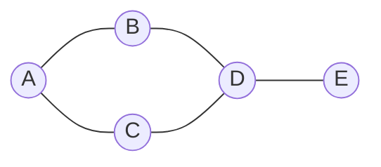

# 图神经网络原理与代码实战案例讲解

## 1. 背景介绍

### 1.1 问题的由来

在现实世界中,许多复杂系统都可以被抽象为由节点和边组成的网络结构,例如社交网络、蛋白质互作网络、交通网络等。传统的机器学习算法通常将这些网络数据进行扁平化处理,忽视了网络拓扑结构中蕴含的丰富信息。随着数据规模的不断增长和网络结构的日益复杂,有效地表示和处理网络数据成为一个迫切的需求。

### 1.2 研究现状

近年来,图神经网络(Graph Neural Networks, GNNs)作为一种新兴的深度学习模型,展现出了在处理网络结构数据方面的巨大潜力。图神经网络能够直接对网络数据进行端到端的学习,捕捉节点之间的拓扑结构信息,并将其融入节点表示中,从而有效地解决了传统方法的局限性。

### 1.3 研究意义

图神经网络在诸多领域展现出了优异的性能,如社交网络分析、化学分子建模、交通预测等,极大地推动了相关领域的发展。然而,由于图神经网络的理论复杂性,许多研究人员和工程师对其原理和实现细节仍存在一定的困惑。因此,深入探讨图神经网络的原理及其实现方式,对于推广和应用这一前沿技术具有重要意义。

### 1.4 本文结构

本文将全面介绍图神经网络的核心概念、算法原理、数学模型以及实战案例。首先,我们将阐述图神经网络的基本概念及其与传统神经网络的区别。接下来,详细讲解图神经网络的核心算法原理和数学模型。然后,通过代码实例和应用场景,帮助读者深入理解图神经网络的实现细节和实际应用。最后,我们将总结图神经网络的发展趋势和面临的挑战,并提供相关资源供读者进一步学习和研究。

## 2. 核心概念与联系

### 2.1 图(Graph)

图是一种非常重要的数据结构,由节点(Node)和边(Edge)组成。在图神经网络中,我们通常将待处理的数据抽象为一个图结构,其中节点可以表示不同的实体(如用户、产品、城市等),而边则表示节点之间的关系或交互。

### 2.2 图卷积(Graph Convolution)

图卷积是图神经网络中的核心操作,它类似于传统卷积神经网络中的卷积操作,但需要考虑图结构的特殊性。图卷积的目标是聚合每个节点的邻居信息,并将其融入节点的表示中,从而捕捉节点之间的拓扑结构信息。

### 2.3 消息传递(Message Passing)

消息传递是实现图卷积的一种常见范式。在这种范式下,每个节点会根据自身特征和邻居节点的特征,生成一个消息(Message)并传递给邻居节点。然后,每个节点会聚合收到的所有消息,并更新自身的表示。

### 2.4 概念之间的联系

图是图神经网络处理的基本数据结构。图卷积是图神经网络的核心操作,它通过消息传递机制来聚合每个节点的邻居信息,从而捕捉图结构中的拓扑信息,并将其融入节点的表示中。这三个概念紧密相连,共同构建了图神经网络的基础框架。

## 3. 核心算法原理与具体操作步骤

### 3.1 算法原理概述

图神经网络的核心算法原理可以概括为以下三个步骤:

1. **节点特征转换**: 对每个节点的初始特征进行线性变换,以获得更高维的节点表示。

2. **邻居聚合**: 通过消息传递机制,聚合每个节点的邻居节点的信息,捕捉图结构中的拓扑信息。

3. **节点表示更新**: 将聚合后的邻居信息与当前节点表示相结合,得到更新后的节点表示。

这三个步骤循环迭代多次,直至模型收敛或达到预设的迭代次数。

### 3.2 算法步骤详解

以下是图神经网络算法的具体步骤:

1. **初始化**: 为每个节点分配一个初始特征向量,表示节点的原始属性。

2. **节点特征转换**: 对每个节点的初始特征进行线性变换,得到更高维的节点表示:

$$\mathbf{h}_v^{(0)} = \mathbf{W}_0 \cdot \mathbf{x}_v$$

其中 $\mathbf{x}_v$ 是节点 $v$ 的初始特征, $\mathbf{W}_0$ 是可训练的权重矩阵, $\mathbf{h}_v^{(0)}$ 是节点 $v$ 的初始隐藏表示。

3. **邻居聚合**: 对于每个节点 $v$, 聚合其邻居节点的信息:

$$\mathbf{m}_v^{(k)} = \gamma^{(k)}\left(\left\{\mathbf{h}_u^{(k-1)}, \forall u \in \mathcal{N}(v)\right\}\right)$$

其中 $\mathcal{N}(v)$ 表示节点 $v$ 的邻居集合, $\gamma^{(k)}$ 是聚合函数(如平均、最大或注意力机制), $\mathbf{m}_v^{(k)}$ 是节点 $v$ 在第 $k$ 层收到的邻居消息。

4. **节点表示更新**: 将聚合后的邻居信息与当前节点表示相结合,得到更新后的节点表示:

$$\mathbf{h}_v^{(k)} = \phi^{(k)}\left(\mathbf{h}_v^{(k-1)}, \mathbf{m}_v^{(k)}\right)$$

其中 $\phi^{(k)}$ 是更新函数(如concatenation、sum或GRU),  $\mathbf{h}_v^{(k)}$ 是节点 $v$ 在第 $k$ 层的隐藏表示。

5. **重复步骤3和4**: 重复执行邻居聚合和节点表示更新,直至达到预设的迭代次数或模型收敛。

6. **输出层**: 根据任务需求,将最终的节点表示输入到相应的输出层(如分类器或回归器)中,得到预测结果。

### 3.3 算法优缺点

**优点**:

- 能够直接处理网络结构数据,捕捉节点之间的拓扑结构信息。
- 端到端的学习方式,无需手动设计特征。
- 具有很强的泛化能力,可应用于多种任务和领域。

**缺点**:

- 对于大规模图数据,计算和存储开销较大。
- 缺乏理论保证,模型的表现依赖于超参数设置和训练技巧。
- 对于异构图和动态图的处理仍存在一定挑战。

### 3.4 算法应用领域

图神经网络已被广泛应用于以下领域:

- **社交网络分析**: 预测用户行为、推荐好友、检测社区等。
- **生物信息学**: 预测蛋白质功能、构建分子指纹、drug-target interaction等。
- **计算机视觉**: 场景图像理解、人体姿态估计等。
- **交通预测**: 交通流量预测、路径规划等。
- **自然语言处理**: 知识图谱构建、关系抽取等。

## 4. 数学模型和公式详细讲解与举例说明

### 4.1 数学模型构建

图神经网络的数学模型可以形式化地表示为:

给定一个图 $\mathcal{G} = (\mathcal{V}, \mathcal{E})$, 其中 $\mathcal{V}$ 是节点集合, $\mathcal{E}$ 是边集合。每个节点 $v \in \mathcal{V}$ 都有一个初始特征向量 $\mathbf{x}_v \in \mathbb{R}^{d_x}$, 目标是学习一个节点表示函数 $f: \mathcal{V} \rightarrow \mathbb{R}^{d_h}$, 将每个节点 $v$ 映射到一个 $d_h$ 维的隐藏表示 $\mathbf{h}_v$, 以捕捉图结构中的拓扑信息。

具体地,图神经网络通过以下方式学习节点表示:

$$\mathbf{h}_v^{(k)} = \phi^{(k)}\left(\mathbf{h}_v^{(k-1)}, \gamma^{(k)}\left(\left\{\mathbf{h}_u^{(k-1)}, \forall u \in \mathcal{N}(v)\right\}\right)\right)$$

其中 $\gamma^{(k)}$ 是邻居聚合函数, $\phi^{(k)}$ 是节点更新函数, $\mathcal{N}(v)$ 表示节点 $v$ 的邻居集合。

通过多层迭代计算,图神经网络可以捕捉不同范围的邻居信息,并将其融入节点表示中。最终得到的节点表示 $\mathbf{h}_v^{(K)}$ 可用于下游任务,如节点分类、链接预测等。

### 4.2 公式推导过程

以下是图神经网络中一种常见的邻居聚合函数和节点更新函数的推导过程:

**邻居聚合函数**:

我们采用平均池化的方式聚合邻居信息:

$$\mathbf{m}_v^{(k)} = \mathrm{MEAN}\left(\left\{\mathbf{h}_u^{(k-1)}, \forall u \in \mathcal{N}(v)\right\}\right) = \frac{1}{|\mathcal{N}(v)|} \sum_{u \in \mathcal{N}(v)} \mathbf{h}_u^{(k-1)}$$

其中 $\mathbf{m}_v^{(k)}$ 表示节点 $v$ 在第 $k$ 层收到的邻居消息, $|\mathcal{N}(v)|$ 是节点 $v$ 的邻居数量。

**节点更新函数**:

我们使用门控循环单元(Gated Recurrent Unit, GRU)作为节点更新函数:

$$\begin{aligned}
\mathbf{r}_v^{(k)} &= \sigma\left(\mathbf{W}_r^{(k)} \cdot \left[\mathbf{h}_v^{(k-1)} \| \mathbf{m}_v^{(k)}\right]\right) \\
\mathbf{z}_v^{(k)} &= \sigma\left(\mathbf{W}_z^{(k)} \cdot \left[\mathbf{h}_v^{(k-1)} \| \mathbf{m}_v^{(k)}\right]\right) \\
\mathbf{n}_v^{(k)} &= \tanh\left(\mathbf{W}_n^{(k)} \cdot \left[\mathbf{r}_v^{(k)} \odot \mathbf{h}_v^{(k-1)} \| \mathbf{m}_v^{(k)}\right]\right) \\
\mathbf{h}_v^{(k)} &= \left(1 - \mathbf{z}_v^{(k)}\right) \odot \mathbf{n}_v^{(k)} + \mathbf{z}_v^{(k)} \odot \mathbf{h}_v^{(k-1)}
\end{aligned}$$

其中 $\sigma$ 是sigmoid激活函数, $\odot$ 表示元素wise乘积, $\|$ 表示向量拼接操作, $\mathbf{W}_r^{(k)}$, $\mathbf{W}_z^{(k)}$, $\mathbf{W}_n^{(k)}$ 是可训练的权重矩阵, $\mathbf{r}_v^{(k)}$, $\mathbf{z}_v^{(k)}$, $\mathbf{n}_v^{(k)}$ 分别是重置门、更新门和候选隐藏状态。

通过上述公式,图神经网络可以学习如何选择性地更新节点表示,并将邻居信息融入其中。

### 4.3 案例分析与讲解

让我们通过一个简单的示例来更好地理解图神经网络的工作原理。

假设我们有一个简单的社交网络,包含5个节点(用户)和6条边(友谊关系),如下图所示:

每个节点都有一个2维的初始特征向量,表示该用户的年龄和性别:

- $\mathbf{x}_A =