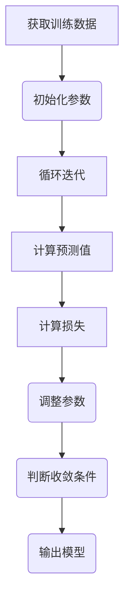
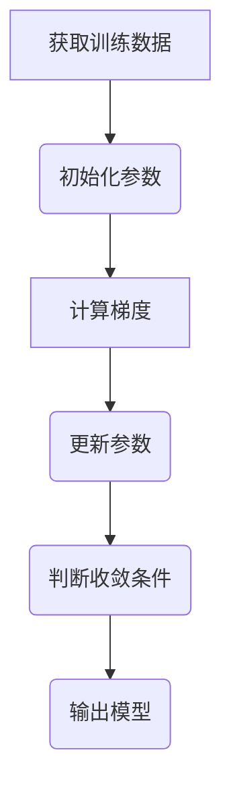

                 
# 监督学习(Supervised Learning) - 原理与代码实例讲解

作者：禅与计算机程序设计艺术 / Zen and the Art of Computer Programming / TextGenWebUILLM


# 监督学习(Supervised Learning) - 原理与代码实例讲解

作者：禅与计算机程序设计艺术 / Zen and the Art of Computer Programming

关键词：监督学习,机器学习,数据驱动,分类,回归,神经网络

## 1.背景介绍

### 1.1 问题的由来

在现实世界中，我们经常需要基于已知的数据集做出预测或决策。例如，在医疗诊断中，医生可能希望根据病人的症状和检查结果预测疾病的可能性；在金融投资中，分析师可能会利用历史市场数据预测股票价格走势。这些问题的核心是建立一个模型，该模型可以从已有的输入特征（如病人信息、股票指标）预测出相应的输出值（如疾病概率、股票价格变化）。这种从输入到输出的学习方法被称为**监督学习**。

### 1.2 研究现状

随着大数据和计算能力的发展，监督学习已经取得了显著进步，并在多个领域实现了广泛应用。常见的监督学习方法包括线性回归、支持向量机、决策树、随机森林、梯度提升树、神经网络等。这些方法各有优势，适用于不同类型的预测问题。

### 1.3 研究意义

监督学习的研究不仅推动了人工智能和机器学习技术的发展，还对各行各业产生了深远影响。它使得自动化决策成为可能，提高了效率和准确性，同时也促进了科学研究的进步以及智能系统的普及。

### 1.4 本文结构

本文将系统地介绍监督学习的基本原理、主要算法、数学建模、实际应用案例，以及如何通过代码实现这些理论知识。最后，我们将探讨监督学习的未来发展趋势和面临的挑战。

## 2.核心概念与联系

### 2.1 问题定义

监督学习的目标是从一组输入特征$x$与对应的期望输出目标$y$的样本集合中学习一个函数$f(x)$，使得对于新的未知输入$x'$，能够预测其对应的输出$y' = f(x')$尽可能接近真实值。

### 2.2 数据集

数据集通常表示为$(X,Y)$的形式，其中$X=\{x_1,x_2,...,x_n\}$是一组输入特征的集合，$Y=\{y_1,y_2,...,y_n\}$是对应的真实输出值的集合。每个样本$x_i$和$y_i$代表一次观察或实验的结果。

### 2.3 类别和任务类型

- **分类**（Classification）：当目标变量$y$是离散类别时，例如预测某人是否患有某种疾病。
- **回归**（Regression）：当目标变量$y$是连续数值时，例如预测房价或股票价格。

### 2.4 错误衡量

为了评估模型性能，引入了损失函数（Loss Function），用于量化预测值$\hat{y}$与真实值$y$之间的差异。常用的损失函数有：
- 平均绝对误差（Mean Absolute Error, MAE）
- 平方损失（Squared Loss）
- 对数损失（Logarithmic Loss）

## 3.核心算法原理与具体操作步骤

### 3.1 算法原理概述

- **最小二乘法**（Least Squares Method）：最小化平方损失函数，常用于线性回归。
- **梯度下降法**（Gradient Descent）：迭代更新参数以减小损失函数值，适用于多种学习算法。
- **逻辑回归**（Logistic Regression）：用于二分类问题，基于最大似然估计求解参数。
- **支持向量机**（Support Vector Machines, SVM）：通过最大化间隔来构建决策边界，适用于非线性分类问题。
- **决策树与集成学习**（Decision Trees & Ensemble Methods）：使用决策树构建模型，通过集成多个决策树提高泛化能力。
- **神经网络**（Neural Networks）：层次化地组织节点，通过反向传播算法优化权重。

### 3.2 算法步骤详解

#### 最小二乘法


#### 梯度下降法


### 3.3 算法优缺点

- **优点**：准确度高，可解释性强，适应性强。
- **缺点**：需要大量标注数据，容易过拟合，复杂模型难以解释。

### 3.4 算法应用领域

- **金融分析**：信用评分、风险管理、投资组合优化
- **医疗健康**：疾病预测、药物发现、基因序列分析
- **自然语言处理**：文本分类、情感分析、翻译
- **计算机视觉**：图像分类、物体检测、语义分割

## 4.数学模型和公式详细讲解举例说明

### 4.1 数学模型构建

假设我们有一个线性回归模型：

$$ y = \beta_0 + \beta_1 x + \epsilon $$

其中，$y$是输出，$x$是输入特征，$\beta_0$和$\beta_1$分别是截距和斜率，$\epsilon$是随机噪声。

### 4.2 公式推导过程

最小二乘法的目标是最小化残差平方和：

$$ J(\beta) = \sum_{i=1}^{n}(y_i - (\beta_0 + \beta_1 x_i))^2 $$

通过求导并设置偏导数等于零得到最优解：

$$ \frac{\partial J}{\partial \beta_0} = -2\sum_{i=1}^{n}(y_i - (\beta_0 + \beta_1 x_i)) $$
$$ \frac{\partial J}{\partial \beta_1} = -2\sum_{i=1}^{n}x_i(y_i - (\beta_0 + \beta_1 x_i)) $$

### 4.3 案例分析与讲解

使用Python实现线性回归：

```python
import numpy as np
from sklearn.linear_model import LinearRegression
from sklearn.model_selection import train_test_split
import matplotlib.pyplot as plt

# 准备数据
X = np.random.rand(100, 1)
y = 2 * X + 1 + 0.5 * np.random.randn(100, 1)

# 划分训练集和测试集
X_train, X_test, y_train, y_test = train_test_split(X, y, test_size=0.2, random_state=42)

# 训练模型
model = LinearRegression()
model.fit(X_train, y_train)

# 预测
y_pred = model.predict(X_test)

# 绘制结果
plt.scatter(X_test, y_test, color='blue', label='Actual')
plt.plot(X_test, y_pred, color='red', linewidth=2, label='Predicted')
plt.xlabel('X')
plt.ylabel('Y')
plt.legend()
plt.show()

print("截距:", model.intercept_)
print("系数:", model.coef_)
```

### 4.4 常见问题解答

常见问题包括如何选择合适的超参数、如何避免过拟合、如何进行特征工程等。解决方案可能包括交叉验证、正则化、特征选择或转换等技术。

## 5.项目实践：代码实例和详细解释说明

### 5.1 开发环境搭建

确保安装了以下库：
- NumPy (`pip install numpy`)
- Pandas (`pip install pandas`)
- Scikit-learn (`pip install scikit-learn`)
- Matplotlib (`pip install matplotlib`)

### 5.2 源代码详细实现

上面已经提供了一个简单的线性回归示例。接下来，我们将展示一个完整的多层感知器（MLP）实现，以进行更复杂的分类任务：

```python
import torch
import torch.nn as nn
import torch.optim as optim
from torchvision.datasets import MNIST
from torchvision.transforms import ToTensor
from torch.utils.data import DataLoader

# 加载MNIST数据集
train_dataset = MNIST(root='./data', train=True, transform=ToTensor(), download=True)
test_dataset = MNIST(root='./data', train=False, transform=ToTensor())

# 创建数据加载器
batch_size = 64
train_loader = DataLoader(train_dataset, batch_size=batch_size, shuffle=True)
test_loader = DataLoader(test_dataset, batch_size=batch_size)

# 定义神经网络模型
class MLP(nn.Module):
    def __init__(self):
        super(MLP, self).__init__()
        self.fc1 = nn.Linear(784, 256)
        self.fc2 = nn.Linear(256, 128)
        self.fc3 = nn.Linear(128, 10)

    def forward(self, x):
        x = x.view(x.size(0), -1)
        x = torch.relu(self.fc1(x))
        x = torch.relu(self.fc2(x))
        x = self.fc3(x)
        return x

# 初始化模型和损失函数
model = MLP()
criterion = nn.CrossEntropyLoss()
optimizer = optim.SGD(model.parameters(), lr=0.01)

# 训练模型
num_epochs = 10
for epoch in range(num_epochs):
    for i, (images, labels) in enumerate(train_loader):
        outputs = model(images)
        loss = criterion(outputs, labels)

        optimizer.zero_grad()
        loss.backward()
        optimizer.step()

        if (i+1) % 100 == 0:
            print(f'Epoch [{epoch+1}/{num_epochs}], Step [{i+1}/{len(train_loader)}], Loss: {loss.item():.4f}')

# 测试模型
correct = 0
total = 0
with torch.no_grad():
    for images, labels in test_loader:
        outputs = model(images)
        _, predicted = torch.max(outputs.data, 1)
        total += labels.size(0)
        correct += (predicted == labels).sum().item()

print(f'Test Accuracy of the model on the 10000 test images: {(100 * correct / total):.2f}%')

```

### 5.3 代码解读与分析

这段代码展示了如何使用PyTorch构建一个多层感知机（MLP），用于处理图像数据的分类任务。关键步骤包括：

- **数据预处理**：将MNIST数据集转化为张量，并通过数据加载器进行批处理。
- **定义模型**：创建包含全连接层（fc）的MLP模型。
- **优化与损失函数**：选择随机梯度下降（SGD）作为优化算法，并使用交叉熵损失函数计算损失值。
- **训练过程**：循环遍历训练数据，前向传播、反向传播并更新权重。
- **评估模型**：在测试数据上运行模型，输出最终准确率。

### 5.4 运行结果展示

该代码会在终端中打印出每100个批次的损失值，并在所有训练完成后显示测试集上的准确率。准确率可以通过调整超参数、增加更多隐藏层或改进网络结构来进一步提高。

## 6. 实际应用场景

监督学习在众多领域有广泛的应用，例如：

- **金融风险控制**：预测贷款违约概率，优化投资组合策略。
- **医疗健康**：疾病诊断、药物研发、基因序列分析。
- **电子商务**：用户行为预测、个性化推荐系统。
- **自动驾驶**：路径规划、物体识别、决策制定。

## 7. 工具和资源推荐

### 7.1 学习资源推荐

- **在线课程**：Coursera的《机器学习》、edX的《深度学习》
- **书籍**：《统计学习方法》（周志华）、《动手学深度学习》（杨强）
- **博客与教程**：Towards Data Science、Kaggle的博客、Machine Learning Mastery网站

### 7.2 开发工具推荐

- **Python**：Python是机器学习领域的首选语言，拥有丰富的库如NumPy、Pandas、Scikit-learn、PyTorch等。
- **Jupyter Notebook**：交互式编程环境，方便实验和文档编写。
- **TensorFlow、PyTorch**：流行的深度学习框架，适合构建复杂的人工智能模型。

### 7.3 相关论文推荐

- **“Deep Learning”** by Ian Goodfellow, Yoshua Bengio and Aaron Courville （深度学习）
- **“A Few Useful Things to Know about Machine Learning”** by Pedro Domingos （关于机器学习的一些有用知识）

### 7.4 其他资源推荐

- **GitHub**：搜索相关项目和代码示例，如`scikit-learn/examples`、`pytorch/examples`
- **Kaggle**：参与竞赛、查看优秀解决方案和技术分享

## 8. 总结：未来发展趋势与挑战

### 8.1 研究成果总结

本文详细介绍了监督学习的基本原理、主要算法、数学建模、实际应用案例以及如何通过代码实现这些理论知识。通过实例演示了线性回归和多层感知机（MLP）的实现，展示了监督学习在解决实际问题中的强大能力。

### 8.2 未来发展趋势

随着大数据和高性能计算的发展，监督学习将朝着更高效、自动化和可解释性的方向发展。特别是在深度学习领域，研究者将继续探索更加复杂的神经网络架构以解决更高维度的数据和更复杂的任务。同时，增强学习与监督学习的结合也将成为一个重要趋势，为解决半监督和无监督学习问题提供新的视角。

### 8.3 面临的挑战

- **过拟合**：如何设计合理的正则化策略减少模型对训练数据的依赖，提升泛化能力？
- **解释性**：如何使复杂的模型具有更好的可解释性，便于理解其决策机制？
- **数据偏见**：如何确保模型的学习过程不受训练数据集中偏见的影响，提高公平性和准确性？

### 8.4 研究展望

未来的监督学习研究将致力于开发更高效、鲁棒且易于理解和解释的算法，同时探索跨领域应用，推动人工智能技术在各个行业中的深入融合和发展。

## 9. 附录：常见问题与解答

### 常见问题解答

Q: 如何避免过拟合？

   A: 使用正则化（L1或L2）、Dropout、数据增强和早停法等技术可以有效防止过拟合。

Q: 为什么需要特征工程？

   A: 特征工程有助于提取有价值的信息，优化输入特征，从而改善模型性能和效率。

Q: 如何选择合适的超参数？

   A: 可以通过网格搜索、随机搜索或贝叶斯优化等方法来寻找最佳的超参数配置。

Q: 如何评估模型表现？

   A: 常用的评价指标有精度、召回率、F1分数、ROC曲线下的面积等，具体取决于任务类型。

Q: 在实际应用中，如何有效地收集和准备数据？

   A: 数据清洗、标准化、缺失值处理和特征选择是关键步骤，同时应考虑数据隐私和伦理问题。

