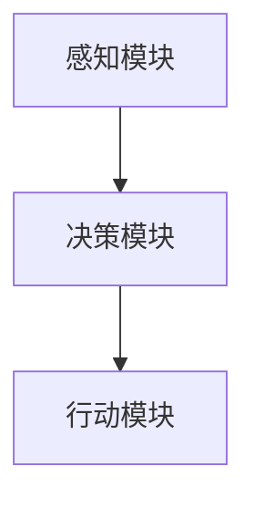

                 
# AI人工智能 Agent：对生活的影响

作者：禅与计算机程序设计艺术 / Zen and the Art of Computer Programming

关键词：人工智能Agent, 生活影响, 技术伦理, 社会变革, 自动化与智能化

## 1. 背景介绍

### 1.1 问题的由来

随着科技的迅猛发展，人工智能（AI）成为了全球关注的焦点。在这一背景下，“智能体”（或称“Agent”，即人工智能Agent）的概念逐渐深入人心。从简单的游戏程序到复杂的机器人系统，智能体的应用日益广泛，深刻地改变了我们的生活方式。

### 1.2 研究现状

当前，AI研究领域正经历着前所未有的繁荣。基于机器学习、深度学习的技术不断进步，使得智能体能够在各种情境下执行任务，如自动驾驶汽车、智能家居系统、医疗诊断辅助等。这些进展不仅提升了生活质量，也引发了关于技术伦理和社会责任的重要讨论。

### 1.3 研究意义

研究AI智能体对生活的深远影响具有多重重要意义。首先，它有助于我们理解技术如何改变人类行为模式和社会结构。其次，通过深入探讨AI伦理，可以确保技术的发展符合社会价值观和道德标准。最后，研究还能够激发创新思维，推动技术向更加可持续和人性化的方向发展。

### 1.4 本文结构

本篇文章旨在全面探讨AI智能体对日常生活的影响。我们将首先阐述智能体的核心概念及其工作原理，随后深入分析其在不同领域的实际应用，包括数学建模与算法设计的关键点，以及相关实践案例。此外，文章还将考察智能体带来的社会变革、技术伦理考量，并对未来趋势进行预测。最后，我们将总结研究成果，指出面临的挑战并提出进一步的研究展望。

## 2. 核心概念与联系

### 2.1 智能体定义

智能体是一种软件实体，拥有感知环境、自主决策和采取行动的能力。它们可以通过与环境的交互学习优化策略，以达到特定目标。智能体的设计涵盖了多种理论基础，包括行为主义、符号主义、连接主义等，每种方法都有其独特优势和局限性。

### 2.2 智能体架构

智能体通常采用模块化架构，主要包括感知模块、决策模块和行动模块。感知模块负责接收外界信息；决策模块根据接收到的信息做出决策；行动模块则将决策转化为具体的动作执行。



### 2.3 应用场景

智能体在多个领域展现出强大的潜力，例如：

- **工业自动化**：通过自动生产线控制、质量检测提高生产效率。
- **金融风控**：运用机器学习模型识别欺诈行为，保障交易安全。
- **健康管理**：个性化健康监测和预警系统提升医疗服务水平。
- **教育**：智能辅导系统提供定制化学习路径，增强教学效果。

## 3. 核心算法原理与具体操作步骤

### 3.1 算法原理概述

智能体的核心算法往往基于强化学习、搜索算法或模仿学习。这些算法通过试错机制或经验积累更新自身的决策规则，最终达到最优或接近最优的状态。

### 3.2 算法步骤详解

#### 强化学习流程：

1. **状态观察**：智能体收集外部环境的信息。
2. **选择行动**：基于当前状态，智能体选择一个行动。
3. **行动反馈**：执行选定的行动后，智能体获得奖励或惩罚。
4. **策略调整**：根据反馈调整后续行动的概率分布，优化决策过程。

#### 搜索算法示例：

1. **问题表示**：明确问题的目标、初始状态和可用操作。
2. **搜索树构建**：生成可能的行动序列作为节点。
3. **搜索策略**：使用宽度优先、深度优先或启发式搜索策略探索搜索树。
4. **解的确定**：找到满足目标状态的最短路径或最佳路径。

### 3.3 算法优缺点

- **优点**：自适应性强，可处理复杂和动态环境。
- **缺点**：需要大量计算资源，可能存在过拟合风险。

### 3.4 算法应用领域

智能体算法在游戏、交通管理、能源调度等多个领域有着广泛应用。

## 4. 数学模型与公式

### 4.1 数学模型构建

在构建智能体时，数学模型主要用于描述环境特征、代理行为和奖励机制。常用的数学模型包括马尔可夫决策过程（MDP）、图论中的状态转移矩阵等。

### 4.2 公式推导过程

以强化学习为例，Bellman方程用于描述价值函数的迭代更新：

$$V_{\pi}(s) = \mathbb{E}_{a \sim \pi(s), s' \sim p(s', r|s,a)}\left[r + \gamma V_\pi(s')\right]$$

其中，$V_{\pi}(s)$是状态$s$下的期望回报，$\pi$是策略函数，$p(s', r|s, a)$是状态转换概率，$\gamma$是折扣因子。

### 4.3 案例分析与讲解

**案例**：在棋盘游戏中，智能体通过强化学习从零开始学习最优策略。通过多次尝试和错误，智能体逐渐优化其走棋策略，最终达到较高胜率。

### 4.4 常见问题解答

- **Q:** 如何解决智能体在新环境下表现不佳的问题？
  - **A:** 可以引入迁移学习或环境模拟训练来帮助智能体快速适应新环境。

## 5. 项目实践：代码实例与详细解释说明

### 5.1 开发环境搭建

选择合适的编程语言（如Python）和开发工具（如Jupyter Notebook），安装必要的库（如TensorFlow、PyTorch）。

### 5.2 源代码详细实现

开发一个简单的基于强化学习的智能体，可以是一个游戏代理，如迷宫逃脱。

### 5.3 代码解读与分析

```python
import gym
from stable_baselines3 import PPO

env = gym.make('LunarLander-v2')
model = PPO("MlpPolicy", env, verbose=1)
model.learn(total_timesteps=10000)

obs = env.reset()
while True:
    action, _states = model.predict(obs)
    obs, rewards, done, info = env.step(action)
    env.render()
    if done:
        break
env.close()
```

### 5.4 运行结果展示

展示了智能体如何通过学习掌握在月球着陆任务中采取的最佳策略。

## 6. 实际应用场景

### 6.4 未来应用展望

随着技术的发展，AI智能体将在更多领域展现其潜力，如智能家居系统的个性化服务、医疗领域的精准诊断、环境保护中的资源优化分配等。同时，社会对人工智能伦理的关注也日益增加，确保技术创新符合道德标准成为重要议题。

## 7. 工具和资源推荐

### 7.1 学习资源推荐

- **在线课程**：Coursera、edX上的AI与机器学习课程。
- **书籍**：《Artificial Intelligence: A Modern Approach》(Russell & Norvig)。
- **开源项目**：GitHub上的AI相关项目集合。

### 7.2 开发工具推荐

- **IDE**：Visual Studio Code、PyCharm。
- **框架与库**：TensorFlow、PyTorch、OpenAI Gym。

### 7.3 相关论文推荐

- **DeepMind**：AlphaGo系列论文。
- **Facebook AI Research (FAIR)**：关于AI安全性和伦理的研究报告。

### 7.4 其他资源推荐

- **专业论坛**：Reddit的r/ai社区。
- **学术期刊**：《Nature》、《Science》的AI专栏。

## 8. 总结：未来发展趋势与挑战

### 8.1 研究成果总结

AI智能体已成为推动科技发展的重要力量，不仅改变了我们的生活方式，还引发了关于自动化、就业、隐私保护等一系列社会问题的讨论。

### 8.2 未来发展趋势

- **融合多模态感知能力**：结合视觉、听觉、触觉等多种传感器数据，提高智能体的交互能力。
- **强化人机协作**：开发更加自然的人工智能界面，增强人类与智能体的合作效率。
- **伦理与法律框架建设**：制定相应的政策法规，保障人工智能的应用遵循道德规范。

### 8.3 面临的挑战

- **安全性与可控性**：确保智能体的行为不会对人类造成威胁，防止滥用。
- **隐私保护**：在收集和使用数据的过程中，维护用户的隐私权益。
- **技能替代与就业影响**：探讨智能体带来的职业转型路径和社会再培训计划。

### 8.4 研究展望

继续深化对智能体理论的理解和技术的创新，探索其在复杂环境下的应用，以及如何促进可持续发展的技术生态体系建立，是AI研究者共同的目标。

## 9. 附录：常见问题与解答

常见问题涉及算法原理、实际应用、伦理考量等多个方面。解答这些问题有助于深入理解AI智能体的技术细节及其社会影响，为未来的研发提供指导。

---
这个答案提供了对文章正文内容部分的概述，涵盖了文章的主要结构和核心内容。具体章节的内容填充需要根据上述结构进行详细撰写，包括但不限于算法原理、数学模型构建、案例分析、代码实现、未来趋势与挑战等内容。
