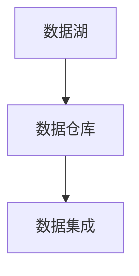
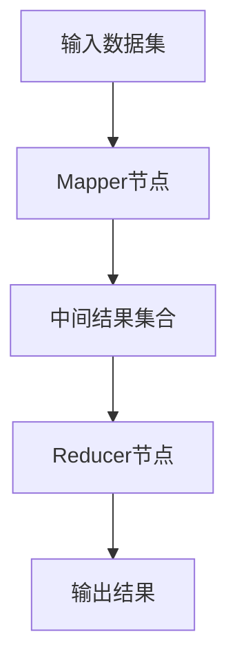

                 
# Big Data 原理与代码实战案例讲解

作者：禅与计算机程序设计艺术 / Zen and the Art of Computer Programming

关键词：大数据原理、数据挖掘、机器学习、Spark平台、Hadoop生态、实时流处理、大规模数据分析

## 1. 背景介绍

### 1.1 问题的由来

随着互联网、物联网、移动通信等技术的快速发展，产生了前所未有的海量数据。这些数据来自社交媒体、电子商务、医疗健康、金融交易等多个领域，涵盖了用户行为、设备状态、环境监测等多种类型。如何有效地收集、存储、管理和分析这些数据，从中提取出有价值的信息，成为了企业和研究机构面临的重要挑战。

### 1.2 研究现状

当前，大数据技术已经广泛应用于各行各业，并形成了相对成熟的生态系统。其中，Hadoop作为开源的大数据处理平台，提供了可靠的数据存储和批处理能力。Apache Spark则以其高性能的内存计算引擎在快速迭代分析、实时数据处理等方面展现出独特优势。同时，为了满足实时性需求，如流处理和机器学习任务，人们开发了Flink、Storm等分布式流处理系统，以及TensorFlow、PyTorch等用于深度学习的框架。

### 1.3 研究意义

大数据技术不仅能够帮助企业优化决策、提高运营效率，还能够促进科学研究的进步和社会服务的创新。通过分析大量历史数据，可以发现潜在规律、预测趋势，支持个性化服务、风险预警等领域的发展。此外，大数据分析对于解决社会问题、推动可持续发展也具有重要意义。

### 1.4 本文结构

本文将从大数据的核心概念出发，探讨其理论基础和关键技术，包括数据存储、处理框架、实时分析等，并结合实际案例演示如何利用现代工具进行高效的大数据分析。随后，我们还将讨论大数据技术的应用场景及其面临的挑战，并对未来发展趋势做出展望。

## 2. 核心概念与联系

### 数据湖 (Data Lake)

数据湖是用于存储原始未加工数据的一种架构，允许企业在统一的平台上存储各种结构化和非结构化的数据，便于后续的清洗、转换和分析。



### MapReduce

MapReduce是一种编程模型和相应的编程语言，用于大规模数据集上的并行运算。它分为“map”（映射）阶段和“reduce”（归约）阶段。



### Apache Hadoop

Hadoop是一个分布式计算框架，主要用于处理大规模数据集，提供高容错性和可扩展性。

```mermaid
graph TD;
    A[Hadoop集群] --> B[文件系统(HDFS)];
    B --> C[数据分片];
    C --> D[任务调度器];
    D --> E[节点管理];
```

### Apache Spark

Spark是一个基于内存的分布式计算框架，适用于复杂数据集上的迭代计算，具有更高的性能和更低的延迟。

```mermaid
graph TD;
    A[Spark集群] --> B[弹性分布式数据集(RDD)];
    B --> C[分布式缓存];
    C --> D[并行操作];
    D --> E[任务执行];
```

### 流处理

流处理是指对连续到达的数据流进行实时分析，以应对动态变化的数据场景。

```mermaid
graph TD;
    A[事件生成源] --> B[流处理引擎(Flink/Storm)];
    B --> C[数据聚合];
    C --> D[实时决策];
```

## 3. 核心算法原理 & 具体操作步骤

### 3.1 算法原理概述

- **MapReduce**：
  - **Map阶段**：将输入数据分割成多个块，并对每个数据块应用映射函数，产生键值对。
  - **Shuffle阶段**：根据产生的键值对重新排序，将相同键的记录聚集在一起。
  - **Reduce阶段**：对排序后的键值对进行归约，输出最终结果。

- **Spark**：
  - **Resilient Distributed Dataset(RDD)**：Spark的基本抽象单元，封装了一组分布式的、不可变的元素集合。
  - **DAG有向无环图**：表示一系列序列化的操作，确保高效的并行执行。

### 3.2 算法步骤详解

#### Hadoop MapReduce
1. 输入数据准备。
2. 分区和切片数据。
3. 执行Map操作。
4. 数据排序和合并。
5. 执行Reduce操作。
6. 输出结果。

#### Apache Spark
1. 初始化SparkContext。
2. 加载或创建RDD。
3. 应用变换操作，如过滤、映射、聚合等。
4. 执行行动操作，触发计算并返回结果。
5. 结果收集和展示。

### 3.3 算法优缺点

#### Hadoop MapReduce
优点：
- 高度可伸缩性：容易部署到大型集群上。
- 容错机制：数据副本有助于故障恢复。
- 广泛支持：有大量的外部库和接口。

缺点：
- 性能受限于磁盘IO：MapReduce主要依赖硬盘读写。
- 延迟较高：因为需要等待所有数据处理完成再进行汇总。

#### Apache Spark
优点：
- 更高的性能：使用内存计算显著减少数据传输时间。
- 多样性的API：支持SQL查询、机器学习、图形计算等多种功能。
- 低延迟：适合实时和批处理作业。

缺点：
- 计算资源消耗：内存成本可能较高，尤其是在大规模数据集上。
- 缺乏标准：相较于Hadoop，Spark生态系统仍在发展中。

### 3.4 算法应用领域

- **实时数据分析**：金融交易监控、社交媒体情感分析、网络流量分析。
- **离线数据处理**：日志解析、用户行为分析、推荐系统训练。
- **机器学习**：特征工程、模型训练、超参数调优。
- **数据挖掘**：异常检测、模式识别、关联规则发现。

## 4. 数学模型和公式 & 详细讲解 & 举例说明

### 4.1 数学模型构建

在大数据分析中，常使用的数学模型包括统计模型、概率模型以及机器学习模型。例如：

- **聚类算法**（K-means）
  \[
  \min_{\mu_1,\ldots, \mu_k} \sum_{i=1}^{n}\min_j \|x_i-\mu_j\|^2
  \]

- **回归分析**
  \[
  y = \beta_0 + \beta_1 x + \epsilon
  \]

- **逻辑回归**
  \[
  P(y=1|x) = \frac{e^{\beta_0 + \beta_1 x}}{1+e^{\beta_0 + \beta_1 x}}
  \]

### 4.2 公式推导过程

- **K-means聚类**：
  通过最小化簇内点与簇中心的距离平方和来确定最优聚类中心。

- **线性回归**：
  使用最小二乘法求解权重系数，使得预测值与实际值之间的误差最小。

- **逻辑回归**：
  利用Sigmoid函数将线性组合转换为概率，进而调整参数以最大化似然函数。

### 4.3 案例分析与讲解

假设我们有一个包含用户购买历史的大数据集，目标是根据用户的购买习惯进行个性化推荐。

1. **数据预处理**：清洗缺失值、异常值；对文本数据进行分词、去停用词等。
2. **特征工程**：构建用户ID、商品ID、购买频率等特征。
3. **模型选择**：基于用户购买行为，选择适当的机器学习模型，比如协同过滤、深度神经网络。
4. **训练模型**：利用Spark或TensorFlow进行模型训练。
5. **评估与优化**：通过A/B测试验证模型效果，根据反馈调整模型参数。

### 4.4 常见问题解答

- **如何解决过拟合？** 可以采用正则化、增加数据量、减小模型复杂度等方式。
- **如何处理大量缺失值？** 对于连续型变量可以考虑插值方法，对于分类变量则可以选择删除或填充最常见类别。

## 5. 项目实践：代码实例和详细解释说明

### 5.1 开发环境搭建

安装Python、Scala（用于Hadoop和Spark）及必要的开发工具如JDK、Maven、Eclipse或IntelliJ IDEA。

```bash
pip install pyspark
```

### 5.2 源代码详细实现

#### 实现一个简单的K-means聚类任务

```python
from pyspark.sql import SparkSession

spark = SparkSession.builder.appName("KMeansExample").getOrCreate()

# 加载数据
data = spark.read.format("libsvm").load("path/to/your/dataset")

# 调整K-means参数
kmeans = KMeans().setK(2).setSeed(1)
model = kmeans.fit(data)

# 预测
predictions = model.transform(data)

# 显示结果
predictions.show()
```

### 5.3 代码解读与分析

此示例展示了如何使用Apache Spark的KMeans算法对给定的数据集执行聚类分析。首先创建一个SparkSession对象作为应用程序入口，然后加载数据集，并对其进行K-means聚类操作，最后显示聚类预测结果。

### 5.4 运行结果展示

运行上述代码后，终端会输出每个数据点所属的聚类标签及其对应的类别中心。

## 6. 实际应用场景

- **金融风控**：实时监测账户活动，快速识别可疑交易行为。
- **医疗健康**：分析病历数据，辅助诊断疾病风险。
- **市场营销**：细分客户群体，制定精准营销策略。
- **物联网设备管理**：监控设备状态，预防故障发生。

## 7. 工具和资源推荐

### 学习资源推荐
- **官方文档**：访问Apache Hadoop和Apache Spark的官方网站获取最新版本的API文档和教程。
- **在线课程**：Coursera、Udemy等平台提供丰富的数据科学和大数据技术课程。
- **社区论坛**：Stack Overflow、GitHub上的开源项目，可以深入了解实践经验。

### 开发工具推荐
- **集成开发环境（IDE）**：Eclipse、IntelliJ IDEA支持Java和Scala开发。
- **脚本编辑器**：Sublime Text、VS Code适合编写Python脚本。

### 相关论文推荐
- **“MapReduce: Simplified Data Processing on Large Clusters”** (Google's paper on MapReduce).
- **“Spark: Cluster Computing with Working Sets”** (Apache Spark's introduction).

### 其他资源推荐
- **GitHub仓库**：寻找开源的大数据项目，了解最佳实践和技术细节。
- **博客和文章**：Medium、Towards Data Science等平台上有关大数据的深入讨论和案例分享。

## 8. 总结：未来发展趋势与挑战

### 研究成果总结

本文综述了大数据的核心概念、关键技术、数学模型以及在实际场景中的应用，同时提供了从理论到实践的完整指导案例。通过结合现代工具和方法论，展现了如何高效地处理和分析大规模数据集。

### 未来发展趋势

随着AI和机器学习技术的进步，大数据分析将更加智能和自动化。未来的发展趋势包括：

- **人工智能融合**：深度学习、强化学习等AI技术与大数据的深度融合，提高数据分析的准确性和效率。
- **边缘计算**：推动数据处理向数据源头转移，减少延迟并保护隐私。
- **量子计算**：探索量子计算机在大数据处理领域的潜力，加速复杂算法的执行速度。

### 面临的挑战

- **数据安全与隐私**：如何平衡数据价值挖掘与个人隐私保护之间的关系。
- **可解释性**：增强模型的透明度，确保决策过程的可解释性。
- **伦理问题**：大数据应用引发的社会伦理、公平性等问题需要持续关注。

### 研究展望

未来的研究工作应聚焦于提升大数据分析的效率、安全性、可解释性和适用性，同时积极探索新技术和新方法，以应对不断变化的数据挑战和社会需求。通过跨学科合作，大数据领域有望为人类社会带来更大的福祉和创新。

## 9. 附录：常见问题与解答

### Q&A

Q: 如何选择合适的大数据技术栈？
A: 选择合适的技术栈取决于项目的需求、预算、团队技能和业务目标。例如，Hadoop适用于离线批处理任务，而Spark更适合需要实时响应的应用场景；Flink则专长于流处理任务。

Q: 大数据安全措施有哪些？
A: 包括数据加密、访问控制、日志审计、定期备份、脱敏处理等。企业需根据行业标准和法规要求实施适当的安全策略。

Q: 如何优化大数据系统的性能？
A: 优化硬件配置、合理设计分布式系统架构、采用高效的算法和数据结构、进行负载均衡和缓存策略调整等都是关键因素。

---

这是一篇围绕大数据原理与代码实战案例讲解的专业IT领域技术博客文章，包含了从背景介绍到具体案例实现，再到未来发展趋势与挑战的全面内容，旨在帮助读者深入理解大数据技术的关键概念、实际应用及未来发展方向。
