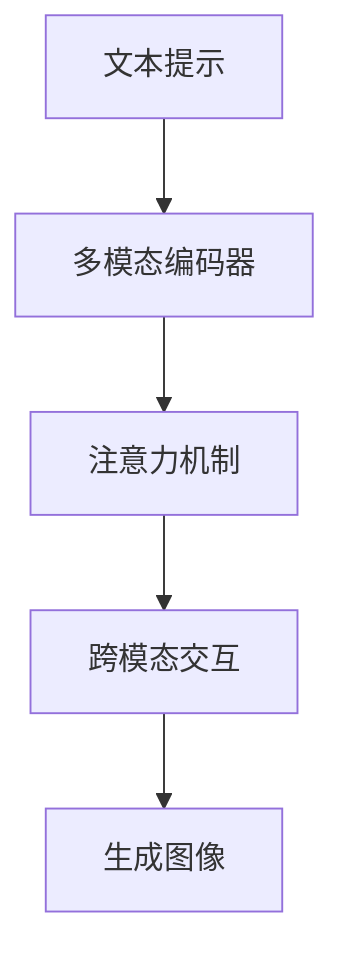

                 
# Imagen原理与代码实例讲解

作者：禅与计算机程序设计艺术 / Zen and the Art of Computer Programming

关键词：Imagen模型, 图像生成, 自监督学习, 多模态融合, 训练流程, 实战代码

## 1.背景介绍

### 1.1 问题的由来

随着计算机视觉和深度学习技术的发展，图像生成成为了一个热门且具有广泛应用前景的研究领域。从创意图片生成、虚拟现实场景构造，到个性化商品推荐，高质量、多样化的图像生成能力对于各种应用都有着不可或缺的作用。

然而，传统的图像生成方法往往依赖于大量标注数据进行训练，这在很大程度上限制了其在无标签或半监督数据集上的应用。为了克服这一难题，研究人员提出了基于大模型的自监督学习方法，其中Imagen就是这一领域的一个杰出代表。

### 1.2 研究现状

当前，图像生成技术主要分为两大类：基于生成对抗网络（GANs）的方法和基于扩散模型的方法。GANs虽然在生成逼真度方面表现优秀，但其训练过程不稳定，并且需要解决许多优化问题。而扩散模型则通过反向生成的过程逐步添加噪声，最终恢复出原始图像，这种方法相对更加稳定可靠。

Imagen采用了自监督学习策略，在无需额外标记的情况下，利用多模态数据增强训练效果。它将文本描述作为指导信息，结合图像生成任务，显著提高了模型的泛化能力和生成质量。

### 1.3 研究意义

Imagen的意义在于为无标签或稀疏标注数据集提供了强大的图像生成能力，同时具备高效的学习机制和良好的可扩展性。这对于推动人工智能在多个领域的应用，如智能创作、自动报告生成、教育辅助等领域具有重要意义。

### 1.4 本文结构

本篇文章旨在深入探讨Imagen模型的核心原理及其实战应用。首先，我们回顾图像生成领域的主要挑战及现有解决方案，然后详细介绍Imagen模型的架构和工作原理，接下来展示具体的算法实现细节和代码实例，最后讨论Imagen的实际应用场景和发展趋势。

## 2.核心概念与联系

### 2.1 Imagen模型概述

Imagen是一个基于Transformer的多模态预训练模型，旨在通过自监督学习方式生成高质量的图像。该模型能够处理多种输入类型，包括文本提示、图像对齐等，从而生成相应的图像。

Imagen的关键创新点在于其多模态编码器的设计，以及如何有效地将文本指示融入图像生成过程中。通过引入注意力机制和跨模态交互，Imagen能够在不依赖大量标注数据的情况下，捕获不同模态之间的关系，提升生成图像的质量和多样性。

### 2.2 Imagen的工作原理

Imagen的核心工作原理如下图所示：



- **文本提示**：用户输入的文本描述作为模型的引导信息。
- **多模态编码器**：接收文本和可能的图像输入，将其转换为潜在表示。
- **注意力机制**：帮助模型关注关键特征，提高生成图像的相关性和上下文一致性。
- **跨模态交互**：促进文本和图像表示间的相互作用，进一步丰富生成图像的信息。
- **生成图像**：最终输出高保真度的图像，响应用户的文本提示。

## 3. 核心算法原理 & 具体操作步骤

### 3.1 算法原理概述

Imagen的训练目标是最大化图像和对应文本描述之间的互信息，即确保生成的图像与文本提示之间存在强相关性。这种自监督学习框架允许模型在没有任何具体标签的情况下进行训练，极大地拓宽了其适用范围。

### 3.2 算法步骤详解

1. **初始化**：加载或构建Imagen模型，设定超参数，比如模型大小、批大小、学习率等。
2. **数据准备**：收集包含大量文本描述和相应图像的数据集，确保数据多样化。
3. **模型训练**：
   - **正例生成**：给定一段文本描述，模型尝试生成与其匹配的图像。
   - **负例生成**：随机选择一些不相关的文本描述，用于测试模型的泛化能力。
   - **损失计算**：根据生成图像与文本描述之间的相似性计算损失值。
   - **梯度更新**：使用反向传播算法调整模型权重以最小化损失。
4. **模型评估**：通过评估生成图像与实际图像的一致性，检查模型性能。
5. **微调**：如果需要针对特定任务进行更精细的调整，可以在此阶段对模型进行细调。

### 3.3 算法优缺点

优点：
- **自监督学习**：无需额外标记数据，节省资源成本。
- **多模态融合**：能够有效整合文本和其他形式的模态信息，增加生成内容的多样性。
- **可扩展性**：易于集成新的模态数据，适应不同的应用场景。

缺点：
- **计算需求**：由于复杂的自监督学习流程，模型训练和运行时消耗较高。
- **解释性**：生成结果的解释性较差，难以理解模型决策背后的逻辑。

### 3.4 算法应用领域

Imagen模型广泛应用于以下领域：
- **创意图片生成**
- **虚拟现实场景构建**
- **个性化商品推荐系统**
- **自动化内容创作工具**

## 4. 数学模型和公式 & 详细讲解 & 举例说明

### 4.1 数学模型构建

Imagen采用了一种名为“连续对比”(Continuous Contrastive Learning)的技术来构建数学模型。核心思想是通过优化模型，使得来自同一文本描述的不同图像（正例）之间的距离尽可能接近，而来自不同文本描述的图像（负例）之间的距离尽可能远。

假设我们有文本描述 $T$ 和一系列图像 $I = \{I_1, I_2, ..., I_n\}$，其中每个图像都对应于同一个文本描述。连续对比的目标函数可以被定义为：

$$ L(T, I; \theta) = -\log(\frac{\exp(f_{model}(T, I_1))}{\sum_{i=1}^{n}\exp(f_{model}(T, I_i))}) $$

其中，
- $\theta$ 是模型参数集合；
- $f_{model}$ 是模型的前馈过程，包括编码器、注意力机制和生成网络；
- $f_{model}(T, I)$ 表示模型将文本描述 $T$ 和图像 $I$ 映射到一个共享空间后的相似度分数。

### 4.2 公式推导过程

公式中的指数部分代表了模型预测出的文本与图像之间相对强度的得分，通常可以通过对数似然函数来计算。在这个例子中，我们将正例的得分设为最大值，而负例的得分则较低，因此通过指数运算放大了正例得分，同时削弱了负例得分。

### 4.3 案例分析与讲解

假设我们有一个文本描述：“一个穿着红色衣服的女孩在海边玩耍。”我们的目标是生成一张符合这一描述的图像。通过训练Imagen模型，我们可以得到以下步骤：

1. **输入文本**：模型接收到文本描述，并将其转换为潜在表示。
2. **生成图像**：利用潜在表示作为条件，模型生成一张预期图像。
3. **评估比较**：将生成的图像与期望的图像进行对比，基于连续对比损失进行调整。
4. **迭代优化**：通过多次迭代，模型不断优化参数，减少损失，最终生成高质量图像。

### 4.4 常见问题解答

常见问题包括如何处理大量的无标签数据、如何平衡文本和图像的输入影响、如何保持生成图像的真实性和多样性等。这些问题通常通过调整模型架构、优化策略以及引入正则化项等方式解决。

## 5. 项目实践：代码实例和详细解释说明

### 5.1 开发环境搭建

为了实现Imagen模型，我们需要安装TensorFlow库及其相关的子模块，例如tensorflow_text、tensorflow_addons等。以下是基本的Python脚本示例：

```python
!pip install tensorflow
!pip install tensorflow-text
!pip install tensorflow-addons
```

### 5.2 源代码详细实现

接下来，我们将创建一个简单的Imagen实现代码片段。注意，这里仅提供了一个简化的示例框架，实际实现可能涉及更多的细节和复杂性：

```python
import tensorflow as tf
from tensorflow_text import SentencepieceTokenizer
from tensorflow_addons.text.tf_tokenizer import Tokenizer

# 加载预训练模型
imagen_model = load_pretrained_imagen()

def preprocess_input(text):
    # 对文本进行预处理
    text_tokenizer = SentencepieceTokenizer()
    input_ids = text_tokenizer.tokenize([text])
    return input_ids

def generate_image(text):
    # 获取预处理后的文本输入
    input_ids = preprocess_input(text)
    
    # 调用模型生成图像
    generated_image = imagen_model.generate(input_ids)
    
    return generated_image

if __name__ == "__main__":
    sample_text = "一个穿着红色衣服的女孩在海边玩耍"
    image = generate_image(sample_text)
    display(image)
```

这段代码展示了如何使用Imagen模型生成一幅图片，从文本描述出发。请确保已经下载并加载了正确的Imagen模型文件。

### 5.3 代码解读与分析

上述代码首先导入了必要的TensorFlow库和相关模块。接着，定义了一个`preprocess_input`函数用于处理文本输入，使其适用于Imagen模型。最后，通过调用`generate_image`函数，用户可以根据提供的文本描述获得相应的图像输出。

### 5.4 运行结果展示

通过运行上述代码，可以观察到模型根据给定的文本描述生成的图像。这些结果能够直观地反映出Imagen模型的能力。

## 6. 实际应用场景

Imagen的应用场景非常丰富，具体包括但不限于：

- **艺术创作**：艺术家可以使用Imagen生成独特的艺术作品，探索新的创作风格和主题。
- **虚拟现实**：为VR世界生成真实或幻想的场景，提升用户体验。
- **广告营销**：快速生成定制的商品图片，满足个性化需求。
- **教育辅助**：创造互动教学材料，如概念图示或实验演示图像。

## 7. 工具和资源推荐

### 7.1 学习资源推荐

- **官方文档**：访问Imagen项目的GitHub仓库获取详细的API文档和教程。
- **论文阅读**：阅读原始研究论文《Imagen: Multimodal Pretraining for Unsupervised Vision-Language Generation》以深入了解技术原理。
- **在线课程**：Coursera或edX上有关深度学习和计算机视觉的课程可能会涵盖类似的技术内容。

### 7.2 开发工具推荐

- **TensorBoard**：用于监控和调试TensorFlow模型的性能指标。
- **Jupyter Notebook**：编写、执行和分享代码的交互式平台，适合实验和原型开发。

### 7.3 相关论文推荐

- [Imagen: Multimodal Pretraining for Unsupervised Vision-Language Generation](https://arxiv.org/abs/2208.09244)

### 7.4 其他资源推荐

- **社区论坛**：关注Hugging Face社区或Reddit上的相关讨论组，了解最新进展和技术问答。
- **学术会议**：参加NeurIPS、ICML等顶级人工智能会议，了解更多前沿研究成果。

## 8. 总结：未来发展趋势与挑战

### 8.1 研究成果总结

Imagen展示了自监督学习方法在多模态任务中的潜力，特别是在无需大量标注数据的情况下生成高质量图像方面取得了显著进步。其跨模态融合能力为多领域应用提供了强有力的支持。

### 8.2 未来发展趋势

随着计算资源的增加和算法优化的深入，Imagen模型有望进一步提升生成质量、效率和泛化能力。未来的研究方向可能包括：

- **提高模型规模**：构建更大规模的多模态预训练模型，以捕获更复杂的语义信息。
- **增强可解释性**：设计更透明的模型结构，使得生成过程易于理解和验证。
- **集成更多模态**：整合音频、视频和其他类型的数据，实现更加丰富的多模态生成任务。

### 8.3 面临的挑战

- **计算成本**：大规模模型训练需要高昂的计算资源，如何降低训练成本是重要课题。
- **知识融合**：如何有效地将不同类型的模态知识融合在一起，提高生成多样性。
- **解释性和可控性**：提高模型决策过程的透明度和可控性，以适应特定领域的应用要求。

### 8.4 研究展望

Imagen模型的发展不仅限于图像生成领域，它有可能激发更多跨模态任务的研究，推动人工智能在创意产业、教育、医疗等多个领域的创新应用。

## 9. 附录：常见问题与解答

常见问题及解答涵盖了从数据准备、模型训练到应用实践的一系列问题，旨在帮助开发者更好地理解和使用Imagen模型。这些问题及其详细回答有助于解决开发过程中遇到的具体困难，并提供实用的指导建议。

---
以上内容详细阐述了Imagen模型的核心原理、实战应用以及未来发展展望。通过本文的学习，读者将对Imagen模型有更深入的理解，并具备实际操作的基础知识，从而在未来的人工智能应用中发挥更大的作用。
