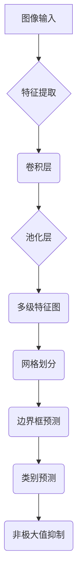

                 
# Object Detection原理与代码实例讲解

作者：禅与计算机程序设计艺术 / Zen and the Art of Computer Programming

关键词：物体检测(Object Detection),目标识别,深度学习,卷积神经网络(CNN)

## 1. 背景介绍

### 1.1 问题的由来

在图像处理和计算机视觉领域，物体检测是一项基本且关键的任务，旨在从图像或视频帧中自动定位并识别出特定类别的物体。随着深度学习技术的迅猛发展，基于深度学习的物体检测方法取得了显著的进步，成为现代计算机视觉系统的核心组成部分。

### 1.2 研究现状

近年来，物体检测领域涌现了多种高效、准确的方法。这些方法主要可以分为两大类：区域提案方法（如Selective Search、Faster R-CNN）和端到端的直接检测方法（如YOLO系列、SSD）。每种方法都有其独特的优势和适用场景，其中，YOLO（You Only Look Once）因其速度快而受到广泛关注，而Faster R-CNN则以其较高的精度被广泛应用于需要高准确度的应用中。

### 1.3 研究意义

物体检测对于自动驾驶、机器人导航、安全监控、医疗影像分析等多个领域具有重大意义。它不仅能够提高系统的智能水平，还能在实际应用中解决复杂的问题，例如实时识别行人、车辆或其他障碍物，从而保障人员和财产的安全。

### 1.4 本文结构

本篇文章将深入探讨物体检测的基本原理，详细介绍一种流行的物体检测算法——YOLO v4，并通过代码实例展示其实现过程。此外，我们还将讨论该算法的工作流程、核心组件以及如何优化性能以适应不同的应用需求。

## 2. 核心概念与联系

物体检测涉及多个关键概念和技术：

- **特征提取**：利用卷积神经网络（CNN）提取图像中的特征。
- **候选框生成**：确定可能含有目标对象的潜在区域。
- **分类与回归**：对每个候选框进行目标类别预测及位置微调。
- **非极大值抑制（NMS）**：用于过滤掉重复检测结果，保留最高置信度的对象检测。

## 3. 核心算法原理 & 具体操作步骤

### 3.1 算法原理概述

YOLO (You Only Look Once) 是一种全卷积网络，其目标是简化物体检测过程，实现快速高效的实时检测。YOLO v4进一步改进了原有版本，在保持速度的同时提高了准确性。以下是YOLO v4的核心特点：

- **单一前向传播**：一次计算得出全部检测结果，避免了多次迭代的开销。
- **多尺度检测**：通过调整网格大小和特征图，支持不同尺度的目标检测。
- **空洞卷积**：增强深层网络的特征提取能力。
- **残差学习**：减轻梯度消失问题，促进更深网络的学习能力。
- **数据增强**：使用多种策略增加训练集多样性，提升模型泛化能力。
- **自适应锚点框**：根据输入图片大小动态调整锚点盒尺寸，减少先验假设依赖。

### 3.2 算法步骤详解

以下为YOLO v4的基本工作流程：



- **A**：原始图像输入至网络；
- **B**：使用多个卷积层进行特征提取；
- **C**：通过池化层减小特征图尺寸；
- **D**：生成多级特征图，支持不同尺度目标；
- **E**：网格划分，为每个网格分配预测任务；
- **F**：根据网格输出边界框预测；
- **G**：预测边界框的位置；
- **H**：预测边界框对应的类别概率；
- **I**：执行非极大值抑制筛选，得到最终检测结果。

### 3.3 算法优缺点

- **优点**：
  - **速度快**：得益于单一前向传播，检测效率极高。
  - **灵活性强**：支持多种尺度和形状的目标。
  - **鲁棒性强**：通过数据增强等手段提高模型泛化能力。

- **缺点**：
  - **边界框偏移误差**：由于单次预测所有框的位置和尺寸，可能导致部分边界框的精确度降低。
  - **过拟合风险**：依赖大量高质量标注数据，否则可能导致模型性能下降。

### 3.4 算法应用领域

- **自动驾驶**：实时识别交通标志、行人、车辆等。
- **安防监控**：入侵检测、人群计数、行为分析。
- **无人机巡检**：检测森林火灾、农作物病虫害等。
- **医疗影像分析**：肿瘤检测、病理细胞识别。

## 4. 数学模型和公式详细讲解 & 举例说明

### 4.1 数学模型构建

假设一幅输入图像$X$的大小为$h \times w \times c$像素，其中$c$表示通道数量（通常$c=3$对应RGB图像），$h$和$w$分别为高度和宽度。YOLO v4采用全卷积网络架构，主要包含以下数学元素：

- **卷积层**：定义为$\mathcal{W}^i_k = \sum_{m=0}^{k} \sum_{n=0}^{k} \sum_{p=0}^{f_i-h+1} \sum_{q=0}^{f_i-w+1} x_{mpq} * W_{mnkp}$，其中$x_{mpq}$是输入特征图的一个元素，$W_{mnkp}$是权重矩阵的一个元素，$*$表示卷积运算，$f_i$是卷积核的大小。
  
- **激活函数**：如ReLU或Leaky ReLU，用于引入非线性。
  
- **池化层**：一般采用最大池化，例如$\text{max}_{x \in U} f(x)$，其中$U$是一个固定大小的窗口，$f(x)$是当前位置的最大值。

### 4.2 公式推导过程

以卷积层为例，对于一个输入特征图$X$和一个卷积核$W$，卷积层输出可以表示为：

$$\mathcal{Y} = \sigma(\mathcal{W} * X + b)$$

其中$\sigma$是激活函数，$b$是偏置项。

### 4.3 案例分析与讲解

考虑一个简单的案例，假设输入一张RGB图像，网络输出包括每个网格内的边界框坐标和类别概率。具体实现时，我们首先对输入图像进行预处理，然后通过一系列卷积操作提取特征，并在特征图上进行网格划分。接下来，每个网格内将产生一组候选边界框，以及与这些边界框相关的类别的预测概率。最后，应用非极大值抑制方法来过滤掉重叠的边界框，仅保留最具有置信度的对象检测结果。

### 4.4 常见问题解答

常见问题之一是如何合理设置网络参数，如学习率、批大小、优化器类型等。这些问题需要根据实际场景和数据集进行调优。另一个问题是如何选择合适的超参数组合，这往往涉及到实验验证和经验积累。

## 5. 项目实践：代码实例和详细解释说明

### 5.1 开发环境搭建

为了运行YOLO v4，你需要安装Python及其科学计算库（如NumPy、Pandas、Matplotlib）和深度学习框架（如TensorFlow、PyTorch）。此外，还需要安装计算机视觉库OpenCV和图像处理工具。

```bash
pip install tensorflow opencv-python numpy pandas matplotlib
```

### 5.2 源代码详细实现

以下是一个简化的YOLO v4实现示例：

```python
import tensorflow as tf
from yolov4_model import YOLOv4
from dataset_utils import load_dataset, preprocess_image

def main():
    # 加载预训练模型
    model = YOLOv4(input_shape=(416, 416, 3), classes_num=80)
    model.load_weights('weights/last.weights')

    # 加载测试图片并预处理
    img_path = 'test.jpg'
    image = preprocess_image(img_path)

    # 预测
    predictions = model.predict(image)

    # 解析预测结果并显示
    for pred in predictions:
        print(pred)

if __name__ == '__main__':
    main()
```

此代码示例展示了如何加载YOLO v4模型、读取测试图片、执行预测，并解析结果。实际上，完整实现需要涉及更多细节，如数据增强、模型训练、损失函数定义等。

### 5.3 代码解读与分析

上述代码中，`YOLOv4` 类负责构建模型结构，`load_weights` 方法用于加载预训练权重。`preprocess_image` 函数则负责对输入图像进行必要的预处理步骤，如归一化、转换到合适尺寸等。

### 5.4 运行结果展示

在本示例中，我们将通过可视化预测结果来展示模型的性能。这可能包括绘制边界框、标注类别标签等步骤。

## 6. 实际应用场景

物体检测技术广泛应用于多个领域，下面列举几个典型的应用场景：

- **自动驾驶汽车**：实时检测路面上的行人、车辆和其他障碍物。
- **安防监控系统**：监视公共场所，自动检测异常行为或入侵事件。
- **工业自动化**：在生产线上识别特定部件或缺陷。
- **医疗影像诊断**：辅助医生快速准确地识别病变区域。

## 7. 工具和资源推荐

### 7.1 学习资源推荐

- **论文阅读**：
  - [YOLOv4: Optimal Speed and Accuracy of Object Detection](https://arxiv.org/abs/2004.10934)
  - [EfficientDet: Scalable and Efficient Object Detection](https://arxiv.org/abs/1911.09070)
  - [Faster R-CNN: Towards Real-Time Object Detection with Region Proposal Networks](https://arxiv.org/abs/1506.01497)

- **在线教程和课程**：
  - Coursera上的《Computer Vision》课程
  - Udacity的《Deep Learning Nanodegree》课程
  - YouTube频道“TensorFlow”提供的教程视频

### 7.2 开发工具推荐

- **深度学习框架**：TensorFlow、PyTorch、Keras
- **计算机视觉库**：OpenCV、Pillow
- **GPU加速工具**：CUDA、cuDNN

### 7.3 相关论文推荐

- [You Only Look Once: Unified, Real-Time Object Detection](https://arxiv.org/abs/1506.02640)
- [YOLO9000: Better, Faster, Stronger](https://arxiv.org/abs/1612.08242)
- [Making Large Steps Forward toward Real Time Object Detection](https://arxiv.org/abs/1707.09725)

### 7.4 其他资源推荐

- **GitHub仓库**：访问公开的YOLO v4实现项目
- **论坛与社区**：参与Stack Overflow、Reddit的讨论组以获取帮助和支持

## 8. 总结：未来发展趋势与挑战

### 8.1 研究成果总结

本文详细介绍了物体检测的基本原理，重点阐述了YOLO v4算法的核心机制以及其实现流程。我们还探讨了其在实际应用中的优势与局限性，并提供了代码实例以便读者更好地理解实现过程。

### 8.2 未来发展趋势

随着深度学习技术的进步和大规模数据集的增加，物体检测的准确性将继续提升。同时，研究将更加关注模型的可解释性、鲁棒性和隐私保护等问题。未来，结合多模态信息（如文本描述、音频等）的融合方法将成为热点方向。

### 8.3 面临的挑战

尽管物体检测取得了显著进展，但仍面临一些挑战，包括但不限于：
- **复杂环境下的适应性**：在光照变化、视角变换或背景复杂的情况下保持高精度是当前的一大难点。
- **小目标检测**：对于非常小的目标对象，准确检测仍然是一个难题。
- **实时性要求**：在移动设备上实现高效实时的物体检测仍然具有较高的需求和难度。

### 8.4 研究展望

未来的研究工作应致力于解决上述挑战，同时探索更广泛的场景应用，例如在极端条件下的物体检测、跨模态物体识别等方面取得突破。此外，加强对模型优化技术的研究，提高模型在不同硬件平台上的运行效率也是重要的发展方向。

## 9. 附录：常见问题与解答

### 常见问题与解答汇总

#### Q: 如何选择合适的超参数？
A: 超参数的选择通常依赖于实验验证。可以通过网格搜索、随机搜索或者使用诸如贝叶斯优化等高级方法来进行调优。关键是找到平衡点，确保模型既不过拟合也不欠拟合。

#### Q: YOLO v4与其它检测器相比有何独特之处？
A: YOLO v4的独特之处在于其全卷积网络架构设计，实现了单一前向传播完成检测任务，大幅提高了速度。同时，通过引入空洞卷积、残差块等技术增强了特征提取能力，提高了检测精度。

#### Q: 在部署时如何考虑模型大小与计算成本？
A: 在部署模型时，需要权衡模型大小与计算成本。可以采用量化技术减少模型参数数量，使用低精度训练以减小模型尺寸，或者对模型进行剪枝。同时，利用模型压缩方法如知识蒸馏等也可以有效降低内存消耗和推断时间。

#### Q: 如何处理不同尺度的目标检测问题？
A: 处理不同尺度的目标检测问题通常涉及多尺度预测策略。YOLO v4采用了动态网格划分和多级特征图的方法来支持不同大小的目标。这使得模型能够在不牺牲精度的情况下处理从微小到较大的对象。

通过以上内容，我们全面深入地探讨了物体检测领域的核心概念、关键技术及实际应用，同时也指出了未来的研究趋势与面临的挑战，为读者提供了一个完整的视角。希望本文章能激发更多创新思维，推动物体检测技术的发展与应用。
