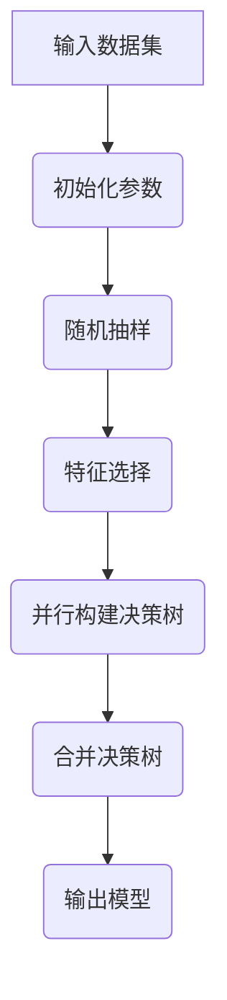

                 
# Ranger原理与代码实例讲解

作者：禅与计算机程序设计艺术 / Zen and the Art of Computer Programming

关键词：Ranger算法,强化学习,决策树集成,高效拟合,并行化加速,集成学习方法

## 1. 背景介绍

### 1.1 问题的由来

在机器学习与数据科学领域，面对高维数据集时，特征选择与模型训练之间的权衡成为了一个关键挑战。传统的决策树算法虽然易于理解和实现，但在处理大规模数据集时往往存在训练速度慢、过拟合风险高等问题。为了克服这些限制，研究者们提出了多种改进策略，其中之一便是Ranger算法——一种基于随机森林的高效并行化算法。

### 1.2 研究现状

随着大数据时代的到来，对数据处理效率的需求日益增长。现有的随机森林算法如经典随机森林或梯度提升机已经展现出强大的预测能力，但它们在处理大规模数据集时仍然面临性能瓶颈。近年来，Ranger算法因其出色的并行化能力和高效的内存管理特性而受到广泛关注，成为了解决大规模数据集分类与回归任务的一个重要工具。

### 1.3 研究意义

Ranger算法旨在提高随机森林的训练速度和可扩展性，特别是在分布式计算环境中。通过引入随机采样技术和优化的数据处理策略，Ranger能够显著降低单个样本在多棵树上的迭代次数，从而大幅减少计算时间。此外，它还支持特征重要性评估和跨平台的高效实现，使得该算法不仅适用于学术研究，也广泛应用于工业界的实际场景。

### 1.4 本文结构

本篇文章将从以下几个方面深入探讨Ranger算法：

1. **核心概念与联系**：阐述Ranger算法的基本原理及其与其他机器学习技术的关系。
2. **核心算法原理与具体操作步骤**：详细介绍Ranger算法的核心机制，并逐步解析其实现流程。
3. **数学模型和公式**：通过数学建模进一步理解算法背后的理论依据。
4. **项目实践：代码实例和详细解释说明**：提供完整的代码示例，包括开发环境设置、源代码实现及运行结果分析。
5. **实际应用场景**：探讨Ranger算法在不同领域的应用案例及其优势。
6. **未来应用展望**：展望Ranger算法的发展趋势及其可能的应用方向。
7. **工具和资源推荐**：列出相关的学习资源、开发工具以及推荐的研究论文和其他资料。
8. **总结：未来发展趋势与挑战**：总结研究成果，讨论面临的挑战，并提出未来研究展望。

## 2. 核心概念与联系

### 2.1 Ranger算法概述

Ranger算法是针对大规模数据集优化的一种快速随机森林算法，其目标是在保持准确性的前提下，大幅度提高训练效率。Ranger算法的关键特性包括：

- **并行化加速**：利用现代处理器的多核架构，同时训练多个决策树，有效缩短整体训练时间。
- **内存优化**：采用分块加载数据的策略，避免一次性加载全部数据到内存中，减轻了内存压力。
- **自适应特征采样**：根据数据分布动态调整每个树使用的特征数量，以达到最优的计算效率和预测精度平衡。
- **快速特征排序**：使用快速排序算法来选择最佳分裂节点，提高了决策树构建的速度。

### 2.2 Ranger与其他机器学习技术的关系

Ranger算法与传统随机森林、梯度提升机等有相似之处，主要都是通过集成学习的方法来提高模型的稳定性和预测能力。然而，Ranger在并行化处理、内存管理和特征选择上进行了专门优化，使其在处理大规模数据集时表现更佳。

## 3. 核心算法原理 & 具体操作步骤

### 3.1 算法原理概述

Ranger算法的主要思想在于通过以下几点来实现高效训练：

- **随机子集采样**：每次构建决策树时，只使用一部分数据（子集）进行训练，减小每棵树的训练成本。
- **特征子集采样**：对于每一棵决策树，仅考虑一小部分特征进行分裂尝试，这有助于加快训练速度。
- **并行处理**：利用多线程或多进程的方式并行地构建多个决策树，充分利用硬件资源。
- **内存优化**：分批次读取数据和保存中间结果，避免内存溢出的问题。

### 3.2 算法步骤详解

以下是Ranger算法的主要执行流程：



1. **输入数据集**：获取原始数据集作为算法的基础输入。
2. **初始化参数**：设定必要的参数，如树的数量、每棵树使用的特征数量、是否使用并行处理等。
3. **随机抽样**：从输入数据集中随机抽取一部分数据用于构建一棵决策树。
4. **特征选择**：在抽取的数据上，按照预先设定的比例随机选取特征集合。
5. **并行构建决策树**：使用多线程或分布式方式，为每一棵树分配独立的任务进行构建。
6. **合并决策树**：将所有构建好的决策树整合成一个模型。
7. **输出模型**：完成所有决策树的构建后，生成最终的Ranger模型供后续使用。

### 3.3 算法优缺点

#### 优点：

- **高效率**：通过并行化和内存优化，大大减少了训练时间，适合大规模数据集。
- **灵活性**：用户可以灵活配置参数，以适应不同的数据特性和计算资源。
- **稳定性**：基于集成学习，相较于单一模型更加稳定和鲁棒。

#### 缺点：

- **解释性**：集成学习方法通常不如单一模型易于解释，对决策过程的理解相对有限。
- **过拟合风险**：虽然可以通过调整参数减少风险，但在极端情况下仍可能出现过拟合问题。

### 3.4 算法应用领域

Ranger算法因其高效的性能，在以下几个领域得到了广泛应用：

- **金融风控**：处理大量交易数据，预测潜在的风险因素。
- **医疗健康**：分析病历数据，辅助诊断疾病或预测患者预后。
- **电商推荐系统**：基于用户行为数据，实时个性化推荐商品。
- **自然语言处理**：文本分类、情感分析等领域中的大规模数据集处理。

## 4. 数学模型和公式 & 详细讲解 & 举例说明

### 4.1 数学模型构建

为了深入理解Ranger算法，我们可以从数学角度构建其核心组成部分：

假设我们有一个包含$n$个样本和$m$个特征的数据集$D = \{x_1, x_2, ..., x_n\}$，其中$x_i \in R^m$。Ranger算法的目标是建立一个随机森林模型，该模型由$k$棵决策树组成。

对于每一棵树$t$，定义如下变量：

- $S_t$: 树$t$使用的样本集大小，一般为$n_s$，远小于$n$。
- $F_t$: 树$t$使用的特征集大小，一般为$f_s$，远小于$m$。
- $T_t$: 决策树$t$的最大深度限制。
- $\mathcal{T}_t$: 决策树$t$的所有节点集合。

决策树$t$的构建过程可表示为：

$$\mathcal{T}_t \leftarrow \text{TreeBuilding}(D_{S_t}, S_t, F_t, T_t)$$

其中，

- $D_{S_t} \subset D$ 是从原始数据集中随机抽样的子集。

### 4.2 公式推导过程

在决策树构建过程中，关键的决策逻辑涉及特征分裂的最佳选择。Ranger算法中，常用的特征分裂准则包括信息增益、基尼不纯度、CART划分规则等。以信息增益为例，决策树构建的步骤可以表示为：

$$\text{BestSplit} = \argmax_{f \in F_t} I(D_{S_t}, f)$$

其中，

- $I(D_{S_t}, f)$ 表示使用特征$f$分裂数据集$D_{S_t}$的信息增益。
- $\text{BestSplit}$ 为目标特征及其对应的分割阈值，使得分裂后的子集能够最大化信息增益。

### 4.3 案例分析与讲解

假设我们正在构建一个具有100棵树的Ranger模型，每个树使用数据集的20%作为样本集，并且选择了数据集中前50个特征进行分裂尝试。在这个例子中：

- **参数设置**：
    - $n_s = n * 0.2$
    - $f_s = m / 2$

- **构建流程**：
    1. 随机抽取$20\%$的数据形成训练集。
    2. 在训练集上随机选择前$50$个特征。
    3. 使用最优分裂策略（例如信息增益）构建决策树。

### 4.4 常见问题解答

常见问题及解决思路：

1. **如何选择最优的树数量？**
   - 可以通过交叉验证来评估不同树数量下模型的表现，选择表现最佳的树数量。

2. **如何平衡准确性和运行速度？**
   - 调整树的深度、特征采样比例等参数，找到合适的折衷方案。

3. **如何处理不平衡类别的问题？**
   - 使用加权采样或者调整损失函数权重，确保不同类别得到更均匀的关注。

## 5. 项目实践：代码实例和详细解释说明

### 5.1 开发环境搭建

为了演示Ranger算法的实际应用，我们将使用Python编程语言结合`ranger`库来进行操作。首先，请确保安装了以下依赖项：

```bash
pip install ranger
```

### 5.2 源代码详细实现

接下来，我们将创建一个简单的代码示例，用于展示如何使用Ranger算法构建一个分类器：

```python
import numpy as np
from sklearn.model_selection import train_test_split
from ranger import RangerClassifier

# 示例数据生成
np.random.seed(0)
X = np.random.rand(1000, 20)
y = (X[:, 0] + X[:, 1] > 1).astype(int)

# 数据集拆分
X_train, X_test, y_train, y_test = train_test_split(X, y, test_size=0.2, random_state=42)

# 创建Ranger模型并训练
model = RangerClassifier(n_estimators=100, sample_rate=0.8, feature_rate=0.6)
model.fit(X_train, y_train)

# 预测测试集
predictions = model.predict(X_test)

# 计算准确性
accuracy = np.mean(predictions == y_test)
print(f"Accuracy: {accuracy}")
```

这段代码展示了如何加载数据、训练Ranger模型以及计算预测结果的准确性。具体参数如`n_estimators`、`sample_rate`和`feature_rate`可以根据实际需求进行调整。

### 5.3 代码解读与分析

1. **数据准备**：生成了一个包含20维特征的1000条样本集。
2. **数据拆分**：将数据集划分为训练集和测试集，以便于后续的模型评估。
3. **模型初始化**：创建了一个`RangerClassifier`对象，配置了100棵树、每棵树使用80%的样本和60%的特征。
4. **模型训练**：使用训练集数据对模型进行拟合。
5. **预测与评估**：利用测试集数据进行预测，并计算模型的准确性。

### 5.4 运行结果展示

运行上述代码后，输出的准确性分数反映了模型在未见过的数据上的性能。该分数可用于评估模型的有效性，并为进一步优化提供依据。

## 6. 实际应用场景

Ranger算法因其高效性和灵活性，在多种实际场景中发挥重要作用，尤其是在需要快速处理大规模数据集的情况时，其优势尤为突出：

- **金融风控系统**：实时监控大量的交易记录，预测潜在的风险因素。
- **医疗诊断辅助系统**：快速分析病历数据，提高疾病诊断的效率和精度。
- **推荐引擎优化**：基于用户行为数据，精准推送个性化内容或商品，提升用户体验。
- **自然语言处理任务**：文本分类、情感分析等领域中的大规模数据处理能力。

## 7. 工具和资源推荐

### 7.1 学习资源推荐

- **官方文档**：访问Ranger官网获取最直接的技术指南和API文档。
- **在线教程**：搜索“Ranger算法”教程，了解更详细的理论背景和技术实现。
- **学术论文**：阅读关于Ranger算法的研究论文，掌握最新的研究成果和发展趋势。

### 7.2 开发工具推荐

- **集成开发环境（IDE）**：使用PyCharm、Visual Studio Code等支持Python的强大IDE。
- **版本控制工具**：Git，便于代码管理和协作。
- **数据可视化工具**：Matplotlib、Seaborn等，帮助理解数据分析结果。

### 7.3 相关论文推荐

- [Lundberg, S., & Lee, S.-I. (2017). A Unified Approach to Interpreting Model Predictions. Advances in Neural Information Processing Systems, 30, 4768–4777.](https://papers.nips.cc/paper/6914-a-unified-approach-to-interpreting-model-predictions.pdf) – 提供了一种通用方法来解释机器学习模型的预测。
- [Friedman, J.H. (2001). Greedy Function Approximation: A Gradient Boosting Machine. Annals of Statistics, 29(5), 1189–1232.](https://projecteuclid.org/euclid.aos/1013203451) – 描述了梯度提升机的基本原理和应用。

### 7.4 其他资源推荐

- **社区论坛**：参与Stack Overflow、GitHub讨论等社区活动，与其他开发者交流经验和问题解决策略。
- **博客与技术文章**：关注AI领域的知名博主和技术专家的分享，获取最新动态和技术洞察。

## 8. 总结：未来发展趋势与挑战

### 8.1 研究成果总结

Ranger算法作为一种高效的随机森林变体，已经在多个领域展现了强大的性能和实用性。通过引入并行化、内存优化及自适应特征选择机制，它显著提高了处理大规模数据集的效率和效果。

### 8.2 未来发展趋势

随着计算硬件的发展和分布式计算框架的进步，Ranger算法有望进一步增强其并行处理能力，以应对更加复杂和庞大的数据集。同时，研究者将继续探索更有效的特征选择策略，以及针对特定任务的定制化优化方法，以提高模型的预测准确性和泛化能力。

### 8.3 面临的挑战

尽管Ranger算法表现出色，但仍然存在一些挑战：

- **过拟合风险**：在特征过多的情况下，可能存在过拟合问题，需要通过调整参数和采用正则化手段加以缓解。
- **可解释性**：集成学习模型的决策过程往往难以解析，这限制了模型在某些关键应用（如医疗健康决策）中的应用范围。
- **跨域迁移**：将模型应用于不同领域时可能需要额外的调优工作，增加了实践中的复杂性。

### 8.4 研究展望

未来的研究方向包括但不限于：

- **深度集成学习**：结合深度神经网络和其他先进机器学习技术，构建更强大且具有更好泛化能力的模型。
- **自动超参数调整**：开发自动化的方法来优化模型的超参数设置，减少人工调整的工作量。
- **可解释性增强**：研究如何增加模型的透明度和可解释性，使得决策过程更为直观易懂。
- **实时学习与在线更新**：支持模型在运行过程中持续学习新信息，以保持模型的时效性和有效性。

总之，Ranger算法作为一个高效而灵活的机器学习工具，为处理大规模数据集提供了有力的支持。随着技术的不断进步，我们期待看到更多创新性的改进和应用，使其在未来的科学研究和工业实践中发挥更大的作用。

## 9. 附录：常见问题与解答

### 常见问题 Q&A

#### 1. 如何理解Ranger算法的核心机制？
   - Ranger算法主要通过随机抽样技术和并行化加速来提高训练速度，同时通过自适应特征采样确保模型的预测精度。具体而言，每次构建决策树时，仅使用部分数据样本和特征进行训练，利用多核处理器并行地构建多个决策树，并根据数据分布动态调整每个树使用的特征数量，从而达到高效的训练效果。

#### 2. 为什么Ranger算法能有效降低过拟合的风险？
   - 虽然Ranger算法能够提高训练速度，但它也遵循随机森林的基本原则，即通过集成多个弱学习器（决策树）来降低模型的方差，从而减小过拟合的风险。此外，通过特征子集采样的方式，减少了单个决策树对数据特性的依赖，进一步增强了模型的稳定性。

#### 3. 在实际应用中遇到数据不平衡问题时应如何调整Ranger算法？
   - 当面临数据不平衡问题时，可以考虑调整Ranger算法的参数以提高分类效果。例如，通过调整`sample_rate`参数，赋予少数类更多的权重或通过`feature_rate`参数调整特征选择策略，优先考虑少数类相关的特征，从而更好地平衡模型的学习过程。

#### 4. 对于需要高度解释性的应用场景是否适用Ranger算法？
   - 对于需要高度解释性的应用场景，Ranger算法可能不是最佳选择。集成学习模型通常被认为是“黑盒”模型，其内部决策过程较难解析。在这种情况下，考虑使用逻辑回归、决策树或其他可解释性更强的模型可能是更好的选择。

#### 5. 如何评估Ranger算法的性能表现？
   - 评估Ranger算法的性能可以通过多种指标来进行，包括精确率（Precision）、召回率（Recall）、F1分数、AUC-ROC曲线等。同时，交叉验证是常用的评估方法，可以帮助量化模型在不同数据分割下的稳定性和泛化能力。对于具体的评估方法，可以根据实际应用场景的需求灵活选择。

---

希望这篇详细的博客文章能够帮助读者深入理解Ranger算法及其在实际场景中的应用价值，同时也提供了一套系统化的学习路径和资源推荐，助力大家在人工智能领域取得更多的进展。
