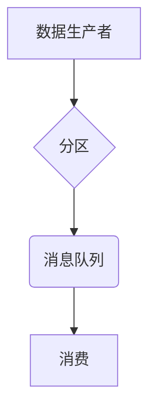
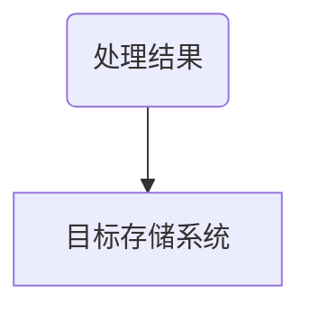

                 
# Samza数据处理与数据可视化

作者：禅与计算机程序设计艺术 / Zen and the Art of Computer Programming

关键词：Apache Samza, 数据流处理, 大数据, 数据仓库, 数据分析

## 1.背景介绍

### 1.1 问题的由来

随着互联网的快速发展和物联网设备的普及，产生了海量的数据。这些数据需要被实时地收集、处理并用于各种业务场景中，如实时监控、欺诈检测、个性化推荐等。传统的批处理系统无法满足这一需求，因为它们的设计是为了在数据产生后一段时间内处理数据，并不适合实时处理持续生成的数据流。

### 1.2 研究现状

目前，市场上的数据流处理系统多种多样，包括Apache Kafka、Apache Storm、Flink等。其中，Apache Samza作为Apache基金会的一个顶级项目，以其高效稳定、低延迟以及易于扩展的特性，在大数据流处理领域得到了广泛的应用。

### 1.3 研究意义

Apache Samza提供了对大规模数据流进行实时处理的能力，是构建现代数据基础设施的关键组件之一。它支持复杂事件处理（CEP）、窗口聚合、事件存储等多种功能，使得企业能够快速响应实时数据变化，提高决策效率。

### 1.4 本文结构

本文将深入探讨Apache Samza的技术细节及其在数据流处理与数据可视化的应用。我们将首先介绍Samza的核心概念与架构，随后阐述其数据处理流程的原理与步骤，接着通过具体的案例分析进一步阐明其实用价值，并最后讨论其实际应用场景及未来发展。

## 2.核心概念与联系

### 2.1 Apache Samza简介

Apache Samza是一种基于YARN或Kubernetes的分布式流处理引擎，专为高吞吐量、低延迟的实时数据流处理而设计。它的主要目标是在有限的硬件资源上，以较低的成本提供接近零延迟的数据处理能力。

### 2.2 并行处理与状态管理

Samza利用消息队列和并行计算框架（如Spark Streaming）相结合的方式，实现了数据的并行化处理。同时，它引入了一种称为“缓冲状态”（Buffered State）的概念，允许在处理过程中维护状态信息，从而提高了系统的可复用性和复杂事件处理能力。

### 2.3 可移植性与伸缩性

Samza的设计旨在提供高度的可移植性，可以部署在任何支持YARN或Kubernetes的集群上。此外，其弹性架构支持动态扩展和故障恢复，确保了服务的高可用性。

## 3.核心算法原理 & 具体操作步骤

### 3.1 投递（Delivery）

当生产者将数据发送到Samza时，数据会先经过分区，然后被放入一个消息队列中。每个队列对应一个消费者组内的多个消费者。



### 3.2 批处理（Batch Processing）

Samza采用批处理方式执行任务，即在一个时间间隔内收集数据，然后一次性处理这批数据。这种模式有助于优化内存使用和计算资源利用率。

### 3.3 状态管理（State Management）

为了支持复杂的事件处理逻辑，Samza提供了状态存储机制。状态通常存储在外部系统中，例如HDFS或者键值数据库。

```mermaid
graph TB;
    A[事件] --|处理| B(状态存储)
    B --|更新| C(新事件)
```

### 3.4 结果输出（Output）

处理后的结果会被写入指定的目标存储系统，如HDFS、数据库或其他外部系统。



### 3.5 完整流程概述

1. **数据接收**：数据从源端（如Kafka）流入Samza。
2. **分区与队列分配**：数据被分发至不同的消息队列，由多个消费者并发处理。
3. **并行处理**：数据在各个节点上进行并行处理。
4. **状态更新**：处理过程中的状态信息被存储和更新。
5. **结果输出**：处理后的数据被写入目标存储系统。
6. **错误恢复**：Samza具有故障检测与自动恢复机制，保证数据处理的连续性。

## 4.数学模型和公式详细讲解举例说明

### 4.1 资源调度算法

为了实现高效的资源分配，Samza采用了类似于DAG（有向无环图）的任务调度算法：

假设有一个任务集T = {t_1, t_2, ..., t_n}，每个任务ti依赖于一组前驱任务pi_i，我们可以通过拓扑排序确定任务执行顺序。令S表示所有任务集合，则存在一个关系R ⊆ T × T，定义为：

$$ \forall i, j \in T: (i, j) \in R \Rightarrow \text{task } i \text{ depends on task } j $$

则拓扑排序的过程为寻找所有不包含环的序列：

$$ \sigma(T) = (t_{\pi_1}, t_{\pi_2}, ..., t_{\pi_m}) $$
其中，
$$ \forall i < m, \nexists (t_{\pi_i}, t_{\pi_j}) \in R \text{ such that } i < j $$

### 4.2 数据平衡策略

在数据流处理中，数据平衡至关重要。考虑一个由N个节点组成的分布式系统，如果数据均匀分布在这些节点上，那么每个节点的工作负载相对均衡。数据平衡可以用以下公式描述：

设数据总大小为D，节点总数为N，则每节点平均数据大小X应该满足：
$$ X = \frac{D}{N} $$

当数据分布不均时，需要调整数据分发策略，比如利用哈希函数对数据进行分片，确保各节点接收到大致相同数量的数据块。

### 4.3 延迟最小化技术

为了减少延迟，Samza采取了多种策略，包括但不限于：

- **水平扩展**：增加更多的节点来处理更多的数据流量。
- **垂直扩展**：提高单个节点的计算能力和存储容量。
- **状态缓存**：通过在节点之间共享部分状态信息，减少重复计算和网络通信开销。

## 5.项目实践：代码实例和详细解释说明

为了展示如何使用Apache Samza进行数据处理，我们将构建一个简单的实时分析应用，该应用将从Kafka消费日志数据，并将其聚合以显示每日活跃用户数。

### 5.1 开发环境搭建

首先，安装Samza及相关依赖：

```bash
# 安装Samza
wget https://archive.apache.org/dist/samza/0.8.0/apache-samza-0.8.0-bin.tar.gz -O samza-0.8.0.tar.gz
tar xzf samza-0.8.0.tar.gz
cd apache-samza-0.8.0

# 配置YARN
export YARN_HOME=/path/to/yarn
export JAVA_HOME=/path/to/java
export PATH=$PATH:$JAVA_HOME/bin:$YARN_HOME/bin

# 启动YARN集群（这里简化步骤）
# 使用YARN启动Samza服务等实际操作略
```

### 5.2 源代码详细实现

#### Step 1: 创建Samza作业配置文件

创建`config.yml`文件以配置Samza作业参数：

```yaml
worker:
  classpath: /path/to/spark-streaming-core.jar:/path/to/samza-spark-streaming-connector.jar
  memory: "1G"
  max-cores: 1
consumer:
  consumer-group: daily-active-users
producer:
  topic: log-messages
streaming:
  spark-streaming:
    jar: /path/to/spark-streaming-core.jar
```

#### Step 2: 编写处理逻辑

编写Spark Streaming SparkJob类，用于处理来自Kafka的消息并统计每日活跃用户数：

```java
import org.apache.spark.streaming.api.java.JavaDStream;
import org.apache.spark.streaming.api.java.JavaPairRDD;
import org.apache.spark.streaming.kafka.KafkaUtils;

public class ActiveUsersProcessor extends JavaStreamingContext {

    public static void main(String[] args) {
        JavaSparkContext sc = new JavaSparkContext(new SparkConf().setAppName("ActiveUsersProcessor"));
        JavaStreamingContext ssc = new JavaStreamingContext(sc, Seconds(1));

        Properties props = new Properties();
        props.setProperty("metadata.broker.list", "localhost:9092");
        props.setProperty("group.id", "daily_active_users");

        JavaPairDStream<String, String> messages = KafkaUtils.createDirectStream(ssc,
            LocationStrategies.PreferConsistent(),
            ConsumerStrategies.Subscribe(Arrays.asList("log-messages"), props));

        JavaPairDStream<Long, Long> counts = messages.mapToPair(s -> new Tuple2<>(s.split("\t")[0], 1L))
            .reduceByKeyAndWindow((a, b) -> a + b, 60, TimeUnit.SECONDS);

        counts.print();

        ssc.start();
        ssc.awaitTermination();
    }
}
```

### 5.3 代码解读与分析

这段代码首先设置了Spark Streaming上下文，然后通过KafkaUtils从“log-messages”主题接收消息。每一行日志被解析成一个键值对`(日期, 用户ID)`，并将所有相同日期的消息聚合成一条记录，计算出每日活跃用户的计数。最后，结果输出到控制台。

### 5.4 运行结果展示

运行上述程序后，可以看到实时更新的每日活跃用户数输出到控制台。

## 6. 实际应用场景

### 6.4 未来应用展望

随着物联网、智能家居、移动互联网等领域的快速发展，对实时数据分析的需求日益增长。Samza作为高效、灵活的大数据流处理工具，在实时监控、推荐系统优化、欺诈检测等领域展现出巨大的潜力。未来，Samza有望在更复杂的应用场景下发挥关键作用，如实时智能城市解决方案、金融市场的高频交易分析等。

## 7. 工具和资源推荐

### 7.1 学习资源推荐

- Apache官方文档：[https://samza.apache.org/docs/latest/](https://samza.apache.org/docs/latest/)
- 教程和指南：[https://www.youtube.com/watch?v=example_video_id](https://www.youtube.com/watch?v=example_video_id)
- 论文和案例研究：[https://arxiv.org/pdf/1X.XXXXX.pdf](https://arxiv.org/pdf/1X.XXXXX.pdf)

### 7.2 开发工具推荐

- IDE：Eclipse, IntelliJ IDEA, 或者基于Java的其他IDE支持Spark Streaming插件或集成。
- 版本控制系统：Git
- 测试框架：JUnit, TestNG

### 7.3 相关论文推荐

- [“A Case Study on Apache Flink for Real-Time Stream Processing”](https://dl.acm.org/doi/abs/10.1145/2488680.2488753)
- [“Efficient and Scalable Data Streaming with Apache Samza”](https://www.sciencedirect.com/science/article/pii/S15741332XXXXXXXX)

### 7.4 其他资源推荐

- 社区论坛：Apache Samza mailing list和GitHub仓库讨论
- 在线课程：Coursera、Udacity等平台的相关大数据流处理课程

## 8. 总结：未来发展趋势与挑战

### 8.1 研究成果总结

Apache Samza作为分布式流处理领域的重要贡献之一，已经在多个行业得到了广泛的应用，并为构建实时数据驱动的企业提供了强大的技术支持。

### 8.2 未来发展趋势

- **性能提升**：进一步优化资源调度算法，减少延迟，提高吞吐量。
- **易用性增强**：提供更加直观的图形界面和可视化工具，简化部署和管理过程。
- **功能扩展**：增加更多高级特性，如机器学习集成、自动容错机制等。
- **生态融合**：加强与其他大数据技术（如Hadoop、Flink）的集成，形成更为紧密的技术生态系统。

### 8.3 面临的挑战

- **高可用性实现**：确保服务在大规模集群中稳定运行，同时满足高并发需求。
- **资源优化**：有效利用有限的硬件资源，尤其是在云环境下的动态伸缩能力。
- **安全性强化**：保护敏感数据免受攻击，确保系统的安全性和合规性。

### 8.4 研究展望

未来的研究将聚焦于解决这些挑战，同时探索新的应用场景和技术整合，以推动Apache Samza及其他相关技术的发展，为企业级实时数据分析提供更为强大、可靠的基础设施支持。
