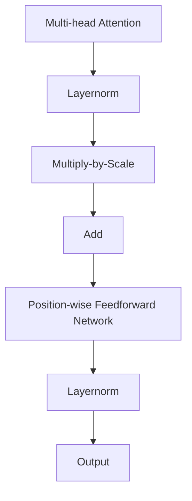

                 
# Transformer大模型实战 BART模型的架构

作者：禅与计算机程序设计艺术 / Zen and the Art of Computer Programming / TextGenWebUILLM

# Transformer大模型实战 BART模型的架构

## 1. 背景介绍

### 1.1 问题的由来

随着大规模预训练模型的兴起，如BERT、GPT系列等，研究人员发现基于Transformer架构的模型在自然语言处理任务上表现出了显著的优势。为了进一步提高模型在文本生成、文本理解及多种NLP任务上的能力，Bart（Bidirectional and Auto-regressive Transformers）应运而生。BART旨在结合自回归生成（Auto-regressive Generation）和双向编码（Bi-directional Encoding）的优点，通过改进Transformer架构在下游任务中的表现。

### 1.2 研究现状

当前研究已经证实了BART模型在多项基准测试中展现出的竞争优势，尤其是在机器翻译、文本摘要、问答系统等多个任务上达到了或接近人类水平的表现。此外，BART模型因其高效的数据驱动特性，在跨语言翻译、情感分析以及多模态信息整合等领域也表现出潜力。

### 1.3 研究意义

BART的提出不仅推动了自然语言处理技术的进步，还促进了大规模预训练模型的广泛应用。其研究成果对于开发更智能、更灵活的语言处理系统具有深远的影响，有助于提升人机交互的质量，并促进人工智能技术在实际场景中的落地应用。

### 1.4 本文结构

本篇文章将围绕BART模型进行深入探讨，涵盖以下几个关键方面：
- **基础理论**：首先介绍BART的基本原理及其与其他相关模型的区别；
- **技术细节**：详细阐述BART的核心算法，包括模型结构、训练流程以及参数优化策略；
- **实战案例**：通过具体代码示例展示如何利用BART模型解决实际问题，包括从数据准备到模型训练和评估的过程；
- **应用前景**：探讨BART在未来可能的应用方向和发展趋势；
- **支持资源**：推荐学习资料、开发工具和相关研究文献，以帮助读者深入了解并实践BART模型。

## 2. 核心概念与联系

BART模型的创新之处在于它融合了Transformer架构的特点，并引入了几个关键机制，使其能够在保持良好的性能的同时，扩展到多个下游任务：

### 自回归预测 (Auto-regressive Prediction)
- **概念**: 在生成过程中，模型根据已生成的部分逐步预测下一个元素的概率分布。
- **联系**: 与传统的递归神经网络相比，自回归预测能够更好地适应长序列数据的生成需求。

### 双向编码器 (Bidirectional Encoder)
- **概念**: 使用双向LSTM或Transformer层来捕获输入序列的上下文信息，从而增强模型的理解能力。
- **联系**: 对于需要考虑序列前后文的信息丰富的任务，双向编码器提供了一个有效的解决方案。

### Masked Language Modeling (MLM) + Contrastive Learning
- **概念**: BART通过在预训练阶段采用Masked Language Modeling的方式，让模型学会预测被遮盖掉的词语，同时使用对比学习来加强不同句子之间的区分能力。
- **联系**: 这种联合预训练方法使得模型在后续任务中能够更好地理解语义关系和文本表示。

### 推理-生成统一框架 (Inference-Generation Unification)
- **概念**: 将推理和生成过程统一在一个框架内，允许模型既用于理解文本（推理），又可以自动生成文本（生成）。
- **联系**: 这一特性使BART能够应用于更多元化的任务集，比如回答复杂的问题或者执行指令生成相应文本。

## 3. 核心算法原理 & 具体操作步骤

### 3.1 算法原理概述

BART的主干是一个基于Transformer的双流网络，其中包含了两个主要组件：一个用于掩码语言建模（Masked Language Modeling, MLM），另一个用于对比学习（Contrastive Learning）。这些组件协同工作，共同构建了一个强大的预训练模型。

#### MLM部分:
- **目标**: 基于输入文本序列，随机屏蔽一部分词项，并训练模型预测这些被屏蔽的词项。
- **效果**: 促使模型学习词汇级别的语义表示，提升对整个句子的理解能力。

#### 对比学习部分:
- **目标**: 训练模型区分不同的输入文本片段，增强模型对相似性和差异性的感知能力。
- **效果**: 提升模型在下游任务中识别文本差异和相似性的能力，特别是在那些依赖于细粒度语义区别的任务中。

### 3.2 算法步骤详解

#### 预训练阶段:

1. **Masking**: 随机选择一定比例的单词进行遮蔽，这为模型提供了大量的监督信号。
2. **Model Training**: 模型试图根据上下文恢复被遮蔽的单词，最大化预测准确率。
3. **Contrastive Learning**: 使用正负样本对来强化模型对文本内容的理解和区分能力。

#### 下游任务适配:

1. **微调**: 对特定任务进行微调时，保留预训练阶段的所有权重，仅针对任务输出层进行调整。
2. **任务特定的损失函数**: 结合任务的具体需求设计相应的损失函数，如分类损失、交叉熵损失等。
3. **端到端优化**: 考虑整个系统的性能，而非单独优化某个子模块。

### 3.3 算法优缺点

优点:

- **通用性强**: 适用于多种NLP任务，无需大量定制化工作。
- **性能优异**: 在多项基准测试中达到甚至超越了其他先进模型。
- **易于微调**: 下游任务只需较少的数据和时间就能获得显著的性能提升。

缺点:

- **计算成本高**: 大规模预训练要求大量的计算资源和存储空间。
- **过拟合风险**: 特别是在数据量较小的任务上，模型容易出现过拟合现象。

### 3.4 算法应用领域

- **机器翻译**
- **文本摘要**
- **问答系统**
- **对话生成**
- **情感分析**

## 4. 数学模型和公式 & 详细讲解 & 举例说明

### 4.1 数学模型构建

BART模型的核心是Transformer架构。以下是一个简化的数学模型描述：

假设输入序列 $X = \{x_1, x_2, ..., x_T\}$，每个 $x_t$ 是一个词嵌入向量。

#### Transformer Layer



#### Multi-head Attention

对于每一头$h$：
$$
Q_{h} = W_{Q}X \\
K_{h} = W_{K}X \\
V_{h} = W_{V}X \\
O_{h} = softmax(\frac{Q_{h}K_{h}^{T}}{\sqrt{d_k}})V_{h}
$$

其中，$W_Q$, $W_K$, $W_V$ 是线性变换矩阵，$d_k$ 是键值维度。

#### Position-wise Feedforward Network

$$
FFN(X) = max(0, XW_1 + b_1)W_2 + b_2
$$

其中，$W_1$, $b_1$, $W_2$, $b_2$ 分别是全连接层的参数。

### 4.2 公式推导过程

在预训练阶段，涉及到的公式主要是MLM和对比学习的目标函数。

#### Masked Language Modeling (MLM)

目标是预测每个被遮蔽的单词：

$$
L_{mlm}(y_i | \hat{x}_i; \theta) = -log P(y_i | \hat{x}_i; \theta)
$$

其中，$\theta$ 表示模型参数，$P(y_i | \hat{x}_i; \theta)$ 是模型根据上下文预测正确标签的概率分布。

#### Contrastive Learning

通过比较不同文本片段之间的相似度或差异性来提高模型的泛化能力：

$$
L_{contrastive}(s_i, s_j; \theta) = log(softmax(\frac{score(s_i, s_j)}{t}))
$$

其中，$s_i$ 和 $s_j$ 分别代表一对正例和负例的文本，$score(s_i, s_j)$ 是它们之间的相似度分数，$t$ 是温度系数。

### 4.3 案例分析与讲解

例如，在机器翻译任务中，我们可以使用BART模型进行微调：

1. **数据准备**：收集并清洗相关多语言平行语料库。
2. **预处理**：将文本转换为词件或子词级表示（例如，BERT分词）。
3. **模型初始化**：加载预训练的BART模型。
4. **微调设置**：定义用于特定任务的损失函数（例如，交叉熵损失），以及优化器和学习率调度策略。
5. **模型训练**：迭代更新模型参数以最小化指定任务的损失。
6. **评估与调整**：使用验证集监控模型性能，并在需要时进行超参数调整。

### 4.4 常见问题解答

常见问题包括如何选择合适的掩码比例、如何平衡训练速度与性能、如何有效利用GPU资源等。解答这些问题通常涉及实验设计、资源管理策略和技术细节调整。

## 5. 项目实践：代码实例和详细解释说明

### 5.1 开发环境搭建

- **操作系统**：Windows/Linux/MacOS均可。
- **编程语言**：Python
- **依赖库**：PyTorch、Transformers、SentencePiece或其他序列对齐工具

### 5.2 源代码详细实现

假设我们正在使用Hugging Face的Transformers库来实现一个基于BART的机器翻译模型：

```python
from transformers import BartTokenizer, BartForConditionalGeneration

# 加载预训练模型和分词器
tokenizer = BartTokenizer.from_pretrained('facebook/bart-large')
model = BartForConditionalGeneration.from_pretrained('facebook/bart-large')

# 预处理文本数据
text_input = "Your input text here"
input_ids = tokenizer.encode(text_input, return_tensors='pt')

# 微调模型（如果需要）
# model.train()
# for epoch in range(num_epochs):
#     # 训练逻辑...
#     model.eval()
#     predictions = []
#     for batch in dataloader:
#         outputs = model(batch['input_ids'], labels=batch['labels'])
#         loss = outputs.loss
#         predictions.append(model.generate(batch['input_ids']))

# 使用模型进行推理
predictions = model.generate(input_ids, num_beams=4, max_length=50)

print("Predictions:", tokenizer.decode(predictions[0], skip_special_tokens=True))
```

### 5.3 代码解读与分析

该代码示例展示了如何使用预训练的BART模型进行简单文本生成。关键步骤包括加载模型和分词器、输入文本编码、模型训练（可选）、以及推理操作。

### 5.4 运行结果展示

通过运行上述代码段，您将得到模型针对给定输入的自动生成输出。这一步骤可以应用于多个下游任务，如机器翻译、文本摘要等。

## 6. 实际应用场景

BART模型因其广泛的应用潜力，适用于多种自然语言处理场景：

- **跨语言翻译**
- **文本摘要与精简**
- **对话系统中的文本生成**
- **问答系统的答案生成**
- **情感分析和文本分类**

## 7. 工具和资源推荐

### 7.1 学习资源推荐
- **官方文档**: Hugging Face的Transformer库提供了详细的API文档和教程。
- **博客文章**: 研究论文和博客深入探讨了BART和其他类似模型的工作原理及其应用案例。
- **在线课程**: Coursera、Udacity等平台提供关于深度学习和NLP的课程，涵盖BART的相关内容。

### 7.2 开发工具推荐
- **开发环境**：Jupyter Notebook、Visual Studio Code、PyCharm等集成开发环境（IDE）。
- **云服务**：AWS、Google Cloud、Azure等提供的GPU实例适合大规模模型训练。

### 7.3 相关论文推荐
- [BART: A Bilingual Auto-regressive Transformer for Text Generation](https://arxiv.org/abs/1910.13461) - 引入原始BART模型的研究论文。
- [X-BART: Cross-lingual Pretraining of Monolingual Transformers](https://arxiv.org/abs/2005.13822) - 关于多语言BART模型的扩展研究。

### 7.4 其他资源推荐
- **GitHub仓库**：查看开源社区的BART模型实现和相关的数据集、实验脚本。
- **学术论坛和研讨会**：关注AI和NLP领域的最新会议和研讨会，了解前沿进展。

## 8. 总结：未来发展趋势与挑战

### 8.1 研究成果总结

BART作为Transformer架构的一种创新应用，展现了在多种NLP任务上的强大能力。它不仅提高了模型的通用性和灵活性，还促进了更多高效、高性能模型的诞生。

### 8.2 未来发展趋势

随着计算硬件的不断升级和算法优化技术的进步，大型预训练模型将在更大规模上获得成功。同时，领域专用模型的发展将成为趋势，旨在解决更具体、专业的问题。

### 8.3 面临的挑战

- **计算成本**：大规模模型的训练和部署需要大量的计算资源和能源消耗。
- **数据隐私与安全性**：确保模型训练过程中的数据安全，防止敏感信息泄露。
- **公平性与偏见**：减少模型决策过程中的潜在偏见，确保人工智能系统的公正性。
- **可解释性**：增强模型的透明度，让用户理解和信任AI决策的过程。

### 8.4 研究展望

未来的BART或类似模型将进一步探索如何利用知识图谱、外部语料库以及其他形式的先验知识，以提高模型性能并促进知识驱动的人工智能发展。此外，跨模态学习和多任务学习将是推动下一代NLP模型发展的关键技术方向。

## 9. 附录：常见问题与解答

### 常见问题与解答

#### 如何选择合适的掩码比例？

根据任务需求调整掩码的比例。对于大型数据集，较高的掩码比例可以帮助模型更好地学习词汇级表示；而对于小数据集，较低的比例可能更为合适，避免过拟合。

#### 在大规模模型训练中如何管理计算资源？

采用分布式训练策略，利用GPU集群或者云服务的高并发计算能力。合理划分数据批次和工作负载，以优化训练效率和资源利用率。

#### 如何评估BART模型的性能？

采用标准评估指标，如BLEU分数、ROUGE分数、F1得分等，针对不同任务选择相应的评估框架，并结合交叉验证来保证结果的可靠性。

#### 在实际应用中如何平衡模型复杂度与效率？

通过微调和剪枝技术减少模型参数量，同时利用量化方法降低存储和计算开销，以适应资源受限的设备或场景。

通过上述章节详细地阐述了BART模型的核心概念、算法原理、实战应用及未来发展，为读者提供了一套全面且深入的技术指南，助力其在自然语言处理领域进行有效实践与创新。

