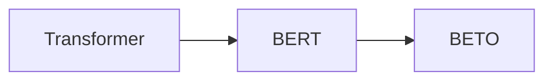

# Transformer大模型实战 西班牙语的BETO模型

关键词：Transformer, BERT, BETO, 西班牙语, 预训练模型, 迁移学习

## 1. 背景介绍 
### 1.1 问题的由来
随着深度学习的快速发展,尤其是Transformer架构的提出,预训练语言模型在自然语言处理(NLP)领域取得了巨大成功。BERT(Bidirectional Encoder Representations from Transformers)作为其中的代表性工作,通过在大规模无标注语料上进行预训练,可以学习到通用的语言表征,进而在下游任务上取得优异表现。然而,大多数预训练模型都是基于英语语料训练的,对于其他语言的支持还比较有限。为了拓展BERT在多语言场景下的应用,研究人员开始探索针对特定语言的BERT模型训练。

### 1.2 研究现状
目前,已经有多个语言的BERT模型被训练出来,如中文的BERT-wwm、法语的CamemBERT、阿拉伯语的AraBERT等。西班牙语作为世界上使用人数排名第二的语言,同样需要一个强大的预训练模型。在这样的背景下,西班牙语BERT模型BETO应运而生。BETO模型由西班牙国家研究委员会(CSIC)的研究人员开发,在多个西语NLP任务上取得了SOTA效果,展现出了广阔的应用前景。

### 1.3 研究意义
BETO模型的提出,为西语NLP研究提供了一个强大的基础模型。通过在BETO上进行迁移学习,可以大大降低西语NLP任务的训练成本,提升模型效果。同时,BETO的训练经验也为其他语言BERT模型的开发提供了有益参考。研究BETO的内在机制和应用实践,对于理解语言模型的工作原理,推动NLP技术在多语言场景下的发展具有重要意义。

### 1.4 本文结构
本文将全面介绍BETO模型的技术细节和实践应用。第2部分阐述Transformer和BERT的核心概念,分析它们之间的联系。第3部分重点讲解BETO模型的核心算法原理和训练流程。第4部分从数学角度对BETO的模型结构和目标函数进行公式推导。第5部分通过代码实例,演示如何利用BETO进行西语NLP任务的迁移学习。第6部分总结BETO在实际中的应用场景,并展望其未来发展方向。第7部分推荐BETO相关的学习资源、开发工具和研究论文。第8部分对全文进行总结,分析BETO未来的机遇与挑战。

## 2. 核心概念与联系
Transformer是一种基于自注意力机制的神经网络架构,摒弃了传统的RNN/CNN等结构,通过Self-Attention学习序列内部的依赖关系,并利用Multi-Head Attention融合不同位置的信息。Transformer主要由Encoder和Decoder两部分组成,Encoder用于对输入序列进行特征提取,Decoder根据Encoder的输出和之前的预测结果生成目标序列。

BERT是基于Transformer Encoder结构的大规模预训练语言模型。它采用Masked Language Model和Next Sentence Prediction两个预训练任务,在海量无标注语料上学习通用语言表征。通过预训练得到的BERT模型可以方便地应用到下游NLP任务,只需在特定任务的数据上进行简单的微调即可获得不错的效果。

BETO是西班牙语版的BERT模型,它在模型结构和训练方式上与BERT基本一致,只是预训练语料换成了西班牙语数据集。BETO继承了BERT语言理解的强大能力,通过在西语数据上的预训练,可以更好地刻画西语的语言特性。

下图展示了Transformer、BERT和BETO之间的关系:

## 3. 核心算法原理 & 具体操作步骤
### 3.1 算法原理概述
BETO的核心算法与BERT一致,主要包括以下几个方面:

1. Transformer Encoder:利用Self-Attention和前馈神经网络,对输入序列进行特征提取。
2. Masked Language Model:随机遮挡部分词元,预测被遮挡位置的原始词元。
3. Next Sentence Prediction:预测两个句子是否前后相邻。
4. 预训练和微调:先在大规模语料上进行预训练,再在下游任务数据上进行微调。

### 3.2 算法步骤详解

BETO的训练分为两个阶段:预训练和微调。

预训练阶段的主要步骤如下:
1. 语料预处理:对西语语料进行tokenization,并将每个句子转换为词元序列。
2. 构建训练样本:对词元序列进行截断和填充,生成固定长度的输入。同时创建遮挡标签和NSP标签。
3. 模型初始化:随机初始化BETO模型的参数。
4. 模型训练:利用Masked Language Model和Next Sentence Prediction任务训练BETO,优化目标是最小化这两个任务的总损失。
5. 保存模型:训练完成后,保存BETO的参数作为预训练模型。

微调阶段的主要步骤如下:
1. 任务数据准备:收集和标注特定任务的西语数据集。
2. 模型结构调整:根据任务的特点,在BETO的基础上添加任务特定的输出层。
3. 模型初始化:用预训练的BETO参数初始化模型,输出层随机初始化。
4. 模型微调:在任务数据集上训练模型,优化目标是最小化任务的损失函数。
5. 模型评估:在任务的测试集上评估微调后的模型性能。

### 3.3 算法优缺点

BETO算法的主要优点包括:
1. 语言理解能力强:通过在大规模语料上的预训练,BETO可以学习到西语的深层语义信息。
2. 通用性好:BETO可以方便地迁移到各种西语NLP任务,只需少量微调即可获得不错效果。
3. 计算效率高:得益于Transformer的并行计算特性,BETO的训练和推理速度很快。

BETO算法的主要缺点包括:
1. 模型参数量大:BETO通常有数亿的参数,需要较大的存储空间和计算资源。  
2. 训练成本高:BETO的预训练需要大量的语料和计算资源,对中小型研究团队来说门槛较高。
3. 解释性不足:BETO是一个黑盒模型,其内部工作机制还不够透明,预测结果的可解释性有待提高。

### 3.4 算法应用领域

BETO可以应用于西班牙语的各种NLP任务,包括但不限于:
1. 文本分类:如情感分析、新闻分类等。
2. 命名实体识别:识别文本中的人名、地名、机构名等。
3. 问答系统:根据给定问题,从文本中抽取答案。 
4. 机器翻译:将西语文本翻译成其他语言,或将其他语言翻译成西语。
5. 文本摘要:自动生成文本的摘要。
6. 关键词提取:从文本中提取关键词。

随着BETO的不断发展和完善,它有望在更多西语NLP场景中发挥重要作用。

## 4. 数学模型和公式 & 详细讲解 & 举例说明
### 4.1 数学模型构建
BETO的数学模型主要由Transformer Encoder、Masked Language Model和Next Sentence Prediction三部分组成。

Transformer Encoder可以表示为一个函数$f(X)$,将输入序列$X$映射为隐藏状态序列$H$:

$$H = f(X) = \text{Transformer}(X)$$

其中,$X \in \mathbb{R}^{n \times d}$是输入序列的词嵌入表示,$n$为序列长度,$d$为嵌入维度。$\text{Transformer}(\cdot)$代表Transformer Encoder的计算过程,主要包括Self-Attention和前馈神经网络等。

Masked Language Model的目标是最大化被遮挡词元的对数似然概率。设$\mathbf{x}$为输入序列,$\mathbf{y}$为目标序列,$\mathcal{M}$为被遮挡位置的集合,则MLM的目标函数可以表示为:

$$\mathcal{L}_{\text{MLM}} = -\sum_{i \in \mathcal{M}} \log P(y_i | \mathbf{x}_{\backslash \mathcal{M}})$$

其中,$\mathbf{x}_{\backslash \mathcal{M}}$表示去掉遮挡位置的输入序列,$P(y_i | \mathbf{x}_{\backslash \mathcal{M}})$是BETO在位置$i$预测目标词元$y_i$的条件概率。

Next Sentence Prediction的目标是最大化二分类的对数似然概率。设$\mathbf{x}_1, \mathbf{x}_2$为一对句子,$y \in \{0, 1\}$为它们是否相邻的标签,则NSP的目标函数可以表示为:

$$\mathcal{L}_{\text{NSP}} = -\log P(y | \mathbf{x}_1, \mathbf{x}_2)$$

其中,$P(y | \mathbf{x}_1, \mathbf{x}_2)$是BETO预测两个句子是否相邻的概率。

BETO的总体目标函数是MLM和NSP目标的加权和:

$$\mathcal{L} = \mathcal{L}_{\text{MLM}} + \lambda \mathcal{L}_{\text{NSP}}$$

其中,$\lambda$为平衡两个任务的超参数。

### 4.2 公式推导过程

下面以Masked Language Model为例,推导BETO的前向计算公式。

首先,将输入序列$\mathbf{x}$通过词嵌入矩阵$\mathbf{E}$映射为词嵌入向量:

$$\mathbf{X} = \mathbf{E}\mathbf{x}$$

然后,将词嵌入向量$\mathbf{X}$输入Transformer Encoder,得到隐藏状态序列$\mathbf{H}$:

$$\mathbf{H} = \text{Transformer}(\mathbf{X})$$

接着,将隐藏状态$\mathbf{H}$通过一个线性变换和softmax函数,得到每个位置的词元概率分布:

$$P(y_i | \mathbf{x}_{\backslash \mathcal{M}}) = \text{softmax}(\mathbf{W}\mathbf{h}_i + \mathbf{b})$$

其中,$\mathbf{W} \in \mathbb{R}^{|\mathcal{V}| \times d_h}$是权重矩阵,$\mathbf{b} \in \mathbb{R}^{|\mathcal{V}|}$是偏置项,$|\mathcal{V}|$为词表大小,$d_h$为隐藏状态维度。

最后,将概率分布代入MLM的目标函数,得到损失值:

$$\mathcal{L}_{\text{MLM}} = -\sum_{i \in \mathcal{M}} \log P(y_i | \mathbf{x}_{\backslash \mathcal{M}})$$

通过优化$\mathcal{L}_{\text{MLM}}$,可以训练BETO模型学习到西语的语言知识。

Next Sentence Prediction的公式推导过程与此类似,只是在最后一步需要计算句子对的二分类概率,而不是每个位置的词元概率。

### 4.3 案例分析与讲解

下面以一个简单的例子来说明BETO的数学模型。

假设我们有一个西语句子:"El perro come la comida"(狗吃食物),将其转换为词元序列:['[CLS]', 'El', 'perro', 'come', 'la', 'comida', '[SEP]']。

在MLM任务中,我们随机遮挡一些词元,如将"perro"替换为"[MASK]",得到输入序列:['[CLS]', 'El', '[MASK]', 'come', 'la', 'comida', '[SEP]']。

接下来,将输入序列通过BETO的Transformer Encoder,得到每个位置的隐藏状态,如第三个位置(即"[MASK]"的位置)的隐藏状态为$\mathbf{h}_3$。

然后,将$\mathbf{h}_3$通过线性变换和softmax,得到一个词表大小的概率分布$P(y_3 | \mathbf{x}_{\backslash \{3\}})$,表示在给定其他位置词元的情况下,位置3的词