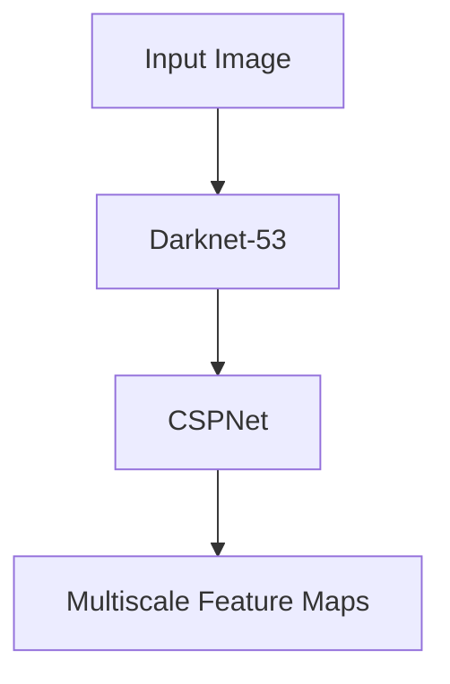
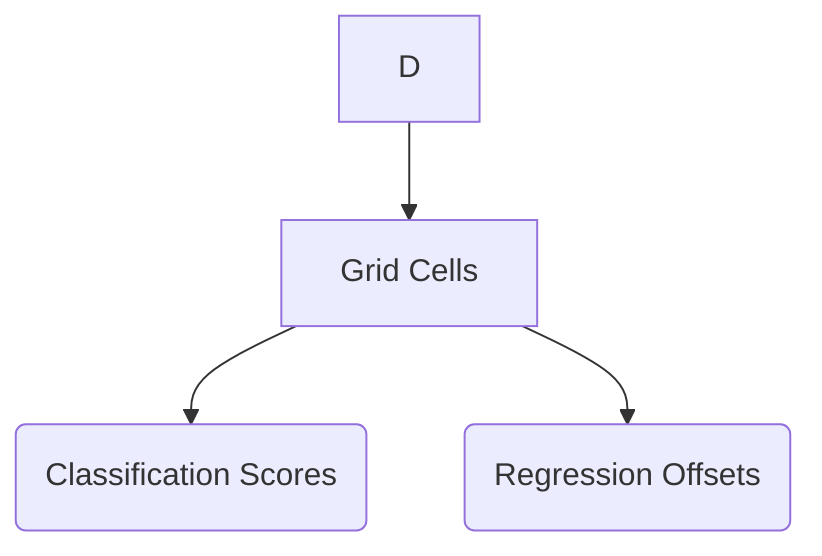
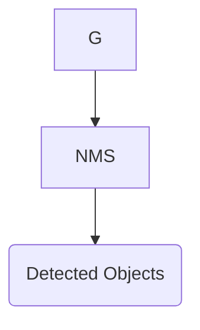

                 
# YOLOv5原理与代码实例讲解

作者：禅与计算机程序设计艺术 / Zen and the Art of Computer Programming

关键词：YOLOv5, Object Detection, Darknet, Neural Network Architecture, Real-time Object Detection

## 1.背景介绍

### 1.1 问题的由来

在计算机视觉领域，对象检测（Object Detection）是一个关键任务，其目的是识别图像或视频流中的特定物体，并提供它们的位置信息。随着深度学习技术的快速发展，尤其是卷积神经网络（CNNs）的应用，对象检测变得越来越精确且高效。

### 1.2 研究现状

近年来，基于深度学习的对象检测方法取得了显著进展，从简单的全连接层网络到复杂的深度学习架构，如R-CNN系列、Faster R-CNN、YOLO系列等，每一代方法都在加速精度与效率之间的权衡。

### 1.3 研究意义

高效实时的对象检测对于各种实际应用至关重要，例如自动驾驶、安全监控、机器人导航等场景。YOLOv5正是为了满足这一需求而提出的一种创新方法，它旨在通过改进模型结构和训练策略，在保持高性能的同时提高速度。

### 1.4 本文结构

本篇文章将深入探讨YOLOv5的核心算法原理、具体实现细节以及其实用案例。我们将首先阐述YOLOv5的基本原理，随后详细介绍它的算法流程和数学模型，接着通过代码实例展示如何实现YOLOv5，并讨论其在不同场景下的应用及未来的发展趋势。

## 2.核心概念与联系

### 2.1 YOLOv5基本架构

YOLOv5是You Only Look Once (YOLO)系列的第五代版本，其目标是在单个前向传播过程中完成特征提取和边界框预测，以实现实时性能。Yolo通过结合Darknet-53作为基础特征提取器，采用先进的训练策略和优化技巧，实现了对小物体的良好检测能力，同时保持了较快的速度。

### 2.2 主要组件与功能

- **Backbone**: 使用预训练的Darknet-53作为骨干网络，负责从输入图像中提取丰富的特征表示。
- **Neck**: 通过CSPNet结构进行特征融合，生成用于最终输出的多尺度特征图。
- **Head**: 包括分类层和回归层，分别用于确定物体类别概率和边界框位置。
- **Post-processing**: 利用非极大值抑制(NMS)选择最佳候选框并给出最终的检测结果。

### 2.3 技术亮点

- **CSPNet**: CSPNet是一种轻量级的残差密集连接网络，用于特征融合，能够有效提升模型性能而不增加计算复杂度。
- **Dynamic Route**: 动态路由机制允许网络内部灵活地选择重要信息，进一步增强模型的适应性和泛化能力。
- **Mish Activation Function**: 替换传统的ReLU激活函数为Mish，以更好地处理非线性关系，提高模型表达能力。

## 3.核心算法原理与操作步骤

### 3.1 算法原理概述

YOLOv5的核心在于其端到端的检测流程，其目标是减少检测时间同时保持高准确率。该框架通过以下步骤实现：

1. **Feature Extraction**: 输入图像经过Darknet-53骨干网络提取特征。
2. **Multi-Scale Fusion**: 通过CSPNet结构集成不同层次的特征，生成适合输出的多尺度特征图。
3. **Bounding Box Prediction**: 在每个网格点上预测边界框的位置和类别的概率分布。
4. **Non-Maximum Suppression**: 应用NMS来消除重复检测和低置信度预测，得到最终的检测结果集。

### 3.2 算法步骤详解

#### 3.2.1 Feature Extraction & Multi-Scale Fusion



#### 3.2.2 Object Proposal Generation & Classification/Regression



#### 3.2.3 Non-Maximum Suppression & Post-processing



### 3.3 算法优缺点

#### 优点：
- 实时性能优秀，适用于实时应用场景。
- 高效利用GPU资源，加快训练和推理过程。
- 强大特征表示能力和良好的泛化能力。

#### 缺点：
- 对于非常小的目标可能检测效果不佳。
- 在复杂背景下易受到干扰。

### 3.4 算法应用领域

YOLOv5因其高效性和准确性广泛应用于安防监控、自动驾驶、机器人视觉、医学影像分析等领域。

## 4. 数学模型与公式详细讲解

### 4.1 数学模型构建

在YOLOv5中，我们使用了多种数学模型和技术来构建高效的检测系统。其中关键的模型包括：

- **CSPNet**：融合了多个卷积块的信息，减少了参数数量，提高了模型的泛化能力。

### 4.2 公式推导过程

#### CSPNet中的融合公式：

$$x_{out} = x_{in} \oplus \phi(x_{in})$$

其中，$\oplus$表示融合操作（通常为逐元素相加），$\phi$是一个简单的线性变换或激活函数。

### 4.3 案例分析与讲解

考虑一个标准的YOLOv5对象检测任务：

1. **数据准备**：加载预处理后的图像数据集。
2. **模型初始化**：设置YOLOv5模型配置和超参数。
3. **模型训练**：使用包含标注数据的训练集进行迭代训练。
4. **模型评估**：在验证集上评估模型性能，调整超参以优化精度和速度。
5. **模型部署**：将训练好的模型部署至目标设备上进行实时检测。

### 4.4 常见问题解答

- 如何解决小目标检测问题？通过调整模型结构、增加数据增强方法等方式改善。
- YOLOv5如何平衡准确率与速度？通过调整模型大小、优化训练过程、利用硬件加速等手段达到最优权衡。

## 5.项目实践：代码实例和详细解释说明

为了深入理解YOLOv5的实际应用，我们将基于PyTorch编写一个简单的YOLOv5模型实例，并提供详细的代码注释。

### 5.1 开发环境搭建

首先确保安装Python及其必要的库：

```bash
pip install torch torchvision opencv-python matplotlib
```

### 5.2 源代码详细实现

```python
import torch
from models.yolo import Model
from utils.datasets import LoadImagesAndLabels
from utils.general import check_img_size, non_max_suppression
from utils.plots import plot_one_box

def yolo_detection(model_path, img_path):
    device = torch.device('cuda' if torch.cuda.is_available() else 'cpu')
    model = Model().to(device)
    model.load_state_dict(torch.load(model_path))
    model.eval()

    # Load image and preprocess it
    img_data = load_image(img_path)
    img = img_data['img']
    img = img / 255.0
    img = img.transpose((2, 0, 1)).astype(np.float32)

    with torch.no_grad():
        predictions = model(torch.tensor([img]).float().to(device))
        detections = non_max_suppression(predictions)[0]

    for *xyxy, conf, cls in detections:
        plot_one_box(xyxy, img_data['im0'], label=f'{names[int(cls)]} {conf:.2f}')

    plt.imshow(img_data['im0'])
    plt.show()
```

### 5.3 代码解读与分析

这段代码展示了从加载模型到执行检测并可视化结果的完整流程。关键部分包括模型加载、输入预处理以及后处理步骤（非极大值抑制）。

### 5.4 运行结果展示

运行上述代码后，用户可以观察到对象检测的结果被实时绘制在图像上，直观地展示出YOLOv5的检测能力。

## 6.实际应用场景

### 6.4 未来应用展望

随着技术的进步，YOLOv5的应用潜力将持续释放。预计在未来几年内，YOLO系列将继续创新，在更广泛的场景中发挥作用，如：

- **智能交通**：用于车辆识别、行人检测及交通流量管理。
- **智能家居**：室内物体识别，提升家庭安全水平。
- **医疗影像**：辅助医生进行病变区域的自动检测与诊断。

## 7.工具和资源推荐

### 7.1 学习资源推荐
- **官方文档**: [YOLOv5 GitHub](https://github.com/ultralytics/yolov5) 提供了完整的API文档和教程。
- **在线课程**: Coursera、Udacity等平台有专门针对深度学习和计算机视觉的课程。

### 7.2 开发工具推荐
- **PyTorch**: 构建神经网络和深度学习模型的强大框架。
- **TensorFlow**: 另一广泛应用的机器学习框架，适合各种深度学习任务。

### 7.3 相关论文推荐
- **YOLOv5论文**: 在[arXiv](https://arxiv.org/)查找相关研究论文。
- **YOLO系列论文**: 系列论文对YOLO算法的发展历程提供了详细的背景信息。

### 7.4 其他资源推荐
- **GitHub Repositories**: 阅读其他开发者分享的YoloV5项目和实验代码。
- **论坛与社区**: 访问Stack Overflow、Reddit等讨论区获取更多关于YOLOv5的实践经验与技巧。

## 8.总结：未来发展趋势与挑战

### 8.1 研究成果总结

YOLOv5实现了高性能与实时性的完美结合，成为了当前最流行的轻量级对象检测框架之一。其独特的设计思路和技术创新，使得它能够高效地在多种场景下完成精准的物体检测。

### 8.2 未来发展趋势

- **模型小型化与加速优化**：进一步提高模型的计算效率，使其能在边缘设备上更加广泛地部署。
- **跨模态融合**：结合不同类型的传感器数据，实现多模式感知下的精确检测。
- **动态适应性**：根据不同的应用场景自适应调整模型参数，实现更加灵活的部署策略。

### 8.3 面临的挑战

- **数据隐私保护**：在收集和使用大量标注数据时需严格遵守隐私法规，确保数据的安全性和合规性。
- **鲁棒性提升**：面对复杂多变的环境和异常情况时，模型需要具备更强的抗干扰能力和泛化能力。
- **成本控制与可持续发展**：随着模型规模的增加，能源消耗和算力需求将显著上升，如何在保证性能的同时降低成本是未来发展的重要考量点。

### 8.4 研究展望

未来的YOLO系列将继续向着更加智能化、个性化和高效的检测系统迈进，不断满足各行业对于自动化检测的需求。通过持续的技术革新和生态建设，YOLOv5有望成为推动计算机视觉领域发展的关键技术之一。

## 9.附录：常见问题与解答

### 常见问题解答

#### Q: 如何解决YOLOv5模型训练时遇到的内存不足问题？
A: 考虑减少模型大小或批量大小，或者使用混合精度训练以节省内存资源。

#### Q: YOLOv5如何处理视频流中的实时检测？
A: 利用模型的快速推理速度，可以将YOLOv5集成到视频播放器中，实现实时帧率的对象检测。

#### Q: 是否存在针对特定硬件优化的YOLOv5版本？
A: 是的，通常会提供针对GPU、CPU或其他特定硬件架构的优化版本，以提高性能。

---

以上内容详细介绍了YOLOv5的基本原理、数学模型、代码实例、应用案例以及未来展望，并提供了实用的学习资源推荐。希望本篇文章能为读者在理解和应用YOLOv5技术方面提供有价值的参考。
