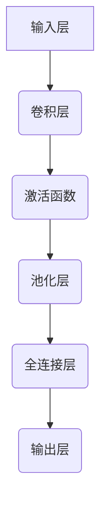

                 
# 一切皆是映射：卷积神经网络(CNNs)在图像处理中的应用

作者：禅与计算机程序设计艺术 / Zen and the Art of Computer Programming

关键词：卷积神经网络(CNNs), 图像处理, 卷积核, 局部不变性, 特征提取

## 1. 背景介绍

### 1.1 问题的由来

随着数字成像设备的普及，如数码相机、摄像头以及各种传感器，大量高质量图像数据的生成使得图像处理成为了现代科技的重要组成部分。这些图像不仅包含了丰富的视觉信息，而且蕴含着大量的潜在知识，对于科学研究、商业决策、安全监控等多个领域都有着极其重要的价值。然而，直接从原始像素值进行高维空间上的理解和分析往往是具有挑战性的，这是因为人类对世界的感知往往基于局部特征和模式识别能力，而非全盘考虑整个图像的细节。

### 1.2 研究现状

近年来，深度学习方法，尤其是卷积神经网络（Convolutional Neural Networks, CNNs）的兴起极大地推动了图像处理领域的进步。CNNs通过模仿人脑视觉皮层的层次化结构，能够自动学习图像中的特征，并且具有较强的泛化能力和鲁棒性。它们被广泛应用于目标检测、图像分类、语义分割、风格迁移等多种任务上，显著提高了图像处理的准确性和效率。

### 1.3 研究意义

深入理解并优化CNNs在图像处理中的表现，不仅可以提升现有技术的应用效果，还能为开发新的高效、低能耗的人工智能系统奠定基础。此外，这一研究还促进了人工智能理论的发展，尤其是在非线性映射、局部不变性、可解释性等方面的研究，有助于建立更加健壮、透明的机器学习模型。

### 1.4 本文结构

接下来，我们将探讨卷积神经网络的核心概念、算法原理及其在图像处理中的应用，包括数学建模、具体操作流程、实际案例分析、代码实现、未来应用场景展望以及相关工具与资源推荐等。

---

## 2. 核心概念与联系

### 2.1 卷积运算

卷积神经网络的核心在于其特有的卷积层，该层采用了一个或多个卷积核（Kernel），每个卷积核负责检测输入图像中特定的局部特征。卷积运算可以视为一种多尺度的空间滤波操作，它通过对输入图像执行滑动窗口扫描，并计算窗口内点与卷积核对应位置元素的加权和得到输出。

$$ (f * k)(x,y) = \sum_{m=-M}^{M}\sum_{n=-N}^{N} f(x+m, y+n)k(m,n) $$

其中$f$表示输入图像，$k$表示卷积核，$(f * k)$表示卷积运算的结果。

### 2.2 局部不变性

卷积神经网络的另一个关键特性是其局部不变性。通过使用不同大小和移动步长的卷积核，网络能够捕获不同尺度、形状和方向的特征，从而增强其对输入变化的鲁棒性，例如旋转、缩放和亮度变化。

### 2.3 特征层级

卷积神经网络通常包含多个卷积层，每一层都会产生更抽象、更高层次的特征表示。这种多层次的特征构建机制允许网络逐步地从低级到高级抽象特征，最终形成对图像内容的高度概括。

## 3. 核心算法原理 & 具体操作步骤

### 3.1 算法原理概述

卷积神经网络的基本架构如下图所示：



- **输入层**：接收原始图像作为输入。
- **卷积层**：应用一系列卷积核进行特征检测。
- **激活函数**：引入非线性变换，增加模型表达能力。
- **池化层**：减少特征图的维度，降低计算复杂度同时保持重要信息。
- **全连接层**：将低层特征整合，用于分类或回归任务。
- **输出层**：根据任务需求生成预测结果。

### 3.2 算法步骤详解

以一个简单的图像分类任务为例：

1. **初始化参数**：设定卷积核的数量、尺寸、步长、填充等。
2. **前向传播**：
   - 将输入图像馈入卷积层，经过卷积运算后应用激活函数。
   - 接下来执行池化操作，缩小特征图的尺寸。
   - 经过多次迭代后，所有卷积层和池化层都完成，进入全连接层。
3. **反向传播**：计算损失函数，更新权重和偏置。
4. **训练循环**：重复前向传播和反向传播过程，直到达到预设的迭代次数或性能指标满足要求。

### 3.3 算法优缺点

优点：

- 自动提取特征，减少了人工设计的需要。
- 层次化的特征表示增强了模型的表达能力。
- 较高的鲁棒性和泛化能力。

缺点：

- 训练时间较长，特别是在大规模数据集上。
- 对于复杂的任务可能需要大量的计算资源。
- 模型解释性较差，即难以理解模型内部决策过程。

### 3.4 算法应用领域

卷积神经网络广泛应用于以下领域：

- 图像分类与识别
- 目标检测
- 图像分割
- 语义理解与生成
- 视频分析
- 医疗影像诊断

## 4. 数学模型和公式 & 详细讲解 & 举例说明

### 4.1 数学模型构建

假设我们有一个图像$I \in R^{H \times W \times C}$，其中$H$、$W$分别是高度和宽度，而$C$代表通道数（如RGB颜色空间）。给定$k \times k$大小的卷积核$K$和步长$p$，卷积运算的数学表达式可以进一步细化为：

$$\text{Conv}(I, K)_{out}(h, w) = \sum_{i=0}^{\frac{H-h}{p}}\sum_{j=0}^{\frac{W-w}{p}} I(i \cdot p + h, j \cdot p + w, :)\cdot K(h-i, w-j,:)$$

其中$h$和$w$是在输出特征图上的位置索引。

### 4.2 公式推导过程

在构建深度学习模型时，公式推导主要围绕损失函数最小化展开。对于二元分类问题，常用的损失函数包括交叉熵损失函数：

$$L(\hat{y}, y) = -y \log(\hat{y}) - (1-y) \log(1-\hat{y})$$

其中$\hat{y}$是预测的概率值，$y$是真实的标签。

### 4.3 案例分析与讲解

考虑一个基本的图像分类任务，利用卷积神经网络识别手写数字（MNIST）中的图片。该模型可能包含两个卷积层，每个层后面跟着一个最大池化层，最后是一个全连接层进行分类。

### 4.4 常见问题解答

常见的问题及解决方案包括：

- **梯度消失/爆炸**：调整学习率、使用不同的激活函数（如ReLU）、优化器选择（如Adam），以及规范化技术（如批标准化）来缓解这一问题。
- **过度拟合**：通过正则化技术（如$L_1$、$L_2$正则化）、Dropout、数据增强等方式来提升模型的泛化能力。
- **模型效率**：采用GPU加速训练、批量梯度下降、并行计算等方法提高训练速度。

## 5. 项目实践：代码实例和详细解释说明

为了演示如何实现一个简单的CNN模型，并将其应用于图像分类任务，下面提供了一个基于PyTorch框架的示例代码：

```python
import torch
import torchvision.transforms as transforms
from torchvision.datasets import MNIST
from torch.utils.data import DataLoader
from torchvision.models import resnet18

# 数据加载和预处理
transform = transforms.Compose([
    transforms.ToTensor(),
    transforms.Normalize((0.5,), (0.5,))
])
train_dataset = MNIST(root='./data', train=True, download=True, transform=transform)
test_dataset = MNIST(root='./data', train=False, download=True, transform=transform)
train_loader = DataLoader(train_dataset, batch_size=64, shuffle=True)
test_loader = DataLoader(test_dataset, batch_size=64)

# CNN模型定义
class SimpleCNN(torch.nn.Module):
    def __init__(self):
        super(SimpleCNN, self).__init__()
        self.conv1 = torch.nn.Conv2d(in_channels=1, out_channels=16, kernel_size=3, stride=1, padding=1)
        self.relu = torch.nn.ReLU()
        self.pool = torch.nn.MaxPool2d(kernel_size=2, stride=2)
        self.fc = torch.nn.Linear(16 * 7 * 7, 10)

    def forward(self, x):
        x = self.conv1(x)
        x = self.relu(x)
        x = self.pool(x)
        x = x.view(-1, 16 * 7 * 7)
        x = self.fc(x)
        return x

model = SimpleCNN()

# 训练设置
optimizer = torch.optim.Adam(model.parameters(), lr=0.001)
criterion = torch.nn.CrossEntropyLoss()

for epoch in range(10):  # 迭代次数
    for inputs, labels in train_loader:
        optimizer.zero_grad()
        outputs = model(inputs)
        loss = criterion(outputs, labels)
        loss.backward()
        optimizer.step()

# 测试模型
correct = 0
total = 0
with torch.no_grad():
    for inputs, labels in test_loader:
        outputs = model(inputs)
        _, predicted = torch.max(outputs.data, 1)
        total += labels.size(0)
        correct += (predicted == labels).sum().item()

print('Accuracy of the network on the 10000 test images: %d %%' % (100 * correct / total))
```

## 6. 实际应用场景

卷积神经网络在多种实际场景中发挥着重要作用，例如：

### 6.4 未来应用展望

随着研究的深入和技术的进步，卷积神经网络的应用领域将进一步扩展，包括但不限于：

- 更加高效、低能耗的人工智能系统开发。
- 复杂视觉任务的自动化解决，如自动驾驶、医学影像分析等。
- 跨模态学习，将图像信息与其他类型的数据相结合以提高性能。
- 自适应学习机制，使模型能够根据环境变化自我调整和优化。

## 7. 工具和资源推荐

### 7.1 学习资源推荐

- **在线课程**：
  - Coursera上的“深学习”系列课程。
  - edX的“机器学习入门”课程。
  
- **书籍**：
  - “Deep Learning” by Ian Goodfellow, Yoshua Bengio, and Aaron Courville。
  - “Computer Vision: A Modern Approach” by David H. Ballard and Christopher M. Brown。
  
- **论文**：
  - “ImageNet Classification with Deep Convolutional Neural Networks” by Alex Krizhevsky et al.
  - “GoogLeNet: Going Deeper with Convolutions” by Christian Szegedy et al.

### 7.2 开发工具推荐

- **深度学习框架**：
  - TensorFlow
  - PyTorch
  
- **数据集**：
  - ImageNet
  - CIFAR-10
  - COCO

### 7.3 相关论文推荐

- “Learning Deep Architectures for AI” by Yann LeCun et al.
- “Convolutional Neural Networks for Sentence Classification” by Yoon Kim

### 7.4 其他资源推荐

- **GitHub Repositories**: 丰富的开源项目和实验代码库。
- **学术会议**：CVPR, ICML, NeurIPS等顶级人工智能与机器学习会议。

## 8. 总结：未来发展趋势与挑战

### 8.1 研究成果总结

卷积神经网络作为深度学习的重要组成部分，在图像处理领域的贡献巨大。通过其独特的设计理念和算法创新，不仅实现了对复杂视觉模式的有效识别，还推动了计算机视觉技术的整体发展。

### 8.2 未来发展趋势

- **多模态融合**：结合其他类型的输入（声音、文本）进行深度学习，提升跨域任务的解决方案能力。
- **可解释性增强**：探索更深层次的理解网络决策过程，提高模型透明度和信任度。
- **自适应性和鲁棒性的提升**：设计更加灵活的网络架构，使其能自动适应不同任务需求，并具有更强的对抗攻击防御能力。
- **计算效率优化**：探索更高效的计算方法，减少训练时间和硬件消耗，实现更广泛的部署。

### 8.3 面临的挑战

- **过拟合问题**：需要进一步改进正则化策略，确保模型在面对未见数据时也能保持良好的泛化能力。
- **解释性不足**：尽管存在一些试图增加模型可解释性的努力，但如何提供清晰、有效的模型解释仍然是一个开放的研究方向。
- **能源消耗**：随着大型模型的发展，降低计算和存储成本以及减少能源消耗成为关键问题之一。

### 8.4 研究展望

未来的研究将继续围绕如何构建更强大、更高效且更具普适性的卷积神经网络展开。同时，关注如何让这些模型更加符合人类的认知方式，从而更好地服务于社会各个层面的需求。

## 9. 附录：常见问题与解答

这里列出了一些常见问题及其解答，帮助读者快速了解并解决可能出现的技术难题：

- **Q:** 如何避免过度拟合？
  **A:** 使用正则化技术、Dropout层、批量归一化或数据增强等手段可以有效减轻过度拟合现象。

- **Q:** 在选择深度学习框架时应该考虑哪些因素？
  **A:** 应考虑框架的易用性、社区支持、性能表现以及是否满足特定项目的特殊需求（如TensorFlow的优势在于成熟的生态体系，PyTorch在科研领域拥有更高的灵活性）。

- **Q:** 卷积神经网络为什么适用于图像处理？
  **A:** 卷积操作可以捕捉局部特征，而层次化的结构允许网络从简单到复杂的特征逐步抽象，这使得CNN特别适合于理解和处理高维图像数据。
