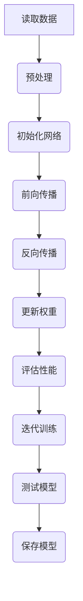

                 
# 卷积神经网络(Convolutional Neural Networks) - 原理与代码实例讲解

作者：禅与计算机程序设计艺术 / Zen and the Art of Computer Programming

关键词：卷积神经网络(CNN), 图像识别, 深度学习, 计算机视觉, 特征提取, 局部不变性

## 1.背景介绍

### 1.1 问题的由来

在现代计算机科学与工程的众多领域中，图像处理和理解是关键挑战之一。随着数据量的爆炸式增长以及计算能力的提升，对高效且精确的图像分析方法的需求日益增加。传统的方法往往依赖于人工设计的特征，然而，这种方法存在效率低、泛化能力弱的问题。因此，需要一种能够自动从原始数据中学习有效特征表示的方法，这就是卷积神经网络（Convolutional Neural Networks, CNN）应运而生的原因。

### 1.2 研究现状

自20世纪80年代首次提出以来，CNN已经发展成为深度学习领域中最重要的组成部分之一，在图像分类、物体检测、语义分割等多个任务上取得了显著的性能提升。近年来，得益于硬件加速技术的发展（如GPU、TPU）、大数据集的积累以及优化算法的进步，CNN的应用范围不断扩大，并在许多实际场景中展现出卓越的能力。

### 1.3 研究意义

CNN的研究不仅推动了计算机视觉领域的发展，也为自动驾驶、医疗影像分析、机器人视觉等领域提供了强大的技术支持。其对局部特征的敏感性和对复杂模式的学习能力使得它在解决高维、非线性问题时表现出色，为人工智能系统赋予了“看”和“理解”的能力，从而极大地拓展了人类利用机器智能处理信息的方式。

### 1.4 本文结构

本篇文章旨在深入探讨卷积神经网络的核心原理及其在实际开发中的应用。首先，我们将回顾卷积神经网络的基本概念与联系，然后详细介绍其算法原理与具体操作步骤。接下来，我们通过数学模型与公式深入解析CNN的工作机制，并结合代码实例进行实践演示。最后，我们将探讨CNN的实际应用场景与未来发展趋势，以期为读者提供全面的技术理解和实用指导。

## 2.核心概念与联系

### 2.1 原始概念介绍

#### 2.1.1 卷积层 (Convolution Layer)

卷积层是CNN中最基本的组成部分，负责从输入数据中提取局部特征。它使用一系列大小固定的小矩阵（称为滤波器或核）在输入数据上滑动，对每个位置执行点乘运算并求和，产生一个新的输出值，这个过程被称为卷积操作。

#### 2.1.2 激活函数 (Activation Function)

激活函数引入非线性因素到模型中，允许网络学习复杂的映射关系。常见的激活函数包括ReLU（Rectified Linear Unit）、sigmoid和tanh等。

#### 2.1.3 池化层 (Pooling Layer)

池化层用于减少输入特征图的空间维度，降低模型参数数量和计算成本。常用的池化类型有最大池化（Max Pooling）和平均池化（Average Pooling）。

#### 2.1.4 全连接层 (Fully Connected Layer)

全连接层将所有前一层的输出节点与下一层的所有节点相连，用于进行最终的分类决策或回归预测。它是传统神经网络的关键部分，但在CNN中通常位于卷积层之后，作为整个网络的最后一步。

### 2.2 CNN的架构特点

- **局部感受野**：每个卷积核只关注输入的一个小区域。
- **权重共享**：同一层内的卷积核权重相同，减少参数数量。
- **稀疏连接**：除了相邻的像素外，其他像素之间没有直接的连接。
- **非线性变换**：激活函数引入非线性，使网络能学习更复杂的特征表达。
- **层次化抽象**：不同层级提取不同尺度和特性的特征。

## 3.核心算法原理 & 具体操作步骤

### 3.1 算法原理概述

卷积神经网络的核心在于通过多层次的卷积、激活、池化操作，逐步从原始图像中抽取具有层次特征表示。每一层的输出都是对上一层输出的进一步抽象和简化，形成一个递归的特征生成过程。这种层次化结构有助于网络学习更加复杂和抽象的概念。

### 3.2 算法步骤详解

以下是一个典型的CNN训练流程：



### 3.3 算法优缺点

优点：
- 自动特征提取：无需手动设计特征。
- 参数共享：减少过拟合风险。
- 层次化学习：能够处理多尺度特征。
- 可解释性：对于特定决策的解释较容易实现。

缺点：
- 计算资源需求大：涉及大量参数和计算。
- 对超参数敏感：如学习率、批次大小等。
- 需要大量的训练数据：否则可能影响模型表现。

### 3.4 算法应用领域

- 图像识别与分类
- 物体检测与定位
- 目标跟踪
- 图像生成与合成
- 医疗影像分析
- 自然语言处理（文本到图像转换）

## 4. 数学模型和公式 & 详细讲解 & 举例说明

### 4.1 数学模型构建

假设输入图像$I$的尺寸为$W \times H \times C$（宽度、高度和通道数），滤波器$k$的尺寸为$f \times f \times C$（宽度、高度和通道数），步长$s$，填充$p$。则卷积操作可以表示为：

$$
\text{Output}_{ij} = \sum_{m=0}^{f-1}\sum_{n=0}^{f-1}\sum_{c=0}^{C-1} I_{i+m,p+n,c} \cdot k_{m,n,c}
$$

其中$i,j$是输出特征图的位置索引。

### 4.2 公式推导过程

以简单的二维卷积为例，我们可以将上述公式展开如下：

给定输入矩阵$I$和滤波器矩阵$k$，以及它们的尺寸分别为$W, H, C$和$f, f, C$。卷积层的输出大小$(O_W, O_H)$可以通过下面的公式计算：

$$
O_W = \frac{(W + 2p - f)}{s} + 1 \\
O_H = \frac{(H + 2p - f)}{s} + 1
$$

其中$p$是填充量，$s$是步长。

### 4.3 案例分析与讲解

考虑一个简单的图像分类任务，使用CNN进行训练。我们采用经典的MNIST手写数字数据库作为示例。该任务的目标是识别0-9之间的手写数字。在实践中，我们可以使用Keras或其他深度学习库来构建CNN模型，并通过调整网络结构、优化方法等参数来提高模型的性能。

### 4.4 常见问题解答

常见问题包括但不限于：

- 如何选择合适的滤波器大小？
- 在哪些情况下应该使用池化层？
- 如何解决过拟合问题？

这些问题的答案通常依赖于具体的应用场景和数据特性，需要根据实际情况灵活调整网络结构和训练策略。

## 5. 项目实践：代码实例和详细解释说明

### 5.1 开发环境搭建

为了执行CNN的代码实例，我们需要安装Python及其相关库，例如TensorFlow、Keras或PyTorch。确保你的开发环境中已经安装了这些库。以下是基本命令：

```bash
pip install tensorflow keras numpy matplotlib
```

### 5.2 源代码详细实现

#### 实现CNN模型

以下是一个使用Keras构建简单CNN模型的例子：

```python
from tensorflow.keras.models import Sequential
from tensorflow.keras.layers import Conv2D, MaxPooling2D, Flatten, Dense, Dropout

def create_cnn_model(input_shape):
    model = Sequential()
    
    # 卷积层1
    model.add(Conv2D(32, kernel_size=(3, 3), activation='relu', input_shape=input_shape))
    model.add(MaxPooling2D(pool_size=(2, 2)))
    
    # 卷积层2
    model.add(Conv2D(64, kernel_size=(3, 3), activation='relu'))
    model.add(MaxPooling2D(pool_size=(2, 2)))
    
    # 全连接层
    model.add(Flatten())
    model.add(Dense(128, activation='relu'))
    model.add(Dropout(0.5))  # 减少过拟合
    model.add(Dense(10, activation='softmax'))  # 输出层
    
    return model

# 调用函数创建模型
model = create_cnn_model((28, 28, 1))

# 编译模型
model.compile(optimizer='adam',
              loss='sparse_categorical_crossentropy',
              metrics=['accuracy'])

# 数据预处理
(x_train, y_train), (x_test, y_test) = tf.keras.datasets.mnist.load_data()
x_train = x_train.reshape(-1, 28, 28, 1).astype('float32') / 255
x_test = x_test.reshape(-1, 28, 28, 1).astype('float32') / 255
y_train = tf.keras.utils.to_categorical(y_train)
y_test = tf.keras.utils.to_categorical(y_test)

# 训练模型
model.fit(x_train, y_train, epochs=5, batch_size=128)

# 测试模型
loss, accuracy = model.evaluate(x_test, y_test)
print("Test accuracy:", accuracy)
```

### 5.3 代码解读与分析

这段代码首先定义了一个简单的CNN模型，包含两个卷积层和两个全连接层。它利用ReLU激活函数、Max Pooling层减少参数数量并增加不变性，最后使用Dropout防止过拟合。模型编译时设置损失函数为交叉熵，并选择Adam优化算法。然后加载MNIST数据集，对其进行预处理，并使用训练集对模型进行训练。测试阶段评估模型在测试集上的准确率。

### 5.4 运行结果展示

运行此代码后，你将会看到模型的训练和测试准确率。对于MNIST数据集，期望的结果应接近99%以上。

## 6. 实际应用场景

卷积神经网络广泛应用于多个领域，如自动驾驶中的物体检测、医疗影像分析（如肿瘤检测）、自然语言处理中基于视觉的理解、视频分析等。它们能够有效处理高维数据，提取关键特征，支持复杂的决策制定流程。

## 7. 工具和资源推荐

### 7.1 学习资源推荐

- **书籍**：
  - "Deep Learning" by Ian Goodfellow, Yoshua Bengio and Aaron Courville
  - "Convolutional Neural Networks: A Visual Introduction for Beginners"
  
- **在线课程**：
  - TensorFlow官方教程：[https://www.tensorflow.org/tutorials](https://www.tensorflow.org/tutorials/)
  - Coursera's Deep Learning Specialization: [https://www.coursera.org/specializations/deep-learning](https://www.coursera.org/specializations/deep-learning)
  - Udacity's Intro to AI with Deep Learning Nanodegree: [https://www.udacity.com/course/intro-to-ai-with-deep-learning--nd101](https://www.udacity.com/course/intro-to-ai-with-deep-learning--nd101)

### 7.2 开发工具推荐

- **深度学习框架**：TensorFlow、PyTorch、Keras、CNTK
- **可视化工具**：Matplotlib、Seaborn、Plotly

### 7.3 相关论文推荐

- "LeNet-5" by Yann LeCun et al.
- "ImageNet Classification with Deep Convolutional Neural Networks" by Alex Krizhevsky et al.

### 7.4 其他资源推荐

- **GitHub Repositories**: Search for repositories related to CNNs on GitHub to find open-source projects and code examples.
- **Online Forums and Communities**: Participate in forums like Stack Overflow, Reddit’s r/MachineLearning, or the Keras community forum to get help and share knowledge.

## 8. 总结：未来发展趋势与挑战

### 8.1 研究成果总结

通过本篇文章的学习，我们深入理解了卷积神经网络的核心原理及其在实际开发中的应用。从基本概念到数学建模，再到代码实现，以及其在实际场景中的应用案例，文章提供了全面的技术指导和实践经验。

### 8.2 未来发展趋势

随着硬件技术的进步、大数据集的积累以及算法优化的不断推进，卷积神经网络将继续发展：

- **性能提升**：更高的计算能力将允许构建更大规模的模型。
- **复杂任务扩展**：CNN将进一步应用于更复杂、更具挑战性的任务。
- **解释性和透明度**：提高模型的可解释性，使得模型决策过程更加清晰明了。
- **跨模态融合**：结合其他类型的输入（如文本、语音）以增强模型的能力。

### 8.3 面临的挑战

尽管CNN展现出巨大的潜力，但在实际应用中仍面临一些挑战：

- **数据依赖**：高性能通常需要大量高质量的数据支持。
- **解释性问题**：黑盒性质导致模型决策难以解释。
- **泛化能力**：在新数据集上表现不佳可能限制其广泛应用。

### 8.4 研究展望

未来的研究将致力于解决上述挑战，同时探索新的应用场景。持续的创新和技术进步有望推动CNN向着更高效、更智能、更容易理解和控制的方向发展。

## 9. 附录：常见问题与解答

Q: 我该如何选择合适的滤波器大小？
A: 滤波器大小的选择取决于你要识别的目标尺寸和图像细节的重要性。一般来说，较小的滤波器可以捕捉到更精细的特征，而较大的滤波器则更适合于捕捉更大的模式或整体结构。

Q: 如何避免过拟合？
A: 除了使用正则化技术（如L1、L2正则化），还可以采用Dropout、数据增强、提前停止训练等策略来减少过拟合的风险。

Q: 卷积层和池化层的作用是什么？
A: 卷积层用于从输入数据中提取局部特征；池化层则用于降低空间维度，减少参数量，同时也增加了模型的稳健性。两者相结合可以帮助模型更好地抽象出有意义的信息。

---

通过上述内容，我们不仅深入探讨了卷积神经网络的基本原理、应用实践，还展望了其未来的趋势和发展方向，为读者提供了一次系统且全面的学习体验。
