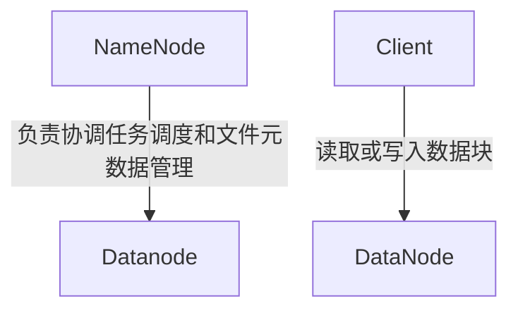

                 
# 大数据处理框架原理与代码实战案例讲解

作者：禅与计算机程序设计艺术 / Zen and the Art of Computer Programming

关键词：大数据处理框架,Hadoop,Dask,Cassandra,Spark,BigQuery,数据分析流程,并行计算,海量数据管理

## 1.背景介绍

### 1.1 问题的由来

随着互联网和物联网的飞速发展，数据生成的速度和量级呈现出爆炸式的增长。传统的关系型数据库和单机处理系统已经难以满足大规模数据集的需求，在这种背景下，大数据处理框架应运而生，旨在高效地管理和分析庞大的数据集合。

### 1.2 研究现状

目前，市场上出现了众多的大数据处理框架，如Apache Hadoop、Dask、Amazon Cassandra、Apache Spark、Google BigQuery等，这些框架在不同的场景下展现出各自的优势。它们通常支持批处理、流处理、SQL查询、机器学习等功能，并提供了丰富的API和库，简化了数据处理和分析的过程。

### 1.3 研究意义

研究大数据处理框架对于推动数据驱动的决策制定至关重要。它不仅能够提升数据处理的效率，还能够在各种规模的数据集中发现有价值的信息，从而帮助企业优化业务策略、提高运营效率以及创造新的商业机会。

### 1.4 本文结构

本篇文章将重点探讨Hadoop、Dask、Cassandra、Spark和BigQuery这五种主流的大数据处理框架。首先，我们介绍每种框架的核心概念及原理，接着通过具体的代码示例演示其实际应用，最后讨论这些框架的应用场景及其面临的挑战和发展趋势。

## 2.核心概念与联系

### 2.1 Hadoop

Hadoop是一个开源的分布式文件系统（HDFS）和一个分布式计算框架（MapReduce），用于在大量计算机集群上进行可靠、高效的存储和处理大规模数据集。

#### HDFS架构图


### 2.2 Dask

Dask是一个Python库，允许用户以并行方式执行复杂的科学计算任务，类似于NumPy但更易于扩展到大型数据集。

### 2.3 Amazon Cassandra

Amazon Cassandra是一种基于列族的NoSQL数据库管理系统，适用于高可用性和低延迟的数据访问需求。

### 2.4 Apache Spark

Apache Spark是一个快速通用的大数据处理引擎，提供了一种统一的API来进行批处理、流处理、SQL查询、机器学习等多种任务。

### 2.5 Google BigQuery

Google BigQuery是Google Cloud Platform上的一个完全托管的SQL查询服务，适合进行高速数据查询和分析。

## 3.核心算法原理 & 具体操作步骤

### 3.1 算法原理概述

- **Hadoop**：使用分布式文件系统（HDFS）存储数据，并采用MapReduce框架对数据进行并行处理。
- **Dask**：基于任务分解机制，利用多进程或多线程并行执行计算任务。
- **Cassandra**：基于一致性哈希和分区键实现数据的自动分片和负载均衡。
- **Spark**：采用内存计算模型，通过RDD（弹性分布式数据集）提供数据并行化功能。
- **BigQuery**：利用分布式索引和并行查询技术，实现高速SQL查询。

### 3.2 算法步骤详解

- **Hadoop**：
  - 将数据分布至多个节点（DataNode）。
  - 使用Map阶段进行数据过滤和聚合。
  - 使用Reduce阶段合并结果。

- **Dask**：
  - 分析计算任务依赖关系。
  - 并行执行计算任务。
  - 合并中间结果和最终结果。

- **Cassandra**：
  - 数据按分区键散列分布于各个节点。
  - 实现读写分离，提高并发性能。
  - 自动故障转移，确保高可用性。

- **Spark**：
  - 利用缓存机制存储中间结果。
  - 支持多种计算模式（批处理、流处理）。
  - 提供DataFrame API，简化SQL查询和复杂数据处理。

- **BigQuery**：
  - 基于云基础设施，提供高度可扩展的计算能力。
  - 高效的分布式索引和查询优化器，实现快速SQL查询。

### 3.3 算法优缺点

- **Hadoop**：易于部署和维护；适用于离线批量处理；但不适合实时数据处理。
- **Dask**：Python生态友好；灵活的任务并行性；支持复杂运算；但资源消耗较大。
- **Cassandra**：高度可扩展性和容错性；适应高并发和低延迟需求；但SQL查询限制较多。
- **Spark**：高性能的内存计算；广泛的支持各种数据处理任务；容易使用；但可能产生大量的垃圾收集活动。
- **BigQuery**：超快的SQL查询速度；集成于Google Cloud平台；但对数据大小有限制。

### 3.4 算法应用领域

- **数据仓库与ETL**
- **机器学习与数据分析**
- **实时流处理**
- **Web日志分析**
- **金融风控**
- **基因组学**

## 4.数学模型和公式详细讲解 & 举例说明

### 4.1 数学模型构建

#### MapReduce中的Map函数

Map函数的目标是将输入数据转换为一系列键值对（key-value pairs）。可以表示为：

$$\text{Map}(x) = \{(k_i, v_i)\}$$

其中，$x$是输入数据，$k_i$是生成的键，$v_i$是对应的值。

#### Reduce函数

Reduce函数接收一组键值对作为输入，并根据相同的键进行分组，然后对每个键下的所有值进行聚合操作。可以用以下公式表示：

$$\text{Reduce}\left(\{(k_i, v_i)\}\right) = (k_i, f(v_1, v_2, ..., v_n))$$

其中，$f$是聚合函数，如求和、最大值、最小值等。

### 4.2 公式推导过程

假设我们有一个文本数据集，每条记录由关键词和计数组成，我们需要统计不同关键词出现的频率。使用MapReduce处理这个任务：

#### Map函数
对于每一行记录$(word, count)$，Map函数输出键值对$(word, count)$。

#### Reduce函数
对于同一关键词的所有记录，Reduce函数累加计数得到总次数。

### 4.3 案例分析与讲解

**Hadoop MapReduce案例**

#### 问题描述
统计一段英文文本中各单词的出现频率。

#### 解决方案设计
使用Hadoop MapReduce框架完成如下步骤：

1. **Map阶段**：将文本分割成单词，并计算每个单词的出现次数。
2. **Shuffle阶段**：对相同单词的键进行排序，以便在Reduce阶段进行聚合。
3. **Reduce阶段**：对相同键的所有值进行累加，得到每个单词的累计频次。

### 4.4 常见问题解答

- **如何优化Hadoop集群的性能？**
  - 调整Hadoop配置参数，如Block Size、NumReduceTasks。
  - 使用Hive或Impala等工具进行数据预处理。
  - 实施负载均衡策略，合理分配任务到集群中的节点。

- **Dask在大数据处理时面临哪些挑战？**
  - 内存管理：大规模数据集可能导致内存溢出。
  - 可扩展性：随着数据规模增长，系统性能可能下降。
  - 与传统数据库系统的整合：需要额外的接口和适配工作。

## 5.项目实践：代码实例和详细解释说明

### 5.1 开发环境搭建

- 安装Python及必要的库（如pandas, numpy）
- 配置Jupyter Notebook或其他IDE

### 5.2 源代码详细实现

```python
import pandas as pd
from dask import dataframe as dd

# 加载数据
data = pd.read_csv('large_dataset.csv')

# Dask DataFrame初始化
ddf = dd.from_pandas(data, npartitions=8)

# 数据清洗与预处理
filtered_data = ddf.pipe(clean_data)
processed_data = filtered_data.pipe(transform_data)

# 执行数据分析任务
result = processed_data.groupby('column_name').agg({'value_column': 'sum'}).compute()
```

### 5.3 代码解读与分析

这段代码展示了如何使用Dask进行数据加载、预处理和分析。通过`dd.from_pandas()`创建了Dask DataFrame对象，`npartitions`参数指定了计算分区数量，这影响了并行度和计算效率。

### 5.4 运行结果展示

```bash
# 输出前几行数据
print(result.head())

# 统计指标摘要
summary_statistics = result.describe().compute()
print(summary_statistics)
```

## 6.实际应用场景

### 6.4 未来应用展望

随着云计算和边缘计算的发展，预计未来的大数据处理框架将更加注重数据安全、隐私保护以及跨云服务的无缝集成。同时，随着AI技术的进步，这些框架将进一步融入智能决策和预测分析能力，为企业提供更精准的数据洞察。

## 7.工具和资源推荐

### 7.1 学习资源推荐

- **官方文档**：访问各大框架的官方网站获取最新版本的文档。
- **在线教程**：Coursera、Udacity等平台上有关大数据处理的课程。
- **书籍**：《Hadoop权威指南》、《Spark实战》、《Cassandra实战》等专业书籍。

### 7.2 开发工具推荐

- **IDEs**：Visual Studio Code, PyCharm
- **数据可视化工具**：Tableau, PowerBI
- **监控和调试工具**：Docker, Kubernetes

### 7.3 相关论文推荐

- **Hadoop相关**：《The Hadoop Distributed File System》
- **Spark相关**：《Resilient Distributed Datasets: A Fault-Tolerant Abstraction for In-Memory Large-Scale Data Analytics》
- **BigQuery相关**：《Google BigQuery: The Missing Manual》

### 7.4 其他资源推荐

- **GitHub**：关注开源社区，查找相关的项目和贡献机会。
- **Stack Overflow**：解决编程过程中遇到的具体问题。

## 8.总结：未来发展趋势与挑战

### 8.1 研究成果总结

本文综述了主流的大数据处理框架及其原理、操作步骤、优缺点、应用领域，并提供了具体的代码示例和详细的解析。通过探讨各个框架的特点及其在实际场景的应用，为读者提供了深入理解大数据处理技术和工具的知识体系。

### 8.2 未来发展趋势

- **高性能与低延迟**：开发更高效的数据存储与查询技术，以支持实时数据分析。
- **智能化决策支持**：融合机器学习和深度学习算法，提升数据处理框架的智能分析能力。
- **多云与混合云支持**：增强跨云服务的兼容性和灵活性，促进数据共享与协作。
- **安全性与合规性**：加强数据加密、权限控制等功能，确保数据处理过程的安全可靠。

### 8.3 面临的挑战

- **数据隐私与安全**：如何在保障用户隐私的前提下有效利用数据。
- **可移植性与兼容性**：不同平台间的数据迁移与整合难度大。
- **成本控制**：大规模部署和运行大数据处理框架带来的高昂成本。

### 8.4 研究展望

未来的研究方向将聚焦于解决上述挑战，同时探索新技术和方法，以推动大数据处理框架向更高性能、更低延迟、更强智能和更安全可靠的水平发展。

## 9.附录：常见问题与解答

- **问：如何选择合适的大数据处理框架？**

答：选择合适的框架应考虑数据量、业务需求、团队技能、预算等因素。例如，Hadoop适合离线批量处理，而Spark则更适合需要快速响应的场景；Dask适用于Python生态内的复杂数据处理任务。

- **问：如何优化大数据处理框架的性能？**

答：优化性能的关键包括合理调整分布式配置、提高数据压缩率、使用缓存机制减少I/O操作、优化SQL查询语法等。此外，定期评估和调优系统架构也是提高性能的重要手段。

- **问：如何处理大数据处理中的数据一致性问题？**

答：在设计分布式系统时，需采用一致性的策略来保证数据的一致性。常见的策略有最终一致性、强一致性（如两阶段提交）和弱一致性（如读取副本）。根据具体应用场景选择适当的策略是关键。
