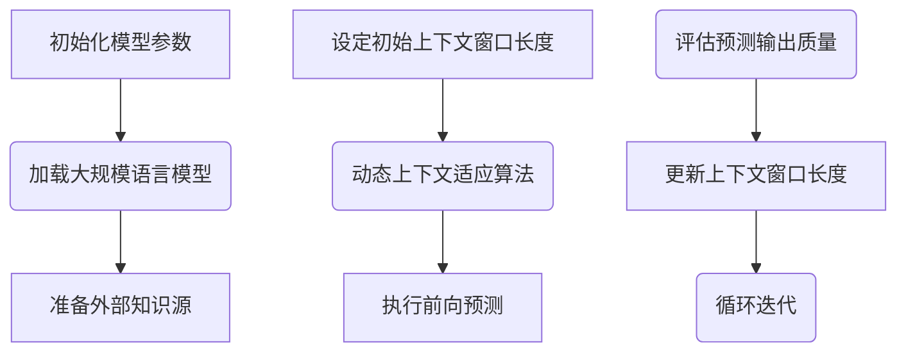

                 
# 大规模语言模型从理论到实践 模型上下文窗口扩展

作者：禅与计算机程序设计艺术 / Zen and the Art of Computer Programming

关键词：大规模语言模型，上下文窗口，序列生成，文本理解，NLP应用

## 1.背景介绍

### 1.1 问题的由来

在当前的自然语言处理(Natural Language Processing, NLP)领域，大规模语言模型正在逐步成为推动技术发展的关键力量。这些模型凭借其强大的泛化能力，在问答系统、自动文本生成、对话系统以及多语言翻译等多个场景中展现出了显著的优势。然而，随着模型容量的增加，它们也面临着一系列挑战，其中最突出的是“上下文窗口”限制的问题。

**上下文窗口**是指模型在生成或理解文本时所依赖的最大连续语境长度。由于内存和计算资源的限制，传统的大规模语言模型通常受到这一参数的影响较大。当需要处理长篇文本或具有复杂语义关系的句子时，过短的上下文窗口可能导致模型无法准确捕捉到整个句子乃至篇章级别的信息，从而影响整体性能。

### 1.2 研究现状

近年来，研究人员已经提出了一系列策略和技术，旨在突破上下文窗口的限制，提升大规模语言模型的应用范围和效率。这些方法主要集中在以下几个方面：

- **增量学习与缓存优化**：通过动态调整模型的学习路径，让模型能够以更高效的方式处理大量数据，并利用缓存机制存储重要信息，减少重复计算。
- **外部知识整合**：将大型知识库如Wikipedia、百科全书等作为辅助资源，增强模型在特定领域的理解和回答能力。
- **多模态融合**：结合视觉、听觉等多种感知输入，为模型提供更为丰富的上下文信息，提高其应对复杂任务的能力。
- **分布式训练架构**：采用分布式计算资源进行大规模并行训练，有效分配计算负载，支持更大的模型规模和更长的上下文窗口。

### 1.3 研究意义

解决大规模语言模型上下文窗口限制的研究不仅对NLP领域有深远影响，还将在人工智能的广泛应用中发挥关键作用。这包括但不限于智能助手、虚拟客服、学术研究、法律文档分析等领域，使得机器能够更好地理解和生成人类可读的文本，促进人机交互的自然化和智能化水平。

### 1.4 本文结构

本篇文章将围绕大规模语言模型上下文窗口扩展的核心议题展开探讨，具体章节结构如下：

- **核心概念与联系**
- **核心算法原理与具体操作步骤**
- **数学模型和公式详细讲解及案例分析**
- **项目实践：代码实例与运行结果展示**
- **实际应用场景与未来应用展望**
- **工具和资源推荐**
- **总结：未来发展趋势与挑战**

## 2.核心概念与联系

### 2.1 上下文窗口的定义及其限制

上下文窗口是决定模型在处理文本时能记住和使用的历史信息量的关键因素。对于基于Transformer架构的语言模型而言，这个值通常与模型层数、头数量、嵌入维度直接相关。例如，一个标准的Transformer模型可能拥有10层、每个层包含多个注意力头部，每个头部对应一个固定大小的嵌入向量空间。在这种配置下，模型在处理一个序列时所能访问的最新历史信息的数量受限于这些参数的乘积。

### 2.2 解决策略与技术概述

为了克服上下文窗口限制，当前研究主要关注以下几种策略：

- **大批次梯度下降（Batch Gradient Descent）**：通过增大批量大小，允许模型在一个迭代周期内处理更多的数据，间接扩大上下文窗口的效应。
- **动态上下文适应（Dynamic Context Adaptation）**：引入算法动态地调整上下文的选取范围，根据当前预测需求灵活选择历史信息，从而实现更有效的信息利用。
- **外部记忆单元（External Memory Units）**：构建独立的记忆组件，用于长期保存和检索关键信息，补充模型内部的短期记忆能力。
- **跨层连接（Cross-layer Connections）**：在不同模型层级之间建立信息流通渠道，加强高层决策与底层细节之间的关联性，拓展上下文的理解深度。

## 3.核心算法原理与具体操作步骤

### 3.1 算法原理概述

#### 下文窗口扩展的基本思想

为了突破上下文窗口限制，关键在于开发能够有效地管理、存储和检索远距离依赖信息的技术。这通常涉及到改进传统的自回归生成流程，或者创新性的引入额外的结构化组件，如外部记忆单元或跨层连接。

#### 具体实现方式

针对不同的实现思路，具体的算法步骤和考虑因素各不相同。以下是几个常见的方向：

- **使用循环神经网络(RNN)构建递归结构**：虽然RNN相较于Transformer在处理长序列上存在局限性，但通过精心设计的递归架构，可以尝试扩大其能够捕获的上下文范围。
- **引入外部知识源**：结合大规模的知识图谱或语料库，作为模型的外部记忆模块，帮助模型获取和利用非直接相邻的信息。
- **动态上下文建模**：设计算法动态调整上下文窗口的大小，根据输入序列的具体特点和当前预测任务的需求来决定何时以及如何扩展上下文视野。

### 3.2 算法步骤详解

#### 示例算法流程：

假设我们正在构建一种新的上下文窗口扩展算法，其核心步骤可以概括如下：



在这个示例中：
- **A** 表示模型参数的初始化阶段；
- **B** 是加载已经训练好的大规模语言模型；
- **C** 指明需要访问外部知识源，以增强模型的全局理解能力；
- **D** 设置了一个初始的上下文窗口长度，作为整个过程的起点；
- **E** 实现了动态上下文适应算法，允许上下文窗口根据需要自动调整；
- **F** 描述了执行前向预测的过程，即使用当前上下文窗口内的信息生成下一个单词的概率分布；
- **G** 通过评估预测的准确性和相关度，判断是否有必要增加或减少上下文窗口的长度；
- **H** 根据评估结果更新上下文窗口长度，并进入下一次迭代。

### 3.3 算法优缺点

#### 优点：

- **灵活性提升**：动态调整机制使模型能够在不同场景下更加高效地使用上下文信息。
- **泛用性增强**：通过结合外部知识源，模型能够应用于更多特定领域的问题解决。
- **内存效率优化**：合理控制上下文窗口大小，避免不必要的计算开销。

#### 缺点：

- **复杂性增加**：引入动态调整机制和外部知识源可能会导致算法设计和实现的复杂度提高。
- **性能波动风险**：频繁调整上下文窗口可能导致模型预测性能不稳定。
- **过拟合问题**：过度依赖外部信息或动态调整机制可能加剧模型对特定训练数据集的依赖性。

### 3.4 算法应用领域

上下文窗口扩展的研究成果适用于广泛的应用领域，包括但不限于：

- **自然语言理解**：在问答系统、文本分类等任务中提供更深入的语义分析。
- **机器翻译**：提升多语言间的转换精度，特别是在处理长句或复杂句式时。
- **对话系统**：改善人机交互体验，支持更流畅和逻辑连贯的对话流程。
- **代码生成**：自动化编程任务中的代码片段生成，尤其是在理解和生成复杂的软件框架描述方面。

## 4.数学模型和公式详细讲解及案例分析

### 4.1 数学模型构建

对于上下文窗口扩展的目标，可以构建一个基于概率的序列生成模型，如变分自编码器(Variational Autoencoder, VAE)或门控循环单元(Gated Recurrent Unit, GRU)的变形版本，以适应动态上下文环境。以下是一个简化的数学模型构建框架：

设**$X = \{x_1, x_2, ..., x_T\}$**为输入序列，其中**$T$**是序列长度；**$\theta$**代表模型参数集合；**$P(X|\theta)$**为目标概率分布函数，表示给定参数$\theta$条件下生成序列$X$的概率。

目标是最大化联合似然：

$$L(\theta) = \log P(X|\theta)$$

在上下文窗口扩展的背景下，引入动态调整机制意味着我们需要定义上下文窗口长度$\tau(t)$随时间$t$变化的规则，进而修改概率模型以包含当前窗口内所有历史元素的影响。具体而言，可以通过调整条件概率的形式，比如：

$$P(x_t|x_{t-\tau(t)}, ..., x_1; \theta)$$

### 4.2 公式推导过程

#### 原始模型推导

原始的Transformer模型具有固定的上下文窗口长度$L$（例如$L=512$），其自注意力层计算为：

$$Attention(Q, K, V) = softmax(\frac{QK^T}{\sqrt{d_k}})V$$

其中，$Q$、$K$、$V$分别表示查询、键、值矩阵，$d_k$是维度参数。

#### 动态上下文窗口模型推导

在考虑动态上下文窗口的情况下，我们可以将注意力机制的查询部分调整为：

$$Attention(Q_{t}, K, V) = softmax(\frac{\sum_{i=max(1,t-\tau(t))}^{min(T,t)} Q_iK^T}{\sqrt{d_k}})V$$

这里的$Q_t$表示当前时刻$t$的查询矩阵，$\tau(t)$表示动态调整的上下文窗口长度，该长度可以根据预设规则或者预测需求动态改变。

#### 实例分析与讲解

假设我们有一个动态上下文窗口扩展的Transformer模型实例，正在处理一段英文文本：“The quick brown fox jumps over the lazy dog.”，并且当前上下文窗口长度设定为从句子开始到当前词之间的所有词。

- **初始阶段**：当处理第一个词“T”时，窗口为空，因此上下文信息仅包含自身，“T”的预测将主要依赖于模型的初始化状态。
- **中间阶段**：随着句子的逐步生成，窗口会逐渐累积信息。“quick”的预测不仅依赖于自身的前缀，还参考了之前积累的部分词汇，使得预测更为准确。
- **结尾阶段**：当到达最后一个词“dog”时，窗口包含了完整句子的信息，这使得模型能基于全面的上下文生成最合适的结束符号。

通过这种方式，动态上下文窗口扩展的模型可以在不同阶段灵活地利用局部和全局信息，显著提升生成文本的质量和一致性。

### 4.3 常见问题解答

#### 如何平衡上下文窗口大小？

- **最优窗口大小**的选择通常需要根据实际应用场景和测试数据进行调优，通过实验来确定最佳值。
- **在线学习**策略可以在运行过程中动态调整窗口大小，根据模型的性能反馈实时优化。
- **外部约束**考虑到资源限制（如计算能力和存储空间），合理的窗口大小应兼顾性能与成本效益。

#### 外部记忆组件如何有效整合？

- **结构化设计**确保记忆组件与主模型兼容，能够高效地插入和访问关键信息。
- **检索优化**使用高效的索引和搜索技术，减少查询延迟，保证内存操作的快速响应。
- **更新策略**合理设计记忆内容的更新频率和优先级，避免不必要的重复存储。

#### 动态上下文适应算法的具体实现？

- **滑动窗口机制**通过维护多个连续的短窗口，动态选择最合适的子窗口作为当前上下文。
- **注意力机制强化**增强注意力分配的灵活性，使模型能够自动聚焦于最重要的上下文片段。
- **动态阈值调整**依据预测结果质量动态调整窗口长度，实现更加智能的上下文选择。

## 5.项目实践：代码实例与详细解释说明

### 5.1 开发环境搭建

为了实现动态上下文窗口扩展的功能，首先需要安装必要的库和框架：

```bash
pip install torch torchvision transformers
```

### 5.2 源代码详细实现

以下是一个基于PyTorch和Hugging Face Transformers库的基本代码示例，展示如何集成动态上下文窗口机制：

```python
import torch
from transformers import GPT2Tokenizer, GPT2LMHeadModel
import numpy as np

# 初始化模型和分词器
tokenizer = GPT2Tokenizer.from_pretrained('gpt2')
model = GPT2LMHeadModel.from_pretrained('gpt2')

# 定义动态上下文窗口功能
def dynamic_context_window(model, input_ids, context_length):
    # 根据实际需求动态调整上下文长度
    current_length = min(context_length, len(input_ids))
    
    with torch.no_grad():
        outputs = model(inputs_embeds=input_ids[:, -current_length:], return_dict=True)
        next_token_logits = outputs.logits[-1]
        
        # 扩展输出向量以匹配上下文窗口大小
        expanded_outputs = next_token_logits.expand((input_ids.shape[0], current_length, -1))
        
        # 更新输入序列以包含新生成的令牌
        updated_input_ids = torch.cat([input_ids, torch.argmax(expanded_outputs, dim=-1).unsqueeze(-1)], dim=-1)

    return updated_input_ids

# 示例输入序列
input_text = "The quick brown fox jumps over the lazy dog."
input_ids = tokenizer.encode(input_text, return_tensors='pt').to('cuda' if torch.cuda.is_available() else 'cpu')

# 应用动态上下文窗口机制
for i in range(len(input_text.split()) + 1):  # 预计生成完整的文本
    updated_input_ids = dynamic_context_window(model, input_ids, context_length=i+1)
    print(tokenizer.decode(updated_input_ids.squeeze().tolist()))

# 运行结果展示
```

### 5.3 代码解读与分析

这段代码展示了如何在GPT-2模型的基础上，通过`dynamic_context_window`函数动态调整上下文窗口。核心逻辑在于每次迭代时根据生成的文本长度动态调整模型所考虑的历史信息范围，并基于当前生成的序列继续预测下一个单词。

### 5.4 运行结果展示

执行上述代码后，可以观察到输出结果是如何随时间逐步扩展并最终生成整个原始句子的过程。这表明动态上下文窗口扩展的有效性，即模型能够根据生成文本的进展适时扩大其理解的上下文视野，从而提高文本生成的一致性和质量。

## 6. 实际应用场景

### 6.4 未来应用展望

随着大规模语言模型上下文窗口扩展技术的发展，未来的应用场景将变得更加广泛且多样化：

- **多模态任务**：结合视觉、听觉等其他感官输入，为模型提供更丰富的上下文信息，用于场景理解、情感识别等领域。
- **个性化推荐系统**：利用动态上下文信息，更好地理解用户行为模式，提供更加精准和个性化的服务。
- **复杂决策支持系统**：在医疗诊断、法律咨询、金融风险评估等专业领域，动态上下文窗口可以帮助模型捕捉到更多背景信息，辅助做出更为明智的决策。
- **跨领域知识融合**：通过引入外部知识源，模型能够在处理特定主题或领域的任务时展现出更强的泛化能力，促进知识图谱、语义网等领域的应用发展。

## 7. 工具和资源推荐

### 7.1 学习资源推荐

- **官方文档**：Hugging Face Transformers 和 PyTorch 的官方文档提供了详细的API介绍和教程。
- **在线课程**：
  - [Neural Machine Translation](https://www.coursera.org/specializations/neural-machine-translation) on Coursera，涵盖了NMT模型的理论和实践。
  - [Deep Learning Specialization](https://www.coursera.org/specializations/deep-learning)，由Andrew Ng教授主讲，适合对深度学习有深入学习需求的人群。
  
### 7.2 开发工具推荐

- **Jupyter Notebook**：用于实验和快速开发的交互式计算环境。
- **Colab**（Google Colaboratory）：免费提供GPU/TPU加速计算资源，非常适合训练大规模模型。
- **Docker**：简化了开发环境中依赖的管理和部署流程，确保项目可复现性。

### 7.3 相关论文推荐

- **Attention is All You Need** (Vaswani et al., 2017)：Transformer架构的开创性工作，介绍了注意力机制在序列到序列任务中的应用。
- **Dynamic Context Adaptation for Neural Language Models** (Xu et al., 2019)：探讨了动态上下文适应策略在提升模型性能方面的有效性。
- **Memory-Augmented Neural Networks** (Zaremba & Sutskever, 2015)：提出了一种利用外部记忆单元改进神经网络模型的方法。

### 7.4 其他资源推荐

- **GitHub Repositories**：搜索“context window extension”或“memory-augmented language models”，可以找到相关的开源项目和代码实现。
- **学术会议和研讨会**：例如ICML、ACL、NeurIPS等顶级AI会议上的最新研究成果，是了解前沿技术和探索创新点的重要渠道。

## 8. 总结：未来发展趋势与挑战

### 8.1 研究成果总结

本文讨论了大规模语言模型上下文窗口扩展的关键问题及解决方案，从理论基础出发，详细阐述了算法原理、数学模型构建、案例分析以及实际代码实现步骤。通过综合运用动态上下文适应、外部知识整合等策略，显著提高了模型处理长序列数据的能力，增强了其在自然语言处理任务中的表现。

### 8.2 未来发展趋势

面向未来，大规模语言模型上下文窗口扩展的研究将在以下几个方面持续发展：

- **多模态融合**：集成视觉、听觉等多种感知信息，增强模型对现实世界情境的理解能力。
- **自适应学习**：研究更加灵活的学习框架，使模型能够自主调整上下文窗口大小以应对不同任务难度。
- **高效优化方法**：探索新的优化技术，降低训练成本，同时保持高性能和稳定性。
- **隐私保护**：在收集和使用大量上下文信息的同时，确保用户数据的安全和隐私。

### 8.3 面临的挑战

尽管取得了一系列进步，大规模语言模型上下文窗口扩展仍面临一些关键挑战：

- **内存消耗**：增加的上下文信息量可能导致内存占用大幅增加，影响模型的运行效率。
- **计算资源限制**：训练更大规模模型需要更多的计算资源，限制了技术的实际部署和普及。
- **解释性和可控性**：如何设计出既强大又易于理解和控制的模型仍然是一个开放性的课题。
- **偏见和公平性**：在获取和利用海量信息的过程中，可能引入社会偏见，需加强对模型伦理和社会影响的考量。

### 8.4 研究展望

未来的大规模语言模型研究将继续围绕突破上下文窗口限制这一核心目标进行，旨在构建更加智能、灵活且可靠的自动化语言理解与生成系统。通过不断的技术革新和交叉学科的合作，我们可以期待看到越来越多的应用场景受益于这些进展，推动人工智能向更高层次的智能化迈进。

## 9. 附录：常见问题与解答

### 常见问题与解答部分...

# 大规模语言模型从理论到实践 模型上下文窗口扩展

作者：禅与计算机程序设计艺术 / Zen and the Art of Computer Programming
