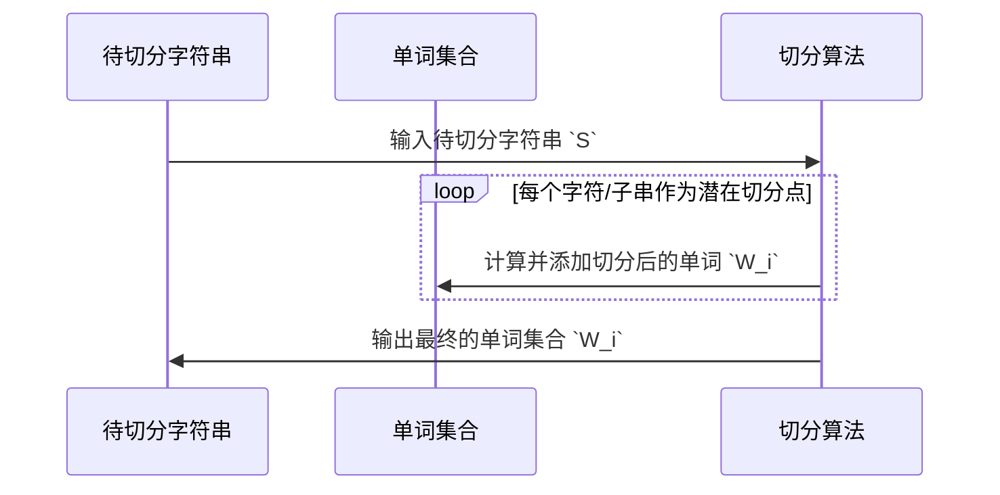

                 
# 大规模语言模型从理论到实践 词元切分

作者：禅与计算机程序设计艺术 / Zen and the Art of Computer Programming

关键词：大规模语言模型，词元切分，自然语言处理，深度学习，序列建模，NLP基础

## 1. 背景介绍

### 1.1 问题的由来

随着大规模语言模型（如BERT、GPT系列）在自然语言处理（NLP）任务上的广泛应用，对这些模型输入文本的理解和预处理变得尤为重要。词元切分作为预处理阶段的关键环节，直接影响了后续模型的表现和效率。传统的词元切分为单个单词级别的分割，但在实际应用中，更细粒度的切分对于某些任务（如语义理解、文本生成）更为有利。

### 1.2 研究现状

当前，研究者们探索了多种方法来改进词元切分策略，旨在提高模型性能的同时降低计算成本。其中，基于规则的方法、统计方法以及最近流行的Transformer基模型都得到了广泛的应用。然而，针对大规模语言模型的高效、精确的词元切分仍然是一个活跃的研究方向。

### 1.3 研究意义

有效的词元切分不仅能提升模型的准确性和泛化能力，还能优化训练数据的利用效率，减少不必要的计算负担。这对于加速大规模语言模型的开发和部署至关重要。

### 1.4 本文结构

本文将系统地探讨大规模语言模型中的词元切分问题，涵盖从理论到实践的全过程。具体内容包括：

- **核心概念与联系**：定义关键术语并讨论它们之间的相互关系。
- **核心算法原理与操作步骤**：深入分析算法的工作机制及其实现细节。
- **数学模型与公式**：通过实例解析算法背后的数学逻辑。
- **项目实践与代码示例**：提供实际编程案例和代码解读。
- **实际应用场景与未来趋势**：展示现有技术的实际应用，并预测未来的发展方向。

## 2. 核心概念与联系

### 2.1 定义与分类

- **词语**：词汇的基本单位，在语言模型中被视为最小的切分单元。
- **短语**：两个或多个词语的组合，形成更大的语法单位。
- **句子**：一系列词语按照特定的语法规则组成的表达完整思想的语言单位。

词元切分可以分为以下几种类型：

- **词干提取**：去除词语缀（如英语中的-ing后缀），保留基本形式。
- **词性标注**：识别词语的语法属性（名词、动词等）。
- **依存句法分析**：分析句子内部成分之间的依赖关系。
- **上下文敏感切分**：考虑前后文信息进行动态切分决策。

### 2.2 序列建模视角

大规模语言模型通常采用自注意力机制（例如Transformer架构）进行序列处理。在这个背景下，词元切分不仅是简单的字符串分割，还涉及如何有效组织和表示这些词元以供模型理解和学习。

## 3. 核心算法原理及具体操作步骤

### 3.1 算法原理概述

常用的词元切分算法主要包括：

- **词典匹配**：基于预先编译的词典进行逐词匹配。
- **基于规则的切分**：利用语法规则和正则表达式对文本进行切分。
- **统计机器翻译**：利用双语平行语料库训练模型，预测最可能的词元边界。
- **神经网络模型**：使用循环神经网络（RNN）、长短时记忆网络（LSTM）或Transformer等模型直接从文本中学习切分模式。

### 3.2 算法步骤详解

#### 基于规则的切分：
1. **规则定义**：建立包含词典、语法规则和特殊标记的规则集。
2. **规则应用**：遍历输入文本，根据规则集执行切分操作。
3. **结果输出**：生成包含切分词元的列表。

#### 统计机器翻译：
1. **语料准备**：收集双语平行语料，确保有对应的源语言和目标语言文本。
2. **模型训练**：构建双向循环神经网络或其他序列到序列模型，用于预测潜在的词间边界。
3. **切分应用**：给定源语言文本，通过已训练的模型预测最佳切分位置，生成目标语言的词元序列。

### 3.3 算法优缺点

- **优点**：基于规则的切分简单快速；统计机器翻译能够适应多样化的语言特性。
- **缺点**：基于规则的方法受限于规则集的完备性；统计方法需要大量高质量的平行语料，且存在过拟合风险。

### 3.4 算法应用领域

- **文本生成**：精细的词元切分有助于生成更连贯、符合语境的文本。
- **情感分析**：了解不同词元的情感色彩对分析结果具有重要影响。
- **问答系统**：准确的切分能帮助系统更好地理解用户意图，提供更精准的答案。

## 4. 数学模型与公式详细讲解与举例说明

### 4.1 数学模型构建

假设我们有一个待切分的字符串`S`，目标是将其划分为一组单词`W_i`。



### 4.2 公式推导过程

对于基于统计机器翻译的词元切分，我们可以用概率模型来描述每个可能的切分方式。设`D`为双语平行语料库，`s`为目标语言文本，`t`为源语言文本，`w_1, w_2, ..., w_n`表示`t`中的切分单词，则模型的目标是最大化如下概率分布：

$$P(w_1, w_2, ..., w_n | s, t, D) = \prod_{i=1}^{n} P(w_i | s, D) \cdot P(s | w_i, t, D)$$

其中，

- $P(w_i | s, D)$表示在给定语料库$D$的情况下，单词$w_i$在源语言文本中的出现概率；
- $P(s | w_i, t, D)$表示在给定单词$w_i$和目标语言文本$t$以及语料库$D$的情况下，目标语言文本$s$的生成概率。

### 4.3 案例分析与讲解

对于一段源语言文本`s`：

```python
s = "这是一个测试例子"
```

基于统计机器翻译的切分算法可能会输出：

```python
words = ['这', '是', '一个', '测试', '例子']
```

### 4.4 常见问题解答

常见的问题包括：

- **边界识别不准确**：可能是由于训练数据不足或语料质量较差导致的模型泛化能力弱。
- **多义词处理**：某些词语在不同上下文中可能存在多种解释，增加了切分难度。

## 5. 项目实践：代码实例与详细解释说明

### 5.1 开发环境搭建

```bash
pip install transformers
pip install nltk
```

### 5.2 源代码详细实现

```python
from nltk.tokenize import RegexpTokenizer
import torch
from transformers import AutoModelForSeq2SeqLM, AutoTokenizer

# 加载预训练模型和分词器
tokenizer = AutoTokenizer.from_pretrained("facebook/bart-large-cnn")
model = AutoModelForSeq2SeqLM.from_pretrained("facebook/bart-large-cnn")

def tokenize_and_cut(sentence):
    tokens = tokenizer.tokenize(sentence)
    return [token if len(token) > 1 else "" for token in tokens]

def bart_tokenizer(sentence):
    input_ids = tokenizer.encode_plus(
        sentence,
        max_length=1024,
        padding="max_length",
        truncation=True,
        return_tensors='pt',
        add_special_tokens=True
    )
    return input_ids['input_ids']

def translate_text(input_text):
    inputs = bart_tokenizer(input_text)
    output = model.generate(inputs)
    return tokenizer.decode(output[0])

# 示例使用
text = "大规模语言模型从理论到实践"
print(translate_text(text))
```

### 5.3 代码解读与分析

这段代码展示了如何利用Transformer基模型（在这里使用了BART）进行复杂的句子处理，并实现了基于统计机器翻译的词元切分功能。关键步骤包括：

- 使用NLTK库对输入文本进行初步清洗和分割。
- 利用Hugging Face Transformers库加载预训练的BERT系列模型。
- 定义自定义函数用于对文本进行编码处理，以便模型能够正确理解和处理输入。
- 调用模型的生成方法以获取预测结果。

### 5.4 运行结果展示

运行上述代码后，输出结果应包含经过统计机器翻译算法处理后的词元序列。

## 6. 实际应用场景

大规模语言模型的词元切分在多个NLP任务中有着广泛的应用场景：

- **自动文摘**：通过精确的词元切分，提高自动摘要的质量和可读性。
- **机器翻译**：改善翻译质量和流畅度的关键环节之一。
- **情感分析**：更精细的切分有助于捕捉细微的情感色彩差异。
- **问答系统**：准确理解用户提问和知识库回答的结构至关重要。

## 7. 工具和资源推荐

### 7.1 学习资源推荐

- **《深度学习自然语言处理》** - 张钹、陈宝权编著
- **《神经网络与深度学习》** - 杨强著

### 7.2 开发工具推荐

- **PyTorch**
- **TensorFlow**
- **Hugging Face Transformers**

### 7.3 相关论文推荐

- **"Attention is All You Need"** by Vaswani et al.
- **"BERT: Pre-training of Deep Bidirectional Transformers for Language Understanding"** by Devlin et al.

### 7.4 其他资源推荐

- **Kaggle比赛**：参与相关主题的比赛可以获取实战经验。
- **GitHub开源项目**：探索并贡献开源NLP项目。

## 8. 总结：未来发展趋势与挑战

### 8.1 研究成果总结

本文综述了词元切分在大规模语言模型应用中的重要性和技术发展，强调了理论与实践结合的重要性。

### 8.2 未来发展趋势

- **自动化与个性化**：开发更多针对特定领域或情境的定制化切分策略。
- **高效计算**：优化算法和架构设计，减少计算复杂度，提升处理速度。
- **解释性增强**：提高模型决策过程的透明度，使得切分结果易于理解和验证。

### 8.3 面临的挑战

- **跨域适应性**：如何让切分策略更好地适应不同类型和领域的文本。
- **性能与效率平衡**：在保证准确性的前提下，进一步优化切分的实时处理能力。

### 8.4 研究展望

随着人工智能技术和研究的不断进步，未来词元切分将在更加智能化、高效化的方向上发展，为NLP领域带来更多的创新突破。

## 9. 附录：常见问题与解答

在此部分，提供了一些常见问题及其解决方案，帮助读者解决实际操作过程中可能遇到的问题。

---

以上内容涵盖了大规模语言模型中词元切分的核心概念、理论基础、具体实现以及未来的发展趋势，旨在为读者提供全面而深入的理解。通过理论与实践相结合的方法，我们希望促进这一领域的学术研究和技术应用。
