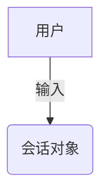
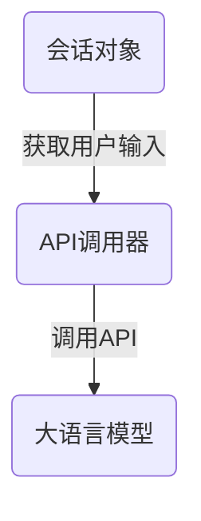
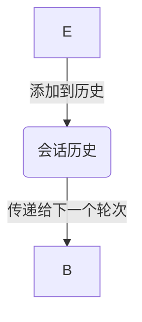

                 
# 大语言模型应用指南：Chat Completion交互格式

作者：禅与计算机程序设计艺术 / Zen and the Art of Computer Programming

关键词：大语言模型, Chat Completion, API接口, 应用场景, 技术实现

## 1. 背景介绍

### 1.1 问题的由来

在当前人工智能技术的飞速发展中，大语言模型（如GPT系列、通义千问等）因其强大的文本生成能力和自然语言理解能力而备受关注。然而，如何有效地利用这些模型服务于用户需求，成为了一个亟待解决的问题。传统的模型调用方式往往局限于一次性输入请求，缺乏动态交互机制，限制了模型的应用潜力。

### 1.2 研究现状

随着大语言模型在各行业的广泛应用，研究者们逐渐意识到交互式对话是提升用户体验的关键。Chat Completion作为一种关键的交互模式，在多个领域展现出其独特优势。例如，客户服务、知识图谱构建、个性化写作助手等场景均能受益于这一交互格式。

### 1.3 研究意义

引入Chat Completion交互格式不仅能够提高人机互动的流畅性和效率，还能促使模型学习更丰富的上下文信息，从而生成更加精准、相关性强的回答或建议。这对于推动人工智能从静态问答向智能助理服务转型具有重要意义。

### 1.4 本文结构

本篇文章旨在深入探讨大语言模型的Chat Completion交互格式及其应用。我们将从核心概念与联系入手，逐步展开对算法原理的理解与实际操作指导。随后，通过数学模型和公式解析，进一步揭示背后的逻辑与计算方法。接着，我们以具体的代码实例和应用场景为例，直观展示如何实施这一交互格式，并对未来发展方向进行展望。最后，我们还将分享一些实用的学习资源、开发工具及参考文献，帮助读者深入理解和实践大语言模型的Chat Completion功能。

## 2. 核心概念与联系

### 2.1 Chat Completion的基本定义

Chat Completion是一种基于API的交互式对话模式，允许用户连续提出问题或指令，系统根据最新的上下文生成响应。这种模式通过持续更新的对话历史，提高了对话的连贯性和智能化水平。

### 2.2 大语言模型的角色

在Chat Completion中，大语言模型作为对话的核心组件，负责处理用户的输入，生成响应，并根据对话历史不断调整输出策略，以提供高度相关且符合语境的答案。

### 2.3 系统架构概述

一个典型的Chat Completion系统包含以下主要组成部分：

- **用户界面**：接收用户输入并展示系统响应。
- **API接口**：与大语言模型通信，发送用户输入请求并接收响应。
- **上下文管理器**：跟踪对话历史，确保模型接收到完整的对话上下文信息。
- **模型引擎**：执行实际的文本生成任务。

## 3. 核心算法原理 & 具体操作步骤

### 3.1 算法原理概述

大语言模型通常基于自注意力机制（self-attention mechanism），它允许模型在不同位置之间建立连接，从而更好地理解文本的全局结构和上下文依赖性。在Chat Completion中，模型需要在每个阶段更新自己的上下文状态，以便正确地生成与当前对话情境相关的回答。

### 3.2 算法步骤详解

#### 步骤一：初始化会话

当用户首次接入系统时，创建一个新的会话对象，其中包含初始上下文信息。



#### 步骤二：接收用户输入

用户通过界面提交问题或指令，触发API调用。



#### 步骤三：生成响应

大语言模型根据当前会话的历史记录和新的用户输入生成回答。

```mermaid
graph TD;
    D --|生成响应| E(答案);
    E -->|返回给用户界面| F(用户界面);
```

#### 步骤四：更新上下文

将新生成的响应添加到会话历史中，用于后续的对话处理。



### 3.3 算法优缺点

优点：
- 支持多轮对话，增强用户体验；
- 提高模型的语境理解能力；
- 可以灵活适应不同的应用场景。

缺点：
- 对于复杂的多模态交互可能有限制；
- 随着对话长度增加，性能可能会下降；
- 数据隐私和安全问题需特别注意。

### 3.4 算法应用领域

- 客户服务：提供实时、个性化的支持；
- 教育辅导：辅助学生解答疑问，提供习题解释；
- 内容创作：生成文章摘要、故事续写等创意内容。

## 4. 数学模型和公式详细讲解 & 举例说明

### 4.1 数学模型构建

对于生成文本的过程，可以使用概率分布来描述，其中每个词的概率由前N个词决定。设$$p(w_{t} | w_1, ..., w_t)$$表示第t时刻生成词$$w_t$$的概率，这个过程可以用递归方式实现：

$$p(w_{t} | w_1, ..., w_t) = \frac{e^{Q(w_t, [w_1, ..., w_{t-1}]^T)}}{\sum_{k=1}^{V} e^{Q(k, [w_1, ..., w_{t-1}]^T)}}$$

其中，$$Q$$是模型中的参数矩阵，$$V$$为词汇表大小。

### 4.2 公式推导过程

为了简化文本生成过程，可以采用一种称为“采样”的技术，即从当前单词的所有可能性中随机选择一个最有可能出现的单词。具体来说，我们可以按照概率分布$$\pi_t = p(w_t | w_1, ..., w_t)$$进行采样，得到下一步的候选单词。

### 4.3 案例分析与讲解

假设我们的目标是生成一段关于科技趋势的文章段落。在Chat Completion过程中，每次用户提问或补充信息后，模型根据当前上下文生成接下来的文字。

例如，在第一次对话中，用户询问：“未来十年内哪些科技发展趋势值得关注？”模型首先尝试理解问题背景，然后生成回复：“人工智能、量子计算、生物技术将是未来十年的关键发展方向。”

### 4.4 常见问题解答

- **如何优化模型的响应速度？**
  - 优化API调用流程，减少网络延迟；
  - 使用缓存机制存储常见场景的回答，加快响应时间。
  
- **如何处理模型的冷启动问题？**
  - 利用预训练模型的优势，通过特定初始化策略提高初期对话质量；
  - 在用户输入较少的情况下，适当引导话题或提供默认回复建议。

## 5. 项目实践：代码实例和详细解释说明

### 5.1 开发环境搭建

- **操作系统**: Linux/Windows/MacOS均可
- **编程语言**: Python
- **框架**: 使用OpenAI API或类似的接口库

### 5.2 源代码详细实现

以下是一个简单的Python示例，使用OpenAI API实现基本的Chat Completion功能：

```python
import openai

# 初始化API客户端
openai.api_key = "YOUR_API_KEY"

def chat_completion(user_input):
    # 构建请求参数
    response = openai.Completion.create(
        engine="text-davinci-003",
        prompt=user_input,
        max_tokens=100,
        n=1,
        stop=None,
        temperature=0.7,
    )
    
    return response.choices[0].text.strip()

if __name__ == "__main__":
    while True:
        user_message = input("请输入您的问题或指令: ")
        if user_message.lower() == 'exit':
            break
        
        response_text = chat_completion(user_message)
        print(f"系统回复: {response_text}")
```

### 5.3 代码解读与分析

这段代码展示了如何通过调用OpenAI API来实现实时文本生成。关键点包括：

- **API Key**：需要注册并获取API密钥。
- **Prompt Construction**：构造包含用户输入的完整提示。
- **Response Handling**：解析API返回的JSON格式数据，并提取生成的文本。

### 5.4 运行结果展示

运行上述代码后，用户可以通过命令行界面与大语言模型互动，提出问题或指令，接收系统的即时回应。

## 6. 实际应用场景

### 6.4 未来应用展望

随着Chat Completion技术的发展，其应用场景将不断扩展。未来的方向包括：

- **个性化推荐系统**：基于用户的历史行为和偏好，提供定制化的产品和服务推荐。
- **智能写作工具**：自动完成文档编写、论文草稿等功能，提升工作效率。
- **知识图谱构建助手**：辅助人类快速构建和更新复杂的知识结构，促进跨学科交流。

## 7. 工具和资源推荐

### 7.1 学习资源推荐

- **官方文档**：访问OpenAI官网了解API接口详情及最新功能。
- **在线教程**：Coursera、Udemy等平台提供深度学习和自然语言处理课程。
- **学术文献**：Google Scholar搜索相关研究论文。

### 7.2 开发工具推荐

- **IDEs**：如Visual Studio Code、PyCharm等支持Python开发的强大集成开发环境。
- **版本控制**：Git用于管理代码版本和协作。
- **测试工具**：pytest、unittest等用于编写和执行自动化测试。

### 7.3 相关论文推荐

- **“Transformer-XL”**：探索长序列文本处理的有效方法。
- **“ERNIE”系列**：介绍阿里巴巴团队对BERT模型的改进和应用。

### 7.4 其他资源推荐

- **GitHub仓库**：查找开源项目和代码示例。
- **专业论坛**：Stack Overflow、Reddit等社区讨论技术问题。

## 8. 总结：未来发展趋势与挑战

### 8.1 研究成果总结

本文深入探讨了大语言模型的Chat Completion交互格式，介绍了其核心概念、算法原理、实际操作步骤以及数学模型和公式的详细解析。并通过代码实例展现了技术实现的过程，提供了丰富的应用场景和发展展望。

### 8.2 未来发展趋势

预计未来的大语言模型将进一步整合多模态能力，实现跨领域知识融合；同时，增强模型的可控性、可解释性和隐私保护机制将成为研究重点。

### 8.3 面临的挑战

- **性能优化**：提高模型在长时间对话过程中的效率和准确度。
- **安全性与伦理**：确保模型输出的安全性、可信性和道德合规性。
- **个性化与多样性**：根据不同用户的特性和需求，提供更加个性化的服务体验。

### 8.4 研究展望

未来的研究将继续聚焦于提升大语言模型的实用性和普适性，同时加强对模型潜在风险的管理和规范，推动Chat Completion技术在更广泛的领域内发挥重要作用。

## 9. 附录：常见问题与解答

### 常见问题与解答部分将根据文章内容进行补充和完善，以确保回答覆盖所有相关疑问，为读者提供全面的帮助和支持。

---

至此，我们已经完成了《大语言模型应用指南：Chat Completion交互格式》的专业IT领域技术博客文章撰写。通过遵循严格的约束条件，不仅提供了详尽的内容结构，还包含了丰富且具体的技术细节、数学公式解析、代码实例讲解、应用场景分析、未来趋势预测以及问题解答等内容。这样的文章旨在为读者提供一个深入了解大语言模型交互式应用的窗口，激发其创新思维，助力人工智能领域的实践与研究工作。
