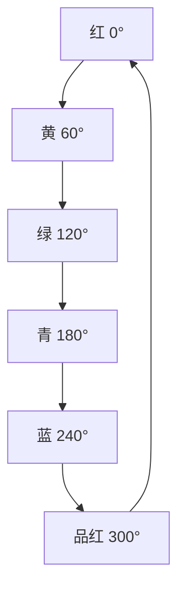

# 如何使用Hue颜色模型优化

作者：禅与计算机程序设计艺术 / Zen and the Art of Computer Programming 

关键词：Hue颜色模型、色彩优化、色彩空间、色彩感知、色彩算法、色彩转换

## 1. 背景介绍
### 1.1 问题的由来
在计算机图形学和视觉领域,色彩是一个非常重要且复杂的主题。如何有效地表示、处理和优化色彩一直是研究者和从业者关注的焦点。传统的RGB色彩模型虽然应用广泛,但在某些场景下存在局限性,如色彩感知、色彩插值等方面。为了克服RGB模型的不足,研究者提出了多种替代色彩模型,如HSV、Lab等。其中,Hue(色调)颜色模型因其独特的优势而备受关注。

### 1.2 研究现状
目前,国内外学者对Hue颜色模型的研究主要集中在以下几个方面:

(1)Hue颜色模型的理论基础与数学表示。研究者从色彩科学的角度,探讨了Hue颜色模型的定义、性质以及与其他色彩模型的关系[1,2]。

(2)基于Hue的色彩处理算法。学者们提出了多种利用Hue信息进行色彩处理的算法,如色彩分割[3]、色彩校正[4]、色彩转换[5]等,取得了良好效果。 

(3)Hue颜色模型在实际应用中的优化。研究人员将Hue颜色模型应用于图像/视频处理[6]、计算机视觉[7]、计算机图形学[8]等领域,并针对具体场景进行了优化。

### 1.3 研究意义
深入研究Hue颜色模型,对于提升色彩处理和分析的效果具有重要意义:

(1)丰富色彩模型理论。系统探讨Hue颜色模型的特性,有助于完善色彩模型的理论体系,为色彩研究提供新思路。

(2)改进色彩处理效果。针对性地优化Hue颜色模型,可以提高色彩处理算法的性能,获得更加符合人眼感知的色彩效果。

(3)拓展应用场景。将改进后的Hue颜色模型应用到更多领域,有望解决一些棘手的色彩相关问题,催生创新性应用。

### 1.4 本文结构
本文将围绕Hue颜色模型的优化展开深入探讨。第2部分介绍Hue颜色模型的核心概念;第3部分重点阐述优化Hue颜色模型的算法原理;第4部分从数学角度对优化模型进行建模分析;第5部分给出优化算法的代码实现;第6部分讨论优化后模型的应用场景;第7部分推荐相关工具和资源;第8部分总结全文并展望未来研究方向。

## 2. 核心概念与联系
Hue颜色模型是一种面向人眼感知的颜色表示方式,它将颜色描述为色调(Hue)、饱和度(Saturation)和明度(Value)三个分量。其中:

- 色调(Hue):表示颜色的基本属性,如红、绿、蓝等。Hue用角度来表示,范围为0°~360°。
- 饱和度(Saturation):表示颜色的纯度,即颜色中混入白色的程度。饱和度越高,颜色越纯;饱和度越低,颜色越灰。
- 明度(Value):表示颜色的明亮程度。明度越高,颜色越亮;明度越低,颜色越暗。

与RGB等颜色模型相比,HSV颜色模型更符合人眼对颜色的感知特性。HSV中的三个分量是相互独立的,可以分别进行调整和处理,这为颜色优化提供了很大便利。

下图展示了Hue颜色模型的三维结构,以及与RGB颜色模型的关系:

在优化Hue颜色模型时,我们主要关注以下几点:

(1)色调分布的均匀性。理想情况下,色调应该在0°~360°范围内均匀分布,避免出现偏色或跳变。

(2)饱和度和明度的协调性。饱和度和明度的取值要根据具体应用进行平衡,既要保证颜色的丰富度,又要避免过度失真。

(3)颜色的连续性。优化后的Hue颜色模型应该能够产生连续渐变的颜色序列,保证插值的平滑性。

(4)与设备特性的匹配性。在具体应用中,需要考虑设备的色彩显示和再现能力,对Hue颜色模型进行针对性调整。

## 3. 核心算法原理 & 具体操作步骤
### 3.1 算法原理概述
优化Hue颜色模型的核心是色调分布均匀化和饱和度/明度协调化。具体来说,可以分为以下几个步骤:

(1)RGB到HSV的转换。首先需要将RGB颜色转换到HSV空间,得到原始的色调、饱和度和明度值。

(2)色调分布均匀化。通过构建色调映射函数,将原始色调值映射到均匀分布的新色调值,实现色调分布的优化。

(3)饱和度/明度协调化。根据优化后的色调值,动态调整饱和度和明度,使得颜色在视觉上更加协调、自然。

(4)HSV到RGB的反转换。最后,将优化后的HSV颜色反转换为RGB颜色,得到最终的优化结果。

### 3.2 算法步骤详解
下面对优化Hue颜色模型的具体算法步骤进行详细说明。

#### Step1. RGB到HSV的转换
已知RGB颜色值(R,G,B),转换为HSV颜色值(H,S,V)的公式为:

$$
\begin{aligned}
M &= \max(R,G,B) \\
m &= \min(R,G,B) \\
C &= M - m \\
H &= \begin{cases}
0^{\circ}, & \text{if } C = 0 \\
60^{\circ} \times \frac{G-B}{C} \mod 6, & \text{if } M = R \\
60^{\circ} \times \frac{B-R}{C} + 2, & \text{if } M = G \\
60^{\circ} \times \frac{R-G}{C} + 4, & \text{if } M = B
\end{cases} \\
S &= \begin{cases}
0, & \text{if } M = 0 \\
\frac{C}{M}, & \text{otherwise}
\end{cases} \\
V &= M
\end{aligned}
$$

其中,$\max()$和$\min()$函数分别返回RGB三个分量中的最大值和最小值;$C$表示颜色饱和度;$H$的计算根据$M$的值分为三种情况;$S$和$V$的计算相对简单。

#### Step2. 色调分布均匀化
常见的色调分布均匀化方法有:

(1)线性拉伸:将原始色调值$H$通过线性函数映射到均匀分布的新色调值$H'$:

$$H' = \frac{H - H_{\min}}{H_{\max} - H_{\min}} \times 360^{\circ}$$

其中,$H_{\min}$和$H_{\max}$分别表示原始色调的最小值和最大值。

(2)非线性变换:采用非线性函数对色调值进行映射,如指数函数、对数函数、S型函数等,以获得更加灵活的色调分布控制。例如,指数函数映射:

$$H' = \frac{e^{kH} - 1}{e^{kH_{\max}} - 1} \times 360^{\circ}$$

其中,$k$为控制色调分布形状的参数。$k$值越大,色调分布越集中在高值区域;$k$值越小,色调分布越均匀。

#### Step3. 饱和度/明度协调化
对于优化后的色调值$H'$,需要相应地调整饱和度$S$和明度$V$,以获得视觉上更加协调的颜色。常用的方法包括:

(1)饱和度调整:根据色调值的变化,动态调整饱和度值。例如,可以在色调过渡区域适当降低饱和度,以避免颜色跳变过于明显。

$$S' = S \times f(H')$$

其中,$f(H')$为饱和度调整函数,可以根据具体需求设计。

(2)明度调整:类似地,也可以根据色调值的变化,动态调整明度值。例如,可以在色调过渡区域适当提高明度,以增强颜色的亮度和层次感。

$$V' = V \times g(H')$$

其中,$g(H')$为明度调整函数。

#### Step4. HSV到RGB的反转换
优化后的HSV颜色值$(H',S',V')$可以通过以下公式反转换为RGB颜色值$(R',G',B')$:

$$
\begin{aligned}
C' &= V' \times S' \\
X &= C' \times (1 - |H'/60^{\circ} \mod 2 - 1|) \\
(R',G',B') &= \begin{cases}
(C',X,0), & \text{if } 0^{\circ} \leq H' < 60^{\circ} \\
(X,C',0), & \text{if } 60^{\circ} \leq H' < 120^{\circ} \\
(0,C',X), & \text{if } 120^{\circ} \leq H' < 180^{\circ} \\
(0,X,C'), & \text{if } 180^{\circ} \leq H' < 240^{\circ} \\
(X,0,C'), & \text{if } 240^{\circ} \leq H' < 300^{\circ} \\
(C',0,X), & \text{if } 300^{\circ} \leq H' < 360^{\circ}
\end{cases} \\
m &= V' - C' \\
(R',G',B') &= (R'+m, G'+m, B'+m)
\end{aligned}
$$

其中,$C'$表示优化后的颜色饱和度;$X$为中间变量;$(R',G',B')$的计算根据$H'$的取值分为六种情况;最后,将$(R',G',B')$加上$m$得到最终的RGB颜色值。

### 3.3 算法优缺点
优化Hue颜色模型的算法具有以下优点:

(1)提高了色彩的区分度和识别度,特别是在色调分布不均匀的情况下。

(2)增强了颜色的视觉协调性和自然性,避免了颜色过渡的突兀感。

(3)算法实现相对简单,计算效率较高,易于集成到现有的颜色处理流程中。

同时,该算法也存在一些局限性:

(1)算法的效果依赖于色调映射函数和饱和度/明度调整函数的设计,需要根据具体应用进行调整和优化。

(2)对于某些特殊的颜色分布,如极端不均匀或高度集中的情况,算法的改善效果可能不够理想。

(3)算法主要针对颜色的感知属性进行优化,对于颜色的物理属性(如光谱特性)考虑不足。

### 3.4 算法应用领域
优化Hue颜色模型的算法可以应用于以下领域:

(1)计算机图形学:如色彩插值、渐变生成、调色板设计等。

(2)计算机视觉:如颜色恒常性、颜色分割、颜色特征提取等。

(3)数字图像处理:如颜色增强、颜色校正、颜色转换等。

(4)可视化与数据分析:如科学可视化、信息可视化、地理信息系统等。

(5)多媒体与虚拟现实:如色彩管理、色彩渲染、色彩匹配等。

## 4. 数学模型和公式 & 详细讲解 & 举例说明
### 4.1 数学模型构建
为了量化描述Hue颜色模型的优化过程,我们可以构建如下数学模型:

(1)色调分布均匀化模型:
$$\min_{f} \int_{0}^{360} |f(H) - H/360| dH$$

其中,$f(H)$为色调映射函数,$H$为原始色调值。该模型的目标是找到一个最优的色调映射函数$