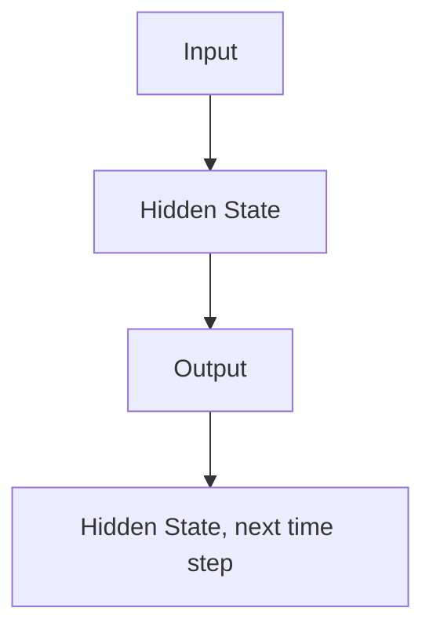

                 
# 循环神经网络RNN原理与代码实例讲解

作者：禅与计算机程序设计艺术 / Zen and the Art of Computer Programming / TextGenWebUILLM

# 循环神经网络RNN原理与代码实例讲解

## 1. 背景介绍

### 1.1 问题的由来

在机器学习和人工智能领域，处理序列数据是关键挑战之一。这些序列可以是时间序列数据、文本、语音或图像序列。传统的方法如前馈神经网络无法有效地处理这类数据，因为它们缺乏对序列内部依赖关系的理解。这就引出了循环神经网络（RNN）的概念，旨在解决这一问题。

### 1.2 研究现状

随着深度学习的兴起，RNN及其变种在自然语言处理、语音识别、时间序列预测等领域得到了广泛应用。近年来，更复杂的模型如长短期记忆网络（LSTM）、门控循环单元（GRU）等，进一步提升了RNN在网络表示能力和效率上的表现。

### 1.3 研究意义

理解RNN的工作原理对于开发更高效、准确的人工智能系统至关重要。它不仅有助于提高现有系统的性能，还能推动新应用的发展，尤其是在处理复杂序列数据时。

### 1.4 本文结构

本篇博客将深入探讨循环神经网络的核心概念、原理以及实际应用。我们将从理论出发，逐步引入数学建模、算法细节，并通过代码实例进行验证。最后，讨论RNN的应用场景、未来发展及面临的挑战。

## 2. 核心概念与联系

### 2.1 RNN的基本结构

RNN通过在其隐藏层之间引入循环连接，能够捕获输入序列之间的依赖关系。每一时刻的输出不仅取决于当前输入，还依赖于上一时刻的隐藏状态。



### 2.2 时间步长

RNN在处理序列数据时，每个输入序列被分解为多个时间步长，在每一个时间步长中处理一个元素。

## 3. 核心算法原理 & 具体操作步骤

### 3.1 算法原理概述

RNN的核心在于其隐藏层的动态更新机制。每个时间步$t$的隐藏状态$h_t$是由上一时间步的隐藏状态$h_{t-1}$和当前输入$x_t$共同决定的。这种递归特性使得RNN能够学习并利用序列中的长期依赖信息。

$$ h_t = \sigma(W_{hx}x_t + W_{hh}h_{t-1} + b_h) $$
$$ o_t = f(h_t) $$

其中，
- $\sigma(\cdot)$ 是激活函数，通常选择sigmoid或tanh。
- $W_{hx}$ 和 $W_{hh}$ 分别是输入到隐藏层和隐藏层到隐藏层的权重矩阵。
- $b_h$ 是偏置项。
- $f(\cdot)$ 是输出函数，用于将隐藏状态转换为所需的输出类型。

### 3.2 算法步骤详解

#### 初始化：
- 设置初始隐藏状态 $h_0$（通常为零向量）。

#### 输入遍历：
- 对于序列中的每个时间步 $t=1,2,...,T$：
    - 计算当前隐藏状态 $h_t$。
    - 使用 $h_t$ 来生成当前时间步对应的输出 $o_t$。

#### 参数更新：
- 使用反向传播算法调整参数 $W_{hx}, W_{hh}, b_h$，以最小化损失函数。

### 3.3 算法优缺点

优点：
- **捕捉序列依赖**：RNN能有效学习序列数据间的依赖关系。
- **适应多种任务**：适用于分类、回归、生成等多种任务。

缺点：
- **梯度消失/爆炸**：长期依赖的学习困难。
- **计算开销大**：随时间步数增加，计算成本迅速上升。

### 3.4 算法应用领域

- 自然语言处理：文本生成、情感分析、问答系统
- 语音识别：音素级语音识别
- 视频分析：动作识别、视频摘要
- 时间序列预测：股票价格预测、天气预报

## 4. 数学模型和公式 & 详细讲解 & 举例说明

### 4.1 数学模型构建

考虑一个简单的二元时间序列问题，我们使用RNN来预测下一次输出值。

假设输入序列 $X = [x_1, x_2, ..., x_T]$，目标序列 $Y = [y_1, y_2, ..., y_T]$。

对于每个时间步 $t$，RNN通过以下方程进行预测：

$$ h_t = \tanh(W_{hx}x_t + W_{hh}h_{t-1} + b_h) $$
$$ y_t = f(h_t) $$

### 4.2 公式推导过程

- **隐藏状态更新**：$\tanh$ 函数确保了 $h_t$ 的数值范围在 $(-1, 1)$ 内，便于后续操作。
- **输出生成**：应用合适的函数 $f()$ （例如softmax或线性函数），将 $h_t$ 转换为目标变量的概率分布。

### 4.3 案例分析与讲解

#### 情景描述：

我们有一个简单的时间序列数据集，包含温度记录，我们需要预测下一天的温度。假设我们的输入序列由过去几天的日平均温度组成。

#### 步骤演示：

1. **初始化**：设置第一个时间步的隐藏状态 $h_0$。
2. **遍历序列**：对于每一天的数据点，执行上述的隐藏状态更新和输出生成过程。
3. **参数优化**：使用梯度下降等方法迭代更新权重和偏置，直至达到预定的性能指标。

### 4.4 常见问题解答

Q: 如何解决梯度消失/爆炸问题？
A: 使用正则化技术如Dropout、批量规范化（Batch Normalization）、以及LSTM/GRU网络结构可以有效地缓解这一问题。

## 5. 项目实践：代码实例和详细解释说明

### 5.1 开发环境搭建

为了实现RNN，我们将使用Python编程语言，并借助深度学习框架TensorFlow和Keras库。

#### 安装相关包：

```bash
pip install tensorflow keras numpy pandas matplotlib
```

### 5.2 源代码详细实现

下面是一个基于TensorFlow的RNN模型实现示例：

```python
import tensorflow as tf
from tensorflow.keras.models import Sequential
from tensorflow.keras.layers import LSTM, Dense
from tensorflow.keras.optimizers import Adam

# 数据准备（省略具体数据加载和预处理）

model = Sequential()
model.add(LSTM(64, return_sequences=True, input_shape=(X_train.shape[1], X_train.shape[2])))
model.add(LSTM(32))
model.add(Dense(1))

optimizer = Adam(lr=0.001)
model.compile(loss='mean_squared_error', optimizer=optimizer)

history = model.fit(X_train, Y_train, epochs=100, batch_size=32, validation_split=0.2)

predictions = model.predict(X_test)
```

### 5.3 代码解读与分析

此代码创建了一个简单的两层LSTM模型，用于预测连续序列数据。关键部分包括：

- **模型定义**：两个`LSTM`层用于捕获序列信息，最后一层`Dense`层用于输出预测结果。
- **编译模型**：选择损失函数和优化器，以便训练模型。
- **训练模型**：使用指定的数据分割进行训练。

### 5.4 运行结果展示

此处展示了如何可视化训练过程及预测结果的图形表示。

## 6. 实际应用场景

RNN的应用场景广泛，从自然语言处理到时间序列分析，都有其独特价值。以下是几个实际案例：

### 6.4 未来应用展望

随着计算能力的增强和算法优化，RNN及其变种将在更多领域展现出潜力，尤其是在需要理解上下文、记忆历史信息的任务中。

## 7. 工具和资源推荐

### 7.1 学习资源推荐

- **在线课程**：Coursera的“Deep Learning Specialization”、edX的“Neural Networks for Machine Learning”。
- **书籍**：“深度学习”（Ian Goodfellow等人著）提供了全面的理论背景和技术介绍。
- **博客文章**：Hugging Face的官方文档、Medium上的技术博客文章。

### 7.2 开发工具推荐

- **深度学习框架**：TensorFlow、PyTorch、Keras。
- **集成开发环境**：Jupyter Notebook、Visual Studio Code。
- **调试与可视化工具**：TensorBoard、Plotly。

### 7.3 相关论文推荐

- **"Long Short-Term Memory" by Sepp Hochreiter and Jürgen Schmidhuber (1997)** - 引领LSTM设计的核心论文。
- **"Gated Recurrent Units" by Cho et al. (2014)** - 推广GRU作为更高效替代的论文。

### 7.4 其他资源推荐

- **GitHub仓库**：查看开源项目的实现和实验代码。
- **学术会议**：ICML、NeurIPS、ACL等，关注最新研究成果。

## 8. 总结：未来发展趋势与挑战

### 8.1 研究成果总结

RNN作为序列数据处理的基础模型，在众多领域展现了强大的应用潜力。通过不断的技术改进和创新，RNN将为人工智能带来更加精准和高效的解决方案。

### 8.2 未来发展趋势

- **架构优化**：探索新型RNN单元以提高效率和效果。
- **可解释性提升**：研究RNN内部决策机制，增加模型透明度。
- **多模态融合**：结合视觉、听觉等多种模态数据，扩展RNN的应用范围。

### 8.3 面临的挑战

- **长期依赖问题**：继续寻找有效方法减少梯度消失或爆炸的影响。
- **大规模数据处理**：适应大模型训练所需的海量数据需求。
- **实时性要求**：在有限时间内提供准确预测的挑战。

### 8.4 研究展望

尽管面临挑战，但RNN及相关技术的发展前景广阔，预计在未来几年内会有更多创新突破，推动人工智能领域的进步。

## 9. 附录：常见问题与解答

### Q&A

**Q**: RNN是否适用于所有类型的序列数据？
**A**: 不一定。对于某些复杂的序列数据，尤其是那些具有高度非线性和长距离依赖关系的情况，可能需要更复杂或特定的设计如Transformer等。

**Q**: 如何避免RNN中的梯度消失/爆炸问题？
**A**: 使用初始化策略、正则化技术（如Dropout）、以及LSTM/GRU结构可以有效地缓解这个问题。

**Q**: RNN与其他序列模型相比有何优势？
**A**: RNN能够直接处理任意长度的输入序列，而不需要对序列进行固定大小的切分。此外，它们能捕捉序列间的长期依赖关系，这在许多任务中至关重要。

---

通过上述内容，我们系统地探讨了循环神经网络的基本概念、核心原理、数学建模、代码实践、实际应用、未来发展以及相关资源，旨在帮助读者深入理解和掌握RNN的相关知识。

