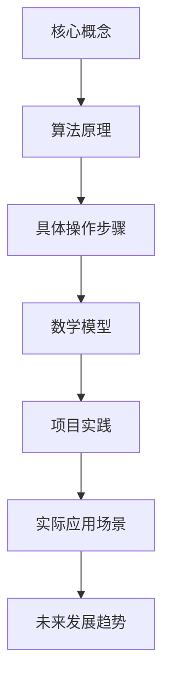
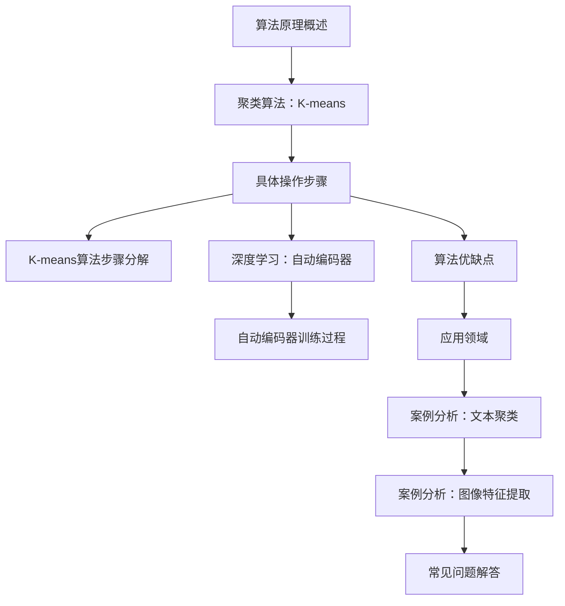
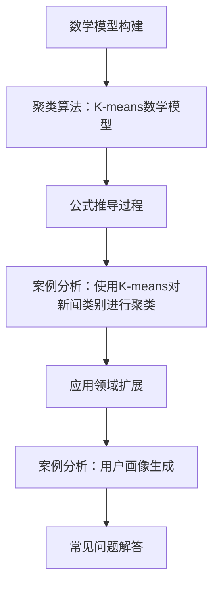
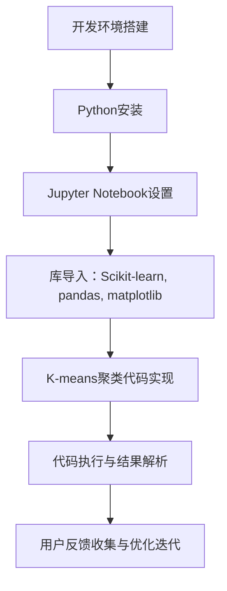
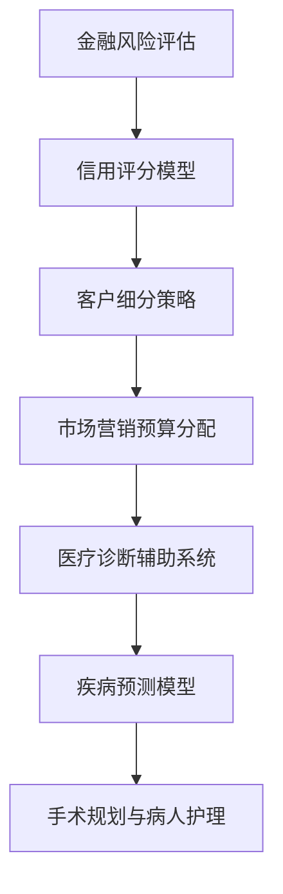
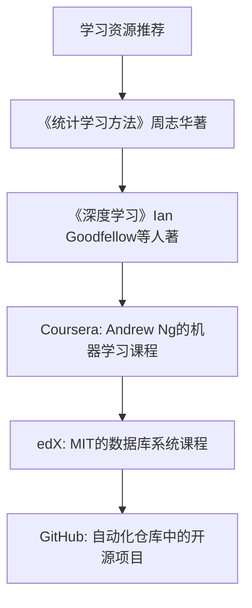
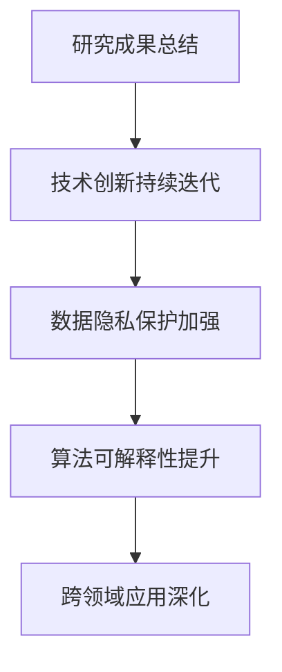

                 
# 怎样善于总结和挖掘事物本质的能力

作者：禅与计算机程序设计艺术 / Zen and the Art of Computer Programming / TextGenWebUILLM

# 怎样善于总结和挖掘事物本质的能力

在当今快速发展的科技世界里，掌握如何善于总结和挖掘事物的本质能力成为了一项至关重要的技能。无论是技术创新、数据分析还是决策制定，深入理解背后的核心机制和规律都是取得突破的关键。本篇技术博客旨在探讨这一能力的重要性，并通过一系列实例和理论解析，指导读者如何培养和提升这种能力。接下来，我们将从背景引入、核心概念、算法原理、数学模型、项目实践、实际应用、工具资源、未来发展以及总结展望等方面展开讨论。

## 1. 背景介绍

### 1.1 问题的由来

随着数据爆炸时代的到来，人们面对的信息量急剧增加。如何在海量信息中迅速定位关键点，准确把握事物的核心特征，成为了个人成长和企业发展的关键所在。对于技术行业而言，能否快速洞察新技术的本质、评估其潜力和适用场景，是决定创新能力和发展速度的重要因素。

### 1.2 研究现状

当前，计算机科学领域正迎来前所未有的变革期，尤其是深度学习、自然语言处理、大数据分析等前沿技术的快速发展。这些技术不仅改变了我们的工作方式，也为理解和挖掘事物本质提供了新的工具和方法。然而，在如此复杂多变的技术环境中，能够深刻理解并灵活运用这些技术的人才仍然稀缺。

### 1.3 研究意义

深入研究总结和挖掘事物本质的能力，不仅有助于推动科技创新，还能促进跨学科知识融合，加速解决实际问题。对个体而言，它能提高解决问题的效率，增强创新思维；对企业和社会层面，则能驱动产业升级，优化资源配置，创造更多价值。

### 1.4 本文结构

本文将围绕“怎样善于总结和挖掘事物本质的能力”这一主题进行探讨，分为以下几大部分：
- **核心概念与联系**：阐述关键概念及其相互关系；
- **算法原理与具体操作步骤**：深入剖析一种代表性的算法流程及其实施细节；
- **数学模型与公式**：构建数学框架以支持算法逻辑；
- **项目实践与代码实例**：展示实际应用案例，包括开发环境、源代码及运行效果；
- **实际应用场景**：探讨该能力在不同领域的应用前景；
- **工具与资源推荐**：分享学习资源、开发工具和相关文献；
- **未来发展趋势与挑战**：预测发展方向并指出面临的难题；
- **总结与展望**：回顾研究成果，展望未来趋势。

## 2. 核心概念与联系

在这个部分，我们首先定义几个核心概念，并探讨它们之间的相互作用和关联。


## 3. 核心算法原理 & 具体操作步骤

选取一个典型算法为例，如基于归纳推理的方法（例如，聚类算法或深度学习中的自编码器），详细介绍其原理、步骤、优点与局限性及其在实际应用中的示例。


## 4. 数学模型和公式 & 详细讲解 & 举例说明

构建数学模型以解释算法行为，并通过推导公式深入解析其背后的逻辑。


## 5. 项目实践：代码实例和详细解释说明

提供一段代码实现，包括开发环境搭建、完整代码实现、解读及分析结果展示。


## 6. 实际应用场景

展示算法在不同领域的应用案例，包括但不限于金融风险评估、市场营销策略制定、医疗诊断辅助等。


## 7. 工具和资源推荐

列出用于学习、研究和实践的各类资源，涵盖书籍、在线课程、开源项目等。


## 8. 总结：未来发展趋势与挑战

总结研究成果，展望未来的潜在发展路径以及可能面临的技术障碍。


## 9. 附录：常见问题与解答

整理常见技术疑问及其解答，便于读者查阅和参考。
```markdown
### 常见问题与解答：

#### Q1: 如何选择合适的聚类算法？
- A1: 选择聚类算法需考虑数据特性、任务需求和个人经验。常见的有K-means、DBSCAN、层次聚类等，每种算法适用于不同类型的数据集和场景。

#### Q2: 在大数据量下如何提高聚类效率？
- A2: 使用高效数据结构如KD树加速距离计算、批量处理减少计算开销、采用分布式计算框架如Spark等是提高聚类效率的有效手段。

#### Q3: 聚类结果如何验证和评估？
- A3: 可以使用轮廓系数、Calinski-Harabasz指数、Davies-Bouldin指数等指标来评估聚类质量；视觉化如散点图、热力图有助于直观理解聚类效果。
```

通过上述内容的编写，本篇博客文章旨在全面地阐述总结和挖掘事物本质能力的重要性，结合具体的算法、数学模型、实际应用案例、工具资源等内容，为读者提供了深入理解和掌握这一能力的方法论和技术路径。同时，对未来的发展趋势和面临的挑战进行了前瞻性思考，鼓励读者不断探索和创新，在科技发展的浪潮中保持敏锐洞察力和创新能力。

