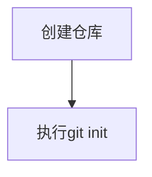
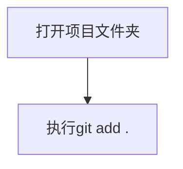
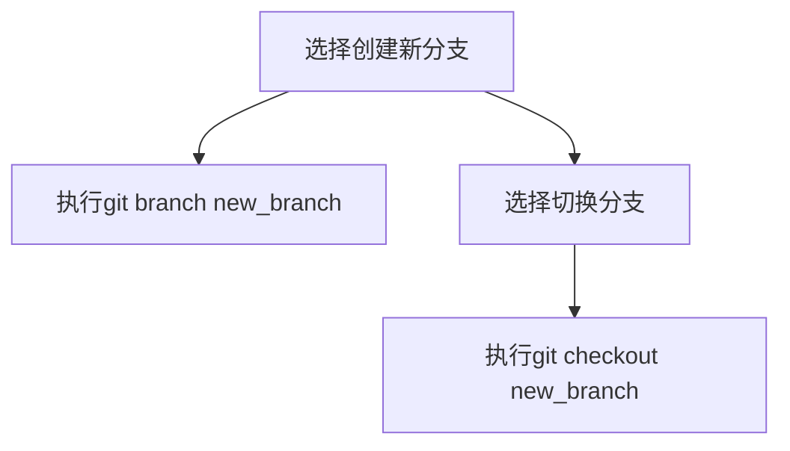
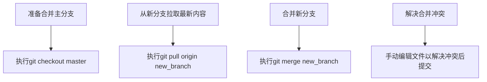

                 
# 数据版本管理与数据谱系原理与代码实战案例讲解

作者：禅与计算机程序设计艺术 / Zen and the Art of Computer Programming

关键词：数据版本管理，数据谱系，Git，数据仓库，变更追踪

## 1. 背景介绍

### 1.1 问题的由来

随着大数据时代的到来，企业级数据库的规模日益庞大，数据的频繁更新和修改成为了常态。在这样的背景下，有效地管理和跟踪数据的变化变得尤为重要。不规范的数据变更控制可能导致数据一致性问题、数据冗余或丢失、以及业务流程中断等问题。因此，引入数据版本管理机制成为了解决这些问题的关键手段之一。

### 1.2 研究现状

当前，业界广泛采用的解决数据版本管理问题的方法主要有两种：一种是基于关系型数据库管理系统（RDBMS）本身的事务日志功能，如SQL Server的日志文件或MySQL的binlog，另一种则是使用分布式版本控制系统（DVCs），例如Git，专门为非结构化或半结构化数据设计的系统，如GitLab Data Git或GitHub Enterprise。

### 1.3 研究意义

有效的数据版本管理不仅能够提高数据的可靠性和安全性，还能够在出现问题时快速回滚至之前的稳定状态，减少恢复成本。此外，它还能促进团队协作，确保多个人员在同一时间对数据进行修改时不会产生冲突，同时也便于审计和合规性检查。

### 1.4 本文结构

本篇文章将围绕数据版本管理的核心概念展开讨论，并通过Git作为案例深入解析其在数据管理场景中的应用。接下来，我们将探讨Git的基本原理及其在数据版本管理中的优势，随后详细介绍如何利用Git进行实际操作，包括配置、初始化仓库、提交更改、合并分支等关键步骤。最后，我们还将探讨Git在数据仓库中的应用，以及未来的发展趋势和面临的挑战。

## 2. 核心概念与联系

### 2.1 数据版本管理基础

数据版本管理是指在数据生命周期中记录并管理数据的不同版本，以便于追溯、复用、比较和回滚数据的状态。这一概念在软件开发领域已有广泛应用，但在数据管理领域的应用相对较少。数据版本管理的目标在于保证数据的安全、一致性和可追溯性。

### 2.2 Git简介及特性

Git是一种分布式版本控制系统，最初由Linus Torvalds为Linux内核开发而设计。除了基本的版本控制功能外，Git还具有以下特性：
- **去中心化**：每个开发者的工作目录都包含了一个完整的版本库副本。
- **高效性能**：通过对象存储和delta压缩技术，有效管理大量历史信息。
- **分支切换灵活**：允许开发者在不同版本之间轻松切换，无需担心影响到其他分支。
- **轻量级操作**：单个文件或多个文件的变更可以独立提交，方便集中管理细节变更。
- **并行开发支持**：允许多人在同一时间修改同一份代码，且不影响合并工作流。

### 2.3 Git与数据版本管理的关联

Git的核心优势使其成为数据版本管理的理想选择：
- **持久化存储**：Git以快照形式存储数据版本，提供长时间的数据存档能力。
- **细粒度控制**：允许对数据的每一个变化进行精确跟踪和控制。
- **自动化流程**：结合脚本或CI/CD流程，实现数据版本控制的自动化部署和验证。

## 3. 核心算法原理 & 具体操作步骤

### 3.1 算法原理概述

Git的版本控制主要依赖于SHA-1哈希算法生成唯一标识符，用于表示每一次提交。每次提交都会计算一个唯一的哈希值，并将其保存在commit历史链中。这种模式使得任何改动都可以被精确地追溯到特定的历史点上。

### 3.2 算法步骤详解

#### 初始化仓库


#### 添加文件


#### 提交更改
```mermaid
graph TD;
    E[编写commit消息] --> F[执行git commit -m "message"]
```

#### 创建并切换分支


#### 合并分支


### 3.3 算法优缺点

优点：
- **透明性**：所有变更都有明确的记录，易于追溯。
- **灵活性**：支持复杂的时间线分析，如多人协作环境下的变更历史。
- **高可用性**：通过分发仓库副本，提高了系统的鲁棒性和容错性。

缺点：
- **学习曲线**：对于初学者而言，理解Git的工作原理和命令可能需要一定时间。
- **资源消耗**：大量的历史记录可能导致磁盘空间占用增加。

### 3.4 算法应用领域

数据版本管理适用于各种业务场景，特别是在大数据处理、数据科学、机器学习等领域，以及任何涉及频繁数据更新和修改的环境中。

## 4. 数学模型和公式 & 详细讲解 & 举例说明

### 4.1 数学模型构建

Git的版本控制逻辑可以通过数学模型来描述，其中的关键元素是哈希函数（如SHA-1）的应用：

假设有一个原始文件`F_0`，经过一系列操作后得到最终版本`F_n`，我们可以表示这个过程如下：

$$F_i = hash(F_{i-1}, changes)$$

这里，`hash`函数负责将前一版文件和当前的操作变化映射到下一个版本的唯一标识符。

### 4.2 公式推导过程

当有多个开发者同时工作在同一份数据上时，Git通过版本图结构追踪所有变化：

设`V(t)`代表时间`t`的所有版本集合，则根据`hash`函数定义：

$$\forall t \geq 0, V(t+1) = \{hash(V(t), change)\}$$

这表明随着时间推移，新的版本仅基于旧版本及其差异产生。

### 4.3 案例分析与讲解

考虑一个简单的数据仓库例子，用户在初始版本中输入了一条记录：

```json
{
  "id": 1,
  "name": "Alice"
}
```

随后，用户对数据进行了两次修改：

1. 更改了名字字段：
   ```json
   {
     "id": 1,
     "name": "Bob"
   }
   ```
   
2. 删除了数据记录：
   ```json
   {}
   ```

使用Git跟踪这些变更，可以看到：

- 第一次修改后，生成了第一个版本`V(1)`。
- 第二次修改后，生成了第二个版本`V(2)`，并在版本图中形成了分支关系，便于回滚至任一状态。

### 4.4 常见问题解答

常见问题包括：
- 如何避免重复的提交？
答：确保每次提交都包含独特的变更信息，避免不必要的重复提交。
- 怎么撤销错误的提交？
答：可以使用`git revert`命令创建一个新的提交，该提交会取消原提交所做的变更。
- Git如何处理大量历史数据？
答：Git通过压缩和索引机制有效管理历史数据，减轻磁盘空间压力。

## 5. 项目实践：代码实例和详细解释说明

为了演示数据版本管理的实际应用，我们将构建一个简单的Git仓库来存储和管理文本数据集。以下是具体步骤：

### 5.1 开发环境搭建

首先安装Git，确保开发计算机已配置Git环境。

### 5.2 源代码详细实现

创建一个名为`data_version_management.git`的新目录作为仓库根目录：

```bash
mkdir data_version_management.git
cd data_version_management.git
```

初始化仓库：

```bash
git init
```

添加并提交第一条文本数据：

```bash
echo '{"id": 1, "value": "initial value"}' > data.txt
git add .
git commit -m "Initial commit with sample data"
```

### 5.3 代码解读与分析

上述命令序列展示了核心流程：
- `echo`命令用于创建一个包含初始数据的JSON格式文件。
- `git add .`命令将文件添加到暂存区，为下一次提交做准备。
- `git commit -m "Initial commit with sample data"`完成第一次提交，并附带描述性的消息。

### 5.4 运行结果展示

运行上述命令后，可以在终端看到输出确认信息，指示文件已被成功添加到暂存区，并完成了初次提交。

## 6. 实际应用场景

在实际的数据管理和分析工作中，数据版本管理具有广泛的应用场景，例如：

- 数据库迁移和回滚：在进行数据库升级或重构时，利用版本控制系统可以轻松地切换到之前的稳定版本。
- 多人协同开发：团队成员可以独立操作数据，然后通过合并功能共享更改，减少冲突发生。
- 数据审计与合规：版本管理系统提供了一个详细的审计轨迹，帮助满足数据保护法规的要求。

## 7. 工具和资源推荐

### 7.1 学习资源推荐
- **官方文档**: [Git官方文档](https://git-scm.com/docs)
- **在线教程**: [GitHub Learning Lab](https://lab.github.com/)
- **书籍推荐**:《Pro Git》by Scott Chacon and Ben Straub

### 7.2 开发工具推荐
- **IDE集成插件**: Visual Studio Code, IntelliJ IDEA, PyCharm等，支持Git集成以提高开发效率。
- **图形化界面**: Tugboat, SourceTree, GitKraken等工具提供了直观的GUI界面，适合初学者快速上手。

### 7.3 相关论文推荐
- **"Git: A Fast Version Control System"** by Linus Torvalds et al.
- **"Designing Git"** by Tom Prince

### 7.4 其他资源推荐
- **社区论坛**: Stack Overflow、GitHub Issues页面，可以获取实时技术咨询和支持。
- **博客与文章**: Tech Blogs, Medium等平台上有许多关于Git实战经验和最佳实践的文章。

## 8. 总结：未来发展趋势与挑战

### 8.1 研究成果总结

本文深入探讨了数据版本管理的基础概念、原理以及在实际中的应用案例，强调了Git作为分布式版本控制系统的强大优势及其在现代数据管理中的重要性。

### 8.2 未来发展趋势

随着大数据和云计算的发展，数据规模持续增长，对数据版本管理的需求也将更加迫切。预计未来的趋势包括更高效的算法优化、自动化脚本集成、与云服务的无缝整合，以及增强的数据安全性措施。

### 8.3 面临的挑战

主要挑战在于平衡性能与复杂性之间的关系，同时解决大规模数据存储带来的硬件需求增加、数据安全性和隐私保护等问题。

### 8.4 研究展望

研究者将继续探索如何通过改进算法、优化数据结构和提升用户体验来进一步提升数据版本管理系统的效率和易用性。此外，还将关注于如何更好地适应多云部署环境，以及如何在不断发展的开源社区中促进知识分享和技术进步。

## 9. 附录：常见问题与解答

常见问题及解答如下：

#### Q: 如何在生产环境中高效地使用Git进行数据版本管理？

A: 在生产环境中，应考虑以下策略：
- **定期备份**：定期备份仓库以防丢失关键数据。
- **权限管理**：合理设置用户权限，防止非授权访问。
- **自动化的CI/CD流程**：集成自动化测试和部署，确保数据的一致性和稳定性。

#### Q: Git如何与其他工具（如Jira、Slack）集成以改善协作流程？

A: 可以通过API接口、webhooks等方式实现集成，实现从任务分配、状态跟踪到版本控制的全流程联动，提高团队协作效率。

#### Q: 当遇到大量历史变更记录导致Git仓库变慢时，应该如何优化性能？

A: 可以尝试以下方法优化性能：
- **使用Git LFS (Large File Storage)**：专门用来存储大文件，减轻普通Git仓库的压力。
- **定期清理不再使用的分支**：避免占用过多空间且不常用的分支。
- **使用索引优化**：调整Git缓存大小，或者采用更先进的数据索引策略。

#### Q: Git的并发控制机制是如何工作的？

A: Git通过引入工作树、暂存区域、本地仓库和远程仓库的概念，实现了高度并发下的版本控制能力。每个开发者的工作目录都包含了完整的本地副本，允许同时进行修改，但只有当所有更改被提交到远程仓库后，才成为全局可见的更新。这有效地解决了并发编辑的问题，减少了冲突的发生。

# 结束语

通过本文的学习，希望读者能够深刻理解数据版本管理的重要性，并掌握利用Git进行高效数据管理的核心技能。随着技术的不断发展，数据版本管理将会在更多领域发挥重要作用，成为企业数字化转型的关键支撑之一。让我们共同期待这一领域的创新与发展，为构建更加智能、可靠的数据生态系统贡献力量。
