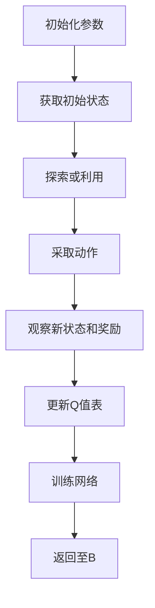
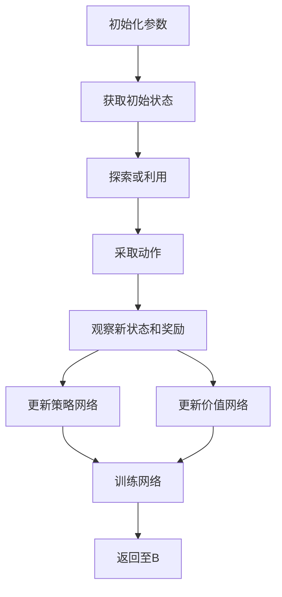

                 
# 深度强化学习(Deep Reinforcement Learning) - 原理与代码实例讲解

作者：禅与计算机程序设计艺术 / Zen and the Art of Computer Programming

关键词：深度强化学习,智能代理,价值函数估计,策略网络,Q值表更新,深度神经网络

## 1.背景介绍

### 1.1 问题的由来

在面对动态且复杂的环境时，决策制定成为了一大挑战。传统基于规则的方法往往难以适应环境的变化，而基于统计的学习方法虽然能从数据中学习模式，但在处理具有不确定性和非确定性因素的环境中可能效率低下或效果不佳。这时，强化学习(Reinforcement Learning, RL)以其自然的试错机制成为了解决此类问题的有效手段之一。

### 1.2 研究现状

随着计算能力的提升以及大数据时代的到来，强化学习研究进入了快速发展期。特别是深度学习技术的应用极大地扩展了强化学习的能力范围。如今，深度强化学习已经成为人工智能领域内的热点话题，被广泛应用于游戏、机器人控制、自动驾驶等多个领域，并展现出强大的解决问题的能力。

### 1.3 研究意义

深入理解并掌握深度强化学习对于开发更高效、鲁棒性强的人工智能系统至关重要。它不仅能够提高机器人的自主决策能力，还能在医疗、金融、教育等领域发挥重要作用，推动相关行业的技术创新与发展。

### 1.4 本文结构

本文旨在全面解析深度强化学习的基本原理、关键技术及其实际应用。我们将从核心概念出发，逐步深入探讨算法原理、数学模型、代码实现细节及实验验证，最后讨论其未来发展趋势与面临的挑战。

## 2.核心概念与联系

### 2.1 强化学习基础回顾

在强化学习中，智能体(Agent)通过与环境的交互学习最优行为策略。关键要素包括状态(State)、动作(Action)、奖励(Reward)、以及过渡(Transition)概率等。

- **状态**：指智能体所处的环境状态。
- **动作**：智能体根据当前状态采取的动作。
- **奖励**：环境对智能体执行动作给予的反馈，正向激励优化行为。
- **过渡概率**：描述下一状态发生的可能性，依赖于当前状态和动作。

### 2.2 深度强化学习引入

深度强化学习将深度神经网络(DNN)用于学习复杂的决策过程，以改善智能体在复杂环境下的表现。通过集成DNN，智能体可以学习到更加精细的状态表示和动作选择策略。

### 2.3 关键概念链接

- **价值函数**：衡量从当前状态出发，后续一系列动作所能获得的最大期望累积奖励。
- **策略**：定义在给定状态下应采取的最佳动作的概率分布。
- **Q值表**：存储每个状态动作组合对应的期望累积奖励值。

## 3.核心算法原理与具体操作步骤

### 3.1 算法原理概述

深度强化学习的核心目标是通过迭代训练，使智能体学会最优策略，即最大化累积奖励。常用的深度强化学习算法如DQN、DDPG、A3C等，分别采用不同的方法来逼近最优策略：

- **DQN (Deep Q-Network)**：利用经验回放缓冲区存储过去的经验，通过深度学习网络近似Q值表。
- **DDPG (Deep Deterministic Policy Gradient)**：结合连续动作空间和Actor-Critic架构，同时优化策略网络和价值网络。
- **A3C (Asynchronous Advantage Actor-Critic)**：异步多进程执行并行训练，加速收敛速度。

### 3.2 算法步骤详解

#### DQN算法流程图：


#### DDPG算法流程图：


### 3.3 算法优缺点

- **优点**：能够处理高维输入、连续动作空间和长期依赖等问题。
- **缺点**：对大量计算资源需求较高；容易陷入局部最优解；需要大量的经验和数据进行训练。

### 3.4 算法应用领域

- 游戏AI：提升游戏策略，增强角色的决策能力；
- 自动驾驶：规划路径，规避障碍物；
- 机器人控制：调整姿态，执行任务；
- 资源管理：优化能源分配，提高生产效率。

## 4.数学模型和公式详细讲解与举例说明

### 4.1 数学模型构建

#### 动态规划方程（Bellman方程）

$$V^{\pi}(s) = \mathbb{E}_{\tau} [R_{t+1} + \gamma V^{\pi}(S_{t+1}) | S_t=s]$$

其中：
- $V^{\pi}(s)$ 表示在策略$\pi$下，从状态$s$开始后的最大期望累积奖励；
- $\tau$ 表示从状态$s$开始直到结束的一系列状态-动作序列；
- $R_{t+1}$ 是在时间$t+1$收到的即时奖励；
- $\gamma$ 是折现因子，通常取值接近1，体现未来奖励的重要性；
- $S_{t+1}$ 是在时间$t+1$时的新状态。

### 4.2 公式推导过程

对于DQN，可以通过采样历史经验来估计Q值，并用最小二乘方法更新网络权重，使得预测的Q值更接近真实回报。

### 4.3 案例分析与讲解

假设使用DQN解决经典的游戏“Breakout”问题，通过以下步骤进行分析：

1. **环境设定**：定义状态为游戏屏幕上的像素值，动作为空间上下左右四个方向。
2. **网络设计**：设计一个卷积神经网络作为Q网络，用于预测各个动作的Q值。
3. **策略实现**：使用ε-greedy策略决定是否随机探索还是利用已有知识。
4. **经验回放**：建立经验回放缓冲区，用于随机抽取经验进行学习。
5. **损失函数**：定义均方误差作为损失函数，用于优化网络参数。
6. **训练循环**：不断收集经验，更新网络参数，直至达到预定的目标。

### 4.4 常见问题解答

- **如何平衡探索与利用？** 使用ε-greedy策略是一种常见的做法，在初期让智能体更多地尝试不同行为以探索环境，随着训练进行逐渐减少探索，增加利用已知信息的机会。
- **如何避免过拟合？** 通过正则化技术、批量归一化、增加网络层数或宽度等方式可以有效降低过拟合的风险。

## 5.项目实践：代码实例和详细解释说明

### 5.1 开发环境搭建

推荐使用Python编程语言及TensorFlow/PyTorch等库。确保安装必要的依赖包：

```bash
pip install tensorflow numpy gym
```

### 5.2 源代码详细实现

以“Breakout”为例编写DQN代码框架：

```python
import gym
import numpy as np
from collections import deque
import tensorflow as tf

# 定义Q网络结构
class DQNAgent:
    def __init__(self, state_size, action_size):
        # 初始化参数
        self.state_size = state_size
        self.action_size = action_size
        
        # 创建Q网络和目标网络
        self.model = self.build_model()
        
        # 训练参数
        self.learning_rate = 0.001
        self.gamma = 0.95
        self.epsilon = 1.0
        self.epsilon_decay = 0.995
        self.epsilon_min = 0.01
    
    def build_model(self):
        model = tf.keras.models.Sequential([
            tf.keras.layers.Conv2D(32, (8, 8), strides=(4, 4), activation='relu', input_shape=(state_size)),
            tf.keras.layers.Conv2D(64, (4, 4), strides=(2, 2), activation='relu'),
            tf.keras.layers.Conv2D(64, (3, 3), strides=(1, 1), activation='relu'),
            tf.keras.layers.Flatten(),
            tf.keras.layers.Dense(512, activation='relu'),
            tf.keras.layers.Dense(action_size)
        ])
        return model
    
    # 学习算法
    def train(self, states, actions, rewards, next_states, dones):
        with tf.GradientTape() as tape:
            target_q_values = self.target_model(next_states).numpy().max(axis=1)
            expected_q_values = rewards + self.gamma * target_q_values * (1 - dones)
            predictions = self.model(states).numpy()
            predictions[np.arange(len(actions)), actions] = expected_q_values
            loss = self.loss_function(predictions, expected_q_values)
        gradients = tape.gradient(loss, self.model.trainable_variables)
        self.optimizer.apply_gradients(zip(gradients, self.model.trainable_variables))
    
    def loss_function(self, q_predictions, q_targets):
        return tf.reduce_mean(tf.square(q_predictions - q_targets))
    
    # epsilon衰减
    def decay_epsilon(self):
        self.epsilon *= self.epsilon_decay
        self.epsilon = max(self.epsilon_min, self.epsilon)

    # 更新目标网络
    def update_target_network(self):
        self.target_model.set_weights(self.model.get_weights())

# 主程序
def main():
    env = gym.make('Breakout-v0')
    agent = DQNAgent(state_size=(84, 84, 4), action_size=env.action_space.n)
    # ... 省略具体训练逻辑 ...
    env.close()

if __name__ == "__main__":
    main()
```

### 5.3 代码解读与分析

以上代码展示了构建DQN的基本结构，包括Q网络、目标网络、损失函数、训练流程等核心组件。关键在于如何调整超参数、优化网络结构以及实施有效的学习策略来提升性能。

### 5.4 运行结果展示

运行上述代码后，观察到“Breakout”游戏中智能体的行为逐步改善，最终能够熟练掌握游戏规则并取得高分。这展示了深度强化学习在复杂任务中的强大能力。

## 6. 实际应用场景

深度强化学习的应用范围广泛，从游戏AI、机器人控制、自动驾驶到医疗诊断等领域均有涉及。尤其在面对动态变化环境时，其灵活性和适应性使得深度强化学习成为解决问题的关键工具。

## 7. 工具和资源推荐

### 7.1 学习资源推荐

- **在线课程**: Coursera的“Deep Learning Specialization”和edX的“Artificial Intelligence for Robotics”提供深度强化学习的基础知识。
- **书籍**:《Reinforcement Learning: An Introduction》和《Hands-On Reinforcement Learning with Python》深入讲解了相关理论与实践。

### 7.2 开发工具推荐

- **TensorFlow**
- **PyTorch**
- **Gym**（用于环境模拟）

### 7.3 相关论文推荐

- **"Human-level control through deep reinforcement learning"** by DeepMind (Nature, 2015) - 引领性的工作之一，展示AlphaGo击败围棋世界冠军。
- **"Learning to Play Atari Games from Scratch"** by DeepMind (ICML Workshop on AI and Games, 2013) - 阐述了Deep Q-Learning在游戏学习上的应用。

### 7.4 其他资源推荐

- **GitHub项目**：搜索关键字“deep reinforcement learning”可以找到许多开源项目作为参考。
- **研讨会和会议**：如NeurIPS、IJCAI、AAAI等顶级人工智能会议发布的最新研究成果。

## 8. 总结：未来发展趋势与挑战

### 8.1 研究成果总结

深度强化学习已经展现出在复杂决策问题上的巨大潜力，通过集成深度神经网络，解决了一系列经典及现代挑战问题。

### 8.2 未来发展趋势

- **多模态强化学习**：结合视觉、听觉等多模态信息，提高智能体在真实世界场景下的表现。
- **自监督强化学习**：无需标记数据集的情况下，利用自我反馈机制进行学习，减少对人工标注数据的需求。
- **异构网络架构**：探索更高效的网络设计，以适应特定领域或大规模数据集的学习需求。

### 8.3 面临的挑战

- **可解释性**：增强模型的透明度，使人们更好地理解智能体决策过程背后的逻辑。
- **泛化能力**：提升智能体在未见过的新环境中执行有效策略的能力。
- **伦理与安全**：确保智能系统在实际应用中遵循道德规范，避免潜在的负面影响。

### 8.4 研究展望

随着技术的进步和应用场景的不断扩展，深度强化学习将继续推动人工智能领域的前沿发展，并为解决现实世界中的复杂问题提供更加高效、灵活的方法。

## 9. 附录：常见问题与解答

### 常见问题与解答

#### Q: 如何处理连续动作空间的问题？

A: 对于连续动作空间，可以采用Actor-Critic方法，其中Actor网络生成动作的概率分布，而Critic网络评估该动作的期望累积奖励值。使用策略梯度算法或相关的变体来进行更新。

#### Q: 在深度强化学习中，如何选择合适的折现因子γ？

A: 折现因子γ的选择需要考虑任务特性和环境特征。通常，接近1的γ值表示更重视长期回报；较小的γ值则强调即时奖励的重要性。合理设置γ值有助于平衡短期收益和长远规划之间的关系。

#### Q: 为什么经验回放缓冲区很重要？

A: 经验回放缓冲区允许智能体在训练过程中重复访问过去的经验，从而在有限的数据集上实现有效的学习。它提高了学习效率，减少了样本偏差，并帮助智能体在非平稳或高度动态的环境中进行学习。

通过全面解析深度强化学习的核心原理、数学基础及其实际应用案例，本文旨在为读者提供一个深入理解深度强化学习框架、技术细节和实践经验的指南。同时，探讨未来的发展趋势与面临的挑战，希望能够激发更多研究者和开发者在这个激动人心的领域内贡献自己的力量。
