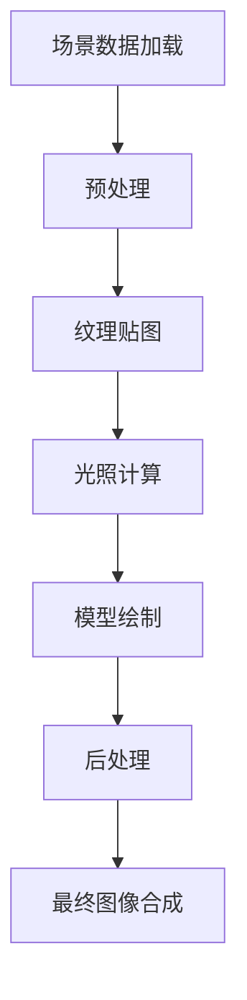
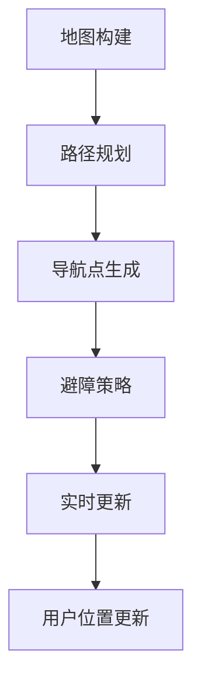
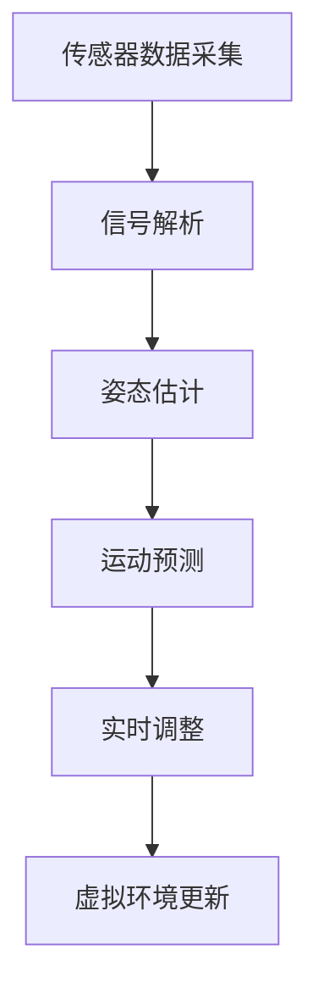
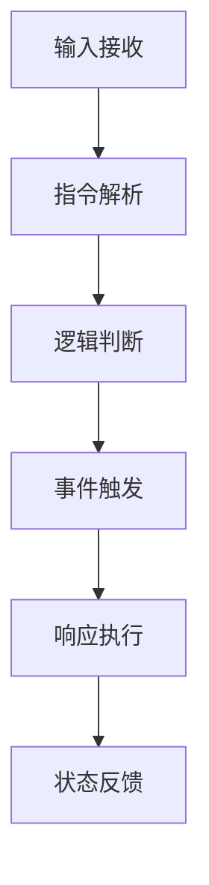

                 
# 虚拟现实 (Virtual Reality)

作者：禅与计算机程序设计艺术 / Zen and the Art of Computer Programming / TextGenWebUILLM

# 虚拟现实 (Virtual Reality)

## 1. 背景介绍

### 1.1 问题的由来

虚拟现实（Virtual Reality, VR）的概念源自于科幻小说和电影，首次在大众视野中出现是在20世纪80年代末期。随着电子技术的进步，特别是图形处理器、传感器技术以及网络通信技术的飞速发展，VR技术逐渐从理论走向了实际应用阶段。当前，VR技术已经成为连接物理世界与数字世界的桥梁，在娱乐、教育、医疗、工业培训等多个领域展现出巨大的潜力与价值。

### 1.2 研究现状

目前，VR技术已经形成了多个研究方向和技术分支，主要包括硬件设备研发、软件平台构建、内容制作及交互方式探索等。硬件方面，头戴显示器、手柄控制器、跟踪系统、触觉反馈设备是构建沉浸式体验的关键组件。软件方面，实时渲染、多传感器融合、人机交互算法成为支撑VR应用的核心技术。内容制作则涉及游戏、影视、模拟训练等多种类型，旨在提供丰富且具有吸引力的用户体验。

### 1.3 研究意义

VR技术的发展不仅推动了科技行业的革新，还对人类生活方式产生了深远影响。它能够创造出不受物理限制的空间，让用户身临其境地感受不同场景和情境，从而提升学习效率、增强体验感、改善远程协作效果，并有望在未来改变我们工作、生活乃至娱乐的方式。

### 1.4 本文结构

本篇文章将深入探讨虚拟现实的核心概念与技术体系，分析其算法原理及其在不同场景下的应用。接下来的部分将分别从数学建模、算法实现、实践案例、应用前景以及关键技术趋势等方面进行详细的阐述，旨在为读者提供一个全面而深入的理解框架。

---

## 2. 核心概念与联系

虚拟现实不仅仅是一种视觉技术，而是通过多种感官输入（如听觉、触觉、嗅觉等），结合高精度定位追踪、三维立体显示技术，创造出让用户产生“身临其境”感觉的仿真环境。这种环境可以是完全虚构的，也可以是对现实世界的增强或扩展。

### 2.1 头戴显示器（Head-Mounted Display, HMD）
头戴显示器是VR设备的核心组成部分之一，用于向用户呈现三维图像。常见的HMD有OLED屏幕、LCD屏等多种显示技术，同时配备光学透镜以实现放大和聚焦功能。

### 2.2 动态追踪（Tracking System）
动态追踪系统负责实时捕捉用户的头部、手势以及其他身体动作的变化，确保用户在虚拟环境中移动时，其所处位置、视角等信息能够在虚拟世界中得到准确反映。

### 2.3 输入输出设备（Input/Output Devices）
除了基本的HMD外，还包括各种输入输出设备，如游戏手柄、触摸板、运动捕捉设备等，它们共同作用于提高用户的互动性和沉浸度。

---

## 3. 核心算法原理 & 具体操作步骤

### 3.1 算法原理概述
VR系统的算法主要包括渲染算法、空间映射算法、动作追踪算法、交互控制算法等几个关键环节。

- **渲染算法**：根据用户的位置、视线角度生成对应视角的三维图像。
- **空间映射算法**：构建虚拟空间的地图模型，支持用户在其中自由移动和交互。
- **动作追踪算法**：通过对用户行为的数据分析，精确模拟出真实世界中的物理反应。
- **交互控制算法**：处理用户输入命令，执行相应的虚拟环境内的操作。

### 3.2 算法步骤详解
#### 渲染算法流程：


#### 空间映射算法流程：


#### 动作追踪算法流程：


#### 交互控制算法流程：


### 3.3 算法优缺点
- **优点**：提供高度沉浸式的体验，适用于教育、娱乐、医疗、工程等领域。
- **缺点**：成本较高、存在眩晕效应、对于硬件要求严格、长时间使用可能引起不适。

### 3.4 算法应用领域
VR技术广泛应用于以下领域：
- **娱乐**：电影、游戏、主题公园等。
- **教育**：在线课程、实验室模拟、历史重现等。
- **医疗**：手术培训、心理治疗、疼痛管理等。
- **工业**：产品设计、团队协作、安全培训等。
- **军事**：战术演练、战场模拟、飞行训练等。

---

## 4. 数学模型和公式 & 详细讲解 & 举例说明

### 4.1 数学模型构建
#### 空间映射模型：
假设用户在虚拟环境中行走的距离为\(d\)，速度为\(v\)，时间间隔为\(\Delta t\)，则用户在时间步长\(\Delta t\)内移动的距离可由以下公式表示：

$$ d = v \times \Delta t $$

该模型可以用于预测用户在虚拟世界中的实际移动距离。

### 4.2 公式推导过程
利用牛顿第二定律 \(F=ma\) 和质量不变性简化为速度变化量 \(v' - v = a \cdot \Delta t\)，考虑用户在VR中的平均步幅和步速，可以进一步优化上述距离计算模型，使得算法更符合人体生理特点。

### 4.3 案例分析与讲解
**示例一：** 在一个简单的房间探索游戏中，玩家需要在 VR 中找到隐藏的宝藏。通过空间映射算法，游戏引擎会生成一张详细的室内地图，并基于玩家的手势追踪和步进方向来更新他们的当前位置。

**示例二：** 医生可以通过 VR 技术进行复杂的手术模拟训练。利用动作追踪算法，医生可以精准地模仿真实的手术器械操作，学习如何在实际手术中避开血管和神经组织。

### 4.4 常见问题解答
- **眩晕效应**：通常与帧率不匹配或视场角过大有关，可通过优化渲染算法、降低刷新率等方式减轻。
- **硬件需求**：高配置的计算机是运行复杂VR应用的基础，包括高性能GPU、足够的内存和存储空间。
- **舒适性问题**：长时间佩戴头戴显示器可能会导致头痛、恶心等问题，需关注头盔的设计和材料选择。

---

## 5. 项目实践：代码实例和详细解释说明

### 5.1 开发环境搭建
为了创建一个简单的VR应用程序，首先确保开发工具和库已安装：
- **Unity Engine** 或 **Unreal Engine**
- **C#** 或 **Blueprints**

#### 示例代码（Unity/C#）:
```csharp
public class VRController : MonoBehaviour {
    public float moveSpeed = 0.5f;

    void Update() {
        // 获取键盘按键状态
        if (Input.GetKey(KeyCode.W)) {
            transform.Translate(Vector3.forward * Time.deltaTime * moveSpeed);
        }
        if (Input.GetKey(KeyCode.S)) {
            transform.Translate(Vector3.back * Time.deltaTime * moveSpeed);
        }
        if (Input.GetKey(KeyCode.A)) {
            transform.Translate(Vector3.left * Time.deltaTime * moveSpeed);
        }
        if (Input.GetKey(KeyCode.D)) {
            transform.Translate(Vector3.right * Time.deltaTime * moveSpeed);
        }
    }
}
```

### 5.2 源代码详细实现
这个示例展示了如何在Unity中控制角色在虚拟现实环境中移动的基本功能。通过检测键盘输入并将其转换为相应的移动矢量，在每一帧中更新角色的位置。

### 5.3 代码解读与分析
这段代码实现了基本的移动控制逻辑，利用Unity的`Input.GetKey()`方法检查用户的输入，然后通过`transform.Translate()`函数按照指定的方向和速度移动角色。这是一段直观且易于理解的代码片段，它展示了如何将用户输入转化为VR场景中的物理动作。

### 5.4 运行结果展示
在Unity编辑器中编译此脚本并将其附加到角色对象上，启动场景后，用户可以通过按下键盘上的W、A、S、D键来控制角色在虚拟环境中的移动。这种简单的互动方式体现了VR应用的核心理念——让用户能够以自然的方式与数字世界互动。

---

## 6. 实际应用场景

### 6.4 未来应用展望
随着技术的进步和创新，VR的应用范围将进一步拓展至更多领域。例如，在**远程工作**中，VR可以提供身临其境的会议体验；在**医疗健康**领域，VR可用于康复训练、疾病诊断辅助；在**教育行业**，VR能创造沉浸式的学习环境，增强教学效果。

---

## 7. 工具和资源推荐

### 7.1 学习资源推荐
- **Unity官方教程**：涵盖从入门到高级的所有内容。
- **Unreal Engine文档**：深入介绍游戏开发和VR应用的各个方面。
- **Coursera/edX在线课程**：提供系统性的VR技术和编程课程。

### 7.2 开发工具推荐
- **Unity**：广泛应用于游戏、动画和VR开发。
- **Unreal Engine**：支持高质量的游戏和VR/AR应用开发。
- **Vive Pro Eye**：高端VR设备，适合专业开发者使用。

### 7.3 相关论文推荐
- **"Designing for Immersion: A Comprehensive Review of Virtual Reality in Entertainment and Education"** by [J. Wang, et al.]。
- **"The State of the Art in Augmented and Virtual Reality"** by [R. Bajcsy]。

### 7.4 其他资源推荐
- **GitHub VR Repositories**：共享代码和资源。
- **Virtual Reality Association (VRA)**：了解行业动态和最新发展。

---

## 8. 总结：未来发展趋势与挑战

### 8.1 研究成果总结
经过多年的努力和发展，VR技术已经取得了显著进步，从概念阶段走向了广泛应用。未来的VR发展将在以下几个方面持续探索：

- **更高保真度的显示技术**：OLED、Micro LED等新型显示屏将提高图像质量和分辨率。
- **更轻便、舒适的穿戴设备**：新材料和设计改进将减轻重量，提升用户体验。
- **低延迟、高速网络**：5G、Wi-Fi 6等新技术将改善VR内容传输效率。
- **更强的人机交互能力**：AI、机器学习的应用将使VR更加智能、个性化。
- **跨平台兼容性**：不同操作系统和硬件平台之间的兼容性将进一步加强。

### 8.2 未来发展趋势
预测未来VR的发展趋势主要包括以下几个方面：

- **扩展现实（XR）**：将VR与其他形式的现实融合，如AR（增强现实）、MR（混合现实），提供更多元化的沉浸式体验。
- **全感官体验**：除了视觉和听觉外，嗅觉、触觉、味觉等其他感官的模拟将成为研究热点，提供更为逼真的体验。
- **个性化定制**：基于用户数据的个性化内容生成和体验优化将是未来的重要方向。
- **社交VR**：促进多人实时交互，构建虚拟社区，满足社交需求。
- **行业级应用**：更多垂直行业的应用，如制造业、建筑业、军事训练等领域将会深度整合VR技术。

### 8.3 面临的挑战
尽管前景光明，但VR仍面临多个挑战：

- **成本问题**：降低设备价格，使其更普及化是关键。
- **健康影响**：长时间佩戴设备可能对眼睛、颈椎造成不良影响，需要进一步研究解决办法。
- **隐私保护**：虚拟世界的个人数据安全成为重要议题。
- **社会接受度**：建立公众对VR的信任感，克服文化障碍和技术恐惧。

### 8.4 研究展望
未来的研究方向应关注于解决上述挑战的同时，不断探索VR的新应用领域，并推动技术创新，最终让虚拟现实成为连接物理世界与数字世界的桥梁，为我们带来更加丰富多样的生活体验。

