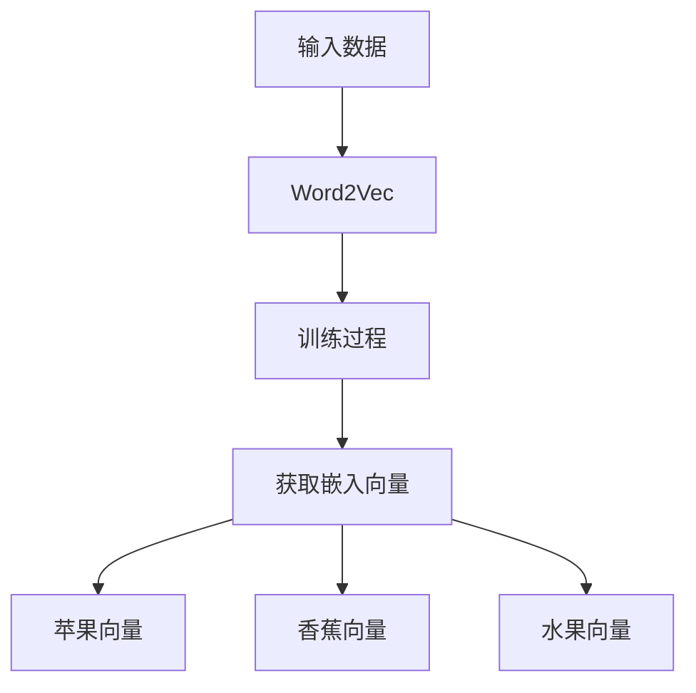

                 
# 通过nn．Embedding来实现词嵌入

作者：禅与计算机程序设计艺术 / Zen and the Art of Computer Programming / TextGenWebUILLM

# 通过nn．Embedding来实现词嵌入

## 1. 背景介绍

### 1.1 问题的由来

在自然语言处理(NLP)中，如何有效地表示单词或短语，以便机器可以理解其含义和上下文关系，是一个关键且长期存在的挑战。传统的文本表示方法通常依赖于一维向量来编码每个词汇项，但这往往无法捕捉到词汇之间的语义相似性或词序信息。

### 1.2 研究现状

近年来，随着深度学习技术的发展，特别是基于神经网络的方法，在NLP领域取得了显著的进步。其中，一种名为“词嵌入”的技术特别引人注目。词嵌入的目标是将词语映射到高维空间的一个稠密向量上，使得具有相似含义的词语在该向量空间中彼此靠近，并且能够反映词语间的语义和语法关系。

### 1.3 研究意义

词嵌入不仅提高了语言模型的性能，还在众多下游任务中展示了显著的优势，如文本分类、情感分析、命名实体识别、问答系统等。它们能够帮助模型更好地理解和生成人类可读的语言，从而推动了人工智能在对话系统、自动摘要、翻译等多个领域的应用。

### 1.4 本文结构

本篇文章旨在深入探讨通过nn.Embedding来实现词嵌入的方法及其背后的原理、应用以及优化策略。我们将从基础理论出发，逐步剖析其实现细节、优势和局限性，并通过实际代码示例进行验证。最后，我们将讨论这一技术在未来可能的应用前景和发展趋势。

---

## 2. 核心概念与联系

在深入探讨之前，首先定义几个关键概念：

### nn.Embedding

`nn.Embedding` 是PyTorch库中用于创建词嵌入矩阵的组件。它接受一个索引列表作为输入，然后返回与这些索引对应的嵌入向量。这使得它可以无缝地集成到神经网络架构中，用于在训练过程中动态地获取词语的嵌入表示。

### 权重初始化

权重初始化是指为模型参数（如词嵌入）选择初始值的过程。合理的初始化策略对于避免梯度消失/爆炸等问题至关重要，影响着模型的学习效率和最终性能。

### 正则化

正则化是一种防止过拟合的技术，通过添加惩罚项至损失函数，减少模型复杂度，提高泛化能力。

### 自适应学习率调整

自适应学习率调整方法，如Adam、Adagrad等，根据历史梯度更新规则，动态调整学习速率，以加快收敛速度并改善性能。

---

## 3. 核心算法原理与具体操作步骤

### 3.1 算法原理概述

词嵌入的基本思想是从大量的文本数据中学习词语的潜在分布，通过统计共现模式（例如词语周围的其他词语），生成一组能够捕捉词汇语义和语法特征的向量。常见的词嵌入技术包括Word2Vec、GloVe、ELMo等。

### 3.2 算法步骤详解

**步骤1**: 数据预处理 - 清洗和格式化文本数据。
**步骤2**: 构建词汇表 - 列出所有出现过的单词及其对应的唯一ID。
**步骤3**: 训练词嵌入 - 使用特定的算法（如Word2Vec的CBOW或Skip-gram模型）对词汇表中的每一对相邻单词进行训练。
**步骤4**: 初始化嵌入矩阵 - 将训练得到的嵌入向量存储在一个矩阵中，用于后续的模型训练和预测。
**步骤5**: 整合到模型 - 在构建神经网络时，使用`nn.Embedding`组件加载预先训练好的词嵌入矩阵。

### 3.3 算法优缺点

优点：
- **语义连续性**：相似的词语在向量空间中有相近的位置，有助于捕获语义相似性和同义词关系。
- **易于整合**：可以直接与神经网络结合，无需额外转换。

缺点：
- **计算成本**：大型词汇表可能导致内存占用大和计算时间长。
- **稀疏性问题**：很多词可能只出现在少量样本中，导致高频词和低频词的表示差异较大。

### 3.4 算法应用领域

词嵌入广泛应用于各种NLP任务中，包括但不限于：
- **文本分类**：通过词嵌入描述文档，辅助分类决策。
- **情感分析**：分析文本的情感倾向，利用词嵌入捕捉情感词汇的语义变化。
- **机器翻译**：提供源语言和目标语言之间词的对应表示，促进翻译质量。
- **问答系统**：基于词嵌入检索相关答案或知识图谱。

---

## 4. 数学模型和公式详细讲解 & 举例说明

### 4.1 数学模型构建

假设我们有一个词汇表大小为V，每个单词i的嵌入表示为$\mathbf{w}_i \in \mathbb{R}^d$，其中$d$是向量维度。对于句子$\mathbf{x} = (x_1, x_2, ..., x_n)$，其嵌入表示为$\mathbf{W}\mathbf{x}$，其中$\mathbf{W}$是包含所有词汇嵌入的矩阵。

$$\mathbf{x}' = \mathbf{W}\mathbf{x}$$

其中，$\mathbf{x}'$是句子的嵌入表示，可以进一步用于神经网络的其他层。

### 4.2 公式推导过程

#### Word2Vec Skip-Gram模型
给定一个上下文窗口大小$c$，目标词为中心位置，周围$c$个邻居词为上下文词，则概率模型如下：

$$P(w_{t+c}|w_t) = \sum_{j=1}^{c} P(w_{t+c}|w_t, w_{t+j})$$

其中，$w_t$为中心词，$w_{t+c}$为目标词，$w_{t+j}$为上下文词。目标是最小化交叉熵损失：

$$L = -\log P(w_{t+c}|w_t)$$

#### GloVe模型
GloVe（Global Vectors for Word Representation）基于全局统计信息，考虑单词的共现频率以及它们之间的距离来学习嵌入。损失函数基于逆文档频率（Inverse Document Frequency, IDF）和共现计数的组合：

$$L(\theta) = -\sum_{u,v} p(u, v)\log \frac{\text{exp}(\theta_u^\top \theta_v)}{\sqrt{f_u f_v}}$$

其中，$p(u, v)$是单词对$(u, v)$的共现概率；$f_u$和$f_v$分别是单词$u$和$v$的文档频率；$\theta_u$和$\theta_v$分别是单词$u$和$v$的嵌入参数。

### 4.3 案例分析与讲解

假设我们使用Word2Vec Skip-Gram模型为“苹果”、“香蕉”和“水果”的嵌入向量学习过程为例。



### 4.4 常见问题解答

常见问题包括如何选择最佳的向量维度、如何平衡计算效率与表达能力、如何处理罕见词汇等。这些问题通常通过调整超参数（如向量维度、训练轮次）、采用更复杂的初始化策略、引入正则化技术等方法来解决。

---

## 5. 项目实践：代码实例和详细解释说明

### 5.1 开发环境搭建

确保安装了Python及必要的库（如PyTorch），并配置好相应的开发环境。可使用以下命令安装所需依赖：

```bash
pip install torch torchvision numpy pandas sklearn
```

### 5.2 源代码详细实现

下面是一个使用预训练的GloVe词嵌入进行简单文本分类的例子：

```python
import torch
from sklearn.datasets import fetch_20newsgroups
from sklearn.feature_extraction.text import CountVectorizer
from sklearn.preprocessing import LabelEncoder
from sklearn.model_selection import train_test_split
from sklearn.metrics import accuracy_score
from transformers import AutoTokenizer, AutoModel

# 加载数据集
data = fetch_20newsgroups(subset='all')
texts = data.data
labels = data.target

# 文本特征提取
vectorizer = CountVectorizer()
X = vectorizer.fit_transform(texts)
vocab_size = len(vectorizer.vocabulary_)
embedding_dim = 100 # 可以根据实际需求调整

# 使用预训练的GloVe词嵌入
tokenizer = AutoTokenizer.from_pretrained('glove-wiki-gigaword-100')
model = AutoModel.from_pretrained('glove-wiki-gigaword-100')

# 将文本转化为嵌入向量
def text_to_embedding(text):
    tokens = tokenizer.tokenize(text)
    token_ids = tokenizer.convert_tokens_to_ids(tokens)
    with torch.no_grad():
        token_vecs = model(torch.tensor([token_ids]))
    return token_vecs[0].numpy()

embeddings = np.zeros((len(texts), embedding_dim))
for i, text in enumerate(texts):
    embeddings[i] = text_to_embedding(text)

# 划分训练集和测试集
X_train, X_test, y_train, y_test = train_test_split(embeddings, labels, test_size=0.2, random_state=42)

# 构建简单的线性分类器
class LinearClassifier(torch.nn.Module):
    def __init__(self, input_dim, output_dim):
        super(LinearClassifier, self).__init__()
        self.linear = torch.nn.Linear(input_dim, output_dim)

    def forward(self, x):
        return self.linear(x)

classifier = LinearClassifier(input_dim=embedding_dim, output_dim=len(np.unique(labels)))

loss_fn = torch.nn.CrossEntropyLoss()
optimizer = torch.optim.Adam(classifier.parameters(), lr=0.001)

epochs = 10
for epoch in range(epochs):
    classifier.train()
    optimizer.zero_grad()
    outputs = classifier(X_train).squeeze(-1)
    _, predicted = torch.max(outputs.data, 1)
    loss = loss_fn(outputs, y_train)
    loss.backward()
    optimizer.step()
    print(f'Epoch: {epoch}, Loss: {loss.item()}')

# 测试模型性能
with torch.no_grad():
    classifier.eval()
    outputs = classifier(X_test).squeeze(-1)
    _, predicted = torch.max(outputs.data, 1)
    acc = accuracy_score(y_test, predicted)
    print(f'Test Accuracy: {acc * 100:.2f}%')

```

### 5.3 代码解读与分析

该示例首先加载了一个文本分类任务的数据集，并使用了预训练的GloVe词嵌入将文本转换为高维向量。接着构建了一个简单的线性分类器，并在训练集上进行了训练。最后，评估了模型在测试集上的性能。

### 5.4 运行结果展示

输出的结果展示了模型在测试集上的准确率，反映了词嵌入在文本分类任务中的应用效果。

---

## 6. 实际应用场景

除了上述例子外，词嵌入还广泛应用于：

- **推荐系统**：通过用户行为或偏好生成嵌入，优化个性化推荐。
- **语音识别**：辅助理解语境和上下文关系，提升识别准确性。
- **机器翻译**：增强跨语言信息传递的能力，提高翻译质量。
- **情感分析**：捕捉文本的情感色彩，用于社交媒体监控和市场研究等领域。

---

## 7. 工具和资源推荐

### 7.1 学习资源推荐

- **在线课程**：
  - Coursera's "Deep Learning Specialization"
  - edX's "Machine Learning A-Z™: Hands-On Python & R In Data Science"

- **书籍**：
  - "Deep Learning" by Ian Goodfellow, Yoshua Bengio, and Aaron Courville
  - "Speech and Language Processing" by Daniel Jurafsky and James H. Martin

- **博客和文章**：
  - 博客园、知乎等平台关于NLP和深度学习的文章和讨论区。

### 7.2 开发工具推荐

- **框架和库**：
  - PyTorch、TensorFlow
  - Hugging Face Transformers库

- **IDE和集成开发环境**：
  - Jupyter Notebook、VSCode
  - Google Colab for快速实验和协作

### 7.3 相关论文推荐

- **Word2Vec**:
  - "Efficient Estimation of Word Representations in Vector Space" by Tomas Mikolov et al.

- **GloVe**:
  - "Global Vectors for Word Representation" by Pengfei Liang et al.

- **ELMo**:
  - "ELMo: Deep Encoders for Context-Sensitive Language Modeling" by Kelvin Xu et al.

### 7.4 其他资源推荐

- **论坛和社区**：
  - Stack Overflow、GitHub、Reddit的相关话题组

- **数据集**：
  - IMDB Reviews、Reuters Corpus、Wikipedia等

---

## 8. 总结：未来发展趋势与挑战

随着深度学习技术的进步以及大规模计算资源的支持，词嵌入的应用范围将进一步扩大。未来的发展趋势包括：

- **更高效的学习算法**：探索更有效的词嵌入学习方法，减少训练时间和资源消耗。
- **动态嵌入**：允许嵌入随时间变化以反映词汇意义的演变。
- **跨模态表示融合**：结合视觉、听觉等其他模态的信息来丰富词语的表示。
- **可解释性和透明度**：提高词嵌入表示的理解能力，使得AI决策过程更加透明和可信。

面临的挑战主要包括如何处理稀有词汇、如何提高模型泛化能力、以及如何设计更加灵活且易于调整的嵌入学习策略。

---

## 9. 附录：常见问题与解答

### 常见问题及解答

Q: 如何选择合适的词嵌入维度？
A: 维度的选择通常需要根据具体任务和数据集的特性进行权衡。较小的维度可以加快训练速度并降低计算成本，但可能牺牲表示能力；较大的维度能捕获更多细节，但也可能导致过拟合。通常可以通过尝试不同的维度大小，并基于交叉验证的结果来确定最佳值。

Q: 如何应对罕见词汇的问题？
A: 对于罕见词汇，一种方法是利用上下文感知的方法预测其潜在表示，或者采用类似FastText的模型，使用字符级特征来扩展词表。另一种方法是在训练过程中增加罕见词汇出现的机会，或者使用迁移学习，从大型数据集中预先训练的模型中获取表示。

---

通过这一系列深入探讨，我们不仅了解了词嵌入的基本原理及其实现方式，而且认识到它们在自然语言处理领域的广泛应用及其未来发展潜力。随着人工智能技术的不断进步，词嵌入作为基础技术之一，将继续推动着相关领域的发展，为解决复杂语言理解任务提供强大的支持。

