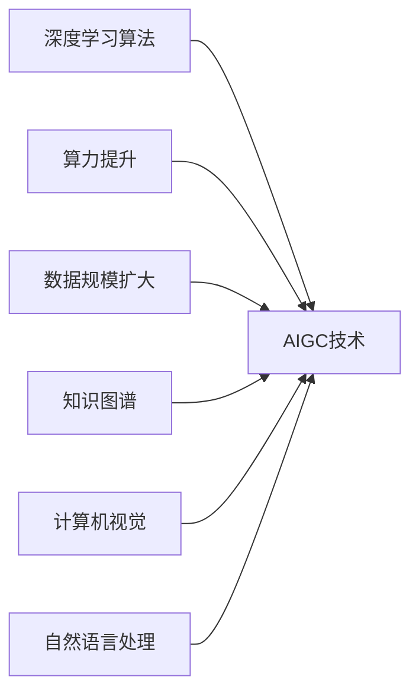

# AIGC从入门到实战：可能消失的职业和新出现的机会

作者：禅与计算机程序设计艺术 / Zen and the Art of Computer Programming

关键词：AIGC, 人工智能, 生成式AI, 就业机会, 职业变革, 未来趋势

## 1. 背景介绍

### 1.1 问题的由来

人工智能生成内容(AIGC)技术的快速发展正在重塑我们的工作和生活方式。随着AI在内容创作领域的广泛应用,许多传统职业面临着被取代的风险,同时也催生出新的就业机会。理解AIGC的发展趋势及其对就业市场的影响,对于个人职业规划和企业人才战略至关重要。

### 1.2 研究现状

目前,AIGC已经在文本、图像、音频、视频等领域取得了显著进展。OpenAI的GPT系列语言模型、Midjourney和Stable Diffusion等图像生成模型代表了这一领域的最新成果。学术界和产业界都在积极探索AIGC技术的应用场景和商业化路径。然而,对于AIGC对就业市场的影响,目前还缺乏系统性的研究和分析。

### 1.3 研究意义

深入剖析AIGC技术发展对就业市场的影响,有助于个人提前做好职业规划,把握时代机遇。对于企业而言,洞察AIGC带来的职业变革趋势,可以帮助其优化人才战略,提升组织竞争力。同时,这一研究也为政府制定就业政策、促进社会稳定提供重要参考。

### 1.4 本文结构

本文将首先介绍AIGC的核心概念和关键技术,然后分析其对传统职业的影响以及催生的新兴职业机会。接着,文章将探讨个人和组织如何应对AIGC带来的职业变革。最后,本文将展望AIGC技术的未来发展趋势及其对就业市场的深远影响。

## 2. 核心概念与联系

人工智能生成内容(AIGC)是指利用人工智能技术自动生成文本、图像、音频、视频等内容的过程。其核心理念是通过机器学习算法,让计算机从海量数据中学习内容创作的模式和规律,进而自主生成高质量的内容。

AIGC技术的关键在于生成模型的构建和训练。目前主流的生成模型包括:
- 生成对抗网络(GAN):通过生成器和判别器的对抗学习,生成逼真的图像、音频等内容。
- 变分自编码器(VAE):通过编码器和解码器的协同训练,学习数据的潜在表示,并基于此生成新的内容。
- Transformer模型:利用自注意力机制捕捉数据的长距离依赖关系,在文本生成、机器翻译等任务上取得了突破性进展。

AIGC技术的发展依赖于深度学习算法的不断创新,以及算力和数据规模的持续提升。同时,AIGC与知识图谱、计算机视觉、自然语言处理等AI技术领域紧密相连,共同推动着人工智能在内容创作领域的进步。



## 3. 核心算法原理 & 具体操作步骤

### 3.1 算法原理概述

AIGC的核心算法是生成模型,其目标是学习数据的分布特征,并基于此生成新的内容。以生成对抗网络(GAN)为例,其由生成器(Generator)和判别器(Discriminator)两部分组成。生成器负责生成假样本,判别器负责判断样本的真假。两者在训练过程中不断博弈,最终使生成器能够生成以假乱真的内容。

### 3.2 算法步骤详解

以图像生成任务为例,GAN的训练步骤如下:

1. 初始化生成器G和判别器D的参数
2. 固定G,训练D:
   - 从真实图像数据集中采样一批真实图像
   - 从随机噪声中采样一批噪声,输入G生成一批假图像
   - 将真实图像和假图像输入D,计算其二分类损失
   - 通过反向传播更新D的参数
3. 固定D,训练G:
   - 从随机噪声中采样一批噪声,输入G生成一批假图像
   - 将假图像输入D,计算其二分类损失
   - 通过反向传播更新G的参数
4. 重复步骤2-3,直到模型收敛或达到预设的训练轮数

可以看出,GAN的训练过程是一个动态博弈的过程。生成器试图生成越来越逼真的假样本来欺骗判别器,而判别器则不断提升自己区分真假样本的能力。最终,生成器可以生成与真实数据分布几乎一致的内容。

### 3.3 算法优缺点

GAN的优点在于:
- 生成效果逼真,能够生成高质量的图像、音频等内容
- 模型灵活,适用于多种类型的数据和任务
- 训练过程直观,易于理解和实现

GAN的缺点包括:
- 训练不稳定,容易出现模式崩溃等问题
- 对训练数据的质量和数量要求较高
- 生成多样性有限,容易出现模式重复的现象

### 3.4 算法应用领域

GAN作为一种通用的生成模型,在多个领域得到了广泛应用,例如:
- 图像生成:生成逼真的人脸、动物、风景等图像
- 图像编辑:进行图像风格迁移、超分辨率重建等
- 视频生成:生成动态的人脸表情、人体动作等视频片段
- 音频合成:生成特定风格或内容的音乐、语音片段
- 文本生成:生成特定主题或风格的文本段落、诗歌等

随着GAN理论和实践的不断发展,其应用领域还将不断扩展。

## 4. 数学模型和公式 & 详细讲解 & 举例说明

### 4.1 数学模型构建

GAN的数学模型可以表示为一个二人零和博弈问题。生成器G和判别器D的目标函数可以定义为:

$$
\min_G \max_D V(D,G) = \mathbb{E}_{x \sim p_{data}(x)}[\log D(x)] + \mathbb{E}_{z \sim p_z(z)}[\log (1 - D(G(z)))]
$$

其中,$x$表示真实数据,$z$表示随机噪声,$p_{data}$和$p_z$分别表示真实数据和噪声的分布。生成器G试图最小化目标函数,而判别器D试图最大化目标函数。

### 4.2 公式推导过程

根据博弈论的理论,上述目标函数可以转化为:

$$
\min_G \max_D V(G,D) = \int_x p_{data}(x) \log D(x) dx + \int_z p_z(z) \log (1 - D(G(z))) dz
$$

通过变分推导,可以得到G和D的优化方向:

$$
\nabla_{\theta_d} \frac{1}{m} \sum_{i=1}^m [\log D(x^{(i)}) + \log (1 - D(G(z^{(i)})))]
$$

$$
\nabla_{\theta_g} \frac{1}{m} \sum_{i=1}^m \log (1 - D(G(z^{(i)})))
$$

其中,$\theta_d$和$\theta_g$分别表示判别器和生成器的参数,$m$表示每个batch的样本数。

### 4.3 案例分析与讲解

以图像生成为例,假设我们要训练一个GAN模型来生成手写数字图像。真实数据集为MNIST,包含0-9十类手写数字图像。生成器G接收一个100维的随机噪声作为输入,输出一张28x28的灰度图像。判别器D接收一张图像作为输入,输出其为真实图像的概率。

在训练过程中,我们交替优化生成器和判别器:
1. 固定G,优化D:从MNIST中采样一批真实图像,从随机噪声中采样一批噪声输入G生成一批假图像,然后将真实图像和假图像输入D计算二分类损失,并通过反向传播优化D的参数。
2. 固定D,优化G:从随机噪声中采样一批噪声输入G生成一批假图像,然后将假图像输入D计算损失,并通过反向传播优化G的参数。

随着训练的进行,生成器G生成的手写数字图像将越来越逼真,判别器D区分真假图像的能力也将不断提高。最终,G可以生成与真实手写数字几乎一致的图像。

### 4.4 常见问题解答

1. GAN训练不稳定的原因是什么?

GAN训练的不稳定性主要来自于生成器和判别器的博弈过程。如果判别器训练得太强,会导致生成器梯度消失;如果生成器训练得太强,会导致判别器无法提供有效的梯度信息。此外,GAN的损失函数设计也容易导致训练不稳定。

2. 如何评估GAN生成内容的质量?

评估GAN生成内容质量的常用指标包括:
- Inception Score(IS):利用预训练的分类模型评估生成图像的质量和多样性
- Fréchet Inception Distance(FID):计算生成图像和真实图像在特征空间的距离
- 人工评估:由人工对生成内容的真实性、美观性等进行主观评分

3. GAN可以应用于哪些具体的内容生成任务?

GAN可以应用于多种内容生成任务,例如:
- 人脸生成:生成逼真的人脸图像,可用于虚拟形象、人脸动画等
- 物体生成:生成逼真的物体图像,如家具、车辆等
- 场景生成:生成逼真的场景图像,如街景、室内场景等
- 风格迁移:将一幅图像的风格迁移到另一幅图像上
- 图像翻译:在不同域之间进行图像转换,如草图到照片、黑白到彩色等

随着GAN技术的发展,其应用场景还将不断拓展。

## 5. 项目实践：代码实例和详细解释说明

### 5.1 开发环境搭建

本项目使用PyTorch深度学习框架,并利用CUDA进行GPU加速。开发环境的主要依赖包括:
- python 3.8
- pytorch 1.9
- torchvision 0.10
- numpy 1.21
- matplotlib 3.4

可以通过以下命令安装所需依赖:

```bash
pip install torch torchvision numpy matplotlib
```

### 5.2 源代码详细实现

以下是一个简单的GAN模型实现,用于生成MNIST手写数字图像:

```python
import torch
import torch.nn as nn
import torchvision
import torchvision.transforms as transforms
import numpy as np
import matplotlib.pyplot as plt

# 设置超参数
batch_size = 64
num_epochs = 50
latent_dim = 100
img_size = 28
channels = 1

# 定义生成器
class Generator(nn.Module):
    def __init__(self):
        super(Generator, self).__init__()
        self.model = nn.Sequential(
            nn.Linear(latent_dim, 256),
            nn.ReLU(),
            nn.Linear(256, 512),
            nn.ReLU(),
            nn.Linear(512, 1024),
            nn.ReLU(),
            nn.Linear(1024, img_size**2),
            nn.Tanh()
        )

    def forward(self, z):
        img = self.model(z)
        img = img.view(img.size(0), channels, img_size, img_size)
        return img

# 定义判别器
class Discriminator(nn.Module):
    def __init__(self):
        super(Discriminator, self).__init__()
        self.model = nn.Sequential(
            nn.Linear(img_size**2, 1024),
            nn.ReLU(),
            nn.Linear(1024, 512),
            nn.ReLU(),
            nn.Linear(512, 256),
            nn.ReLU(),
            nn.Linear(256, 1),
            nn.Sigmoid()
        )

    def forward(self, img):
        img_flat = img.view(img.size(0), -1)
        validity = self.model(img_flat)
        return validity

# 实例化模型
generator = Generator()
discriminator = Discriminator()

# 定义损失函数和优化器
criterion = nn.BCELoss()
optimizer_G = torch.optim.Adam