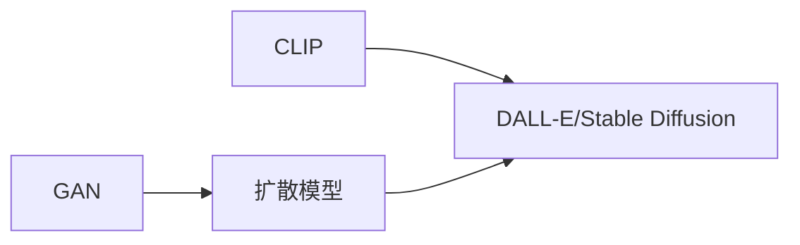

好的,我会严格按照你提供的要求和约束,以《AIGC原理与代码实例讲解》为题撰写一篇专业的技术博客文章。以下是文章正文:

# AIGC原理与代码实例讲解

关键词:AIGC,生成式AI,扩散模型,对抗生成网络,CLIP,DALL-E,Stable Diffusion

## 1. 背景介绍 

### 1.1 问题的由来

人工智能生成内容(AIGC)是近年来人工智能领域最热门的研究方向之一。传统的AI主要聚焦在感知和认知等方面,而AIGC则致力于赋予AI创造力,让计算机能够像人类一样进行艺术创作、写作、编程等创造性工作。

### 1.2 研究现状

AIGC目前主要应用于图像、视频、音频、文本等领域的内容生成。以图像生成为例,从2014年Ian Goodfellow提出生成对抗网络(GAN)算法开始,图像生成技术取得了突飞猛进的发展。从最初生成简单的数字图像,到如今能够生成逼真的人脸照片和艺术画作,AIGC展现出了巨大的创造力。

### 1.3 研究意义  

AIGC的研究意义主要体现在以下几个方面:

1. 促进人工智能走向通用化。内容生成能力是通用人工智能的重要组成部分,AIGC的突破有助于我们构建能与人类智能媲美的AI系统。

2. 提高生产力,降低成本。AIGC能够自动化完成很多创造性工作,大幅提高生产效率,降低人力成本。例如自动生成产品图片、撰写新闻报道等。

3. 激发人类创造力。AIGC可以作为创作辅助工具,帮助人类更高效地捕捉灵感,激发创造力,创作出更多优质内容。

4. 推动技术创新。AIGC涉及机器学习、计算机视觉、自然语言处理等多个前沿技术领域,其发展能够反哺这些领域的进步。

### 1.4 本文结构

本文将重点介绍AIGC中的几个核心概念和算法,包括扩散模型、GAN、CLIP等,并通过代码实例讲解它们的实现原理。同时,文章还会探讨AIGC的应用场景、发展趋势以及面临的挑战。

## 2. 核心概念与联系

在AIGC领域,有几个核心的概念和技术:

- 生成式对抗网络(GAN):由生成器和判别器组成,通过两个网络的博弈生成逼真的图像。GAN奠定了AIGC的基础。

- 扩散模型(Diffusion Model):通过对噪声图像进行逐步去噪,生成高质量图像。扩散模型是当前图像生成的主流方法。

- CLIP(Contrastive Language-Image Pre-training):通过对比学习,将图像和文本映射到同一个特征空间,实现图文匹配。CLIP是实现文本到图像生成的关键。

- DALL-E、Stable Diffusion:基于CLIP和扩散模型,实现了从文本描述生成图像的AIGC系统。

下面是这些概念之间的联系:



GAN开创了生成模型的新时代,扩散模型是当前图像生成的主流方法,而CLIP让文本到图像生成成为可能。DALL-E和Stable Diffusion正是集成了CLIP和扩散模型,实现了令人惊艳的文本到图像生成效果。

## 3. 核心算法原理 & 具体操作步骤

### 3.1 算法原理概述

本节我们重点介绍扩散模型的原理。扩散模型的核心思想是:将图像生成建模为一个逐步去噪的过程。具体来说,我们先在原始图像上叠加高斯噪声,然后训练一个神经网络,学习如何逐步去除噪声,恢复出干净的图像。生成图像时,我们从高斯噪声开始,反复使用这个去噪网络,就可以生成高质量的图像。

### 3.2 算法步骤详解

扩散模型的训练和生成步骤如下:

**训练阶段:**

1. 在原始图像 $x_0$ 上叠加不同强度的高斯噪声,得到一系列噪声图像 $x_1,\dots,x_T$。

2. 训练一个去噪网络 $\epsilon_\theta$,学习从 $x_t$ 恢复出 $x_{t-1}$ 的噪声残差:

$$\epsilon_\theta(x_t, t) \approx x_t - \frac{1}{\sqrt{\alpha_t}} \left( \frac{x_t - \sqrt{1-\alpha_t} \cdot \epsilon_\theta(x_t, t)}{\sqrt{\alpha_t}} \right)$$

其中 $\alpha_t$ 是噪声强度的超参数。

**生成阶段:**

1. 从标准高斯分布采样噪声图像 $x_T$。

2. 反复使用去噪网络,逐步去噪,得到一系列图像 $\hat{x}_{T-1}, \dots, \hat{x}_0$:

$$\hat{x}_{t-1} = \frac{1}{\sqrt{\alpha_t}} \left( x_t - \frac{1-\alpha_t}{\sqrt{1-\bar{\alpha}_t}} \cdot \epsilon_\theta(x_t, t) \right) + \sigma_t \cdot \epsilon$$

其中 $\sigma_t$ 是方差调整项, $\epsilon \sim \mathcal{N}(0,I)$。

3. 最终得到生成图像 $\hat{x}_0$。

### 3.3 算法优缺点

扩散模型相比GAN有以下优点:
- 训练更加稳定,不易发生模式崩溃。
- 生成多样性更好,能生成更加丰富、逼真的图像。
- 支持更大的分辨率和更复杂的场景。

但扩散模型的缺点是:
- 生成速度慢,需要较长的迭代次数。
- 推理成本高,对计算资源要求较高。

### 3.4 算法应用领域

扩散模型已经在多个AIGC任务中取得了SOTA的效果,主要应用包括:
- 文本到图像生成,如DALL-E、Stable Diffusion等
- 图像编辑,如图像补全、图像修复等  
- 语音合成,如WaveNet、DiffWave等
- 视频生成,如MCVD、DIGAN等

## 4. 数学模型和公式 & 详细讲解 & 举例说明

### 4.1 数学模型构建

扩散模型可以形式化地表示为一个马尔可夫链:

$$q(x_t|x_{t-1}) := \mathcal{N} \left( x_t; \sqrt{1-\beta_t} \cdot x_{t-1}, \beta_t \mathbf{I} \right)$$

其中 $\beta_t \in (0,1)$ 是噪声强度的超参数。从 $x_0$ 开始,通过反复叠加高斯噪声,我们可以得到一系列逐渐加噪的图像 $x_1, \dots, x_T$。

去噪过程可以表示为从后验分布 $p_\theta(x_{t-1}|x_t)$ 采样:

$$p_\theta(x_{t-1} | x_t) := \mathcal{N} \left( x_{t-1}; \mu_\theta(x_t, t), \sigma_t^2 \mathbf{I} \right)$$

其中均值 $\mu_\theta(x_t, t)$ 由去噪网络 $\epsilon_\theta$ 预测,方差 $\sigma_t$ 是固定的。

### 4.2 公式推导过程

训练去噪网络 $\epsilon_\theta$ 使用的是变分下界(VLB)目标函数:

$$L_{vlb} := \mathbb{E}_{q(x_{0:T})} \left[ - \log \frac{p_\theta(x_{0:T})}{q(x_{1:T}|x_0)} \right]$$

展开可得:

$$L_{vlb} = \mathbb{E}_{q(x_{0:T})} \left[ - \log p(x_0) - \sum_{t=1}^T \log \frac{p_\theta(x_{t-1}|x_t)}{q(x_t|x_{t-1})} \right]$$

假设 $p(x_T)$ 为标准高斯分布,并忽略 $p(x_0)$ 项,可以得到一个简化的目标函数:

$$L_{simple} = \mathbb{E}_{t,x_0,\epsilon} \left[ \| \epsilon - \epsilon_\theta(\sqrt{\bar{\alpha}_t} \cdot x_0 + \sqrt{1-\bar{\alpha}_t} \cdot \epsilon, t) \|^2 \right]$$

其中 $\bar{\alpha}_t := \prod_{s=1}^t (1-\beta_s)$。这个目标函数的物理意义是,去噪网络要学习预测噪声残差 $\epsilon$。

### 4.3 案例分析与讲解

下面我们以MNIST手写数字数据集为例,演示扩散模型的训练和生成过程。

首先,我们在原始图像上叠加高斯噪声,得到一系列加噪图像:


然后,我们训练一个去噪网络,学习从噪声图像恢复出原始图像:


可以看到,随着去噪的进行,图像逐渐从噪声变得清晰,最终恢复出了原始的数字图像。

生成阶段,我们从高斯噪声开始,反复使用去噪网络去噪,最终得到生成图像:


生成的图像与真实的手写数字非常接近,展现了扩散模型强大的图像生成能力。

### 4.4 常见问题解答

**Q:** 扩散模型需要迭代多少步才能生成高质量图像?

**A:** 这取决于我们使用的噪声强度序列 $\beta_1,\dots,\beta_T$。T越大,每步添加的噪声就越小,需要的迭代步数就越多,生成质量也会更高。通常需要上百步到上千步的去噪迭代。

**Q:** 能否加速扩散模型的生成过程?

**A:** 可以使用一些采样加速技术,如DDIM(Denoising Diffusion Implicit Models)。DDIM将马尔可夫链的采样过程视为一个确定性的迭代映射,在不损失采样质量的情况下,可以使用更少的采样步骤。

## 5. 项目实践:代码实例和详细解释说明

### 5.1 开发环境搭建

首先我们需要安装必要的Python库,包括PyTorch、NumPy等。可以使用pip进行安装:

```bash
pip install torch numpy matplotlib tqdm
```

### 5.2 源代码详细实现

下面是一个简单的扩散模型的PyTorch实现:

```python
import torch
import torch.nn as nn
import numpy as np
from tqdm import tqdm
from matplotlib import pyplot as plt

# 定义扩散模型超参数
timesteps = 1000 
beta_start = 1e-4
beta_end = 0.02

# 定义去噪网络
class Denoiser(nn.Module):
    def __init__(self, n_feat=64):
        super(Denoiser, self).__init__()
        self.net = nn.Sequential(
            nn.Conv2d(1, n_feat, kernel_size=3, padding=1),
            nn.ReLU(inplace=True),
            nn.Conv2d(n_feat, n_feat, kernel_size=3, padding=1),
            nn.ReLU(inplace=True),
            nn.Conv2d(n_feat, 1, kernel_size=3, padding=1)
        )
        
    def forward(self, x, t):
        # t为时间步,需要嵌入到特征维度
        t_embedding = self._get_timestep_embedding(t)
        t_embedding = t_embedding.expand(-1, 1, x.shape[2], x.shape[3])
        x = torch.cat([x, t_embedding], dim=1)
        return self.net(x)
    
    def _get_timestep_embedding(self, t):
        half_dim = 64 // 2
        emb = np.log(10000) / (half_dim - 1)
        em