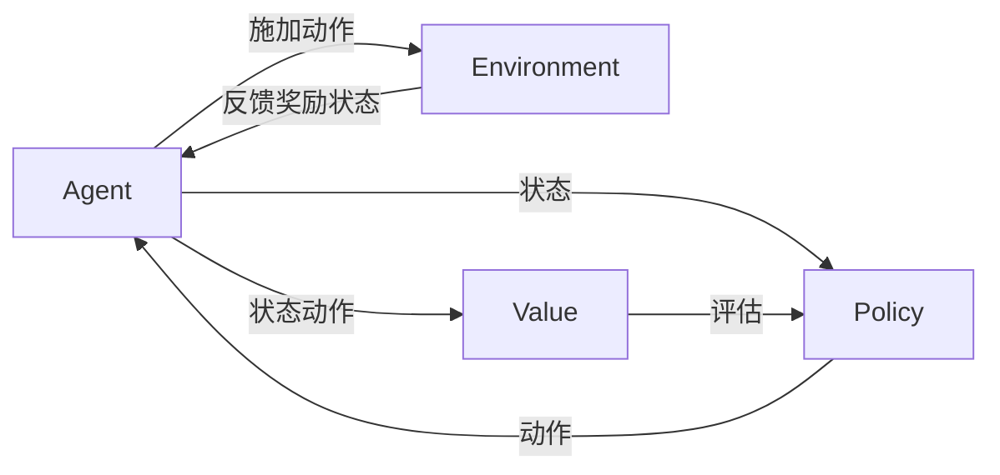

# AI人工智能 Agent：智能体的动作选择策略

关键词：人工智能、智能体、Agent、动作选择、决策、强化学习、马尔可夫决策过程

## 1. 背景介绍
### 1.1  问题的由来
人工智能(Artificial Intelligence, AI)是计算机科学的一个重要分支,旨在研究如何让计算机模拟人类的智能行为。而在人工智能领域,智能体(Agent)是一个非常重要的概念。智能体可以感知环境,根据环境的变化做出相应的决策和动作,从而实现特定的目标。那么,智能体是如何选择最优动作的呢?这就涉及到了智能体的动作选择策略问题。

### 1.2  研究现状
目前,智能体的动作选择策略主要有以下几种:

1. 基于规则的方法:通过预先定义好的规则来选择动作,比如决策树、有限状态机等。
2. 基于搜索的方法:通过搜索算法(如启发式搜索)在动作空间中寻找最优动作。 
3. 基于规划的方法:通过规划算法(如动态规划)求解最优动作序列。
4. 基于学习的方法:通过学习算法(如强化学习)从与环境的交互中学习最优策略。

其中,基于强化学习的方法因其通用性和高效性而备受关注,已成为智能体动作选择的主流范式。

### 1.3  研究意义
智能体动作选择策略的研究对于构建高效、鲁棒的人工智能系统具有重要意义:

1. 提高系统性能:好的动作选择策略可以帮助智能体快速做出最优决策,提高任务完成效率。
2. 增强适应能力:学习型策略可以让智能体根据环境的变化自主调整,具有更强的适应性。
3. 扩展应用场景:通用的动作选择框架可以应用于不同领域,如自动驾驶、智能助理、推荐系统等。

### 1.4  本文结构
本文将围绕智能体动作选择这一主题展开,内容安排如下:
- 第2部分介绍相关的核心概念;
- 第3部分讲解主流的动作选择算法原理; 
- 第4部分给出算法的数学模型和公式推导;
- 第5部分通过代码实例演示算法的具体实现;
- 第6部分讨论算法在实际场景中的应用;
- 第7部分推荐相关的学习资源和工具;
- 第8部分总结全文,并展望未来的发展方向。

## 2. 核心概念与联系
在讨论智能体动作选择之前,我们先来了解几个核心概念:
- 智能体(Agent):可以感知环境并做出行动的实体,其目标是最大化累积奖励。
- 环境(Environment):智能体所处的环境,可以是现实世界,也可以是虚拟环境(如游戏、仿真器等)。智能体通过动作影响环境,环境根据动作给予奖励反馈并更新状态。
- 状态(State):环境在某一时刻的完整描述,包含了智能体做决策所需的所有信息。马尔可夫性假设状态是完全可观测的。
- 动作(Action):智能体施加于环境的控制信号,会导致环境状态的改变。动作空间可以是离散的,也可以是连续的。
- 策略(Policy):将状态映射为动作的函数,即给定状态下应该选择什么动作。最优策略就是能获得最大累积奖励的策略。
- 奖励(Reward):环境对智能体动作的即时反馈,通常是一个标量值。智能体的目标就是最大化累积奖励。
- 价值(Value):衡量状态或动作的长期潜在收益,考虑了即时奖励和未来奖励。
- 探索与利用(Exploration vs. Exploitation):探索是尝试新的动作以发现更优策略,利用是执行已知的最优动作以获得稳定收益,两者需要权衡。

下图展示了这些概念之间的关系:

智能体与环境不断交互,根据当前状态选择动作,获得奖励并进入新状态。策略将状态映射为动作,价值函数评估状态动作的长期收益,为策略提供改进方向。智能体的目标就是学习最优策略以获得最大累积奖励。

## 3. 核心算法原理 & 具体操作步骤
### 3.1  算法原理概述
强化学习是一种通过试错与环境交互来学习最优策略的方法。马尔可夫决策过程(Markov Decision Process, MDP)为强化学习提供了理论基础。MDP由状态空间、动作空间、状态转移概率和奖励函数构成,满足马尔可夫性质,即下一状态只取决于当前状态和动作。求解MDP就是要找到最优策略,使得从任意初始状态出发能获得最大期望累积奖励。

主流的强化学习算法可分为以下三类:
1. 值函数类:通过学习状态价值函数或动作价值函数,然后根据价值函数得到策略,代表算法有Q-learning、Sarsa等。
2. 策略梯度类:直接学习最优策略的参数,通过梯度上升优化策略,代表算法有REINFORCE、Actor-Critic等。 
3. 搜索类:通过启发式搜索或规划在策略空间中搜索最优策略,代表算法有蒙特卡洛树搜索等。

不同类型的算法各有优劣,可以根据具体问题选择合适的算法。本文将重点介绍Q-learning这一经典的值函数类算法。

### 3.2  算法步骤详解
Q-learning的核心思想是学习动作价值函数Q(s,a),表示在状态s下选择动作a的长期期望收益。Q函数满足贝尔曼最优方程:
$$Q(s,a)=R(s,a)+\gamma \max_{a'}Q(s',a')$$
其中,R(s,a)为在状态s下选择动作a的即时奖励,s'为执行动作a后的下一状态,γ为折扣因子。这个方程表明,一个状态动作对的价值等于它的即时奖励加上下一状态的最大Q值乘以折扣因子。

Q-learning的算法流程如下:
1. 初始化Q(s,a),对所有s∈S,a∈A,任意初始化Q(s,a)
2. 重复以下步骤,直到Q收敛或达到指定的训练轮数:
   1) 根据ε-greedy策略选择动作a,即以ε的概率随机选择动作,否则选择Q值最大的动作
   2) 执行动作a,观察奖励r和下一状态s'
   3) 更新Q(s,a):
   $$Q(s,a) \leftarrow Q(s,a)+\alpha [r+\gamma \max_{a'}Q(s',a')-Q(s,a)]$$
   其中,α为学习率
   4) s←s'
3. 返回学到的策略π(s)=argmax_a Q(s,a)

可以证明,只要所有状态动作对被无限次访问,Q-learning最终会收敛到最优动作价值函数Q*,从而得到最优策略π*。

### 3.3  算法优缺点
Q-learning的主要优点有:
- 简单易实现,只需存储一个Q表
- 离线学习,每次更新只需要单步的转移样本
- 通过探索可以学到最优策略,具有一定的探索能力

但Q-learning也存在一些局限:
- 状态动作空间太大时,存储和更新Q表的开销会变得难以承受
- 难以处理连续状态动作空间
- 学习效率较低,需要大量的样本才能收敛

为了克服这些局限,研究者提出了一系列改进方法,如使用函数逼近器(如神经网络)拟合Q函数,引入经验回放、Double DQN等技巧加速学习等。

### 3.4  算法应用领域
Q-learning在许多领域都有应用,例如:
- 游戏AI:Q-learning可以通过与游戏环境交互来学习游戏策略,AlphaGo就使用了改进的Q-learning算法。
- 机器人控制:Q-learning可以学习机器人在不同状态下应该选择什么动作,如移动、抓取等。
- 推荐系统:可以将推荐看做一个序贯决策过程,通过Q-learning学习最优的推荐策略。
- 自然语言处理:将对话看做一个决策过程,利用Q-learning学习对话策略。
- 智能电网:利用Q-learning优化电网的调度和能源管理策略。

总之,Q-learning提供了一种通用的智能体决策学习框架,可以应用于许多领域。

## 4. 数学模型和公式 & 详细讲解 & 举例说明
### 4.1  数学模型构建
马尔可夫决策过程为智能体的序贯决策提供了数学模型。一个MDP由以下元素构成:
- 状态空间S:所有可能的环境状态的集合
- 动作空间A:智能体可以采取的所有动作的集合 
- 状态转移概率P(s'|s,a):在状态s下选择动作a后进入状态s'的概率
- 奖励函数R(s,a):在状态s下选择动作a获得的即时奖励

MDP的目标就是找到一个最优策略π*,使得从任意初始状态s_0出发,智能体执行该策略能获得最大的期望累积奖励:
$$\pi^*=\arg\max_\pi E[\sum_{t=0}^\infty \gamma^t R(s_t,\pi(s_t))]$$
其中,γ∈[0,1]为折扣因子,表示未来奖励的重要程度。

为了求解最优策略,我们引入价值函数的概念。状态价值函数V^π(s)表示从状态s开始执行策略π获得的期望回报:
$$V^\pi(s)=E[\sum_{t=0}^\infty \gamma^t R(s_t,\pi(s_t))|s_0=s]$$

类似地,动作价值函数Q^π(s,a)表示在状态s下选择动作a,然后执行策略π获得的期望回报:  
$$Q^\pi(s,a)=E[\sum_{t=0}^\infty \gamma^t R(s_t,\pi(s_t))|s_0=s,a_0=a]$$

最优价值函数V^*(s)和Q^*(s,a)分别表示在状态s下执行最优策略和在状态s下选择动作a然后执行最优策略的期望回报。它们满足贝尔曼最优方程:
$$V^*(s)=\max_a [R(s,a)+\gamma \sum_{s'} P(s'|s,a)V^*(s')]$$
$$Q^*(s,a)=R(s,a)+\gamma \sum_{s'} P(s'|s,a)\max_{a'}Q^*(s',a')$$

直观地理解,最优价值函数就是在每一步都选择让价值最大的动作。求解MDP就是要找到这些最优价值函数,得到最优策略。

### 4.2  公式推导过程
接下来我们推导Q-learning的更新公式。Q-learning的思想是通过随机探索的方式来近似最优动作价值函数Q*。我们定义Q-learning的损失函数为:
$$L(Q)=E_{s,a}[(R(s,a)+\gamma \max_{a'} Q(s',a')-Q(s,a))^2]$$

这个损失函数衡量了Q函数对贝尔曼最优方程的逼近程度,我们的目标就是最小化这个损失函数。对Q函数求梯度,得到:
$$\nabla L(Q)=E_{s,a}[2(R(s,a)+\gamma \max_{a'} Q(s',a')-Q(s,a)) \nabla Q(s,a)]$$

根据随机梯度下降法,我们更新Q函数为:
$$Q(s,a) \leftarrow Q(s,a)-\alpha \nabla L(Q)$$
$$=Q(s,a)+\alpha [R(s,a)+\gamma \max_{a'} Q(s',a')-Q(s,a)]$$

其中,α为学习率。这就是Q-learning的更新公式。可以看出,它只需要单步的转移样本(s,a,r,s'),而不需要知道环境的转移概率。每次更新将Q(s,a