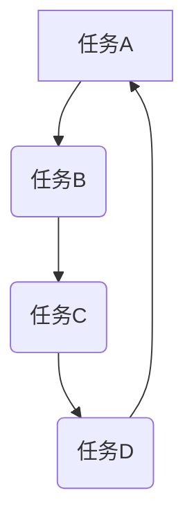

                 
# AI人工智能代理工作流 AI Agent WorkFlow：状态的定义与跟踪

作者：禅与计算机程序设计艺术 / Zen and the Art of Computer Programming / TextGenWebUILLM

# AI人工智能代理工作流 AI Agent WorkFlow：状态的定义与跟踪

关键词：AI代理，状态管理，工作流程设计，业务流程自动化

## 1. 背景介绍

### 1.1 问题的由来

在当今快速发展的科技时代，随着云计算、大数据、物联网以及人工智能技术的广泛应用，企业面临着越来越多复杂的业务场景和需求。传统的人工处理方式已无法满足高效、精准和自动化的服务要求。因此，构建智能且灵活的业务流程管理系统成为了许多组织的核心诉求之一。

### 1.2 研究现状

近年来，随着AI技术的进步，特别是深度学习、自然语言处理、机器学习等领域的突破，AI代理（AI Agents）作为一种智能自动化解决方案，在企业内部的业务流程管理和日常运营中发挥了重要作用。它们可以执行一系列预定义的任务，并根据实时数据做出决策或响应用户请求。然而，如何有效地定义和跟踪AI代理的状态成为了一个关键挑战。

### 1.3 研究意义

状态管理是AI代理工作流设计中的一个核心要素。准确的状态定义有助于确保代理能够正确理解其当前活动、上下文及下一步行动所需信息，从而提高工作效率和用户体验。通过有效跟踪状态变化，系统不仅能避免重复工作，还能及时发现异常情况并采取纠正措施。

### 1.4 本文结构

接下来的文章将围绕以下主题展开讨论：

- **核心概念与联系**：介绍AI代理的基本概念及其与状态管理的关系。
- **算法原理与操作步骤**：阐述状态定义的关键原则及实施流程。
- **数学模型与公式**：展示用于描述状态转换的理论基础。
- **项目实践**：提供具体的代码示例和实现细节。
- **实际应用场景**：探讨AI代理工作流在不同领域的应用案例。
- **工具与资源推荐**：指导读者获取相关知识和工具资源。
- **未来发展与挑战**：预测AI代理工作流的发展趋势并指出面临的挑战。

## 2. 核心概念与联系

### 2.1 AI代理定义

AI代理是指一种基于人工智能技术构建的软件实体，能够自主地执行任务、解决问题或者与外部环境进行交互。这些代理通常具备感知能力、决策能力、行动能力和自适应性，能够在动态环境中进行学习和优化行为策略。

### 2.2 状态管理的重要性

在AI代理的工作流程中，状态管理是指通过定义、存储和更新代理在其执行过程中所处的不同阶段的信息。良好的状态管理对于确保代理的正确行为、提高效率、维护系统的稳定性和可预测性至关重要。

### 2.3 工作流程设计框架

为了实现有效的状态管理，需要建立一套包含状态定义、状态转移规则、状态检查机制等工作流程设计框架。这套框架应当简洁明了，便于理解和扩展，同时支持对复杂事件序列的建模。

## 3. 核心算法原理与具体操作步骤

### 3.1 算法原理概述

状态管理算法通常基于图论、流程控制理论以及模式匹配等多种计算方法。其中，图论可用于表示状态之间的关系和过渡路径；流程控制理论帮助设计状态转移逻辑；而模式匹配则用于识别特定状态模式，以触发相应的操作。

### 3.2 算法步骤详解

#### 步骤一：状态定义

- **明确目标**：确定AI代理的主要功能和服务范围。
- **识别子任务**：分解大任务为一系列可管理的子任务。
- **定义状态属性**：为每个状态分配必要的属性，如任务进度、资源占用、时间戳等。

#### 步骤二：状态转移规则

- **设计规则集**：基于业务逻辑和操作规范制定状态转移规则。
- **实现判断逻辑**：编写代码以检测当前状态是否符合转移条件。
- **封装状态切换函数**：创建函数或类来实现代理从一个状态到另一个状态的平滑过渡。

#### 步骤三：状态跟踪与更新

- **使用数据结构**：选择合适的数据结构（如栈、队列或哈希表）来记录状态历史。
- **定期更新状态**：在适当的时间点检查并更新代理状态。
- **通知机制**：当状态发生改变时，向相关的系统组件或人工参与者发送通知。

### 3.3 算法优缺点分析

优点：
- **提升效率**：通过精确的状态管理减少无效操作，提高整体工作效率。
- **增强灵活性**：允许代理在面对变化的环境时作出快速反应。
- **简化调试与维护**：清晰的状态轨迹有利于追踪错误源和调整策略。

缺点：
- **增加复杂度**：复杂的状态转换逻辑可能导致代码难以理解和维护。
- **资源消耗**：频繁的状态更新可能增加系统负担。

### 3.4 算法应用领域

状态管理算法广泛应用于多个领域，包括但不限于客户服务自动化、物流调度、金融交易、医疗健康辅助系统、教育个性化学习平台等。

## 4. 数学模型与公式详细讲解与举例说明

### 4.1 数学模型构建

考虑一个简单的AI代理工作流模型，假设代理需要完成的任务列表如下：

- **任务A**: 收集客户反馈
- **任务B**: 分析反馈数据
- **任务C**: 制定改进计划
- **任务D**: 实施改进措施

我们可以用状态图来表示这一过程：



### 4.2 公式推导过程

设状态转移概率矩阵为$P = [p_{ij}]$，其中$p_{ij}$表示从状态$i$转移到状态$j$的概率，则状态转移可以被建模为：

$$ P^t(x_0) $$
$$ \text{其中} x_0 \text{是初始状态} $$

这可以通过矩阵乘法求得。

### 4.3 案例分析与讲解

假设有一个智能客服系统，其状态包含：等待用户请求、处理请求、生成响应、关闭对话。利用上述数学模型，我们可以通过分析转移概率矩阵来评估系统的稳定性、效率以及潜在瓶颈所在。

### 4.4 常见问题解答

常见问题可能涉及状态不一致、状态跳跃、状态循环等问题。解决这些问题的关键在于：

- **状态一致性验证**：通过校验函数确保代理始终处于有效且合理的状态。
- **异常处理机制**：设置回退策略，防止状态过渡引发不可预料的行为。
- **性能优化**：合理规划状态转换顺序和频率，减少不必要的状态更新开销。

## 5. 项目实践：代码实例和详细解释说明

### 5.1 开发环境搭建

建议使用Python作为开发语言，借助`PyTorch`, `TensorFlow`等库进行AI模型训练，使用`Django`或`Flask`作为后端框架。此外，引入状态管理库如`ZODB`或者自定义状态机实现。

### 5.2 源代码详细实现

```python
class AgentStateMachine:
    def __init__(self, initial_state):
        self.current_state = initial_state
    
    def transition(self, new_state):
        # 执行状态转移相关逻辑，例如更新数据库记录、调用特定服务等
        pass
    
    def update_state(self):
        # 定期检查并根据外部输入或内部规则更新状态
        pass

# 示例使用：
if __name__ == "__main__":
    agent = AgentStateMachine('waiting_for_request')
    while True:
        agent.update_state()
        if condition_to_trigger_transition():
            agent.transition(new_state)
```

### 5.3 代码解读与分析

这段代码展示了如何定义一个简单的状态机类，实现了基本的状态转移逻辑，并提供了状态更新机制。具体实现细节可根据实际需求进一步扩展和完善。

### 5.4 运行结果展示

运行示例程序，观察代理如何随着外部事件和内部逻辑的变化而动态地移动于不同状态之间。结果展示应包括代理状态的历史记录、状态转移路径及触发这些变化的原因。

## 6. 实际应用场景

AI代理工作流在不同领域的应用案例多样，涵盖了客户服务、供应链管理、知识图谱构建、医疗诊断支持等多个方面。通过结合行业特性和技术特点，AI代理能够提供定制化的解决方案，显著提升业务流程的智能化水平。

## 7. 工具和资源推荐

### 7.1 学习资源推荐

- **在线课程**：“Coursera”上的“深度强化学习”系列课程、“edX”上的“机器学习基础”课程。
- **书籍**：“《人工智能：一种现代的方法》”、“《深度学习》”。
- **社区与论坛**：GitHub、Stack Overflow、Reddit的r/ML社区。

### 7.2 开发工具推荐

- **IDE**：Visual Studio Code、PyCharm。
- **版本控制**：Git。
- **云服务**：AWS、Google Cloud、Azure提供的AI/ML服务。

### 7.3 相关论文推荐

- **经典研究**：“A Formal Model for the Control of Agents with Continuous Sensors and Actuators”（控制Agent的正式模型）。
- **最新进展**：“AI-based Decision Making in Complex Systems: A Review of Recent Advances”（基于AI的复杂系统决策制定：近期进展综述）。

### 7.4 其他资源推荐

- **开源项目**：Hugging Face、Open Assistant、Rasa等。

## 8. 总结：未来发展趋势与挑战

### 8.1 研究成果总结

本文探讨了AI代理工作流中状态管理的重要性及其核心算法设计，通过详细的步骤解析、案例分析和代码示例，展示了如何有效地实现状态管理以提升代理工作效率。同时，也指出了当前面临的挑战与未来发展趋势。

### 8.2 未来发展趋势

随着AI技术的不断演进，未来AI代理的工作流将更加灵活、智能和高效。发展趋势包括但不限于：

- **集成多模态信息处理**：融合视觉、听觉、触觉等多种传感器数据，提高代理对复杂环境的理解能力。
- **增强可解释性**：开发更易于理解和审计的AI代理，增加透明度和信任度。
- **自适应学习**：使AI代理能够在实践中不断学习和调整策略，以应对不确定性和变化的环境。

### 8.3 面临的挑战

- **安全性与隐私保护**：确保AI代理不会泄露敏感信息，维护用户数据安全。
- **伦理道德考量**：在AI代理的决策过程中考虑社会伦理标准，避免偏见和歧视。
- **可靠性和鲁棒性**：保证AI代理在各种情况下的稳定性和可靠性，降低故障率。

### 8.4 研究展望

未来的研究方向旨在克服现有局限，推动AI代理技术向更高层次发展，为人类创造更多价值。这不仅需要技术创新，也需要跨学科合作和社会共识的支持。

## 9. 附录：常见问题与解答

在此部分列出了一些常见的关于AI代理工作流状态管理和实施过程中的疑问，并提供了相应的解答，帮助读者更好地理解并应用相关概念和技术。

