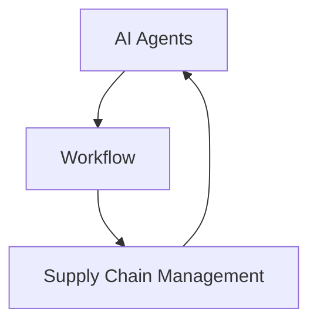

# AI人工智能代理工作流AI Agent WorkFlow：AI代理在供应链管理中的创新运用

作者：禅与计算机程序设计艺术 / Zen and the Art of Computer Programming 

关键词：AI代理、工作流、供应链管理、人工智能、自动化、优化

## 1. 背景介绍

### 1.1 问题的由来

随着全球化进程的加快和市场竞争的日益激烈,供应链管理(Supply Chain Management, SCM)在现代企业运营中的重要性日益凸显。供应链涉及从原材料采购、生产制造到产品交付客户的全过程,其复杂性和不确定性给企业带来了巨大挑战。传统的供应链管理模式难以适应快速变化的市场需求,亟需引入创新技术来提升供应链的敏捷性、柔性和智能化水平。人工智能(Artificial Intelligence, AI)作为一种变革性技术,为供应链管理带来了新的机遇。

### 1.2 研究现状

近年来,国内外学者围绕AI在供应链管理中的应用展开了广泛研究。一些学者提出了智能供应链的概念,探讨了AI赋能供应链转型的路径[1]。另一些学者聚焦AI在供应链各环节的应用,如需求预测[2]、库存优化[3]、物流配送[4]等。还有学者关注AI支持下的供应链协同与集成问题[5]。总的来说,现有研究肯定了AI在供应链领域的应用前景,但对AI代理如何嵌入供应链工作流进行系统性优化的研究还比较欠缺。

### 1.3 研究意义

本文以AI代理为切入点,探索其在供应链管理工作流中的创新应用模式。AI代理作为一种智能化的软件实体,能够自主感知环境、分析决策并执行任务,有望突破传统供应链的瓶颈,实现端到端的流程自动化和优化。本研究对于推动供应链管理理论与实践的发展具有重要意义。一方面,引入AI代理工作流的理念,丰富了智能供应链的内涵;另一方面,围绕AI代理的应用展开系统设计,为供应链数字化转型提供了新思路。

### 1.4 本文结构

本文后续章节安排如下:第2部分阐述AI代理、工作流等核心概念;第3部分介绍AI代理工作流的核心算法原理;第4部分建立AI代理嵌入供应链管理的数学模型;第5部分给出项目实践案例;第6部分分析AI代理在供应链中的典型应用场景;第7部分推荐相关工具和资源;第8部分总结全文并展望未来;第9部分列举常见问题解答。

## 2. 核心概念与联系

为更好地理解AI代理工作流,有必要对几个核心概念进行界定。AI代理(Agent)是一种基于人工智能技术的自主实体,具备感知、推理、学习、执行等智能化能力[6]。它以"代理"的身份嵌入特定应用环境,代表人类或其他系统完成各类任务。工作流(Workflow)是对业务流程的抽象建模,明确定义一系列活动任务的执行次序与条件[7]。将AI代理引入工作流系统,就形成了AI代理工作流。在该工作流中,AI代理作为流程参与者,与人类角色协同完成端到端的业务流程。供应链管理是对企业内外部资源的计划、组织、协调与控制,目的是提高供应链整体绩效[8]。引入AI代理工作流,有助于打通供应链各环节,实现全流程的自动化和智能化管理。

综上,AI、工作流、供应链管理三者紧密相连(如图1所示)。AI代理作为使能技术,嵌入工作流模型参与流程编排与执行,赋能供应链管理流程优化与再造,推动供应链数字化转型和智能化升级。

图1 AI、工作流、供应链管理的关系

## 3. 核心算法原理 & 具体操作步骤

### 3.1 算法原理概述

AI代理工作流的核心是工作流建模与AI代理设计。在工作流建模方面,主要采用面向活动的建模方法,使用UML活动图、Petri网等工具对流程及其活动进行形式化描述[9]。在AI代理设计方面,主要采用多Agent系统(Multi-Agent System, MAS)范式,定义Agent的组织结构、交互协议、行为规则等[10]。此外,还需考虑AI代理的内部机理,如知识表示、推理决策、机器学习等。

### 3.2 算法步骤详解

构建AI代理工作流的一般步骤如下:

(1) 业务流程分析。全面梳理供应链业务流程,识别关键活动、参与角色、信息流动等,形成流程参考模型。

(2) 工作流建模。选择合适的建模语言(如BPMN、UML等),对业务流程进行结构化建模,定义活动、网关、事件等工作流元素。

(3) AI代理识别。从工作流模型中识别可由AI代理执行的自动化活动,明确AI代理的职责边界。

(4) AI代理设计。采用MAS方法对AI代理进行详细设计,定义代理的感知、决策、执行等内部机制,建立代理间的协作机制。

(5) 工作流重构。将AI代理嵌入原有工作流,形成人机协同的新型工作流模型。

(6) 系统实现。选择合适的工作流引擎和AI平台,开发AI代理工作流系统原型。

(7) 测试与优化。在仿真或真实环境中测试AI代理工作流,评估其有效性,并根据反馈结果进行优化。

### 3.3 算法优缺点

AI代理工作流的优点在于:

(1) 提高流程自动化水平,减少人工干预;

(2) 优化流程绩效,缩短流程周期,提升效率;

(3) 增强流程适应性,快速响应需求变化;

(4) 赋能业务创新,催生新型业务模式。

但该方法也存在一些局限:

(1) 技术门槛高,对AI、工作流等技术要求较高;

(2) 应用场景有限,当前主要局限于结构化流程;

(3) 模型泛化能力不足,流程变更时需要重新建模;

(4) 缺乏成熟的开发工具和平台支撑。

### 3.4 算法应用领域

AI代理工作流在供应链各环节都有广阔应用空间,如:

(1) 需求预测。构建智能需求预测代理,结合历史数据和外部信息,动态预测市场需求。

(2) 采购管理。构建采购代理,自动完成供应商选择、询价、下单、跟踪等工作。

(3) 生产调度。构建生产调度代理,优化生产计划、平衡产能负荷、监控生产过程。

(4) 库存管理。构建库存代理,动态优化安全库存、补货策略,减少库存积压和短缺。

(5) 物流配送。构建配送代理,寻优配送路径,提高配送效率和客户满意度。

## 4. 数学模型和公式 & 详细讲解 & 举例说明

### 4.1 数学模型构建

为分析AI代理工作流的效用,构建如下数学模型。假设某供应链由 $N$ 个节点(如供应商、制造商、分销商等)组成,每个节点内部由若干AI代理协作完成业务流程。定义AI代理工作流的效用函数为:

$$
U = \sum_{i=1}^{N} \sum_{j=1}^{M_i} \omega_{ij} f_{ij}(x_{ij}) 
$$

其中, $U$ 表示整个供应链的AI代理工作流效用; $N$ 为供应链节点数; $M_i$ 为节点 $i$ 内的AI代理数; $\omega_{ij}$ 为节点 $i$ 内代理 $j$ 的重要性权重; $f_{ij}$ 为节点 $i$ 内代理 $j$ 的效用函数,表征代理完成任务的质量; $x_{ij}$ 为节点 $i$ 内代理 $j$ 的行为策略。

假设每个代理可选择 $K$ 种行为策略,则优化目标为寻找一组策略 $\{x_{ij}^*\}$ 使整体效用最大化,即:

$$
\max U = \max \sum_{i=1}^{N} \sum_{j=1}^{M_i} \omega_{ij} f_{ij}(x_{ij}) \\
\text{s.t.} \quad x_{ij} \in \{x_1, x_2, \dots, x_K\}, \forall i,j
$$

### 4.2 公式推导过程

为求解上述优化问题,采用分布式强化学习方法。每个代理作为一个学习智能体,通过不断与环境交互,调整自身策略,使全局效用最大化。其学习过程可用Q学习算法描述:

$$
Q(s_t,a_t) \leftarrow Q(s_t,a_t) + \alpha [r_{t+1} + \gamma \max_a Q(s_{t+1},a) - Q(s_t,a_t)]
$$

其中, $Q(s,a)$ 为状态-行为值函数,表示在状态 $s$ 下选择行为 $a$ 的长期累积回报; $s_t$ 为t时刻代理所处状态; $a_t$ 为t时刻代理选择的行为; $r_{t+1}$ 为采取行为 $a_t$ 后获得的即时回报; $\alpha$ 为学习率; $\gamma$ 为折扣因子。

当所有代理的策略学习收敛后,即可得到全局最优的工作流效用。收敛条件为:

$$
\left\lVert Q_{t+1} - Q_t \right\rVert < \varepsilon
$$

其中, $\varepsilon$ 为一个小的正数,表示Q值函数的变化阈值。

### 4.3 案例分析与讲解

下面以一个简单的两节点供应链为例,说明AI代理工作流优化的过程。如图2所示,供应商S和制造商M各自拥有两个AI代理,分别负责采购和生产任务。假设每个代理可选择高质量(H)和低质量(L)两种策略,效用函数如表1所示。

图2 两节点供应链示意图

表1 效用函数设置

| 节点 | 代理 | 策略 | 效用函数 |
|:----:|:----:|:----:|:--------:|
| S    | 1    | H    | $f_{11}(H)=2$|
|      |      | L    | $f_{11}(L)=1$|
|      | 2    | H    | $f_{12}(H)=3$|
|      |      | L    | $f_{12}(L)=1$|
| M    | 1    | H    | $f_{21}(H)=3$|
|      |      | L    | $f_{21}(L)=2$|
|      | 2    | H    | $f_{22}(H)=2$|
|      |      | L    | $f_{22}(L)=1$|

假设各代理初始策略随机选择,权重 $\omega_{ij}=0.5$,学习率 $\alpha=0.1$,折扣因子 $\gamma=0.9$,变化阈值 $\varepsilon=0.01$。根据Q学习算法,各代理与环境不断交互,更新自身策略,经过多轮迭代后,收敛到全局最优策略组合 $\{H,H,H,H\}$,此时整体工作流效用达到最大值 $U^*=5$。

这个简单例子表明,通过AI代理的分布式学习,供应链工作流能够实现自适应优化,收敛到全局最优状态。在实际应用中,供应链规模和复杂度远超示例,但核心思想是一致的,即将AI代理嵌入工作流,通过智能化的建模优化技术,提升供应链整体绩效。

### 4.4 常见问题解答

(1) 问:AI代理工作流优化的本质是什么?

答:本质上是一个多智能体协作优化问题,目标是寻找代理的最优行为策略组