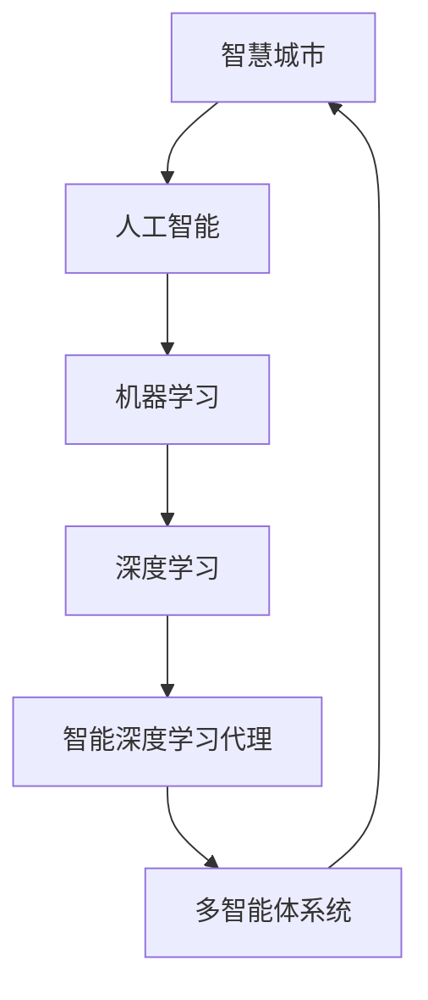

# AI人工智能深度学习算法：智能深度学习代理在智慧城市中的实践

作者：禅与计算机程序设计艺术 / Zen and the Art of Computer Programming 

关键词：人工智能, 深度学习, 智能代理, 智慧城市, 神经网络, 强化学习, 迁移学习, 多智能体系统

## 1. 背景介绍

### 1.1 问题的由来

随着城市化进程的不断加快,城市规模的不断扩大,城市管理和服务面临着前所未有的挑战。传统的城市管理模式已经无法满足现代化城市的需求,迫切需要引入新的技术和理念来提升城市管理和服务的智能化水平。人工智能技术的飞速发展为解决这一问题提供了新的思路和方法。将人工智能技术应用于城市管理和服务,构建智慧城市,已成为全球范围内的热点话题。

### 1.2 研究现状

目前,国内外学者在智慧城市和人工智能领域已经开展了大量卓有成效的研究工作。一方面,研究者们探索了人工智能技术在智慧城市各个领域的应用,如交通管理[1]、环境监测[2]、公共安全[3]、医疗健康[4]等,取得了显著成果。另一方面,研究者们还致力于研发先进的人工智能算法和模型,如深度学习[5]、强化学习[6]、迁移学习[7]等,极大地提升了人工智能系统的性能。

### 1.3 研究意义

将人工智能深度学习算法应用于智慧城市建设,对于提升城市管理和服务水平,改善市民生活质量,促进城市可持续发展具有重要意义。一方面,智能深度学习代理能够高效处理海量城市数据,及时发现并解决城市运行中的各种问题,极大提升了城市管理的效率和精准度。另一方面,智能代理还可以与人类智慧协同工作,为城市管理者提供辅助决策支持,促进人机协同,开创智慧城市建设的新局面。

### 1.4 本文结构

本文将重点探讨人工智能深度学习算法在智慧城市中的应用实践。第2节介绍相关的核心概念;第3节重点阐述智能深度学习代理的核心算法原理;第4节建立算法的数学模型并给出推导过程;第5节通过代码实例演示算法的具体实现;第6节分析算法在智慧城市各领域的应用场景;第7节推荐相关工具和学习资源;第8节总结全文并展望未来;第9节列举常见问题解答。

## 2. 核心概念与联系

智慧城市是指充分运用现代科学技术,将人、机、物等城市要素进行系统集成和优化调度,实现城市智能感知、分析、决策和执行,最终建成一个高效、和谐、宜居的现代化城市[8]。其核心理念是通过人工智能、大数据、云计算、物联网等新一代信息技术的应用,提升城市管理和服务的智能化水平,改善市民生活品质。

人工智能是智慧城市的核心支撑技术之一。它主要研究如何让机器像人一样思考和行动,赋予机器智能[9]。其中,深度学习是当前人工智能领域最前沿、最有潜力的技术之一。它模仿人脑神经网络结构,构建多层次的机器学习模型,能够从海量复杂数据中自主学习提取高层特征,具有强大的感知、理解、决策和优化能力[5]。将深度学习算法应用于智慧城市,可以研发出一系列智能深度学习代理,它们能够自主感知城市环境,分析城市问题,提供智能决策,协助城市管理,为智慧城市建设提供源源不断的智力支持。

智能代理(Intelligent Agent)是人工智能领域的一个重要概念,它是一个可以感知环境并采取行动以实现目标的自治实体[10]。智能深度学习代理集成了深度学习、强化学习、迁移学习等多种人工智能技术,具有更强大的感知、决策和学习能力。当多个智能代理互联协作时,就构成了一个多智能体系统,能够解决更加复杂的问题[11]。在智慧城市场景中,分布式的智能代理网络可以实时监测城市状态,及时响应突发事件,协同调度城市资源,优化城市系统,使城市运行更加智能高效。

下图展示了智慧城市、人工智能、深度学习、智能代理等核心概念之间的关系:

## 3. 核心算法原理 & 具体操作步骤

### 3.1 算法原理概述

智能深度学习代理的核心算法主要包括深度神经网络(DNN)、深度强化学习(DRL)、深度迁移学习(DTL)等。

DNN通过构建多层神经网络,逐层提取数据特征,实现了复杂模式的识别和预测[5]。DRL则将深度学习和强化学习相结合,通过不断与环境交互,学习最优控制策略,实现端到端的决策优化[6]。DTL利用已学习的知识,加速新任务的学习,提高模型的泛化能力[7]。将这些算法集成应用,可以赋予智能代理更全面的感知、决策和学习能力。

### 3.2 算法步骤详解

智能深度学习代理的主要工作流程如下:

1. 感知:通过深度神经网络感知和理解城市环境状态,提取关键特征。
2. 分析:利用深度学习模型对感知数据进行分析,发现潜在问题和优化机会。 
3. 决策:结合深度强化学习算法,自主学习和优化决策控制策略。
4. 执行:根据决策结果,协同调度相关资源,优化城市系统和服务。
5. 迁移:利用深度迁移学习,将学习经验迁移到新的任务和场景中,加速学习。
6. 反馈:根据执行效果反馈,不断改进感知、分析、决策和执行模型。

其中,在感知和分析阶段,主要采用的是DNN算法。以卷积神经网络(CNN)为例,它通过局部连接和权值共享,提取数据的空间特征,适合处理图像、视频等数据[12]。其主要步骤包括:

1. 输入层:接收原始数据(如图像)。
2. 卷积层:通过卷积核提取局部特征,生成特征图。
3. 池化层:通过下采样操作,压缩特征图尺寸。
4. 全连接层:将特征图展平,生成特征向量。 
5. 输出层:通过Softmax等激活函数,输出分类或预测结果。

在决策阶段,主要采用的是DRL算法。以深度Q网络(DQN)为例,它将Q学习和DNN相结合,逼近最优Q函数,实现策略优化[13]。其主要步骤包括:

1. 状态输入:将环境状态输入DNN。
2. Q值估计:通过DNN拟合Q函数,估计各动作的Q值。 
3. 动作选择:根据Q值选择最优动作(如 ε-贪婪策略)。
4. 环境交互:执行动作,获得即时奖励和下一状态。
5. 经验存储:将状态转移样本存入经验回放池。
6. 网络更新:从经验池中随机抽取小批量样本,计算Q学习目标值,更新DNN参数。

上述过程不断迭代,直到策略收敛。

### 3.3 算法优缺点

智能深度学习代理算法的主要优点包括:

1. 端到端学习:无需人工设计特征,自动学习高层特征表示。
2. 非线性建模:可以拟合任意复杂的非线性函数。
3. 自主优化:通过不断试错,自主学习最优策略。
4. 泛化能力:可迁移学习经验,快速适应新环境。

其主要缺点包括:  

1. 数据依赖:需要大量高质量数据进行训练。
2. 计算开销大:模型训练和推理需要大量计算资源。
3. 可解释性差:模型内部决策过程不透明,难以解释。
4. 稳定性不足:模型性能受超参数影响大,训练不稳定。

### 3.4 算法应用领域

智能深度学习代理算法在智慧城市的主要应用领域包括:

1. 智慧交通:交通流量预测与调度,自动驾驶等。
2. 智慧安防:异常行为检测,犯罪预防等。
3. 智慧环保:污染监测与预警,环境治理优化等。
4. 智慧医疗:疾病诊断与预测,医疗资源优化配置等。
5. 智慧能源:能耗预测与优化,智能电网调度等。
6. 智慧政务:政务流程优化,辅助科学决策等。

## 4. 数学模型和公式 & 详细讲解 & 举例说明

### 4.1 数学模型构建

以下以DQN算法为例,介绍智能深度学习代理的关键数学模型。

1. 马尔可夫决策过程(MDP)

智能代理与环境的交互可以用MDP来建模,其核心要素包括:

- 状态空间 $\mathcal{S}$:所有可能的环境状态集合。
- 动作空间 $\mathcal{A}$:智能体可执行的所有动作集合。
- 状态转移概率 $\mathcal{P}$:在状态 $s$ 下执行动作 $a$ 后,转移到状态 $s'$ 的概率 $p(s'|s,a)$。 
- 奖励函数 $\mathcal{R}$:在状态 $s$ 下执行动作 $a$ 后,获得的即时奖励 $r(s,a)$。
- 折扣因子 $\gamma$:未来奖励的衰减率,$\gamma \in [0,1]$。

MDP的目标是寻找一个最优策略 $\pi^*$,使得智能体在所有状态下的期望累积奖励最大化:

$$\pi^* = \arg\max_{\pi} \mathbb{E}\left[\sum_{t=0}^{\infty} \gamma^t r_t | \pi \right]$$

其中,$r_t$ 表示在时刻 $t$ 获得的奖励。

2. Q函数与贝尔曼方程

Q函数 $Q(s,a)$ 表示在状态 $s$ 下执行动作 $a$ 的期望累积奖励:

$$Q(s,a) = \mathbb{E}\left[\sum_{t=0}^{\infty} \gamma^t r_t | s_0=s, a_0=a, \pi \right]$$

根据贝尔曼方程,Q函数满足如下递推关系:

$$Q(s,a) = \mathbb{E}_{s'\sim p(·|s,a)}[r(s,a) + \gamma \max_{a'} Q(s',a')]$$

即当前状态-动作对的Q值等于即时奖励与下一状态最大Q值的折扣和。

3. 深度Q网络

DQN使用深度神经网络 $Q_{\theta}(s,a)$ 来逼近Q函数,其中 $\theta$ 为网络参数。网络的输入为状态 $s$,输出为各动作的Q值估计 $Q_{\theta}(s,\cdot)$。

网络训练采用时序差分(TD)算法,最小化如下损失函数:

$$\mathcal{L}(\theta) = \mathbb{E}_{(s,a,r,s')\sim \mathcal{D}} \left[ (y - Q_{\theta}(s,a))^2 \right]$$

其中,$\mathcal{D}$ 为经验回放池,$y$ 为TD目标:

$$y = r + \gamma \max_{a'} Q_{\theta^-}(s',a')$$

这里的 $Q_{\theta^-}$ 为目标网络,其参数 $\theta^-$ 定期从在线网络 $\theta$ 复制得到,以提高训练稳定性。

### 4.2 公式推导过程

下面推导DQN算法的核心公式。

1. Q函数的贝尔曼最优方程:

$$\begin{aligned}
Q^*(s,