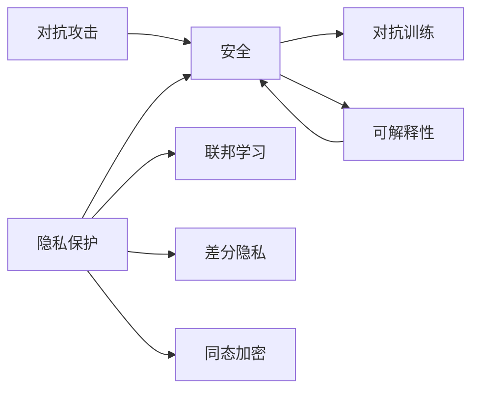

# AI人工智能深度学习算法：深度学习代理的安全与隐私保护

作者：禅与计算机程序设计艺术 / Zen and the Art of Computer Programming

关键词：深度学习、人工智能、安全、隐私保护、联邦学习、差分隐私、同态加密、对抗攻击

## 1. 背景介绍

### 1.1 问题的由来

随着人工智能技术的飞速发展，深度学习算法在各个领域得到广泛应用，如计算机视觉、自然语言处理、语音识别等。深度学习模型通过海量数据的训练，能够自动学习数据中蕴含的特征，从而完成复杂的感知和决策任务。

然而，深度学习算法在给我们生活带来便利的同时，也引发了一系列安全和隐私问题。由于深度学习模型需要大量的训练数据，这些数据往往包含了用户的敏感信息，如个人身份、生物特征、行为偏好等。如果这些数据在收集、传输、存储或使用的过程中被恶意窃取或滥用，将严重威胁用户的隐私安全。

此外，深度学习模型自身也面临着各种安全威胁。恶意攻击者可以通过数据投毒、模型窃取、对抗样本等手段，影响模型的决策行为，甚至完全控制模型，给个人和社会带来难以估量的危害。

### 1.2 研究现状

针对深度学习中的安全与隐私问题，学术界和工业界都在积极开展研究，并取得了一定的进展。

在数据隐私保护方面，目前主要有以下几种技术方案：

1. 联邦学习(Federated Learning)：通过在本地设备上训练模型，只上传模型参数而不上传原始数据，避免数据的集中存储和外泄。代表工作有Google提出的FederatedAveraging算法[1]。

2. 差分隐私(Differential Privacy)：通过在数据或模型中加入随机噪声，使得单个样本对模型输出的影响受限，从而保护个体隐私。代表工作有Abadi等人提出的DP-SGD算法[2]。  

3. 同态加密(Homomorphic Encryption)：允许在加密数据上直接执行计算，获得加密的计算结果，避免了隐私数据的明文暴露。代表工作有微软的CryptoNets[3]。

在模型安全方面，主要采取的措施包括：

1. 对抗训练(Adversarial Training)：通过引入对抗样本增强模型的鲁棒性，提高模型抵御对抗攻击的能力。代表工作有Goodfellow提出的FGSM方法[4]。

2. 模型加固(Model Hardening)：在模型训练过程中加入正则化项，惩罚异常的梯度变化，增强模型的稳定性。代表工作有Papernot的Distillation方法[5]。

3. 可解释性(Interpretability)：通过分析模型内部机制，构建人类可理解的解释，帮助识别模型的异常和错误。代表工作有LIME和SHAP等[6]。

尽管上述研究在一定程度上缓解了深度学习的安全隐私问题，但依然存在不足：如联邦学习面临通信开销大、差分隐私噪声影响效果、同态加密计算效率低等挑战。对抗攻防也是一个动态博弈过程。因此，深度学习安全隐私保护仍是一个亟需攻克的难题。

### 1.3 研究意义

深度学习代理的安全与隐私保护研究具有重要意义：

1. 保护个人隐私：避免用户隐私数据被违规收集、存储、传输和滥用，维护个人信息安全。

2. 保障系统安全：防止深度学习系统被恶意攻击、操纵和控制，导致决策错误，危及人身和财产安全。

3. 促进技术发展：增强公众对AI技术的信任，消除顾虑，为深度学习的进一步发展和应用扫清障碍。

4. 完善法律法规：推动隐私保护和数据安全方面的法律法规建设，为AI时代未来发展提供制度保障。

### 1.4 本文结构

本文将围绕深度学习代理的安全与隐私保护展开，内容涵盖以下几个部分：

第2节介绍相关的核心概念，厘清它们之间的联系。

第3节重点阐述几种主流的隐私保护算法，包括联邦学习、差分隐私和同态加密的基本原理和步骤。

第4节建立隐私保护的数学模型，推导相关公式，并结合案例进行分析讲解。

第5节通过代码实例，演示如何实现这些隐私保护算法，并对代码进行解读。

第6节分析隐私保护技术在实际场景中的应用现状和未来前景。

第7节推荐隐私保护领域的学习资源、开发工具、重要文献等。

第8节总结全文，展望未来发展趋势和面临的挑战。

第9节附录，解答一些常见问题。

## 2. 核心概念与联系

在深度学习的安全与隐私保护领域，有几个核心概念需要理清：

- 隐私(Privacy)：个人信息不被他人非法获取、持有和使用的权利。在深度学习中，主要指训练数据和用户画像等敏感信息。

- 安全(Security)：系统免受恶意攻击和破坏，保持正常运行的属性。在深度学习中，主要指模型鲁棒性和抗攻击能力。

- 联邦学习(Federated Learning)：一种分布式机器学习范式，允许多个主体在本地训练模型，只共享模型参数，而无需上传原始数据，从而保护数据隐私。

- 差分隐私(Differential Privacy)：一种隐私保护机制，通过在数据发布或分析时引入随机噪声，限制敏感信息的泄露，保证个体隐私不会从数据集的变化中被识别出来。

- 同态加密(Homomorphic Encryption)：一种特殊的加密方案，允许直接在密文上进行计算，获得加密后的计算结果，无需解密原始数据，从而保护数据隐私。

- 对抗攻击(Adversarial Attack)：一种针对机器学习模型的攻击手段，通过细微地修改输入数据，误导模型做出错误判断，从而危害系统安全。

- 对抗训练(Adversarial Training)：一种增强模型鲁棒性的方法，将对抗样本引入训练过程，提高模型抵御对抗攻击的能力。

- 可解释性(Interpretability)：使机器学习模型的决策过程对人类可理解、可解释的属性。可解释性有助于识别模型的异常和错误，提高模型的可信度。

这些概念之间有着紧密的联系。隐私保护是安全的重要组成部分，而联邦学习、差分隐私、同态加密等是保护隐私的具体技术手段。对抗攻击威胁着模型安全，需要采取对抗训练等措施来增强模型鲁棒性。可解释性则是实现可信AI的关键，它与隐私保护和安全都有交叉。

下图展示了这些概念之间的关系：

总的来说，隐私保护、安全和可解释性是构建可信AI系统的三大支柱，它们相辅相成，缺一不可。联邦学习、差分隐私、同态加密、对抗训练等技术则是实现这一目标的有力工具。

## 3. 核心算法原理 & 具体操作步骤

本节将重点介绍几种主流的隐私保护算法的基本原理和具体步骤，包括联邦学习、差分隐私和同态加密。

### 3.1 算法原理概述

#### 3.1.1 联邦学习

联邦学习(Federated Learning, FL)是一种分布式机器学习范式，它允许多个参与方在本地设备上训练模型，只需共享模型参数，而无需上传原始数据[1]。这种去中心化的学习方式可以有效保护用户隐私，避免敏感数据外泄。

联邦学习的核心思想是将模型训练任务分解到多个参与方，每个参与方在本地用自己的数据训练模型，得到局部模型参数，然后将这些局部参数上传到中央服务器进行聚合，得到全局模型参数，再将全局参数分发给各个参与方，进行下一轮本地训练。如此迭代，直到模型收敛。

#### 3.1.2 差分隐私

差分隐私(Differential Privacy, DP)是一种隐私保护机制，它通过在数据发布或分析时引入随机噪声，来限制敏感信息的泄露[2]。差分隐私确保了在相邻数据集(即只相差一条记录)上，模型的输出分布基本相同，从而保证了个体隐私不会从数据变化中被识别出来。

差分隐私的核心概念是隐私预算(Privacy Budget)，用 $\epsilon$ 表示。$\epsilon$ 衡量了隐私泄露的上限。$\epsilon$ 越小，隐私保护程度越高，但同时也意味着引入的噪声越大，数据效用降低。差分隐私机制的设计目标是在隐私保护和数据效用之间取得平衡。

#### 3.1.3 同态加密

同态加密(Homomorphic Encryption, HE)是一种特殊的加密方案，它允许直接在密文上进行计算，得到加密后的计算结果，而无需解密原始数据[3]。同态加密使得敏感数据可以在不泄露的情况下进行处理和分析，是隐私保护领域的重要工具。

同态加密主要分为部分同态加密(Partially HE)和全同态加密(Fully HE)。前者只支持有限的操作(如加法或乘法)，后者则支持任意复杂的计算。全同态加密的代表方案是基于格的加密体制，如BGV和CKKS方案。但目前全同态加密的计算效率还比较低。

### 3.2 算法步骤详解

#### 3.2.1 联邦学习算法步骤

以下是联邦学习的典型算法步骤[1]：

1. 初始化：在服务器端初始化全局模型参数 $w_0$，发送给所有客户端。

2. 本地训练：每个客户端 $k$ 在本地数据 $D_k$ 上，用全局参数 $w_t$ 训练模型，得到本地参数更新量 $\Delta w_t^k$：

$$\Delta w_t^k = \eta \nabla \mathcal{L}(w_t; D_k)$$

其中 $\eta$ 是学习率，$\mathcal{L}$ 是损失函数，$\nabla$ 是梯度算子。

3. 参数上传：客户端将本地参数更新量 $\Delta w_t^k$ 上传到服务器。

4. 参数聚合：服务器收集所有客户端的参数更新量，取平均值得到全局参数更新量 $\Delta w_t$：

$$\Delta w_t = \frac{1}{K} \sum_{k=1}^K \Delta w_t^k$$

其中 $K$ 是客户端总数。

5. 参数更新：服务器用全局参数更新量 $\Delta w_t$ 更新全局模型参数：

$$w_{t+1} = w_t + \Delta w_t$$

6. 参数分发：服务器将更新后的全局参数 $w_{t+1}$ 分发给所有客户端。

7. 迭代：重复步骤2-6，直到模型收敛或达到预设轮数。

#### 3.2.2 差分隐私算法步骤

以下是差分隐私随机梯度下降(DP-SGD)算法的典型步骤[2]：

1. 梯度计算：对于每个训练样本 $x_i$，计算其梯度 $g_i=\nabla_w \mathcal{L}(w; x_i)$。

2. 梯度修剪：对每个梯度进行 $l_2$ 范数修剪，限制其大小不超过阈值 $C$：

$$\bar{g}_i = g_i / \max(1