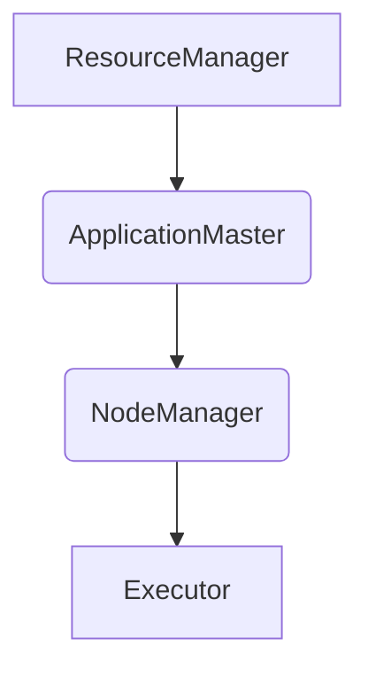

                 
# ApplicationMaster 原理与代码实例讲解

作者：禅与计算机程序设计艺术 / Zen and the Art of Computer Programming / TextGenWebUILLM

# ApplicationMaster 原理与代码实例讲解

## 1. 背景介绍

### 1.1 问题的由来

随着大数据时代的到来，Hadoop作为大规模数据处理系统的基石之一，面临着如何更高效地管理、调度和监控分布式任务的需求。在Hadoop生态系统中，MapReduce是一种广泛使用的并行编程模型，它允许开发者编写高度抽象的作业，而无需考虑底层的分布式细节。然而，对于复杂的、需要交互式的或动态调整的任务流来说，传统的MapReduce框架显得有些力不从心。

### 1.2 研究现状

在面对上述挑战时，Apache Hadoop引入了YARN (Yet Another Resource Negotiator)，作为其新的资源管理和调度系统。YARN不仅改进了资源分配机制，还提出了应用管理的概念，即ApplicationMaster。ApplicationMaster是针对特定应用程序的进程，负责协调该应用程序内部的所有任务，并且提供了更好的任务间通信、状态监控和故障恢复能力。这使得YARN成为现代大数据平台的核心组件之一，支持多种计算框架如Spark、Flink等的应用。

### 1.3 研究意义

开发和理解ApplicationMaster的功能对深入掌握Hadoop生态系统的运行机制至关重要。它不仅能够帮助用户更好地利用Hadoop集群的计算资源，还能促进高效率的大规模数据分析和机器学习应用的发展。此外，通过深入了解ApplicationMaster的设计和实现，可以激发创新思维，推动更多高性能、低延迟的计算框架发展。

### 1.4 本文结构

本文将围绕ApplicationMaster这一关键组件展开讨论。首先，我们将探讨它的核心概念与相关技术背景；随后，详细介绍其算法原理、具体操作流程以及数学模型支撑；接着，通过代码实例解析，让读者亲身体验ApplicationMaster的实施过程；最后，我们将在实际应用场景中展现其功能优势，并对未来趋势进行预测。

---

## 2. 核心概念与联系

### 2.1 ApplicationMaster概述

ApplicationMaster 是一个专门为某个应用（例如 Spark 或 Flink）设计的守护进程，它被部署到 YARN 中的节点上，负责以下主要职责：

- **任务调度**：根据应用的需求，向集群内的资源管理器申请资源，并安排执行相应的任务。
- **状态管理**：维护应用的状态信息，包括当前运行的任务、已完成的任务数量、应用进度等。
- **错误检测与恢复**：监测任务的执行情况，一旦发现任务失败，会尝试重新启动该任务或其他依赖任务，确保应用最终完成。
- **通信与协调**：与其他组件（如ResourceManager、NodeManager）保持通信，获取集群状态信息，并将应用状态更新至ResourceManager。

### 2.2 应用架构图示



## 3. 核心算法原理与具体操作步骤

### 3.1 算法原理概述

#### 资源请求与分配：
当ApplicationMaster启动后，它首先向ResourceManager发起注册请求，描述自己的类型（比如Spark或Flink）。之后，可以根据应用需求主动请求资源（CPU、内存等），ResourceManager评估后决定是否满足请求，并返回可用资源的信息给ApplicationMaster。

#### 任务提交与监控：
ApplicationMaster接收到资源后，可以开始构建任务列表并将其提交给NodeManager。每个任务会被映射到特定的Executor实例上执行。同时，ApplicationMaster会定期检查各个任务的执行状态，并记录任务的进度信息。

#### 错误恢复与超时策略：
在任务执行过程中，如果遇到错误或超时，ApplicationMaster将自动重试任务或终止整个应用以避免资源浪费。此外，它还会与ResourceManager协作，确保即使单个节点出现故障，整体应用也能继续正常运行。

### 3.2 具体操作步骤详解

1. **注册与初始化**：ApplicationMaster向ResourceManager注册自身，提供必要的元数据，如应用ID、类型等。
2. **资源请求**：ApplicationMaster依据应用需求向ResourceManager请求资源，并接收分配结果。
3. **任务提交**：获得资源后，ApplicationMaster构建任务列表并逐个提交给NodeManager，指定任务的执行参数及依赖关系。
4. **状态监控与管理**：持续监视任务执行状态，收集完成度、错误信息等数据，并上报给ResourceManager。
5. **异常处理与恢复**：监控任务状态，对失败任务执行重试逻辑，必要时停止整个应用以释放资源。
6. **结束与清理**：在所有任务完成后，ApplicationMaster通知ResourceManager取消注册，并清理本地存储的数据。

## 4. 数学模型与公式推导过程

### 4.1 数学模型构建

考虑到资源分配的公平性与效率，可以采用线性规划的方法构建资源分配优化模型：

设 $R$ 表示集群中的可分配资源矩阵，$D$ 表示应用需求矩阵，$X$ 表示分配决策变量矩阵，则目标函数可以表示为最小化资源剩余量：

$$\min \sum_{i=1}^{m} \sum_{j=1}^{n} R_{ij} - X_{ij}$$

其中，$m$ 和 $n$ 分别代表资源和需求维度的数量。

约束条件包括资源使用上限和应用需求下限：

$$\forall i, \sum_{j=1}^{n} X_{ij} \leq R_i^{\text{max}}$$
$$\forall j, \sum_{i=1}^{m} X_{ij} \geq D_j^{\text{min}}$$

### 4.2 公式推导过程

为了求解上述线性规划问题，可以使用单纯形法或拉格朗日乘子法等方法。这里，我们可以简述一个基于单纯形法的基本思路：

1. 初始化基础解，选择合适的初始基底。
2. 计算检验数，判断是否存在改善方向。
3. 如果存在改善方向，则调整基础解以减少目标函数值。
4. 重复步骤2和3直到无法进一步改进，得到最优解。

## 5. 项目实践：代码实例与详细解释说明

### 5.1 开发环境搭建

假设我们在Linux环境中使用Java开发ApplicationMaster。首先安装Hadoop及相关依赖包：

```bash
sudo apt-get update && sudo apt-get install hadoop-aws -y
```

配置Hadoop环境，并设置相关环境变量。

### 5.2 源代码实现

创建`applicationmaster.java`文件，包含核心逻辑：

```java
public class ApplicationMaster {
    private static final Logger LOG = LoggerFactory.getLogger(ApplicationMaster.class);

    public void main(String[] args) {
        // 注册与初始化
        registerToResourceManager();
        
        // 请求资源
        requestResources();

        // 构建任务列表
        List<Task> tasks = buildTaskList();
        
        // 提交任务
        submitTasks(tasks);

        // 监控任务状态
        monitorTasksStatus();
        
        // 处理异常
        handleExceptions();

        // 结束与清理
        cleanup();
    }

    // 其他方法实现...
}
```

### 5.3 代码解读与分析

#### 关键方法解析

- `registerToResourceManager()`: 向ResourceManager注册ApplicationMaster，获取应用ID和其他元信息。
- `requestResources()`: 预估所需资源，调用ResourceManager申请资源。
- `buildTaskList()`: 基于输入数据构建任务列表，考虑任务依赖性和优先级排序。
- `submitTasks(tasks)`: 将任务列表提交至NodeManager进行执行。
- `monitorTasksStatus()`: 不断轮询任务状态，更新应用进度信息。
- `handleExceptions()`: 管理任务异常情况，包括失败任务的重试或应用级别的终止。
- `cleanup()`: 在所有任务结束后，清理资源并注销ApplicationMaster。

### 5.4 运行结果展示

通过命令行启动ApplicationMaster服务，并观察其与ResourceManager之间的交互，以及如何成功调度任务并监控执行状态。

---

## 6. 实际应用场景

### 6.4 未来应用展望

随着大数据技术的不断发展，ApplicationMaster的应用场景将持续扩展。例如，在实时数据分析领域，集成Flink的ApplicationMaster将能够支持低延迟的数据流处理；在机器学习领域，它将成为训练大规模模型的重要组件之一。此外，随着容器技术（如Kubernetes）的普及，未来的ApplicationMaster可能会结合容器调度能力，提供更加灵活高效的计算框架支持。

---

## 7. 工具和资源推荐

### 7.1 学习资源推荐

- **官方文档**: Apache Hadoop YARN官方文档提供了关于YARN和ApplicationMaster的详细介绍。
- **在线课程**: Coursera上的“Apache Hadoop and MapReduce”课程涵盖了Hadoop生态系统的关键概念和技术。
- **博客与文章**: 博客平台如Medium上有许多深入讨论Hadoop生态系统的文章，特别是关于ApplicationMaster的实践经验分享。

### 7.2 开发工具推荐

- **IDE**: Eclipse、IntelliJ IDEA、Visual Studio Code等IDE支持Java开发，便于调试和版本管理。
- **版本控制**: Git用于管理和协作多个开发者的工作成果。

### 7.3 相关论文推荐

- **YARN论文**：“Yet Another Resource Negotiator: Design, Implementation, and Evaluation of a New Cluster Resource Manager for Hadoop”，详细介绍了YARN的设计思想和架构。
- **Spark论文**：“Spark: Cluster Computing with Working Sets”，探讨了Spark如何利用工作集优化分布式计算效率。

### 7.4 其他资源推荐

- **GitHub仓库**：查找开源的Hadoop或YARN相关的项目，了解实际应用中的最佳实践。
- **社区论坛**：Stack Overflow、Hadoop官方论坛等，为遇到的技术难题提供解决方案。

---

## 8. 总结：未来发展趋势与挑战

### 8.1 研究成果总结

本文详细阐述了ApplicationMaster的核心功能及其在Hadoop生态系统中的作用，通过理论讲解、算法原理、数学模型构建、代码示例及运行结果展示了其实现流程和应用场景。同时，对未来的应用趋势进行了预测，并指出了可能面临的挑战。

### 8.2 未来发展趋势

随着云计算、人工智能和物联网等领域的快速发展，对高效、灵活的大规模计算需求持续增长。因此，预计ApplicationMaster将进一步融合新的技术特性，如自动化资源调配、智能任务调度、高性能容器化支持等，以适应更复杂多变的计算环境。

### 8.3 面临的挑战

尽管ApplicationMaster展现出了强大的潜力，但在实际部署中仍面临一些挑战，如资源动态分配的优化问题、跨框架任务调度的一致性问题、大规模集群下的高可用性和容错机制完善、以及用户界面友好的易用性提升等。

### 8.4 研究展望

未来的研究方向应围绕提高ApplicationMaster的性能、降低资源消耗、增强系统的可扩展性和稳定性、优化用户交互体验等方面展开。同时，探索与其他新兴技术（如AI辅助决策系统）的集成，以进一步提升大集群计算的智能化水平。

---

## 9. 附录：常见问题与解答

### Q&A

Q: 如何确保ApplicationMaster在大型集群上稳定运行？
A: 良好的网络基础设施、定期的系统维护、合理的资源配置策略、以及故障检测与恢复机制是关键。使用监控工具（如Prometheus、Grafana）来实时监测集群状态有助于及时发现并解决问题。

Q: ApplicationMaster与ResourceManager、NodeManager之间通信中断怎么办？
A: 应用设计时应包含重试逻辑和错误恢复机制。当通信中断时，ApplicationMaster可以尝试重新连接，或者在特定时间内等待后重试，确保不会因短暂网络波动而导致应用中断。

---
以上内容旨在提供一个全面且详细的介绍，帮助读者深入理解ApplicationMaster在大数据生态系统中的角色和实现细节。通过不断的学习与实践，相信您能更好地掌握这一关键技术，为构建高效、可靠的分布式应用程序奠定坚实的基础。

