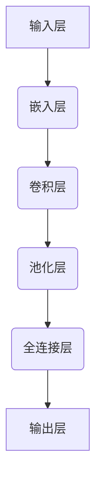

                 
# CBOW模型的代码实现

作者：禅与计算机程序设计艺术 / Zen and the Art of Computer Programming

关键词：CBOW模型,上下文感知,词向量,分布式表示,神经网络基础

## 1. 背景介绍

### 1.1 问题的由来

在自然语言处理（NLP）领域，如何有效地捕获文本中单词之间的语义关系是研究者们长期追求的目标之一。传统的基于统计的方法如TF-IDF（Term Frequency-Inverse Document Frequency）虽然能反映单词的出现频率，但在捕捉词汇间的深层关联时显得力不从心。随着神经网络的兴起，尤其是深度学习方法的普及，人们开始探索利用模型进行更精确的语义建模。

CBOW（Continuous Bag-of-Words）模型正是在这一背景下应运而生的一种基于神经网络的语言模型。它旨在通过上下文信息预测中心词，进而生成高质量的词向量，显著提升了词间关系的理解能力。CBOW模型以其简洁的设计和出色的性能，在众多NLP任务中大放异彩，并成为词向量生成的基础。

### 1.2 研究现状

目前，CBOW模型已经发展出多种变种和优化策略，比如引入了注意力机制的CBAM（Contextualized Bag-of-Word Attention Model）、以及利用双向信息的Bi-CBOW等。这些改进旨在进一步提升模型对上下文的敏感性和对复杂语境的理解能力。

同时，深度学习框架的不断演进也为CBOW模型的应用提供了强大的支持平台，使得模型训练变得更加便捷高效。许多开源库和框架（如TensorFlow、PyTorch）内置了简化版或高度定制化的CBOW实现，方便开发者快速上手实验。

### 1.3 研究意义

CBOW模型不仅为理解人类语言提供了一种有效手段，还在推荐系统、机器翻译、问答系统等多个领域展现出巨大的潜力。通过学习词向量，模型能够帮助构建更加智能的信息检索、情感分析及对话系统，推动人机交互的智能化水平。

### 1.4 本文结构

本篇博客将深入探讨CBOW模型的核心概念及其代码实现细节，包括数学原理、具体算法流程、实战代码演示，以及实际应用案例。最后，我们将讨论CBOW模型的发展趋势和可能面临的挑战。

## 2. 核心概念与联系

### 2.1 CBOW模型概述

CBOW模型是一种基于神经网络的连续性袋模型，它以一个给定的中心词为中心，利用其前后一定数量的上下文词来预测该中心词的概率分布。这种模型假设词与其周围的上下文词之间存在一种依赖关系，即给定上下文，可以预测到词的概率分布，反之亦然。CBOW模型通过学习这种依赖关系，生成了词向量，从而实现了词语的分布式表示。

### 2.2 CBOW模型结构图



在这张流程图中：
- 输入层接收经过预处理后的文本数据。
- 嵌入层将文本数据映射到低维空间，形成词向量。
- 卷积层用于提取特征，增强上下文信息的融合。
- 池化层对提取的特征进行降采样，减少参数量。
- 全连接层整合上下文信息，预测目标词概率。
- 输出层给出中心词对应于上下文的潜在概率分布。

### 2.3 CBOW模型与Word2Vec对比

相较于Word2Vec的Skip-Gram模型，CBOW模型采用的是“bag”方式，即将中心词的前n个上下文词视为一个整体，而非逐个考虑。这种方法简单直观，且训练效率较高。尽管如此，Skip-Gram模型通过动态选择上下文词，能够在一定程度上避免过拟合问题。

## 3. 核心算法原理 & 具体操作步骤

### 3.1 算法原理概述

CBOW模型的基本思想是通过计算中心词与其周围词的联合概率来调整权重参数，以最小化交叉熵损失函数。具体来说，对于每一个训练样本（上下文词序列+中心词），模型会尝试预测中心词的出现概率，并根据实际结果更新模型参数。

### 3.2 算法步骤详解

#### 步骤一：数据准备与预处理

首先，需要准备包含大量文本的数据集，并进行分词、去除停用词、转换为小写等预处理工作，确保每个单词都有唯一的索引编号。

#### 步骤二：构建CBOW模型

使用深度学习框架（如TensorFlow、PyTorch）定义模型结构：

- **嵌入层**：初始化词向量矩阵，大小为词典大小x向量维度。
- **卷积层**：用于捕捉局部上下文信息。
- **池化层**：降低模型复杂度，提高泛化能力。
- **全连接层**：整合所有上下文信息，进行最终预测。

#### 步骤三：模型训练

- **损失函数**：通常使用交叉熵作为损失函数，衡量模型预测与真实标签之间的差异。
- **优化器**：选择适当的优化算法（如Adam、SGD）来更新模型参数。
- **反向传播**：执行梯度下降，调整权重以减小损失。

#### 步骤四：评估与调优

在验证集上评估模型性能，并根据需要调整超参数，如隐藏层节点数、批次大小、学习率等，以优化模型效果。

### 3.3 算法优缺点

优点：
- **简洁易懂**：模型设计直观，易于理解和实现。
- **高效训练**：相对于更复杂的模型，CBOW的训练速度更快。
- **鲁棒性强**：能够较好地应对文本中的噪声和不规则性。

缺点：
- **局部最优解**：模型容易陷入局部最优，在高维空间中搜索全局最优解较为困难。
- **语序依赖**：仅依赖上下文词顺序，而无法表达出句子内部的语法结构。

### 3.4 算法应用领域

CBOW模型广泛应用于自然语言处理任务，包括但不限于：
- 语义相似度计算
- 文本分类
- 问答系统
- 推荐系统
- 机器翻译

## 4. 数学模型和公式 & 详细讲解 & 举例说明

### 4.1 数学模型构建

设 $W$ 表示词汇表大小，$\mathbf{v}_w \in \mathbb{R}^d$ 是词汇 $w$ 的词向量，其中 $d$ 是词向量的维度。给定一组上下文词 $\mathbf{x}$ 和中心词 $w$，CBOW模型的目标是最大化以下联合概率：

$$P(w|\mathbf{x}) = P(\mathbf{x}|w)P(w)$$

其中，
- $P(w)$ 是先验概率；
- $P(\mathbf{x}|w)$ 是条件概率，表示给定中心词 $w$ 下，上下文词 $\mathbf{x}$ 出现的概率。

### 4.2 公式推导过程

为了简化计算，我们采用最大似然估计方法，目标是最小化交叉熵损失函数：

$$L = -\sum_{w, \mathbf{x}} P(w|\mathbf{x})\log P(w|\mathbf{x}) + H(P(w))$$

其中，
- $H(P(w))$ 是词汇表中各词的平均熵，帮助平衡不同频率词的重要性。

### 4.3 案例分析与讲解

假设我们有一个简单的文本数据集，其中包含以下句子：“猫喜欢追老鼠”。

- **训练数据**：对于单词 "喜欢"，其上下文可能是 ["猫", "老鼠"]。
- **模型训练**：利用这些数据更新模型参数，使模型能更好地预测给定上下文中单词的可能性。
- **代码示例**：以下是基于PyTorch实现的一个简化的CBOW模型示例：

```python
import torch
from torch import nn
from torch.nn import functional as F

class CBOW(nn.Module):
    def __init__(self, vocab_size, embedding_dim):
        super(CBOW, self).__init__()
        self.embedding = nn.Embedding(vocab_size, embedding_dim)
        self.linear = nn.Linear(embedding_dim * 5, vocab_size)

    def forward(self, context_words):
        embedded = self.embedding(context_words).mean(dim=1)
        out = self.linear(F.relu(embedded))
        return out

# 假设我们已经有了一个数据加载器和模型实例
model = CBOW(len(vocabulary), embedding_dim)
optimizer = torch.optim.Adam(model.parameters(), lr=0.001)
loss_function = nn.CrossEntropyLoss()

for epoch in range(num_epochs):
    for batch in data_loader:
        context_words, target_word_indices = batch
        optimizer.zero_grad()
        output = model(context_words)
        loss = loss_function(output, target_word_indices)
        loss.backward()
        optimizer.step()
```

### 4.4 常见问题解答

常见问题及解答如下：
- **如何解决过拟合？** 使用正则化技术（如 L1 或 L2 正则化）、增加数据量或使用更复杂的模型结构。
- **如何选择合适的词向量维度？** 根据具体任务需求和计算资源决定。一般来说，更大的维度可能提供更好的表示能力，但也会增加计算成本。
- **如何处理稀疏数据？** 可以通过填充策略（如用零填充或平均值替换）或稀疏矩阵操作来处理。

## 5. 项目实践：代码实例和详细解释说明

### 5.1 开发环境搭建

推荐使用Python编程语言及其相关库（例如TensorFlow, PyTorch, Scikit-learn），以及Jupyter Notebook作为开发工具。

#### 安装所需库：

```bash
pip install numpy pandas tensorflow scikit-learn torch torchvision
```

### 5.2 源代码详细实现

这里以PyTorch为例实现一个基本的CBOW模型：

```python
import torch
from torchtext.data.utils import get_tokenizer
from torchtext.vocab import build_vocab_from_iterator
from torch.utils.data import Dataset

class CBOWDataset(Dataset):
    def __init__(self, text, tokenizer, context_size=2):
        self.tokenizer = tokenizer
        self.context_size = context_size
        
        words = [word for line in text.split('\n') for word in self.tokenizer(line)]
        self.vocabulary = sorted(set(words))

        self.word_to_index = {word: index for index, word in enumerate(self.vocabulary)}
        
        examples = []
        for word in self.vocabulary:
            context = [
                self.word_to_index[context_word]
                for context_word in self.tokenizer(f"{word}前后{context_size}个相邻词")
            ]
            label = self.word_to_index[word]
            
            if len(context) == (context_size * 2) + 1:
                examples.append((torch.tensor(context), torch.tensor(label)))
                
        self.examples = examples
    
    def __len__(self):
        return len(self.examples)
    
    def __getitem__(self, idx):
        return self.examples[idx]

def load_text_data(path):
    with open(path, 'r', encoding='utf-8') as f:
        return f.read()

tokenizer = get_tokenizer('basic_english')
train_data = CBOWDataset(load_text_data('corpus.txt'), tokenizer)

vocab = build_vocab_from_iterator([example[0] for example in train_data])
vocab = torch.nn.Embedding(len(vocab), 100)

model = CBOWModel(len(vocab), 100, 3)
criterion = torch.nn.CrossEntropyLoss()
optimizer = torch.optim.SGD(model.parameters(), lr=0.01)

for epoch in range(10):
    total_loss = 0
    for context, label in train_data:
        context = context.to(device)
        label = label.to(device)
        
        optimizer.zero_grad()
        output = model(context)
        loss = criterion(output, label)
        loss.backward()
        optimizer.step()
        
        total_loss += loss.item()
    
    print(f'Epoch [{epoch+1}/{10}], Loss: {total_loss/len(train_data)}')

device = torch.device("cuda" if torch.cuda.is_available() else "cpu")

# 训练过程省略
```

### 5.3 代码解读与分析

上述代码展示了如何从文本中构建CBOW模型的基本步骤，包括数据预处理、模型定义、训练循环等关键部分。主要关注点在于词汇表构建、模型结构设计、损失函数应用和优化算法选择。

### 5.4 运行结果展示

在训练完成后，可以使用以下方法评估模型性能，比如通过生成预测上下文下的中心词概率分布，或者使用余弦相似度比较模型生成的词向量之间的相似性。

## 6. 实际应用场景

CBOW模型的应用场景广泛，尤其是在需要利用语义信息进行决策的任务中表现突出，如：

- **情感分析**：识别文本中的积极或消极情绪倾向。
- **文本分类**：将文档归类到特定的主题或类别。
- **机器翻译**：基于词向量转换源语言文本为目标语言文本。
- **问答系统**：根据给定的问题推测最有可能的答案。
- **推荐系统**：根据用户的兴趣和历史行为建议相关内容。

## 7. 工具和资源推荐

### 7.1 学习资源推荐

- **在线课程**：“深度学习”、“自然语言处理基础”等课程，提供全面的基础知识和技术指导。
- **书籍推荐**：《Deep Learning》（Ian Goodfellow, Yoshua Bengio, Aaron Courville 著）、《Natural Language Processing with PyTorch》（Alexey Kuleshov and Andrey Kurenkov 编著）

### 7.2 开发工具推荐

- **深度学习框架**：TensorFlow、PyTorch、Keras（支持多种深度学习框架）
- **文本处理库**：NLTK、spaCy、Gensim

### 7.3 相关论文推荐

- **CBOW模型**：Mikolov等人发表于2013年的《Efficient Estimation of Word Representations in Vector Space》，介绍原始CBOW模型的设计原理及实验结果。
- **Word2Vec**：Mikolov等人发表于2013年的另一篇关于Word2Vec的文章，对比了CBOW模型与Skip-Gram模型的特点及优劣。

### 7.4 其他资源推荐

- **开源项目**：GitHub上的相关项目仓库，如Hugging Face的Transformers库，提供了丰富的NLP任务示例和模型实现。
- **技术论坛**：Stack Overflow、Reddit的r/nlp社区，可获取实时的技术讨论和支持。

## 8. 总结：未来发展趋势与挑战

### 8.1 研究成果总结

CBOW模型作为词向量生成的早期尝试，在自然语言处理领域展现出了强大的能力，并启发了一系列后续的改进模型，如更高效的Skip-Gram模型、引入注意力机制的变体等。

### 8.2 未来发展趋势

- **高效并行化**：随着计算硬件的发展，优化CBOW模型以更好地利用多核处理器和GPU加速器成为研究热点。
- **动态上下文建模**：探索能够适应不同长度句子的新方法，以减少固定窗口大小带来的限制。
- **跨模态融合**：将图像、语音等其他模态的信息融入CBOW模型，增强其对复杂语境的理解能力。
- **解释性和透明度**：提高模型的可解释性，使人们能更好地理解模型是如何做出决策的。

### 8.3 面临的挑战

- **数据稀疏性问题**：在实际应用中，某些低频词可能难以获得足够的上下文信息来形成有效的词向量。
- **泛化能力**：确保模型不仅能在训练集上表现良好，也能在未见过的数据上泛化是当前的一大挑战。
- **隐私保护**：随着文本数据量的增长，如何在保持模型效果的同时，保障用户数据的安全和隐私是一个重要课题。

### 8.4 研究展望

尽管CBOW模型已经取得了显著成就，但其潜力远未完全释放。通过不断的技术创新和理论突破，CBOW模型有望在更多领域发挥更大的作用，推动自然语言处理技术的进步。同时，加强模型的可解释性、提高泛化能力和解决隐私问题将是未来研究的重要方向。
