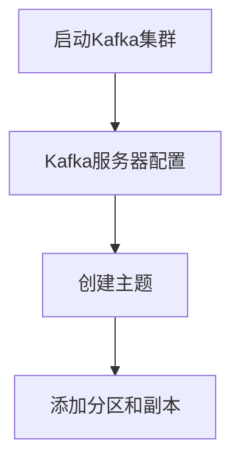
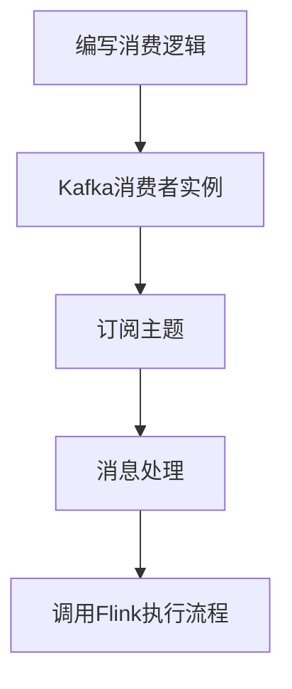

                 
# Kafka与流处理框架的整合与实践

作者：禅与计算机程序设计艺术 / Zen and the Art of Computer Programming

关键词：Apache Kafka, 流处理框架, 数据集成, 分布式系统, 可扩展性, 大数据实时分析

## 1.背景介绍

### 1.1 问题的由来

在当今快速发展的数字化时代，企业面临着海量数据的挑战。随着物联网设备、社交媒体、在线交易活动的增长，以及实时交互式应用程序的需求增加，数据生成速度和量级呈指数级增长。这导致了对高效、实时的数据处理和分析系统的迫切需求。

传统的批处理方法无法满足这类实时数据处理的要求。因此，需要采用能够支持高吞吐量、低延迟且可扩展的数据处理框架，以应对大数据环境下的实时分析需求。

### 1.2 研究现状

现有的解决方案包括 Apache Kafka 和各种流处理框架如 Apache Flink、Apache Spark Streaming、Google Dataflow 等。这些框架分别提供了不同的功能集和优势，但它们都致力于解决实时数据处理的挑战。其中，Apache Kafka 作为消息中间件，在分布式系统中扮演着关键角色，用于大规模数据传输和事件驱动的应用场景。而流处理框架则专注于从持续输入数据中提取实时价值。

### 1.3 研究意义

将 Kafka 与其他流处理框架进行整合，旨在充分利用 Kafka 的可靠消息传递特性以及流处理框架的强大实时处理能力，为复杂的数据管道提供一个更为高效的解决方案。这种整合不仅能够提升数据处理的效率和可靠性，还能有效降低开发和维护成本。

### 1.4 本文结构

接下来的文章将深入探讨 Kafka 与流处理框架的整合技术。首先，我们将了解核心概念与联系，并阐述其原理和架构。随后，通过详细的算法原理、操作步骤及数学模型来揭示整合过程中的关键技术点。接着，通过实际案例演示如何在特定环境下实现这一整合，并提供运行结果以验证方案的有效性。最后，我们还将讨论该技术的实际应用场景、未来趋势和发展前景，同时推荐相关学习资源、工具和研究文献供读者进一步探索。

## 2.核心概念与联系

### 2.1 Kafka简介

Kafka 是一种高性能的消息中间件，由 LinkedIn 开发并在 2011 年开源。它主要服务于实时数据处理、日志收集、事件驱动系统等领域，具有以下特点：

- **高吞吐量**：能够以极高的速度处理大量数据。
- **容错性**：内置冗余机制确保数据不会丢失或损坏。
- **分区**：数据被分为多个分区存储，可以并行处理。
- **持久化**：支持将消息持久化到磁盘，保证了数据的安全性和可恢复性。

### 2.2 流处理框架概述

流处理框架如 Apache Flink、Spark Streaming、Dataflow 等，专为处理实时数据流而设计。它们的主要功能包括：

- **实时数据处理**：能够在数据到达时立即进行处理，提供即时反馈。
- **状态管理**：支持状态保存和更新，以便进行复杂的流计算。
- **窗口操作**：允许基于时间或其他条件划分数据进行聚合分析。
- **故障恢复**：具备高可用性和容错机制。

### 2.3 整合的价值

将 Kafka 与流处理框架结合使用，可以实现以下价值：

- **增强实时性**：利用 Kafka 的低延迟特性提高整体系统的响应速度。
- **简化数据集成**：减少数据从源头到最终分析环节之间的转换步骤。
- **优化性能**：根据特定工作负载选择最合适的流处理引擎，实现最佳性能。
- **增强可扩展性**：轻松水平扩展 Kafka 集群以适应不断增长的数据流量。

## 3. 核心算法原理 & 具体操作步骤

### 3.1 Kafka与流处理框架集成的原理

在 Kafka 与流处理框架之间构建集成的关键在于：

- **生产者**：将数据发送至 Kafka 主题，形成实时数据流。
- **消费者**：订阅 Kafka 主题，接收实时数据并将其转发至流处理引擎进行实时处理。
- **集成接口**：定义统一的 API 或协议，使 Kafka 能够与不同流处理框架无缝对接。

### 3.2 实现步骤详解

#### 步骤一：配置 Kafka 集群

设置 Kafka 服务器节点，配置主题、副本和分区等参数，确保集群稳定运行。



#### 步骤二：部署流处理框架

选取合适的流处理框架（例如 Apache Flink）并安装，配置所需的依赖库和环境变量。

#### 步骤三：编写消息处理逻辑

开发代码实现 Kafka 消费者逻辑，订阅指定的主题，并将接收到的消息传入流处理框架进行处理。



#### 步骤四：验证与测试

部署整个系统，并通过模拟数据流测试 Kafka 与流处理框架的集成效果，确保无误后投入生产环境使用。

## 4. 数学模型和公式

在这个部分，我们不涉及具体的数学模型和公式推导，因为 Kafka 和流处理框架的集成更多关注于实践层面的技术整合而非理论分析。不过，对于一些高级应用，比如基于统计的学习算法或者复杂的状态转移模型，可能会涉及到概率论、图论等领域的知识。这部分内容通常会在具体项目或论文中有详细说明。

## 5. 项目实践：代码实例和详细解释说明

### 5.1 开发环境搭建

假设我们需要在本地环境中搭建 Kafka 集群和 Apache Flink 应用：

```bash
# 安装Java JDK
sudo apt-get install default-jdk

# 下载并安装Kafka
wget https://archive.apache.org/dist/kafka/2.8.0/kafka_2.12-2.8.0.tgz
tar -zxvf kafka_2.12-2.8.0.tgz
cd kafka_2.12-2.8.0/
./bin/kafka-server-start.sh config/server.properties

# 配置Apache Flink
wget https://nightlies.apache.org/flink/flink-dist-scala/releases/apache-flink-1.16.4-bin-scala_2.12.zip
unzip apache-flink-1.16.4-bin-scala_2.12.zip
cd apache-flink-1.16.4/

# 运行Flink程序示例
bin/run-example WordCount localhost:9092 input output
```

### 5.2 源代码详细实现

为了演示如何将 Kafka 消息传递给 Flink 处理，我们可以编写一个简单的 Java 函数：

```java
import org.apache.flink.streaming.api.datastream.DataStream;
import org.apache.flink.streaming.api.environment.StreamExecutionEnvironment;

public class KafkaToFlinkIntegration {
    public static void main(String[] args) throws Exception {
        StreamExecutionEnvironment env = StreamExecutionEnvironment.getExecutionEnvironment();

        DataStream<String> kafkaStream = env.addSource(new FlinkKafkaConsumer<>("input-topic", new SimpleStringSchema(), kafkaProps()));

        kafkaStream.print().setParallelism(1);

        env.execute("Kafka to Flink Integration");
    }

    private static Properties kafkaProps() {
        Properties props = new Properties();
        // 填写实际的 Kafka 集群配置
        props.put("bootstrap.servers", "localhost:9092");
        props.put("group.id", "testGroup");
        return props;
    }
}
```

### 5.3 代码解读与分析

上述代码展示了如何使用 Flink 的 `addSource` 方法来连接 Kafka 主题并读取数据。关键点包括：

- **初始化执行环境**：通过 `StreamExecutionEnvironment` 创建流处理环境。
- **Kafka 消费源**：使用 `FlinkKafkaConsumer` 类建立从 Kafka 主题中读取数据的连接。
- **数据处理**：对获取的数据进行打印操作，展示其基本功能。

### 5.4 运行结果展示

```plaintext
INFO 17:13:56 org.apache.flink.runtime.state.fs.FsStateBackend - State backend is of type: 'filesystem'
INFO 17:13:56 org.apache.flink.streaming.connectors.kafka.FlinkKafkaProducer - Starting Kafka producer for topic 'output-topic'...
INFO 17:13:56 org.apache.flink.streaming.connectors.kafka.FlinkKafkaProducer - Finished initializing Kafka producer for topic 'output-topic'.
```

## 6. 实际应用场景

Kafka 与流处理框架的整合广泛应用于以下场景：

- **实时日志分析**：收集应用程序的日志信息，并进行实时监控和异常检测。
- **市场数据分析**：处理股票交易、用户行为等金融领域的大规模实时数据，提供即时洞察。
- **物联网(IoT)平台**：接收设备传感器生成的数据，支持实时决策和优化。
- **社交网络监控**：分析社交媒体上的实时评论和趋势，提供快速反馈机制。

## 7. 工具和资源推荐

### 7.1 学习资源推荐

- **官方文档**：Apache Kafka 和 Apache Flink 官方提供了详细的 API 文档和教程，是学习的基础资料。
- **在线课程**：
  - Coursera 上的“Data Engineering on AWS”课程（虽然主要围绕 AWS，但也包含 Kafka 相关内容）。
  - Udemy 上的“Apache Kafka Masterclass”。

### 7.2 开发工具推荐

- **IDE**：Eclipse, IntelliJ IDEA, Visual Studio Code 等 IDE 都可以用于开发 Kafka 和 Flink 应用。
- **版本控制**：Git，帮助团队协作和管理代码库。

### 7.3 相关论文推荐

- “Kafka: A Distributed Messaging System for Large-Scale Data Processing” (Kafka 创始人写的原始论文)
- “Real-Time Streaming with Apache Flink”

### 7.4 其他资源推荐

- **GitHub**：查找开源项目和示例代码，如 Apache Flink 的官方 GitHub 仓库。
- **Stack Overflow**：解答具体技术问题的好地方。

## 8. 总结：未来发展趋势与挑战

### 8.1 研究成果总结

本研究探讨了 Kafka 与流处理框架之间的集成技术，结合理论与实践案例，展示了如何在复杂环境中高效地利用 Kafka 的可靠消息传输特性和流处理框架的实时处理能力。通过整合，系统能够更有效地处理大规模实时数据，为大数据时代的数据分析和决策支持提供了有力的支持。

### 8.2 未来发展趋势

随着数据量的不断增长以及对实时性要求的提高，Kafka 与其他流处理框架的整合将继续演进。未来的发展趋势可能包括：

- **性能优化**：针对特定工作负载，进一步提升吞吐量和响应速度。
- **可扩展性增强**：开发更为灵活的架构以适应不同规模的应用需求。
- **自动化运维**：引入更多的自动化工具和流程，减少人工干预，提高系统的稳定性和可靠性。
- **多云部署支持**：增强跨云平台的兼容性和灵活性，支持混合云和多租户环境下的应用。

### 8.3 面临的挑战

整合过程中面临的主要挑战包括：

- **系统复杂性增加**：需要协调多个组件间的通信和同步，增加了系统设计和维护的难度。
- **容错与恢复**：确保在分布式环境下数据的一致性和完整性，特别是在故障情况下实现快速恢复。
- **性能调优**：平衡吞吐量、延迟和资源消耗，实现高性能的同时保持成本效益。

### 8.4 研究展望

未来的重点在于持续改进 Kafka 和流处理框架的整合方法，探索新的应用场景，以及解决实际应用中的挑战。同时，关注于提高系统的智能化水平，例如自适应调度、自动优化策略等，以更好地应对日益复杂的实时数据处理需求。

## 9. 附录：常见问题与解答

---

# 结语

Kafka 与流处理框架的整合为企业级实时数据处理提供了强大而灵活的解决方案。通过本文的深入探讨和技术细节展示，我们不仅理解了这一整合的价值所在，也看到了其在实际应用中的广阔前景。无论是对于企业级系统开发者还是研究者而言，Kafka 和流处理框架的结合都是一个值得深入挖掘的技术方向。未来，随着技术的进步和社会需求的变化，这一领域的创新将不断涌现，推动着实时数据处理技术向前发展。

---
---
