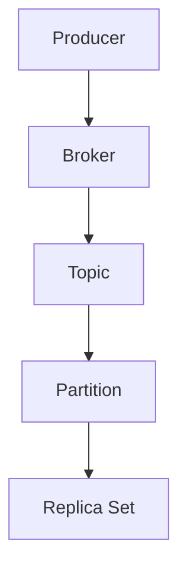
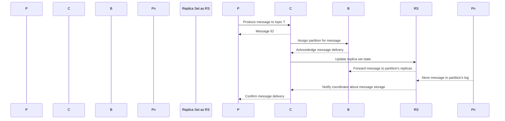
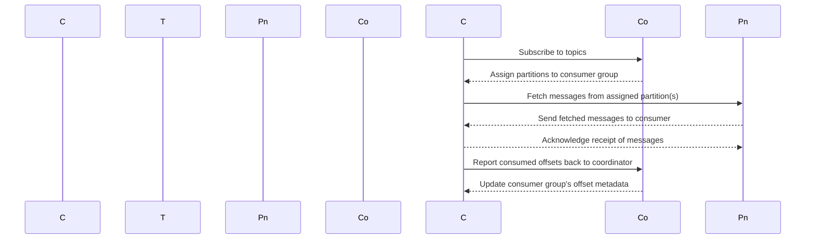

                 
# Kafka的架构与组件

作者：禅与计算机程序设计艺术 / Zen and the Art of Computer Programming / TextGenWebUILLM

# Kafka 的架构与组件

## 1. 背景介绍

### 1.1 问题的由来

随着大数据时代的到来，数据流管理成为现代企业面临的重大挑战之一。传统的关系型数据库在实时处理大量事件流时显得力不从及。在这种背景下，Apache Kafka应运而生，旨在提供一种高效、可靠的数据流平台。

### 1.2 研究现状

Apache Kafka自发布以来，以其高吞吐量、低延迟、高可靠性等特点，在全球范围内获得了广泛应用，特别是在金融、电商、广告投放等领域。目前，Kafka已经成为构建大规模数据管道的核心组件之一，其生态系统持续扩展，支持丰富的功能和集成。

### 1.3 研究意义

Kafka的成功不仅在于其强大的性能表现，更在于它推动了现代数据处理方式的变革，使得实时数据消费、存储和分发变得更加高效和灵活。对于开发者而言，理解Kafka的工作机制和组件特性是构建高性能数据系统的关键一步。

### 1.4 本文结构

本文将深入探讨Apache Kafka的核心架构和组件，包括生产者、消费者、主题、分区以及副本集等功能，并通过详细的案例解析、算法原理、实践示例以及未来发展趋势进行阐述。

## 2. 核心概念与联系

### 2.1 Kafka架构概览

Kafka架构由一系列核心组件组成，共同协作以提供高效的数据传输服务。以下是Kafka架构的主要组成部分及其相互关系：



### 2.2 生产者（Producers）

生产者是Kafka架构中的发起者，负责向集群发送消息。生产者可以是一个应用程序或一个进程，用于生成和发送数据到特定的主题。

### 2.3 协调器（Brokers）

协调器在Kafka集群中扮演着关键角色，它们接收并存储来自生产者的消息，并将其转发给消费者。每个协调器维护着集群的状态信息，确保集群的一致性和可用性。

### 2.4 主题（Topics）

主题是Kafka中的逻辑容器，用于组织相同类型的消息流。一条消息被发布后会被分配到某个主题下。消息可以通过主题进行分类和过滤，方便不同应用程序根据需要订阅和消费。

### 2.5 分区（Partitions）

为了提高读写性能，主题内的消息被划分为多个物理分区。每个分区都可以独立地进行读取和写入操作，从而允许并行处理。这种设计保证了Kafka的高吞吐量和可伸缩性。

### 2.6 副本集（Replica Sets）

为确保数据的持久性和容错能力，Kafka采用主从复制机制。每个分区都有多个副本，其中一个为主副本，其余为从副本。当主副本失效时，可以从任一从副本快速恢复数据同步状态，确保系统的高可用性和数据一致性。

## 3. 核心算法原理与具体操作步骤

### 3.1 投递流程概述

Kafka的消息投递流程涉及到生产者、协调器、主题、分区和副本集等多个组件之间的交互。以下是一个简化的投递流程图：



### 3.2 消费流程详解

Kafka的消费流程涉及消费者与主题、分区、协程之间的交互。消费者通过订阅主题上的一个或多个分区来进行数据消费。



### 3.3 Kafka的实现细节

Kafka内部使用了一系列优化技术来提升性能和可靠性：
- **内存映射文件**：使用内存映射文件减少磁盘I/O开销。
- **异步IO**：利用多路复用和非阻塞I/O模型提高网络效率。
- **心跳检测**：周期性检查集群成员的存在，确保集群的稳定性和故障恢复。
- **日志压缩**：自动压缩日志文件以节省存储空间，同时保持快速访问性能。

## 4. 数学模型和公式详细讲解举例说明

### 4.1 数据持久化策略

假设一个主题包含$N$个分区，每个分区有$m$个副本，其中$p$为主副本。那么，总共有$m \times N + p \times N = m \times N + (m - 1) \times N = n$个副本。此模型描述了如何在单节点故障情况下仍能保持数据可用性和一致性。

### 4.2 并行度优化计算

如果要计算每个分区的最大并行读取数量，可以使用以下公式：
$$\text{最大并行读取数} = \left\lfloor\frac{\text{系统总CPU核心数}}{\text{每任务所需CPU核心数}}\right\rfloor$$

这里$\left\lfloor x \right\rfloor$表示向下取整运算。

### 4.3 故障恢复时间分析

故障恢复时间主要取决于主副本的恢复速度和从副本同步的过程。假设从副本的平均同步速率是$r$字节/秒，则从副本完全更新的时间$t_f$为：
$$t_f = \frac{\text{主副本大小}}{r}$$

## 5. 项目实践：代码实例和详细解释说明

### 5.1 开发环境搭建

假设使用Java作为开发语言，在本地环境搭建Kafka集群：

```bash
# 下载并解压Kafka
wget https://www.apache.org/dyn/download.cgi?file=ftp://apache.mirrors.uq.edu.au//incubator/kafka/releases/3.0.0/kafka_2.13-3.0.0.tgz
tar -xzvf kafka_2.13-3.0.0.tgz
cd kafka_2.13-3.0.0/

# 配置zk和kafka启动脚本
echo "export ZOOKEEPER_HOME=/path/to/zookeeper" >> /etc/environment
echo "export KAFKA_HOME=/path/to/kafka" >> /etc/environment
source /etc/environment

# 启动Zookeeper服务
/bin/bash $KAFKA_HOME/tools/run-zk.sh start

# 启动Kafka服务
./bin/kafka-server-start.sh config/server.properties &

# 查看Kafka状态
./bin/kafka-topics.sh --list --bootstrap-server localhost:9092
```

### 5.2 源代码详细实现

以下是简单的生产者和消费者的示例代码：

#### 生产者示例（Producer.java）:

```java
public class ProducerExample {
    public static void main(String[] args) {
        Properties props = new Properties();
        props.put("bootstrap.servers", "localhost:9092");
        props.put("acks", "all");
        props.put("retries", 0);
        props.put("batch.size", 16384);
        props.put("linger.ms", 1);
        props.put("buffer.memory", 33554432);
        props.put("key.serializer", "org.apache.kafka.common.serialization.StringSerializer");
        props.put("value.serializer", "org.apache.kafka.common.serialization.StringSerializer");

        KafkaProducer<String, String> producer = new KafkaProducer<>(props);

        for (int i = 0; i < 10; i++) {
            producer.send(new ProducerRecord<>("my-topic", "key-" + i, "value-" + i));
        }

        producer.flush();
        producer.close();
    }
}
```

#### 消费者示例（ConsumerExample.java）:

```java
public class ConsumerExample {
    public static void main(String[] args) {
        Properties props = new Properties();
        props.put("bootstrap.servers", "localhost:9092");
        props.put("group.id", "test-group");
        props.put("enable.auto.commit", "true");
        props.put("auto.commit.interval.ms", "1000");
        props.put("session.timeout.ms", "30000");
        props.put("key.deserializer", "org.apache.kafka.common.serialization.StringDeserializer");
        props.put("value.deserializer", "org.apache.kafka.common.serialization.StringDeserializer");
        props.put("metadata.max.age.ms", "60000");

        KafkaConsumer<String, String> consumer = new KafkaConsumer<>(props);
        consumer.subscribe(Collections.singletonList("my-topic"));

        try {
            while (true) {
                ConsumerRecords<String, String> records = consumer.poll(100);
                for (ConsumerRecord<String, String> record : records) {
                    System.out.printf("offset = %d, key = %s, value = %s%n", record.offset(), record.key(), record.value());
                }
            }
        } finally {
            consumer.close();
        }
    }
}
```

## 6. 实际应用场景

Apache Kafka广泛应用于构建实时流处理管道、日志收集系统、事件驱动架构等领域。例如，在电商场景中，Kafka用于实时追踪用户行为，如点击、购买等事件，以便进行即时的用户画像分析和个性化推荐。

## 7. 工具和资源推荐

### 7.1 学习资源推荐

- **官方文档**：[https://kafka.apache.org/documentation](https://kafka.apache.org/documentation)
- **在线教程**：[https://docs.confluent.io/platform/current/learn-tutorials/tutorial-kafka-overview.html](https://docs.confluent.io/platform/current/learn-tutorials/tutorial-kafka-overview.html)

### 7.2 开发工具推荐

- **IDE**：IntelliJ IDEA, Eclipse, IntelliJ IDEA Ultimate
- **集成开发环境**：Kafka Connect Studio (https://github.com/confluentinc/kafka-connect-studio)

### 7.3 相关论文推荐

- **官方白皮书**：[https://kafka.apache.org/quickstart](https://kafka.apache.org/quickstart)

### 7.4 其他资源推荐

- **社区论坛**：[https://discuss.kafka.apache.org/](https://discuss.kafka.apache.org/)
- **GitHub仓库**：[https://github.com/apache/kafka](https://github.com/apache/kafka)

## 8. 总结：未来发展趋势与挑战

### 8.1 研究成果总结

Apache Kafka以其高效、可靠的数据传输能力在大数据领域取得了显著成就，成为构建大规模数据管道的关键技术之一。

### 8.2 未来发展趋势

随着物联网(IoT)、边缘计算和人工智能(AI)的发展，Kafka将面临更大的数据吞吐量需求和更高的实时性要求。因此，未来的Kafka可能会进一步优化其性能和扩展性，并增强对实时AI应用的支持。

### 8.3 面临的挑战

- **数据安全性**：如何在保证高可用性和性能的同时，加强数据的安全防护。
- **可伸缩性**：随着数据规模的持续增长，如何保持良好的性能表现并轻松扩展集群。
- **复杂度管理**：面对日益复杂的业务逻辑和数据模型，如何简化系统的管理和维护工作。

### 8.4 研究展望

未来的研究重点可能集中在提高Kafka的性能、优化其在分布式存储中的使用、以及探索新的应用场景等方面。同时，加强与其他开源项目和标准的整合，提升生态系统的一致性和互操作性也是值得关注的方向。

## 9. 附录：常见问题与解答

### 常见问题解答

Q: 如何选择合适的副本集策略以满足不同的可靠性需求？
A: 根据业务需求调整副本集的数量。对于低延迟、高可用性的场景，可以增加主副本数量；而追求更高容错性的场景，则需要增加从副本的数量。

Q: 如何监控Kafka集群的状态和性能？
A: 使用Kafka自带的监控工具或第三方监控服务，如Prometheus、Grafana等，定期检查集群状态、消息处理速度、内存使用情况等关键指标。

Q: Kafka与其他消息队列相比有何优势？
A: Kafka不仅支持消息持久化和高吞吐量，还提供了丰富的API接口，易于集成到各种应用程序中。此外，Kafka的高性能、高可用性和容错机制使其在处理大量事件流时具有明显的优势。

以上就是关于Apache Kafka架构与组件的详细阐述，希望能为读者提供深入的理解和启发，促进Kafka技术的应用与发展。

