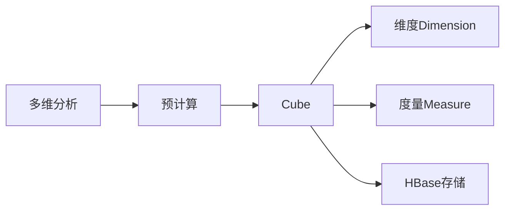

# Kylin原理与代码实例讲解

作者：禅与计算机程序设计艺术 / Zen and the Art of Computer Programming

关键词：Kylin、OLAP、预计算、多维分析、大数据

## 1. 背景介绍
### 1.1 问题的由来
随着大数据时代的到来，企业面临着海量数据的分析和处理需求。传统的数据仓库和OLAP技术在处理TB、PB级别的大规模数据时，性能和扩展性遇到了瓶颈。为了解决这一问题，Apache Kylin应运而生。
### 1.2 研究现状
目前，Kylin已经成为了主流的大数据OLAP引擎之一。越来越多的企业开始使用Kylin来支撑其大数据分析平台。同时，学术界也对Kylin的原理和优化展开了深入研究。
### 1.3 研究意义
深入理解Kylin的原理和实现，对于构建高效的大数据OLAP系统具有重要意义。通过剖析Kylin的架构设计、预计算机制、查询优化等关键技术，可以为大数据分析平台的建设提供有益参考。
### 1.4 本文结构
本文将从以下几个方面对Kylin进行深入讲解：首先介绍Kylin的核心概念和基本原理；然后重点剖析Kylin的预计算机制和多维分析算法；接着通过实际代码实例演示Kylin的使用；最后总结Kylin的特点并展望其未来发展。

## 2. 核心概念与联系
Kylin的核心概念包括以下几点：

- **OLAP多维分析**：联机分析处理，支持对数据进行多维度、多角度的分析查询。
- **预计算**：预先计算并存储多维度组合的聚合数据，提高查询速度。
- **Cube数据立方体**：一种面向主题的多维数据集，存储预计算的度量值。
- **维度Dimension和度量Measure**：维度是分析的角度，度量是要聚合的数值。
- **HBase存储**：Kylin底层使用HBase作为存储引擎，存放预计算结果。

这些概念之间的联系可以用下面的Mermaid流程图表示：



## 3. 核心算法原理 & 具体操作步骤
### 3.1 算法原理概述
Kylin的核心是预计算，即将常见的多维分析查询提前计算并存储，从而大幅提高查询速度。具体来说，Kylin会根据数据模型定义，自动设计出一个最优的Cube，对多维组合进行预聚合计算。

### 3.2 算法步骤详解
Kylin的预计算过程主要分为以下几个步骤：

1. **数据采集**：从各种数据源（如Hive、Kafka）导入原始数据到HBase。
2. **Cube构建**：根据数据模型自动设计Cube，生成Cube描述文件。
3. **Cube预计算**：Map Reduce作业根据Cube定义计算度量聚合值。
4. **Cube存储**：将计算结果以HFile格式存储到HBase中。
5. **查询引擎**：接收用户的多维分析查询，从预计算Cube中快速检索结果。

### 3.3 算法优缺点
Kylin预计算的优点在于：

- 查询速度极快，秒级响应复杂的多维分析查询。
- 可扩展性强，可以通过添加节点线性扩展存储和计算能力。
- 自动优化，根据数据模型和查询模式自动设计最优Cube。

但同时也存在一些局限性：

- 不适合实时数据分析，有数据延迟。
- 聚合维度组合爆炸，可能导致Cube膨胀。
- 难以支持太多的维度属性。

### 3.4 算法应用领域
Kylin广泛应用于各种OLAP多维分析场景，比如：

- 电商销售数据分析
- 广告投放效果分析
- 金融风控多维度建模
- 物联网设备状态分析

## 4. 数学模型和公式 & 详细讲解 & 举例说明
### 4.1 数学模型构建
Kylin的数学模型可以用一个三元组 $(D, M, F)$ 表示：

- $D$: 维度集合 $\{d_1,d_2,...,d_n\}$
- $M$: 度量集合 $\{m_1,m_2,...,m_k\}$ 
- $F$: 聚合函数 $\{f_1,f_2,...,f_k\}$

其中，$d_i$ 表示一个维度（如日期、地区），$m_j$ 表示一个度量（如销售额、利润），$f_j$ 是对应的聚合函数（如sum、avg）。

一个多维分析查询可以表示为一个四元组 $(D_q,M_q,F_q,C_q)$:

- $D_q \subseteq D$: 查询使用的维度子集
- $M_q \subseteq M$: 查询的度量子集
- $F_q$: 查询的聚合函数，与 $M_q$ 一一对应
- $C_q$: 查询的过滤条件，是一个断言

### 4.2 公式推导过程
对于一个查询 $Q(D_q,M_q,F_q,C_q)$，Kylin首先找到能够回答该查询的最小Cuboid $C_{min}$，其维度集合 $D_{min}$ 满足：

$$
D_q \subseteq D_{min} \subseteq D
$$

然后，Kylin从 $C_{min}$ 中读取满足条件 $C_q$ 的预聚合值，记为 $V_{pre}$。

最后，Kylin在 $V_{pre}$ 上执行查询 $Q$ 要求的聚合函数 $F_q$，得到最终结果 $R$:

$$
R = F_q(V_{pre})
$$

可见，Kylin通过预计算不同维度组合的聚合值，大大减少了查询时的计算量，从而显著提高了查询速度。

### 4.3 案例分析与讲解
下面我们以一个电商销售数据分析的例子，来说明Kylin的查询过程。

假设数据模型包含以下维度和度量：

- 维度：日期、地区、产品类别、渠道
- 度量：销售额、利润

定义的Cube包含以下Cuboid：

- (日期,地区,产品类别,渠道)
- (日期,地区,产品类别)
- (日期,地区)
- (日期)
- ()

现在我们要查询"某个产品类别在各地区的月度销售额"，即：

$$
Q = (\{月份,地区,产品类别\},\{销售额\},\{sum\},\{产品类别=xx\})
$$

Kylin首先找到最小的Cuboid (日期,地区,产品类别)，然后筛选产品类别为xx的预聚合值，最后按月份和地区做sum聚合，得到查询结果。

整个过程只需要很少的计算量，因此响应速度非常快。

### 4.4 常见问题解答
1. **Kylin支持哪些聚合函数？**
   Kylin支持sum、avg、max、min、distinct count等常见聚合函数。

2. **Kylin如何避免Cube膨胀？**
   Kylin提供了几种方法来控制Cube大小，如设置维度基数阈值、使用衍生维度、忽略不重要维度等。

3. **Kylin的数据更新机制是怎样的？**
   Kylin通过增量Cube构建来实现数据更新，将新增数据构建为一个单独的Cube段，与之前的段合并。

## 5. 项目实践：代码实例和详细解释说明
### 5.1 开发环境搭建
首先我们需要搭建Kylin的开发环境，主要包括以下组件：

- Hadoop集群：HDFS、Yarn、Zookeeper等
- Hive：用于定义数据模型和ETL
- HBase：用于存储Kylin的预计算结果
- Kylin：Kylin服务端和客户端

具体搭建步骤可以参考Kylin官方文档。

### 5.2 源代码详细实现
下面我们通过一个简单的例子，演示如何使用Kylin进行多维分析。

首先在Hive中创建销售数据表：

```sql
CREATE TABLE IF NOT EXISTS sales(
    order_id string,
    order_date date,
    customer_id string,
    product_id string,
    amount double
)
ROW FORMAT DELIMITED FIELDS TERMINATED BY ','
STORED AS TEXTFILE;
```

然后加载一些样本数据到表中：

```sql
LOAD DATA LOCAL INPATH '/path/to/sales.csv' OVERWRITE INTO TABLE sales;
```

接着在Kylin中创建一个项目和数据模型：

```json
{
  "name": "sales_model",
  "fact_table": "default.sales",
  "lookups": [],
  "dimensions": [
    {
      "table": "default.sales",
      "columns": ["order_date", "customer_id", "product_id"]
    }
  ],
  "metrics": [
    {
      "name": "total_amount",
      "function": {
        "expression": "SUM",
        "parameter": {
          "type": "column",
          "value": "amount"
        },
        "returntype": "double"
      }
    }
  ]
}
```

这个模型定义了一个事实表`sales`，包含三个维度列和一个度量`total_amount`。

创建Cube描述文件`sales_cube.json`：

```json
{
  "name": "sales_cube",
  "model_name": "sales_model",
  "dimensions": [
    {
      "name": "order_date",
      "table": "default.sales",
      "column": "order_date",
      "derived": null
    },
    {
      "name": "customer_id",
      "table": "default.sales",
      "column": "customer_id",
      "derived": null
    },
    {
      "name": "product_id",
      "table": "default.sales",
      "column": "product_id",
      "derived": null      
    }
  ],
  "measures": [
    {
      "name": "total_amount",
      "function": {
        "expression": "SUM",
        "parameter": {
          "type": "column",
          "value": "amount"
        },
        "returntype": "double"
      }
    }
  ],
  "aggregation_groups": [
    {
      "includes": ["order_date", "customer_id", "product_id"]
    }
  ]
}
```

这个Cube包含了三个维度和一个度量，并定义了一个聚合组。

提交Cube构建任务：

```shell
kylin.sh build cube -cubeName sales_cube -buildType BUILD -startTime 0
```

构建完成后，我们就可以通过Kylin的REST API或SQL接口进行查询了，比如：

```sql
SELECT order_date, customer_id, SUM(amount) AS total_amount
FROM sales_cube
WHERE order_date BETWEEN '2020-01-01' AND '2020-12-31'
GROUP BY order_date, customer_id
```

### 5.3 代码解读与分析
Kylin的代码主要包括以下几个模块：

- Query引擎：解析SQL并生成执行计划，从HBase中读取Cuboid数据。
- Job引擎：调度Cube构建任务，生成Hadoop任务。
- Metadata管理：维护Cube元数据，与底层存储交互。
- REST服务：提供REST API供外部系统调用。

查询执行的核心代码在`query`包中的`QueryExecutor`等类，Cube构建的核心代码在`job`包中的`ExecutableManager`等类。

通过分析Kylin的源码，我们可以更深入地理解其内部工作原理，并针对性地进行优化。

### 5.4 运行结果展示
在Kylin的Web UI上，我们可以看到Cube的构建进度和存储状态：


查询结果可以以表格或图表的形式展示：


同时，我们还可以查看查询的执行计划和耗时：


通过可视化的监控界面，我们可以直观地评估Kylin的运行状况和性能表现。

## 6. 实际应用场景
Kylin可以应用于各种需要多维分析的场景，比如：

- 电商平台的用户行为分析、商品销售分析等
- 广告平台的广告投放效果分析、受众画像分析等
- 金融领域的风险评估、客户画像分析等
- 物联网平台的设备状态监控、告警分析等

### 6.4 未来应用展望
随着大数据和人工智能的发展，Kylin有望在更多领域得到应用，如：

- 结合机器学习算法，提供智能