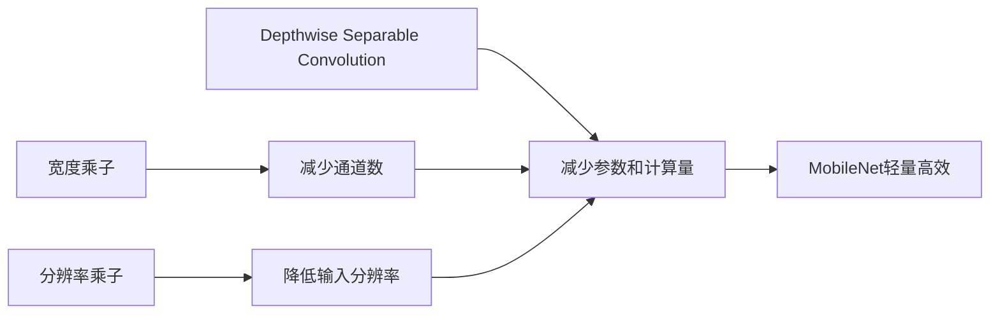

# MobileNet原理与代码实例讲解

作者：禅与计算机程序设计艺术 / Zen and the Art of Computer Programming

关键词：MobileNet, 轻量级CNN, 深度学习, 移动端, 模型压缩, Depthwise Separable Convolution

## 1. 背景介绍

### 1.1 问题的由来

随着智能手机、嵌入式设备等移动终端的广泛普及，在资源受限的移动设备上部署高效的深度学习模型变得越来越重要。传统的卷积神经网络如VGG、ResNet等虽然在图像分类、目标检测等任务上取得了很好的效果，但模型体积庞大、计算量巨大，难以直接应用于移动设备中。因此，如何设计轻量级、高效的深度学习模型成为了一个亟待解决的问题。

### 1.2 研究现状

近年来，学术界和工业界都在轻量级深度学习模型的设计上做了大量工作，提出了一系列模型压缩和加速的方法，如剪枝、量化、知识蒸馏等。其中，设计高效的网络结构是一个重要的研究方向。2017年，谷歌团队提出了MobileNet，通过引入Depthwise Separable Convolution显著降低了模型的参数量和计算量，在保持较高精度的同时大幅提升了模型的效率，为移动端深度学习的应用提供了新的思路。

### 1.3 研究意义

MobileNet的提出具有重要的研究价值和实用意义：

1. 拓展了深度学习在移动端的应用场景，为移动设备中的智能应用开发提供了高效的模型基础。

2. 探索了新的轻量级网络结构设计思路，为后续更多高效模型的设计提供了参考。 

3. 在不显著损失精度的情况下大幅降低了模型复杂度，在模型压缩和加速领域具有重要的借鉴意义。

4. 相比传统的模型压缩方法，MobileNet提供了一种端到端的解决方案，部署更加简单高效。

### 1.4 本文结构

本文将全面介绍MobileNet的原理和代码实现，内容安排如下：

- 第2部分介绍MobileNet中的核心概念，包括Depthwise Separable Convolution、宽度乘子和分辨率乘子等。
- 第3部分详细讲解MobileNet的网络结构和核心算法原理。  
- 第4部分给出MobileNet涉及的数学模型和公式推导过程。
- 第5部分通过代码实例讲解MobileNet的具体实现。
- 第6部分介绍MobileNet的典型应用场景。
- 第7部分推荐MobileNet相关的学习资源和开发工具。
- 第8部分总结MobileNet的贡献、局限性以及未来的发展方向。
- 第9部分给出一些常见问题解答。

## 2. 核心概念与联系

MobileNet中有几个核心概念：

1. **Depthwise Separable Convolution（深度可分离卷积）**：传统卷积操作通过卷积核同时对输入特征图的空间维度和通道维度进行卷积计算，计算量较大。深度可分离卷积将其拆分为Depthwise Convolution（对每个通道独立做卷积）和Pointwise Convolution（1x1卷积用于通道融合）两步，显著降低了参数量和计算量。

2. **宽度乘子（Width Multiplier）**：一个介于0到1之间的超参数，用于控制每层网络的通道数。通道数乘以宽度乘子即为实际的通道数，可以进一步减小网络规模。

3. **分辨率乘子（Resolution Multiplier）**：同样是一个介于0到1之间的超参数，用于控制输入图像的分辨率。分辨率乘子越小，输入分辨率越低，计算量也越小。

这些概念环环相扣，共同构成了MobileNet的核心，其联系可以用下图表示：

## 3. 核心算法原理 & 具体操作步骤

### 3.1 算法原理概述

MobileNet的核心是深度可分离卷积，其基本思想是将标准卷积拆分为两个步骤：

1. Depthwise Convolution：对输入特征图的每个通道分别进行卷积，卷积核的通道数为1。
2. Pointwise Convolution：用1x1卷积对Depthwise Convolution的输出进行通道融合，调整通道数。

传统卷积的参数量为：$D_K \times D_K \times M \times N$
深度可分离卷积的参数量为：$D_K \times D_K \times M + M \times N$

其中$D_K$为卷积核尺寸，$M$为输入通道数，$N$为输出通道数。可以看出，深度可分离卷积的参数量约为传统卷积的$1/N$，大大减少了模型体积。

### 3.2 算法步骤详解

MobileNet的网络结构如下：

1. 标准卷积层：3x3卷积，stride=2，用于初步提取特征。
2. 13个深度可分离卷积块：每个块包含一个3x3 Depthwise Conv和一个1x1 Pointwise Conv，部分块的stride=2用于下采样。
3. 平均池化层：用于特征图尺寸调整。
4. 全连接层：用于分类预测。

其中深度可分离卷积块的结构如下：

前几个块的stride=1，用于特征提取；中间几个块的stride=2，用于减小特征图尺寸；最后几个块的通道数较大，用于捕捉更多高级语义特征。

### 3.3 算法优缺点

优点：
1. 大幅降低参数量和计算量，模型体积小，推理速度快。
2. 精度下降有限，在ImageNet分类任务上仍达到70%以上的准确率。
3. 提供了两个超参数用于灵活调整模型的大小和速度。

缺点：
1. 对大尺寸输入的特征提取能力有限。
2. 部分任务如分割、检测等需要较高分辨率输入，性能有待提高。
3. 模型结构相对简单，对一些复杂场景的建模能力不足。

### 3.4 算法应用领域

MobileNet广泛应用于各种移动端的视觉任务，如：
- 智能手机上的图像分类、物体检测、人脸识别等。
- 嵌入式设备中的目标跟踪、手势识别、场景分析等。
- 自动驾驶领域的路标识别、行人检测等。
- 增强现实中的实时物体识别和跟踪。

此外，MobileNet还可以作为其他任务的骨干网络，如语义分割、关键点检测等。

## 4. 数学模型和公式 & 详细讲解 & 举例说明

### 4.1 数学模型构建

MobileNet中的标准卷积和深度可分离卷积可以用数学公式表示如下：

标准卷积：
$$
\mathbf{G}_{k,l,n} = \sum_{i,j,m} \mathbf{K}_{i,j,m,n} \cdot \mathbf{F}_{k+i-1, l+j-1, m}
$$

深度可分离卷积：
$$
\mathbf{\hat{G}}_{k,l,m} = \sum_{i,j} \mathbf{\hat{K}}_{i,j,m} \cdot \mathbf{F}_{k+i-1, l+j-1, m} \\
\mathbf{G}_{k,l,n} = \sum_{m} \mathbf{K}_{1,1,m,n} \cdot \mathbf{\hat{G}}_{k, l, m}
$$

其中$\mathbf{F}$为输入特征图，$\mathbf{K}$为卷积核参数，$\mathbf{G}$为输出特征图。$i,j$为卷积核的空间维度，$m,n$为特征图和卷积核的通道维度，$k,l$为特征图的空间维度。

### 4.2 公式推导过程

根据卷积的定义，标准卷积的计算量为：
$$
D_K \times D_K \times M \times N \times D_F \times D_F
$$

其中$D_K$为卷积核尺寸，$M$为输入通道数，$N$为输出通道数，$D_F$为输入特征图尺寸。

深度可分离卷积的计算量为：
$$
D_K \times D_K \times M \times D_F \times D_F + M \times N \times D_F \times D_F
$$

第一项为Depthwise Conv的计算量，第二项为Pointwise Conv的计算量。

假设$D_K=3, M=512, N=512, D_F=14$，则标准卷积的计算量为：
$$
3 \times 3 \times 512 \times 512 \times 14 \times 14 \approx 150M
$$

深度可分离卷积的计算量为：
$$
3 \times 3 \times 512 \times 14 \times 14 + 512 \times 512 \times 14 \times 14 \approx 16M
$$

可见深度可分离卷积的计算量只有标准卷积的约1/9，参数量也大幅减少。

### 4.3 案例分析与讲解

以ImageNet分类任务为例，输入图像尺寸为224x224，MobileNet的详细结构如下表所示：

| 层类型 | 步长 | 输入尺寸 | 卷积核尺寸 | 输出通道数 |
| --- | --- | --- | --- | --- |
| Conv2d | 2 | 224 | 3x3 | 32 |
| DepthwiseConv2d | 1 | 112 | 3x3 | 32 |
| PointwiseConv2d | 1 | 112 | 1x1 | 64 |
| DepthwiseConv2d | 2 | 112 | 3x3 | 64 |
| PointwiseConv2d | 1 | 56 | 1x1 | 128 |
| DepthwiseConv2d | 1 | 56 | 3x3 | 128 |
| PointwiseConv2d | 1 | 56 | 1x1 | 128 |
| DepthwiseConv2d | 2 | 56 | 3x3 | 128 |
| PointwiseConv2d | 1 | 28 | 1x1 | 256 |
| DepthwiseConv2d | 1 | 28 | 3x3 | 256 |
| PointwiseConv2d | 1 | 28 | 1x1 | 256 |
| DepthwiseConv2d | 2 | 28 | 3x3 | 256 |
| PointwiseConv2d | 1 | 14 | 1x1 | 512 |
| DepthwiseConv2d | 1 | 14 | 3x3 | 512 |
| PointwiseConv2d | 1 | 14 | 1x1 | 512 |
| DepthwiseConv2d | 1 | 14 | 3x3 | 512 |
| PointwiseConv2d | 1 | 14 | 1x1 | 512 |
| DepthwiseConv2d | 1 | 14 | 3x3 | 512 |
| PointwiseConv2d | 1 | 14 | 1x1 | 512 |
| DepthwiseConv2d | 1 | 14 | 3x3 | 512 |
| PointwiseConv2d | 1 | 14 | 1x1 | 512 |
| DepthwiseConv2d | 1 | 14 | 3x3 | 512 |
| PointwiseConv2d | 1 | 14 | 1x1 | 1024 |
| DepthwiseConv2d | 2 | 14 | 3x3 | 1024 |
| PointwiseConv2d | 1 | 7 | 1x1 | 1024 |
| AvgPool | - | 7 | 7x7 | - |
| FC | - | 1 | - | 1000 |

可以看到，MobileNet使用步长为2的卷积和Depthwise Conv来降低特征图尺寸，同时通过Pointwise Conv来逐渐增加通道数。最终平均池化后接全连接层得到分类结果。