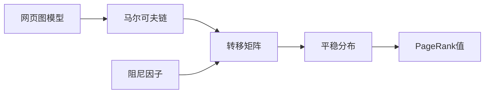

# PageRank原理与代码实例讲解

作者：禅与计算机程序设计艺术 / Zen and the Art of Computer Programming

关键词：PageRank算法，搜索引擎排名，马尔可夫链，随机游走，幂法迭代

## 1. 背景介绍

### 1.1 问题的由来

随着互联网的飞速发展，网页数量呈爆炸式增长。如何从海量网页中快速、准确地找到用户所需信息，成为搜索引擎面临的重大挑战。早期的搜索引擎主要依靠网页内容中的关键词匹配来确定相关性和排名。但这种方法存在很大局限性，容易被刷排名等作弊手段所欺骗。

### 1.2 研究现状

1998年，斯坦福大学的Sergey Brin和Larry Page在研究网页排名问题时提出了革命性的PageRank算法[1]。它从网页链接结构出发，通过随机游走模型计算网页的重要性得分，再根据得分对网页进行排序。这一算法奠定了现代搜索引擎的基础，并最终催生了Google公司的诞生。

此后，PageRank算法得到广泛关注和研究。学者们从数学原理[2]、计算效率[3]、应用拓展[4]等方面对其进行了深入探讨和改进。PageRank及其变种算法已成功应用于网页排序、社交网络分析、推荐系统等诸多领域。

### 1.3 研究意义

深入理解PageRank的数学原理和工程实现，对于从事搜索引擎、数据挖掘、复杂网络等研究的学者和工程师具有重要意义。一方面，PageRank体现了将线性代数、图论等数学知识应用于工程实践的典范。学习PageRank有助于培养数理思维和工程思想的结合。另一方面，PageRank启发人们从网络拓扑结构的角度理解复杂系统，为解决现实世界中的诸多问题提供了新的思路。

### 1.4 本文结构

本文将从以下几个方面对PageRank展开详细讨论：

- 第2部分介绍PageRank涉及的基本概念，如网页图模型、马尔可夫链等，并阐述其内在联系。
- 第3部分讲解PageRank的核心算法原理，给出详细的计算步骤，并分析算法的优缺点和应用场景。  
- 第4部分建立PageRank的数学模型，推导出迭代计算公式，并结合案例进行说明。
- 第5部分给出PageRank的代码实现，详细解释关键步骤，展示程序运行结果。
- 第6部分讨论PageRank在搜索引擎、推荐系统等领域的实际应用情况。
- 第7部分推荐PageRank相关的学习资源、开发工具和文献。
- 第8部分总结全文，展望PageRank的发展趋势和面临的挑战。
- 第9部分的附录中解答一些常见问题。

## 2. 核心概念与联系

要深入理解PageRank，需要先掌握以下几个核心概念：

- **网页图模型(Web Graph)**：将整个万维网看作一个有向图$G=(V,E)$。其中网页是图的节点，网页之间的超链接是有向边。如果网页A存在指向网页B的链接，则图中存在从节点A到B的有向边。

- **入度(In-degree)**：一个网页节点的入度是指指向该网页的链接数量。入度越高，通常意味着网页越重要。

- **出度(Out-degree)**：一个网页节点的出度是指该网页指向其他网页的链接数量。

- **马尔可夫链(Markov Chain)**：描述状态空间中转移的数学模型。系统在每个时刻处于某一状态，下一时刻以一定概率转移到另一状态，且转移概率只依赖于当前状态。PageRank算法利用马尔可夫链刻画了随机游走过程。

- **转移矩阵(Transition Matrix)**：描述马尔可夫链状态转移概率的矩阵。PageRank算法中的转移矩阵是由网页图的邻接矩阵归一化得到的。

- **平稳分布(Stationary Distribution)**：马尔可夫链经过长时间转移后收敛到的状态分布。这与初始状态无关。PageRank值实际上对应于随机游走的平稳分布。

- **阻尼因子(Damping Factor)**：引入阻尼因子是为了解决马尔可夫链的非周期性和非连通性问题。它表示随机游走过程中，用户继续访问网页的概率，一般取值在0.8到0.9之间。

下图展示了PageRank涉及的核心概念以及它们之间的联系：

由网页图模型出发，利用马尔可夫链的状态转移思想，通过转移矩阵的迭代计算，最终得到平稳分布，也就是每个网页的PageRank值。阻尼因子的引入保证了迭代过程的收敛性。

## 3. 核心算法原理 & 具体操作步骤

### 3.1 算法原理概述

PageRank的基本思想是通过网页的链接结构计算其重要性。如果一个网页被很多其他网页链接到，或者被一些重要网页链接到，则认为该网页也比较重要，其PageRank值就会较高。

具体来说，PageRank算法将网页浏览看作一个随机游走(Random Walk)过程。想象一个用户不断地在网页间随机跳转：

1. 用户从某个网页$i$开始浏览。 
2. 用户以概率$d$（阻尼因子）选择一个链接进行跳转，链接的选择遵循均匀分布。即如果当前网页有$n$个出链，则每个链接被选中的概率为$1/n$。
3. 用户以概率$1-d$随机跳转到任意一个网页，各网页被选中的概率相等。
4. 重复步骤2和3，无限次。

经过足够长时间的随机游走后，用户访问每个网页的概率收敛到一个稳定值，这就是该网页的PageRank值。直观上，重要的网页会被更频繁地访问到。

### 3.2 算法步骤详解

下面给出PageRank的具体计算步骤。

输入：
- 包含$N$个网页的有向图$G=(V,E)$
- 阻尼因子$d$，通常取值0.85
- 最大迭代次数$K$，一般取100
- 收敛阈值$\epsilon$，例如$10^{-6}$

输出：
- $N$维向量$\mathbf{R}$，第$i$个元素$R_i$表示网页$i$的PageRank值

步骤：
1. 根据网页图构建$N\times N$的邻接矩阵$\mathbf{A}$。若网页$i$有一个指向网页$j$的链接，则$A_{ij}=1$，否则$A_{ij}=0$。

2. 计算每个网页$i$的出度$D_i$，令$D_i=\sum_{j=1}^N A_{ij}$。

3. 构建转移矩阵$\mathbf{M}$。
$$
M_{ij} = \begin{cases}
\frac{1}{D_i} & \text{if } A_{ij}=1 \\
0 & \text{otherwise}
\end{cases}
$$

4. 处理dead ends（出度为0的网页）。将$\mathbf{M}$中全为0的行替换为$\frac{1}{N}$。

5. 引入阻尼因子$d$，更新转移矩阵。
$$ \mathbf{M} = d\mathbf{M} + (1-d)\frac{1}{N}\mathbf{J} $$
其中$\mathbf{J}$为全1矩阵。

6. 初始化PageRank向量$\mathbf{R}_0=[\frac{1}{N},\cdots,\frac{1}{N}]^T$。

7. 迭代计算$K$次或直到收敛。
$$ \mathbf{R}_{t+1} = \mathbf{M}^T \mathbf{R}_t $$
收敛条件：$\Vert\mathbf{R}_{t+1}-\mathbf{R}_t\Vert_1 < \epsilon$。

8. 输出最终的PageRank向量$\mathbf{R}$。

### 3.3 算法优缺点

PageRank的主要优点有：

- 能够较好地反映网页的重要性和权威性。高质量的网页通常会获得更多的外部链接。
- 计算简单，易于实现。只需要利用网页的链接信息，不依赖于网页内容。
- 具有较强的鲁棒性。能够抵御一般的作弊行为，如大量增加指向自己的链接等。

PageRank的局限性包括：

- 陷阱问题(Rank Sink)。如果一个网页群形成一个闭环，且指向闭环外的链接很少，则PageRank值会在闭环内部累积。
- 主题漂移问题(Topic Drift)。如果一个高PageRank值的网页指向一个不相关的网页，会导致该网页PageRank值升高。
- 新网页问题。新发布的高质量网页由于缺乏外部链接，其PageRank值会较低，不利于被搜索引擎发现。

### 3.4 算法应用领域

PageRank最初是为网页排序而设计的，但其思想可以推广到许多其他领域：

- 社交网络影响力分析。将用户视为节点，互动关系视为边，可以用类似PageRank的算法评估用户的影响力。
- 文献重要性评估。引文网络与网页图具有相似的结构，被引次数多的文献往往更重要。
- 推荐系统。利用用户的历史行为构建图模型，通过随机游走预测用户的兴趣偏好。
- 蛋白质相互作用网络分析。将PageRank值高的蛋白质作为关键蛋白质，有助于理解生物学通路和药物筛选。

## 4. 数学模型和公式 & 详细讲解 & 举例说明

### 4.1 数学模型构建

PageRank算法可以表示为如下的特征方程：

$$
\mathbf{R} = d\mathbf{M}^T\mathbf{R} + (1-d)\frac{1}{N}\mathbf{1}
$$

其中$\mathbf{R}$是$N$维的PageRank向量，$\mathbf{M}$是$N\times N$的转移矩阵，$d$是阻尼因子，$\mathbf{1}$是全1向量。

这个方程可以解释为：一个网页的PageRank值等于所有指向它的网页的PageRank值的加权和（权重为$d/D_i$），再加上一个随机游走项（$(1-d)/N$）。

### 4.2 公式推导过程

为什么PageRank向量$\mathbf{R}$可以通过幂法迭代求解？这里给出简要的证明。

首先，我们将转移矩阵$\mathbf{M}$改写为：

$$
\mathbf{M} = \mathbf{S} + \frac{1}{N}\mathbf{D}
$$

其中$\mathbf{S}$是原始的转移矩阵（dead ends已处理），$\mathbf{D}$是一个对角阵，对角元素$D_{ii}=1$当且仅当网页$i$是dead end。

引入阻尼因子$d$后，转移矩阵变为：

$$
\overline{\mathbf{M}} = d\mathbf{S} + \frac{1-d}{N}\mathbf{J} + \frac{d}{N}\mathbf{D}
$$

其中$\mathbf{J}$是全1矩阵。

可以证明，$\overline{\mathbf{M}}$是一个随机矩阵，即每一行元素和为1，所有元素非负。根据Perron-Frobenius定理，$\overline{\mathbf{M}}$存在一个唯一的特征值1，对应的特征向量的分量全为正。

于是，我们可以通过幂法迭代求解方程$\mathbf{R}=\overline{\mathbf{M}}^T\mathbf{R}$，得到$\overline{\mathbf{M}}$最大特征值1所对应的特征向量，这就是PageRank向量。

### 4.3 案例分析与讲解

下面我们以一个简单的网页图为例，演示PageR