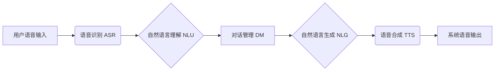

# Python深度学习实践：深度学习在虚拟助理中的应用

作者：禅与计算机程序设计艺术 / Zen and the Art of Computer Programming

关键词：深度学习、虚拟助理、自然语言处理、语音识别、对话系统、Transformer、BERT、GPT

## 1. 背景介绍

### 1.1 问题的由来

随着人工智能技术的飞速发展，虚拟助理已经成为人们日常生活中不可或缺的一部分。从 Apple 的 Siri、Google 的 Google Assistant，到 Amazon 的 Alexa 和微软的 Cortana，各大科技巨头都在虚拟助理领域投入了大量的研发资源。然而，传统的虚拟助理系统在处理复杂的自然语言交互时，仍然存在着许多局限性和挑战。

### 1.2 研究现状

近年来，深度学习技术的兴起为虚拟助理的发展带来了新的机遇。深度学习模型在自然语言处理、语音识别、对话管理等方面表现出了优异的性能，使得虚拟助理能够更加智能化和人性化。目前，业界主流的深度学习模型包括 Transformer、BERT、GPT 等，它们在各种自然语言处理任务上都取得了state-of-the-art的结果。

### 1.3 研究意义

将深度学习技术应用于虚拟助理，可以极大地提升虚拟助理的智能化水平，使其能够更好地理解用户的意图，生成更加自然流畅的对话响应。这不仅能够改善用户体验，提高用户满意度，还能够拓展虚拟助理的应用场景，为人们的生活和工作带来更多便利。同时，深度学习在虚拟助理中的研究也将推动自然语言处理、语音识别等领域的发展，具有重要的理论和实践意义。

### 1.4 本文结构

本文将从以下几个方面探讨深度学习在虚拟助理中的应用：

- 第二部分介绍虚拟助理中的核心概念与它们之间的联系；
- 第三部分详细阐述深度学习的核心算法原理和具体操作步骤；  
- 第四部分建立数学模型，推导相关公式，并给出详细的举例说明；
- 第五部分给出基于Python的代码实例，并对关键代码进行解释说明；
- 第六部分讨论深度学习在虚拟助理中的实际应用场景和未来展望；
- 第七部分推荐相关的工具和学习资源；
- 第八部分对全文进行总结，分析虚拟助理未来的发展趋势与面临的挑战；
- 第九部分的附录中列出了一些常见问题与解答，以便读者进一步理解和掌握相关内容。

## 2. 核心概念与联系

在虚拟助理中，有几个核心概念需要了解和区分：

- **自然语言理解(NLU)**：NLU 的目标是让机器能够理解自然语言的语义和意图。它包括了词法分析、句法分析、语义分析等多个层面的处理。深度学习模型如 BERT 在 NLU 任务上表现优异。

- **自然语言生成(NLG)**：NLG 指的是根据给定的信息和知识，自动生成自然语言文本的过程。深度学习模型如 GPT 在文本生成方面取得了瞩目的成果。

- **语音识别(ASR)**：语音识别是将语音信号转换为相应的文本内容。端到端的深度学习模型在 ASR 任务上已经达到了与人类相当的识别水平。

- **语音合成(TTS)**：语音合成是将文本内容转化为自然流畅的语音。基于深度学习的参数语音合成系统，如 Tacotron 和 WaveNet，能够生成高度拟人的语音。

- **对话管理(DM)**：对话管理负责控制人机对话的流程，决定系统应该如何响应用户的输入。深度强化学习算法被广泛用于构建对话管理模型。

下图展示了这些概念在虚拟助理系统中的关系和数据流向：

可以看到，用户的语音输入首先经过 ASR 转换为文本，然后由 NLU 对文本进行理解，提取出语义信息传递给 DM。DM 根据对话历史、知识库等信息，决定系统应该如何回复，生成回复文本。NLG 负责将文本转化为自然流畅的语句，最后由 TTS 合成语音输出给用户。整个过程环环相扣，共同完成人机语音交互。

## 3. 核心算法原理 & 具体操作步骤

### 3.1 算法原理概述

虚拟助理系统中的核心算法主要包括 Transformer、BERT、GPT 等深度学习模型。它们都基于 Transformer 架构，使用自注意力机制和残差连接，能够建模长距离的语义依赖。

- **Transformer**：Transformer 是一种基于自注意力机制的Seq2Seq模型，包含编码器和解码器两部分。编码器用于对输入序列进行特征提取，解码器根据编码器的输出和之前的预测结果，生成目标序列。

- **BERT**：BERT 是一种预训练的语言模型，采用双向 Transformer 编码器结构。通过 Masked LM 和 Next Sentence Prediction 两个预训练任务，BERT 可以学习到语言的通用表示，再经过微调即可应用到下游的 NLP 任务中。

- **GPT**：GPT 系列模型是自回归的语言模型，使用 Transformer 解码器结构。它们以自左向右的方式生成文本，可以用于开放域对话、文本摘要、问答等任务。GPT-3 模型参数量高达 1750 亿，具有强大的零样本学习能力。

### 3.2 算法步骤详解

以 BERT 为例，其训练和应用的具体步骤如下：

1. **预训练阶段**：
   - 准备大规模无标注文本语料，进行数据清洗和预处理；
   - 对每个输入序列进行随机 Masking，用 [MASK] 标记替换其中的部分 token；
   - 将输入序列传入 BERT 模型，通过 Masked LM 任务学习根据上下文预测 [MASK] 位置的原始 token；
   - 同时进行 Next Sentence Prediction 任务，判断两个句子在原文中是否相邻；
   - 不断迭代上述过程，直到模型收敛，得到预训练的 BERT 模型参数。

2. **微调阶段**：
   - 根据具体的下游任务，准备相应的标注数据集；
   - 在 BERT 模型的基础上，添加任务特定的输出层，如分类层、序列标注层等；
   - 将下游任务的数据输入到微调后的 BERT 模型中，计算损失函数，进行梯度反向传播和参数更新； 
   - 不断迭代微调过程，直到模型在验证集上达到最优性能。

3. **推理阶段**：
   - 将微调后的 BERT 模型部署到生产环境中；
   - 接收用户的输入文本，对其进行预处理和特征提取；
   - 将特征向量输入到 BERT 模型中，经过前向传播得到预测结果；
   - 对预测结果进行后处理，输出最终的结果。

### 3.3 算法优缺点

深度学习算法在虚拟助理中的优点包括：

- 端到端的建模方式，减少了人工特征工程的工作量；
- 强大的特征提取和语义建模能力，能够处理复杂的自然语言；
- 通过预训练和迁移学习，可以显著提升模型的泛化能力；
- 模型参数量大，有利于学习和记忆大规模的知识。

同时，深度学习算法也存在一些局限性：

- 需要大量的标注数据和计算资源进行训练，成本较高；
- 模型的可解释性较差，难以分析其内部工作机制；
- 对于一些小样本和零样本的任务，深度学习模型的性能仍有待提高；
- 在推理阶段，大模型的推理速度和内存占用较高，不利于实时响应。

### 3.4 算法应用领域

深度学习算法在虚拟助理的各个模块中都有广泛的应用，如：

- ASR 中的声学模型和语言模型；
- NLU 中的意图识别、槽位填充、命名实体识别等任务；
- DM 中的对话策略学习和优化；
- NLG 中的文本生成和摘要；
- TTS 中的声学模型和声码器。

此外，深度学习在其他智能系统中也有许多应用，如智能客服、智能教育、智能家居等。随着算法的不断发展和完善，深度学习必将在更多领域发挥重要作用。

## 4. 数学模型和公式 & 详细讲解 & 举例说明

### 4.1 数学模型构建

以 Transformer 模型为例，其核心是自注意力机制和残差连接。

假设输入序列为 $\mathbf{X} = (\mathbf{x}_1, \mathbf{x}_2, \cdots, \mathbf{x}_n)$，其中 $\mathbf{x}_i \in \mathbb{R}^d$ 表示第 $i$ 个词的词向量，$d$ 为词向量维度，$n$ 为序列长度。

在自注意力机制中，首先通过线性变换得到查询矩阵 $\mathbf{Q}$、键矩阵 $\mathbf{K}$ 和值矩阵 $\mathbf{V}$：

$$
\mathbf{Q} = \mathbf{X} \mathbf{W}^Q, \quad
\mathbf{K} = \mathbf{X} \mathbf{W}^K, \quad
\mathbf{V} = \mathbf{X} \mathbf{W}^V
$$

其中 $\mathbf{W}^Q, \mathbf{W}^K, \mathbf{W}^V \in \mathbb{R}^{d \times d_k}$ 是可学习的权重矩阵，$d_k$ 是注意力机制的维度。

然后计算注意力权重矩阵 $\mathbf{A}$：

$$
\mathbf{A} = \text{softmax}(\frac{\mathbf{Q}\mathbf{K}^T}{\sqrt{d_k}})
$$

其中 softmax 函数用于将注意力权重归一化到 [0, 1] 之间。

最后，根据注意力权重矩阵 $\mathbf{A}$ 对值矩阵 $\mathbf{V}$ 进行加权求和，得到自注意力的输出 $\mathbf{Z}$：

$$
\mathbf{Z} = \mathbf{A} \mathbf{V}
$$

在残差连接中，自注意力的输出 $\mathbf{Z}$ 与输入 $\mathbf{X}$ 相加，再经过层归一化(Layer Normalization)得到最终的输出 $\mathbf{H}$：

$$
\mathbf{H} = \text{LayerNorm}(\mathbf{Z} + \mathbf{X})
$$

通过堆叠多个这样的 Transformer 块，就构成了完整的 Transformer 模型。

### 4.2 公式推导过程

以上公式的推导过程如下：

1. 将输入序列 $\mathbf{X}$ 通过线性变换得到 $\mathbf{Q}, \mathbf{K}, \mathbf{V}$：
$$
\begin{aligned}
\mathbf{Q} &= \mathbf{X} \mathbf{W}^Q \\
\mathbf{K} &= \mathbf{X} \mathbf{W}^K \\
\mathbf{V} &= \mathbf{X} \mathbf{W}^V
\end{aligned}
$$

2. 计算 $\mathbf{Q}$ 和 $\mathbf{K}$ 的内积，并除以 $\sqrt{d_k}$ 进行缩放：
$$
\mathbf{S} = \frac{\mathbf{Q}\mathbf{K}^T}{\sqrt{d_k}}
$$

3. 对缩放后的内积结果应用 softmax 函数，得到注意力权重矩阵 $\mathb