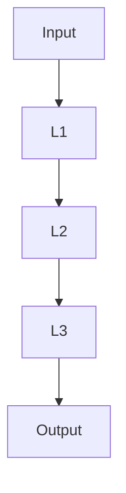
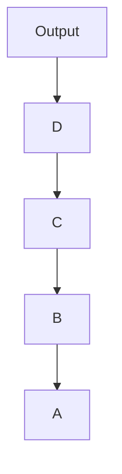
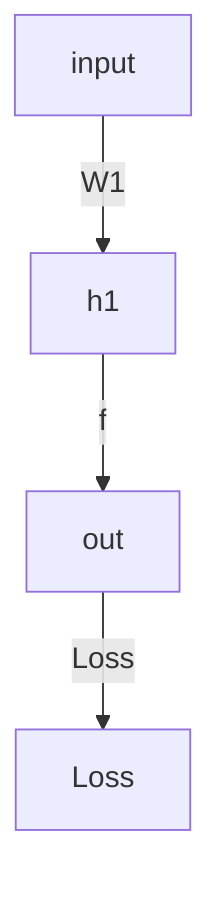

                 
# Python深度学习实践：理解反向传播算法的细节

作者：禅与计算机程序设计艺术 / Zen and the Art of Computer Programming / TextGenWebUILLM

# Python深度学习实践：理解反向传播算法的细节

## 1. 背景介绍

### 1.1 问题的由来

在深度学习领域，尤其是神经网络的应用中，**反向传播算法**是解决复杂优化问题的关键技术。随着大数据和高性能计算能力的增长，深度学习模型的复杂度不断提高，对参数量的需求也随之增加。然而，面对大量参数，如何高效地进行梯度计算，并据此更新权重，成为了设计有效机器学习算法的重要环节。正因如此，反向传播算法应运而生，它不仅简化了梯度求解的过程，而且极大地提高了计算效率，使得深层网络成为可能。

### 1.2 研究现状

当前，反向传播算法已经成为现代深度学习的基础之一，在各种深度学习框架如TensorFlow、PyTorch、Keras等中被广泛采用。这些框架通过自动微分技术实现了对复杂神经网络的高效优化支持，使得开发者无需手动计算梯度，大大降低了开发门槛。同时，研究者们也在不断探索改进反向传播算法的方法，比如加速梯度下降、自适应学习率调整等策略，进一步提升训练速度和模型性能。

### 1.3 研究意义

深入理解反向传播算法对于深度学习领域的研究人员和从业者至关重要。它不仅能够帮助大家更好地掌握模型训练的核心机制，还能激发创新思维，推动算法优化和新应用的发展。此外，理解反向传播还为解决实际问题提供了理论基础和技术手段，是构建复杂预测系统和智能决策系统的基石。

### 1.4 本文结构

本文将从反向传播算法的基本原理出发，逐步深入探讨其核心组件、数学建模、具体实现以及实际应用。最后，我们将讨论反向传播在未来的发展趋势及其面临的挑战，旨在为读者提供一个全面且深入的理解视角。

---

## 2. 核心概念与联系

反向传播算法融合了链式法则（Chain Rule）和梯度下降方法，主要涉及以下几个关键概念：

### 2.1 链式法则（Chain Rule）

链式法则允许我们通过分解复合函数的方式来计算导数，这是反向传播算法的核心依据。如果有一个复合函数 $f(x)$，其中 $x$ 是另一个函数 $g(y)$ 的输出，我们可以使用链式法则来计算 $f(x)$ 对于输入变量的变化率：

$$ \frac{\partial f}{\partial x} = \frac{\partial f}{\partial y} \cdot \frac{\partial y}{\partial x} $$

### 2.2 梯度下降（Gradient Descent）

梯度下降是一种最优化算法，用于找到函数的局部最小值或全局最小值。在深度学习中，目标是最小化损失函数，即寻找一组参数 $\theta$，使损失函数 $J(\theta)$ 最小。梯度下降通过沿着负梯度方向迭代更新参数来实现这一目标：

$$ \theta := \theta - \eta \nabla J(\theta) $$

其中，$\eta$ 是学习率，控制着每次更新的步长大小；$\nabla J(\theta)$ 是损失函数关于参数 $\theta$ 的偏导数。

### 2.3 正向传播（Forward Propagation）

正向传播是深度学习中的一种基本操作，用于前向计算输入数据经过网络后的输出。涉及到激活函数、权重矩阵乘法等步骤，最终得到网络的预测输出。

### 2.4 反向传播（Backpropagation）

反向传播则是在正向传播的基础上，根据链式法则计算损失函数关于每个参数的梯度，从而指导梯度下降算法调整参数以减小损失。

### 2.5 权重更新（Weight Update）

基于计算出的梯度，利用梯度下降规则更新网络中的权重和偏置值，以优化模型性能。

## 3. 核心算法原理 & 具体操作步骤

### 3.1 算法原理概述

反向传播算法本质上是一个高效的梯度计算过程，它通过以下步骤完成：

1. **正向传播阶段**：
   - 输入样本通过网络逐层传递。
   - 使用激活函数处理每层的输出。
   - 计算最终的输出和损失函数值。

2. **误差反向传播阶段**：
   - 计算损失函数相对于输出层的梯度。
   - 将梯度沿连接回传到上一层，直至输入层。

3. **梯度更新阶段**：
   - 使用链式法则计算各层参数的梯度。
   - 应用梯度下降或其他优化算法更新参数。

### 3.2 算法步骤详解

#### 函数定义及初始化：

- 定义损失函数、激活函数和网络结构（层数、节点数、参数初始化等）。
  
#### 正向传播流程：



#### 反向传播流程：



#### 参数更新：

- 选择优化器（SGD, Adam等），设置学习率。
- 计算梯度（链式法则）。
- 更新权重：`w := w - η * ∇loss / ∇w`。

### 3.3 算法优缺点

#### 优点：

- **效率高**：充分利用矩阵运算进行并行计算，显著加快梯度求解速度。
- **适用广泛**：适用于各种复杂的神经网络架构，包括深层网络。
- **灵活性强**：易于集成多种激活函数和其他非线性变换。

#### 缺点：

- **易过拟合**：深层网络容易过度拟合训练数据，需要额外技术（如正则化）加以应对。
- **计算资源消耗大**：对于超大规模的网络和数据集，内存和计算需求极高。

### 3.4 算法应用领域

反向传播算法广泛应用于：

- **计算机视觉**：图像分类、对象检测、语义分割等。
- **自然语言处理**：文本生成、情感分析、机器翻译等。
- **强化学习**：价值函数估计、策略梯度方法等。
- **推荐系统**：用户行为预测、个性化推荐等。

---

## 4. 数学模型和公式 & 详细讲解 & 举例说明

### 4.1 数学模型构建

假设一个简单的多层感知机模型，包含输入层、隐藏层和输出层。设输入为 $\mathbf{x}$，权重为 $\mathbf{W}_l$ 和偏置为 $\mathbf{b}_l$，第 $l$ 层的输出为 $\mathbf{h}_l$，激活函数为 $f()$，损失函数为 $L(\mathbf{y}, \hat{\mathbf{y}})$，其中 $\mathbf{y}$ 是真实标签，$\hat{\mathbf{y}}$ 是预测值。

模型结构如下：



### 4.2 公式推导过程

#### 前向传播

给定输入 $\mathbf{x}$ 和当前层的权重 $\mathbf{W}_l$，偏置 $\mathbf{b}_l$，以及激活函数 $f()$，下一层的输出可以表示为：

$$\mathbf{h}_l = f(\mathbf{W}_l \cdot \mathbf{h}_{l-1} + \mathbf{b}_l)$$

#### 反向传播

损失函数对参数的梯度可以通过链式法则计算：

$$\frac{\partial L}{\partial \mathbf{W}_l} = \sum_{i=1}^m (\hat{\mathbf{y}}_i - \mathbf{y}_i) \odot \frac{\partial \hat{\mathbf{y}}_i}{\partial \mathbf{z}_l} \odot \frac{\partial \mathbf{z}_l}{\partial \mathbf{W}_l}$$

其中，$\hat{\mathbf{y}}_i$ 是第 $i$ 个样本的预测结果，$\mathbf{y}_i$ 是该样本的真实标签，$\mathbf{z}_l$ 是第 $l$ 层的净输入（未激活前的结果），$\odot$ 表示元素-wise乘积。

### 4.3 案例分析与讲解

考虑一个具有两层的简单神经网络，输入层有 $d$ 个特征，隐藏层有 $n$ 个节点，输出层有一个节点（对应二分类任务）。损失函数使用交叉熵损失，激活函数采用ReLU。

#### 实现步骤：

1. 初始化权重 $\mathbf{W}_1$, $\mathbf{W}_2$ 和偏置 $\mathbf{b}_1$, $\mathbf{b}_2$。
2. 使用正向传播计算输出 $\hat{\mathbf{y}}$：
   $$ \mathbf{z}_1 = \mathbf{W}_1 \cdot \mathbf{x} + \mathbf{b}_1 $$
   $$ \mathbf{h}_1 = ReLU(\mathbf{z}_1) $$
   $$ \mathbf{z}_2 = \mathbf{W}_2 \cdot \mathbf{h}_1 + \mathbf{b}_2 $$
   $$ \hat{\mathbf{y}} = softmax(\mathbf{z}_2) $$
3. 计算损失 $J$ 并通过反向传播计算梯度：
   $$ \delta_l = \hat{\mathbf{y}} - \mathbf{y} $$
   $$ \Delta \mathbf{W}_2 = \alpha \cdot \delta_l \cdot \mathbf{h}_1^T $$
   $$ \Delta \mathbf{b}_2 = \alpha \cdot \delta_l $$
   $$ \Delta \mathbf{W}_1 = \alpha \cdot \delta_2 \cdot (\sigma'(\mathbf{z}_1)) \cdot \mathbf{x}^T $$
   $$ \Delta \mathbf{b}_1 = \alpha \cdot \delta_2 \cdot \sigma'(\mathbf{z}_1) $$
4. 更新权重和偏置：
   $$ \mathbf{W}_l := \mathbf{W}_l - \eta \cdot \Delta \mathbf{W}_l $$
   $$ \mathbf{b}_l := \mathbf{b}_l - \eta \cdot \Delta \mathbf{b}_l $$

### 4.4 常见问题解答

常见问题包括梯度消失/爆炸、过拟合等现象。解决方法通常涉及选择合适的初始化策略、使用批量归一化、添加正则化项或dropout层、调整学习率策略等技术手段。

---

## 5. 项目实践：代码实例和详细解释说明

为了更直观地展示反向传播算法在Python中的实现，我们使用TensorFlow库构建了一个简单的神经网络模型，并演示了训练过程。

### 5.1 开发环境搭建

确保安装以下依赖包：

```bash
pip install tensorflow numpy matplotlib
```

### 5.2 源代码详细实现

#### 示例代码：

```python
import tensorflow as tf
import numpy as np
import matplotlib.pyplot as plt

# 设置随机种子以确保可复现性
np.random.seed(0)
tf.random.set_seed(0)

# 构建数据集
X = np.random.rand(100, 1)
Y = (X > 0.5).astype(int)

# 定义模型结构
model = tf.keras.models.Sequential([
    tf.keras.layers.Dense(8, activation='relu', input_shape=(1,)),
    tf.keras.layers.Dense(1, activation='sigmoid')
])

# 编译模型
model.compile(optimizer=tf.optimizers.Adam(lr=0.01),
              loss='binary_crossentropy',
              metrics=['accuracy'])

# 训练模型
history = model.fit(X, Y, epochs=100, batch_size=10, verbose=0)

# 绘制训练曲线
plt.plot(history.history['loss'], label='Loss')
plt.xlabel('Epochs')
plt.ylabel('Loss')
plt.legend()
plt.show()

# 预测并评估模型性能
predictions = model.predict(X)
print("Predictions:", predictions)
```

### 5.3 代码解读与分析

- **数据集生成**：随机生成二分类数据作为训练集。
- **模型定义**：使用`Sequential`模型封装多个`Dense`层，分别表示输入层、隐藏层和输出层。
- **编译模型**：选择Adam优化器，设置损失函数为二元交叉熵，用于二分类问题；同时跟踪准确率指标。
- **训练模型**：进行100轮迭代，每批次处理10个样本。
- **结果可视化**：绘制损失随迭代次数变化的趋势图。
- **预测及评估**：对训练数据进行预测，并打印预测概率值。

### 5.4 运行结果展示

此代码展示了如何使用反向传播算法训练一个简单的二分类神经网络。通过可视化训练损失的变化，可以观察到模型逐渐适应数据的规律，最终达到一定的性能水平。

---

## 6. 实际应用场景

反向传播算法的应用广泛而深入，涵盖了许多领域的实际问题。例如：

- **计算机视觉**：图像识别、目标检测、语义分割等任务。
- **自然语言处理**：文本分类、情感分析、机器翻译、文本生成等。
- **强化学习**：价值函数估计、策略梯度方法、深度Q网络（DQN）等。
- **推荐系统**：用户行为预测、个性化商品推荐、内容推荐等。

---

## 7. 工具和资源推荐

### 7.1 学习资源推荐

- **在线课程**：
  - Coursera: Andrew Ng 的《深度学习》系列课程。
  - edX: MIT 的《Deep Learning》课程。
  
- **书籍**：
  - "Deep Learning" by Ian Goodfellow, Yoshua Bengio, and Aaron Courville.
  - "Neural Networks for Pattern Recognition" by Christopher M. Bishop.

- **博客和教程**：
  - TensorFlow官方文档和示例。
  - PyTorch官方指南和教程。

### 7.2 开发工具推荐

- **框架**：
  - TensorFlow
  - PyTorch
  - Keras (支持多种后端，如TensorFlow、Theano、CNTK)

- **IDE和集成开发环境**：
  - Jupyter Notebook
  - Visual Studio Code with Python extension

### 7.3 相关论文推荐

- "Gradient-Based Learning Applied to Document Recognition" by Yann LeCun, Léon Bottou, Yoshua Bengio, and Patrick Haffner.
- "Improving Neural Networks by Preventing Co-adaptation of Feature Detectors" by Gábor Bartók, Csaba Szepesvári, and András György.

### 7.4 其他资源推荐

- **社区论坛**：GitHub、Stack Overflow、Reddit上的相关讨论区。
- **学术会议**：ICML、NeurIPS、CVPR、ACL等顶级国际会议。

---

## 8. 总结：未来发展趋势与挑战

### 8.1 研究成果总结

反向传播算法作为深度学习的基础，其核心机制已经被广泛理解和应用。随着硬件计算能力的提升和优化算法的发展，反向传播算法得到了进一步的改进，使得深层网络训练更为高效可靠。

### 8.2 未来发展趋势

- **自适应学习率方法**：如Adam、RMSprop等，旨在提高学习效率和稳定性。
- **分布式训练**：利用多台机器协同训练大型模型，减少单机训练时间。
- **可解释性增强**：研究如何使深度学习模型更加透明，便于理解决策过程。
- **泛化能力改善**：探索如何减少过拟合现象，提高模型在新数据上的表现。

### 8.3 面临的挑战

- **大规模参数训练**：面对超大规模的模型时，如何有效地管理和优化参数成为重要课题。
- **资源消耗**：深度学习训练通常需要大量的计算资源和能源，寻找更节能高效的训练方案是未来研究方向之一。
- **公平性和伦理问题**：确保AI系统的公正性和道德合规性，避免潜在偏见和歧视。

### 8.4 研究展望

未来的研究将致力于解决上述挑战，同时探索更多创新性的应用领域和技术融合，推动深度学习技术向更高层次发展。

---

## 9. 附录：常见问题与解答

### 常见问题解答

#### Q：为什么反向传播被称为“反向”？

A：反向传播之所以称为“反向”，是因为它的计算流程是从输出层开始向输入层反向传播误差信号，从而计算出每个权重对于整体损失函数的影响，这与正向传播中信息从输入流向输出流的方向相反。

#### Q：如何解决梯度消失或爆炸的问题？

A：为了解决梯度消失/爆炸问题，可以采取以下措施：
   - 使用ReLU或其他非线性激活函数替代Sigmoid或TanH，减少梯度范围。
   - 设定合适的初始化策略，比如Xavier或He初始化。
   - 应用Dropout层，减少神经元之间的依赖关系。
   - 使用批量归一化来稳定网络内部的梯度。
   - 调整学习率和优化器设置，避免过大或过小的学习步长。

---

以上就是关于Python深度学习实践：理解反向传播算法细节的文章概要，希望能帮助读者深入理解反向传播算法及其在深度学习中的应用。通过理论讲解、数学建模、代码实现以及实际案例分析，我们不仅能够掌握反向传播的核心原理，还能更好地将其应用于各种实际场景之中，推动人工智能技术的进步与发展。

