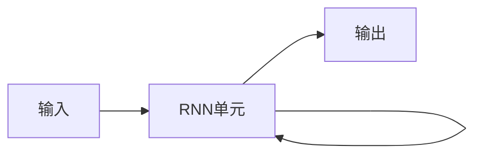

尊敬的读者朋友们,大家好!今天我们来探讨一个在自然语言处理、语音识别、时序数据分析等领域应用广泛的深度学习模型——循环神经网络(Recurrent Neural Networks,简称RNN)。作为一个资深的人工智能从业者,我将从RNN的背景介绍入手,深入剖析其核心概念、数学原理,并结合代码实例对RNN的实现进行详细讲解。希望通过本文,能让大家对RNN有一个全面而深入的认识。下面,就让我们开始RNN的探索之旅吧!

## 1. 背景介绍
### 1.1 问题的由来
在许多现实场景中,我们需要处理一些具有时序关联性的数据,比如自然语言文本、语音信号、股票价格等。这类数据的当前状态往往与之前的历史状态有着密切的联系。然而,传统的前馈神经网络(Feedforward Neural Networks)结构无法很好地建模这种时序数据的长期依赖关系。为了解决这一问题,RNN应运而生。

### 1.2 研究现状
RNN自提出以来,经历了长足的发展。从最初的Elman网络、Jordan网络,到后来的长短期记忆网络(LSTM)、门控循环单元网络(GRU)等,RNN的结构不断改进,性能持续提升。目前,RNN已经成为时序数据建模的主流方法之一,在机器翻译、语音识别、情感分析、图像描述生成等诸多任务上取得了瞩目的成绩。

### 1.3 研究意义
RNN为时序数据的建模提供了一种新的思路和方法,极大地拓展了深度学习的应用范围。对RNN的深入研究,不仅有助于我们更好地理解和掌握这一强大的工具,也为相关领域的技术创新奠定了坚实的基础。同时,RNN的研究也促进了人工智能在工业、医疗、金融等行业的应用,为社会发展做出了重要贡献。

### 1.4 本文结构
本文将分为以下几个部分对RNN进行全面而深入的讨论:

1. RNN的背景介绍  
2. RNN的核心概念与内在联系
3. RNN的核心算法原理与具体操作步骤
4. RNN涉及的数学模型与公式推导
5. RNN的代码实现与详细解读
6. RNN的实际应用场景与案例分析
7. RNN相关的工具与学习资源推荐
8. RNN未来的发展趋势与面临的挑战
9. 常见问题解答与补充说明

## 2. 核心概念与联系

在讨论RNN的核心概念之前,我们先回顾一下传统的前馈神经网络。在前馈网络中,数据是单向流动的,从输入层到隐藏层再到输出层,每一层的神经元只与前一层的神经元相连。这种结构虽然简单高效,但无法处理数据之间的时序关联性。

与之不同,RNN引入了一种循环机制,使当前时刻的神经元不仅与前一层神经元相连,还与上一时刻的自身状态相关。通过这种循环连接,RNN能够建模数据的时间依赖关系,在处理时序数据时展现出独特的优势。下图展示了RNN的基本结构:

从图中可以看出,RNN的核心组件是一个带有循环连接的RNN单元。在每个时间步,RNN单元接收当前时刻的输入和上一时刻的隐藏状态,经过非线性变换后产生新的隐藏状态和输出。这个过程可以用以下公式表示:

$$
h_t = f(W_{xh}x_t + W_{hh}h_{t-1} + b_h)
$$
$$
y_t = g(W_{hy}h_t + b_y)  
$$

其中,$h_t$表示 $t$ 时刻的隐藏状态,$x_t$为 $t$ 时刻的输入,$y_t$为 $t$ 时刻的输出,$W$和$b$分别为权重矩阵和偏置项,$f$和$g$为激活函数(通常选择tanh或sigmoid函数)。

从公式可以看出,当前时刻的隐藏状态$h_t$不仅取决于当前输入$x_t$,还受到上一时刻隐藏状态$h_{t-1}$的影响。这种循环机制使RNN能够建模数据的长期依赖关系,在处理时序数据时表现出色。

需要注意的是,上述公式描述的是最基本的RNN结构,在实际应用中还衍生出了许多重要的变体,如双向RNN、深层RNN等。这些变体在结构上进行了改进和扩展,以进一步提升RNN的性能。

## 3. 核心算法原理 & 具体操作步骤
### 3.1 算法原理概述
RNN的核心是通过循环连接,在时间维度上建立起数据的关联性。具体而言,RNN在每个时间步接收一个输入,结合之前的隐藏状态,经过非线性变换产生新的隐藏状态和输出。随着时间的推移,RNN逐步更新隐藏状态,从而捕捉到数据的时序特征。

### 3.2 算法步骤详解
下面我们详细讲解RNN的前向传播和反向传播算法步骤。

#### 前向传播
1. 输入数据:将时序数据表示为一个向量序列$\{x_1,x_2,...,x_T\}$,其中$T$为序列长度。
2. 初始化隐藏状态:令$h_0$为全零向量或随机初始化的向量。
3. 循环计算隐藏状态和输出:对于$t=1,2,...,T$,按照以下公式计算$h_t$和$y_t$:
   $$h_t = f(W_{xh}x_t + W_{hh}h_{t-1} + b_h)$$
   $$y_t = g(W_{hy}h_t + b_y)$$
4. 输出结果:将$\{y_1,y_2,...,y_T\}$作为RNN的输出。

#### 反向传播
1. 计算损失函数:根据任务的不同,选择合适的损失函数,如均方误差、交叉熵等。
2. 计算输出层的梯度:对于$t=T,T-1,...,1$,计算损失函数对$y_t$的梯度$\frac{\partial L}{\partial y_t}$。
3. 计算隐藏层的梯度:对于$t=T,T-1,...,1$,按照以下公式计算$\frac{\partial L}{\partial h_t}$:
   $$\frac{\partial L}{\partial h_t} = \frac{\partial L}{\partial y_t}\frac{\partial y_t}{\partial h_t} + \frac{\partial L}{\partial h_{t+1}}\frac{\partial h_{t+1}}{\partial h_t}$$
4. 计算参数的梯度:根据隐藏层和输出层的梯度,计算损失函数对权重矩阵$W$和偏置项$b$的梯度。
5. 更新参数:使用优化算法(如梯度下降)更新RNN的参数。

以上就是RNN前向传播和反向传播的基本步骤。需要注意的是,由于RNN在时间维度上展开,梯度的计算和传播也是沿时间反向进行的。这种通过时间反向传播(BPTT)的方式使RNN能够学习到数据的长期依赖关系。

### 3.3 算法优缺点
RNN算法的优点主要有:
1. 能够建模时序数据的长期依赖关系,在处理自然语言、语音等数据时表现出色。
2. 结构灵活,可以根据任务需求设计不同的变体,如双向RNN、深层RNN等。
3. 参数共享,不同时间步的计算共享同一组参数,大大减少了参数量。

但RNN也存在一些缺点:
1. 训练过程中容易出现梯度消失或梯度爆炸问题,导致模型难以捕捉长期依赖。
2. 计算复杂度较高,难以处理非常长的序列。
3. 无法并行计算,因为当前时间步的计算依赖于前一时间步的隐藏状态。

针对以上问题,研究者提出了一些改进方案,如LSTM、GRU等,在一定程度上缓解了RNN的局限性。

### 3.4 算法应用领域
RNN在以下领域有着广泛的应用:
1. 自然语言处理:机器翻译、情感分析、文本生成等。
2. 语音识别:将语音信号转化为文本。
3. 时间序列预测:股票价格预测、销量预测等。
4. 图像描述生成:根据图像生成自然语言描述。
5. 手写识别:将手写文字转化为计算机可编辑的文本。

## 4. 数学模型和公式 & 详细讲解 & 举例说明
### 4.1 数学模型构建
RNN可以看作一个参数共享的深度前馈网络,其数学模型可以用以下公式表示:
$$h_t = f(W_{xh}x_t + W_{hh}h_{t-1} + b_h)$$
$$y_t = g(W_{hy}h_t + b_y)$$

其中,$h_t \in \mathbb{R}^n$表示 $t$ 时刻的隐藏状态,$x_t \in \mathbb{R}^d$为 $t$ 时刻的输入,$y_t \in \mathbb{R}^q$为 $t$ 时刻的输出。$W_{xh} \in \mathbb{R}^{n \times d}, W_{hh} \in \mathbb{R}^{n \times n}, W_{hy} \in \mathbb{R}^{q \times n}$分别为输入到隐藏层、隐藏层到隐藏层、隐藏层到输出层的权重矩阵,$b_h \in \mathbb{R}^n, b_y \in \mathbb{R}^q$为隐藏层和输出层的偏置项。$f$和$g$为激活函数,常见的选择有tanh、sigmoid、ReLU等。

### 4.2 公式推导过程
下面我们以均方误差为例,推导RNN的反向传播公式。

假设样本的真实输出为$\{d_1,d_2,...,d_T\}$,则 $t$ 时刻的均方误差损失函数为:
$$L_t = \frac{1}{2} \lVert d_t - y_t \rVert^2$$

整个序列的损失函数为各时间步损失之和:
$$L = \sum_{t=1}^T L_t = \frac{1}{2} \sum_{t=1}^T \lVert d_t - y_t \rVert^2$$

根据反向传播算法,我们需要计算损失函数对各参数的梯度。首先,计算损失函数对输出层的梯度:
$$\frac{\partial L_t}{\partial y_t} = y_t - d_t$$

然后,计算损失函数对隐藏层的梯度。由于当前时刻的隐藏状态影响了后续时刻的输出,因此需要考虑来自未来时刻的梯度信息:
$$\frac{\partial L}{\partial h_t} = \frac{\partial L_t}{\partial h_t} + \frac{\partial L}{\partial h_{t+1}}\frac{\partial h_{t+1}}{\partial h_t}$$
$$= \frac{\partial L_t}{\partial y_t}\frac{\partial y_t}{\partial h_t} + \frac{\partial L}{\partial h_{t+1}}\frac{\partial f}{\partial h_t}$$
$$= W_{hy}^T(y_t - d_t) + W_{hh}^T\frac{\partial L}{\partial h_{t+1}} \odot f'(W_{xh}x_t + W_{hh}h_{t-1} + b_h)$$

其中,$\odot$表示Hadamard积(逐元素相乘),$f'$为激活函数$f$的导数。

最后,计算损失函数对权重矩阵和偏置项的梯度:
$$\frac{\partial L}{\partial W_{hy}} = \sum_{t=1}^T \frac{\partial L_t}{\partial y_t} h_t^T$$
$$\frac{\partial L}{\partial b_y} = \sum_{t=1}^T \frac{\partial L_t}{\partial y_t}$$
$$\frac{\partial L}{\partial W_{xh}} = \sum_{t=1}^T \frac{\partial L}{\partial h_t} x_t^T$$
$$\frac{\partial L}{\partial W_{hh}} = \sum_{t=1}^T \frac{\partial L}{\partial h_t}