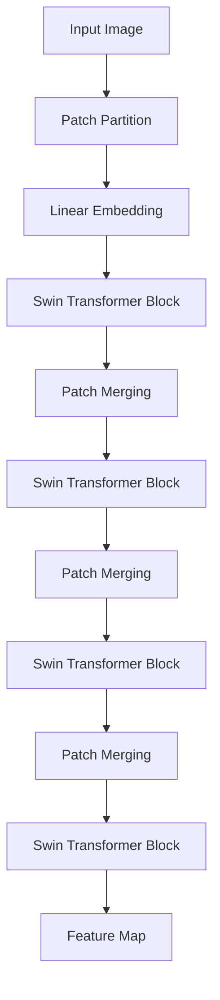

# SwinTransformer在图像检测中的应用

关键词：SwinTransformer，图像检测，深度学习，计算机视觉，Transformer

## 1. 背景介绍
### 1.1  问题的由来
随着人工智能技术的飞速发展，计算机视觉领域取得了突破性的进展。图像检测作为计算机视觉的核心任务之一，在安防监控、自动驾驶、医学影像等众多领域有着广泛的应用。传统的图像检测方法主要基于手工设计的特征，难以应对复杂场景下的检测任务。近年来，深度学习技术的兴起为图像检测带来了新的突破，其中卷积神经网络（CNN）在图像检测任务上取得了显著的性能提升。

### 1.2  研究现状
目前，主流的图像检测算法主要基于CNN框架，如Faster R-CNN、YOLO、SSD等。这些算法在检测精度和速度上都取得了优异的表现。然而，CNN存在一些固有的局限性，如卷积操作的局部感受野限制了全局信息的获取，难以建模长距离的特征依赖关系。

最近，Transformer模型在自然语言处理领域取得了巨大成功，其强大的建模能力和并行计算效率引起了计算机视觉领域研究者的关注。Vision Transformer (ViT)率先将Transformer引入图像分类任务，取得了优于CNN的性能。受此启发，研究者们开始探索将Transformer用于图像检测任务。

### 1.3  研究意义
SwinTransformer是微软亚洲研究院在2021年提出的一种用于通用图像识别任务的Transformer模型。相比传统的ViT，SwinTransformer引入了层次化的Transformer结构和局部窗口注意力机制，极大地提高了模型在图像领域的表现力和计算效率。

将SwinTransformer应用于图像检测任务，有望突破CNN的局限性，更好地挖掘图像的全局信息和长距离特征依赖关系，进一步提升检测性能。这对于推动图像检测技术的发展和拓展其应用领域具有重要意义。

### 1.4  本文结构
本文将围绕SwinTransformer在图像检测中的应用展开详细论述。第2部分介绍SwinTransformer的核心概念和原理。第3部分重点阐述SwinTransformer用于图像检测的算法流程。第4部分从数学角度对模型进行推导和分析。第5部分给出SwinTransformer在图像检测中的代码实现示例。第6部分讨论SwinTransformer在实际场景中的应用情况。第7部分推荐相关的学习资源和开发工具。第8部分总结全文并展望未来。第9部分列举常见问题解答。

## 2. 核心概念与联系
SwinTransformer是一种基于Transformer结构的图像识别模型，其核心是将输入图像划分为多个不重叠的局部窗口，并在局部窗口内进行自注意力计算。相比传统的ViT，SwinTransformer主要有以下创新点：

1. 层次化的Transformer结构。不同于ViT的单层Transformer，SwinTransformer采用了类似CNN的层次化设计，将Transformer分为多个Stage，逐步缩减特征图尺寸，增加特征通道数，实现特征的层次化提取。

2. 局部窗口注意力机制。传统的ViT在全局范围内计算自注意力，计算复杂度较高。SwinTransformer在局部窗口内计算自注意力，大大减少了计算量，同时也增强了局部特征的表达能力。

3. 跨窗口连接。为了建立不同局部窗口之间的联系，SwinTransformer引入了跨窗口连接机制，通过Shifted Window方式在相邻窗口之间传递信息，增强了全局信息的交互。

4. 相对位置编码。与ViT的绝对位置编码不同，SwinTransformer采用相对位置编码，通过引入相对位置偏置项，使得模型能够更好地建模局部窗口内patch之间的相对位置关系。

下图展示了SwinTransformer的总体架构：

## 3. 核心算法原理 & 具体操作步骤
### 3.1  算法原理概述
将SwinTransformer用于图像检测的核心思路是，用SwinTransformer提取图像的多尺度特征，然后接入检测头网络生成检测结果。具体而言，可以将SwinTransformer作为骨干网络，提取不同Stage的特征图，然后将这些特征图输入FPN等检测头网络，进行目标分类和边界框回归，输出最终的检测结果。

### 3.2  算法步骤详解
1. 图像分块：将输入图像划分为固定大小的patches，如4x4或8x8。

2. 线性映射：对每个patch进行线性映射，将其映射为特征向量。

3. Swin Transformer Block：对特征向量序列进行自注意力计算。在每个Stage内，通过多个Swin Transformer Block对特征进行增强。

4. Patch Merging：在相邻的两个Stage之间，通过Patch Merging操作缩减特征图尺寸，增加通道数。

5. 多尺度特征提取：在不同Stage输出的特征图构成了多尺度的特征表示。

6. 检测头网络：将多尺度特征输入FPN等检测头网络，生成最终的检测结果，包括目标分类和边界框坐标。

### 3.3  算法优缺点
优点：
1. 全局建模能力强，能够捕获长距离的特征依赖关系。
2. 层次化的特征提取，可以生成多尺度的特征表示。
3. 局部窗口注意力机制，减少了计算复杂度，提高了效率。
4. 跨窗口连接增强了局部窗口之间的信息交互。

缺点：
1. 计算复杂度仍然较高，对硬件要求较高。
2. 相比CNN，Transformer结构对数据的需求量更大，训练难度更高。

### 3.4  算法应用领域
SwinTransformer用于图像检测，可以应用于以下领域：
1. 智慧安防：用于监控画面中的目标检测和跟踪。
2. 自动驾驶：用于检测车辆、行人、交通标志等目标。
3. 医学影像：用于病灶区域的检测和定位。
4. 工业视觉：用于工业产品的缺陷检测和质量检测。

## 4. 数学模型和公式 & 详细讲解 & 举例说明
### 4.1  数学模型构建
SwinTransformer的数学模型主要包括以下几个部分：

1. 图像分块与线性映射
设输入图像为$\mathbf{I} \in \mathbb{R}^{H \times W \times C}$，其中$H$,$W$,$C$分别为图像的高度、宽度和通道数。将图像划分为$N$个大小为$P \times P$的patches，得到$\mathbf{X} \in \mathbb{R}^{N \times P^2C}$。然后对每个patch进行线性映射，得到特征向量序列$\mathbf{Z} \in \mathbb{R}^{N \times D}$：

$$\mathbf{Z} = \mathbf{XW}_e + \mathbf{b}_e$$

其中$\mathbf{W}_e \in \mathbb{R}^{P^2C \times D}$和$\mathbf{b}_e \in \mathbb{R}^D$分别为线性映射的权重和偏置项。

2. Swin Transformer Block
Swin Transformer Block由多头自注意力（MSA）和两个全连接层（MLP）组成。对于第$l$个Block，其输入为$\mathbf{Z}^{(l-1)}$，输出为$\mathbf{Z}^{(l)}$：

$$
\begin{aligned}
\hat{\mathbf{Z}}^{(l)} &= \text{MSA}(\text{LN}(\mathbf{Z}^{(l-1)})) + \mathbf{Z}^{(l-1)} \\
\mathbf{Z}^{(l)} &= \text{MLP}(\text{LN}(\hat{\mathbf{Z}}^{(l)})) + \hat{\mathbf{Z}}^{(l)}
\end{aligned}
$$

其中$\text{LN}$为层归一化（Layer Normalization），$\text{MSA}$为局部窗口内的多头自注意力计算，可表示为：

$$
\text{MSA}(\mathbf{Z}) = \text{Concat}(\text{head}_1, \dots, \text{head}_h)\mathbf{W}^O
$$

$$
\text{head}_i = \text{Attention}(\mathbf{Q}_i, \mathbf{K}_i, \mathbf{V}_i)
$$

$$
\text{Attention}(\mathbf{Q}, \mathbf{K}, \mathbf{V}) = \text{SoftMax}(\frac{\mathbf{QK}^T}{\sqrt{d}} + \mathbf{B})\mathbf{V}
$$

其中$\mathbf{Q}_i, \mathbf{K}_i, \mathbf{V}_i$分别为查询矩阵、键矩阵和值矩阵，$\mathbf{B}$为相对位置编码。

3. Patch Merging
Patch Merging用于缩减特征图尺寸，增加通道数。设输入特征图为$\mathbf{Z} \in \mathbb{R}^{H \times W \times C}$，Patch Merging的输出为$\mathbf{Y} \in \mathbb{R}^{\frac{H}{2} \times \frac{W}{2} \times 4C}$：

$$
\mathbf{Y} = \text{Reshape}(\mathbf{ZW}_p)
$$

其中$\mathbf{W}_p \in \mathbb{R}^{4C \times 4C}$为线性映射矩阵。

### 4.2  公式推导过程
以上数学模型的推导过程如下：

1. 图像分块与线性映射
将图像$\mathbf{I} \in \mathbb{R}^{H \times W \times C}$划分为$N$个patches，每个patch大小为$P \times P$，可得到$\mathbf{X} \in \mathbb{R}^{N \times P^2C}$。对$\mathbf{X}$进行线性映射，得到特征向量序列$\mathbf{Z} \in \mathbb{R}^{N \times D}$：

$$\mathbf{Z} = \mathbf{XW}_e + \mathbf{b}_e$$

2. Swin Transformer Block
对于第$l$个Block，首先对输入$\mathbf{Z}^{(l-1)}$进行层归一化，然后通过多头自注意力计算得到$\hat{\mathbf{Z}}^{(l)}$：

$$
\hat{\mathbf{Z}}^{(l)} = \text{MSA}(\text{LN}(\mathbf{Z}^{(l-1)})) + \mathbf{Z}^{(l-1)}
$$

多头自注意力$\text{MSA}$将输入特征划分为多个头，每个头独立进行自注意力计算，然后将各个头的输出拼接并线性映射得到最终输出：

$$
\text{MSA}(\mathbf{Z}) = \text{Concat}(\text{head}_1, \dots, \text{head}_h)\mathbf{W}^O
$$

$$
\text{head}_i = \text{Attention}(\mathbf{Q}_i, \mathbf{K}_i, \mathbf{V}_i)
$$

其中$\mathbf{Q}_i, \mathbf{K}_i, \mathbf{V}_i$分别为查询矩阵、键矩阵和值矩阵，通过线性映射得到：

$$
\mathbf{Q}_i = \mathbf{Z}\mathbf{W}_i^Q, \mathbf{K}_i = \mathbf{Z}\mathbf{W}_i^K, \mathbf{V}_i = \mathbf{Z}\mathbf{W}_i^V
$$

自注意力计算$\text{Attention}$通过缩放点积计算Query和Key的相似度，然后加上相对位置编码$\mathbf{B}$，经过Softmax归一化后与Value相乘得到输出：

$$
\text{Attention}(\mathbf{Q}, \mathbf{K}, \mathbf{V}) = \text{SoftMax}(\frac{\mathbf{QK}^T}{\sqrt{d}} + \mathbf{B})\mathbf{V}
$$

最后，通过两个全连接层得到Block的最终输出$\mathbf{Z}^