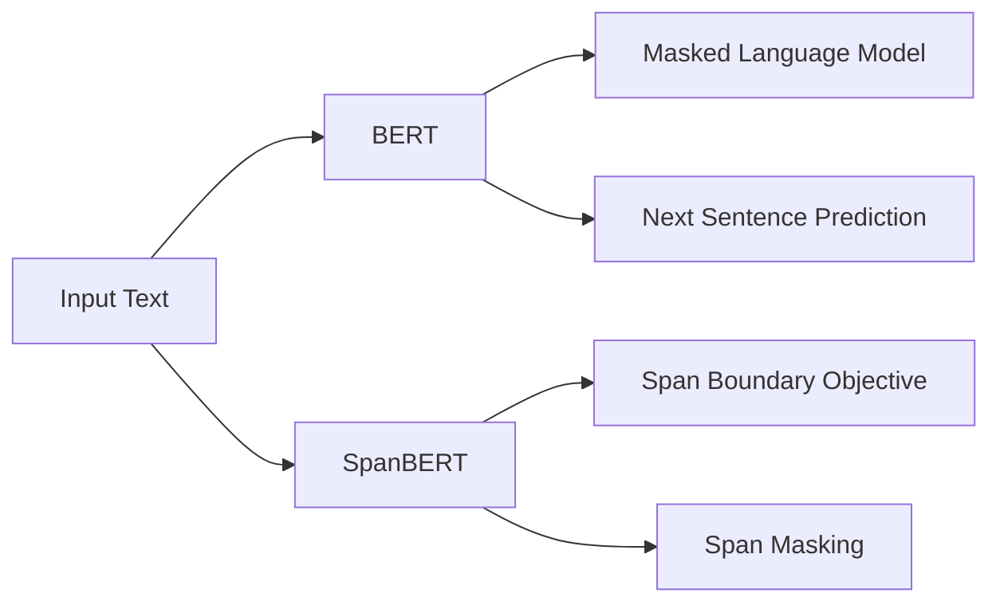

# Transformer大模型实战 了解SpanBERT 的架构

作者：禅与计算机程序设计艺术 / Zen and the Art of Computer Programming 

关键词：Transformer、SpanBERT、预训练模型、自然语言处理、大模型

## 1. 背景介绍
### 1.1  问题的由来
近年来，随着深度学习技术的飞速发展，自然语言处理(NLP)领域取得了巨大进步。Transformer架构的出现更是掀起了NLP领域的一场革命，各种基于Transformer的预训练大模型如雨后春笋般涌现，不断刷新着NLP任务的性能上限。其中，BERT(Bidirectional Encoder Representations from Transformers)无疑是最具代表性和影响力的模型之一。然而，BERT在建模和预测方面仍然存在一些局限性，如何进一步增强模型对语言的理解和生成能力，成为了NLP研究的新方向。

### 1.2  研究现状
在BERT的基础上，研究者们提出了许多改进模型，如RoBERTa、XLNet、ALBERT等。这些模型在预训练目标、模型结构、训练策略等方面做了优化，取得了不错的效果。但它们主要还是基于单词和字符级别的建模，对更高层次的语言单元如短语和句子的理解还不够充分。最近，微软研究院提出了一种新的预训练模型SpanBERT，通过引入span-level的预训练任务，让模型学习到更丰富的语义信息，在下游任务上取得了明显的性能提升。

### 1.3  研究意义
探索更强大的语言模型对于提升NLP系统的性能至关重要。一方面，预训练模型可以学习到高质量的通用语言表示，为下游任务提供良好的初始化参数，大大减少了特定任务的训练成本。另一方面，语言模型蕴含着海量的语言知识，通过对其内部机制的研究，能够加深我们对语言本质的认识，推动人工智能走向通用智能。而SpanBERT作为BERT的进阶版本，对语言的建模和理解更进一步，有望在机器翻译、智能问答、信息抽取等领域带来新的突破。

### 1.4  本文结构 
本文将全面介绍Transformer大模型SpanBERT的技术细节。第2节阐述SpanBERT涉及的核心概念。第3节重点讲解SpanBERT的模型结构和预训练任务。第4节从数学角度对SpanBERT的原理进行推导和证明。第5节通过代码实例演示SpanBERT的实现过程。第6节展望SpanBERT在实际场景中的应用前景。第7节推荐相关的学习资源。第8节对全文进行总结，并分析SpanBERT未来的机遇与挑战。

## 2. 核心概念与联系

在讨论SpanBERT之前，我们先来了解几个相关的核心概念：

- Transformer：一种基于自注意力机制的神经网络架构，摒弃了传统的RNN/CNN结构，通过Self-Attention学习文本的长距离依赖关系，极大地提升了并行计算效率和长文本建模能力，引领了NLP的发展方向。
- BERT：基于Transformer Encoder结构的大规模预训练语言模型，通过Masked Language Model和Next Sentence Prediction两个预训练任务，学习了强大的语言表示。
- 预训练语言模型：指先在大规模无标注语料上进行自监督学习，习得通用语言知识，再在特定任务上微调的范式。这种"预训练+微调"的模式已成为当前NLP的主流范式。
- Span：指文本中连续的字、词或短语。以Span为单位进行建模，可以更好地捕捉局部和整体的语义信息。

下图展示了SpanBERT与BERT在预训练任务上的区别：

可以看到，SpanBERT在BERT的基础上引入了两个以Span为中心的预训练任务：Span Boundary Objective(SBO)和Span Masking(SM)。它们从不同角度增强了模型对Span的学习，使其能够更好地理解词语之间的关联和句法结构。

## 3. 核心算法原理 & 具体操作步骤
### 3.1  算法原理概述
SpanBERT的核心思想是在预训练阶段引入Span级别的学习目标，从而让模型获得对Span的边界和内部的深入理解。具体来说，它提出了两个新的预训练任务：
- SBO任务：在每个Span的起始和结束位置处添加特殊标记，预测这些标记是否属于同一个Span。这可以学习到Span的边界信息。
- SM任务：随机遮掩一些Span，让模型根据上下文去预测这些Span的内容。这有助于学习Span内部的语义和句法关系。

同时，SpanBERT在输入表示、Mask策略等细节上也做了改进，进一步提升了模型性能。

### 3.2  算法步骤详解
SpanBERT的训练过程可分为以下几个步骤：

1. 输入表示：对输入文本进行WordPiece分词，得到token序列。然后添加[CLS]、[SEP]等特殊标记，并将每个token映射为词向量、位置向量和段落向量的加和。

2. Span划分：遍历文本中的所有Span，每个Span的长度在1~5个token之间。为每个Span的起始和结束位置添加特殊标记[S]和[/S]。

3. Span Masking：以一定概率(默认为15%)随机选择一些Span，并将其内部的token替换为[MASK]标记。这些被Mask的Span将用于SM任务的预测。

4. Transformer Encoding：将处理好的输入送入Transformer的多层Encoder，通过Self-Attention和前馈网络学习词之间的关系，得到每个token的上下文表示。

5. SBO任务：在最后一层Encoder的输出上，取出所有[S]和[/S]标记对应的表示，送入一个二分类器，判断它们是否属于同一个Span。该任务的损失函数为交叉熵。

6. SM任务：在最后一层Encoder的输出上，取出所有[MASK]标记对应的表示，送入一个多分类器，预测该位置的原始token id。该任务的损失函数也为交叉熵。

7. 联合训练：将SBO和SM两个任务的损失函数相加作为总的优化目标，利用Adam优化器对模型参数进行训练，直到收敛为止。

8. 微调与推理：将预训练好的SpanBERT应用到下游任务中，在任务特定的数据集上进行微调。微调时一般只需要在Encoder顶层添加一个任务相关的输出层即可。推理时将输入文本传给微调好的模型，即可得到相应的输出结果。

### 3.3  算法优缺点
SpanBERT相比BERT的优点主要有：
- 通过引入Span级别的预训练任务，模型能够更好地学习词语之间的关系，对语言的理解更加全面和深入。
- SBO任务显式地建模了Span的边界，使模型能够准确地识别Span，这对许多下游任务如命名实体识别、语义角色标注等非常有帮助。
- SM任务随机Mask连续的Span而不是离散的单词，这更符合自然语言的特点。同时Span的语义通常比单词更加丰富，有利于学习高质量的上下文表示。
- 在多个任务上的实验表明，SpanBERT能够明显超越BERT和其他模型，充分证明了引入Span级别建模的有效性。

但SpanBERT也存在一些局限：
- 相比BERT，SpanBERT的预训练任务更加复杂，对数据和计算资源的要求更高，训练成本也更大。 
- 尽管理论上Span建模有诸多优势，但在实践中并非所有任务都能从中获益。一些任务如情感分析可能更关注词语的表层特征，对Span的语义并不敏感。
- SpanBERT主要还是基于Transformer Encoder的结构，在生成式任务上的能力有限。要进一步提升语言理解和生成的水平，可能需要更强大的生成式预训练模型。

### 3.4  算法应用领域
得益于在语言建模上的进步，SpanBERT在许多NLP任务上都取得了明显的性能提升，其主要应用包括但不限于：

- 命名实体识别：识别文本中的人名、地名、机构名等实体，这些实体通常由多个连续的词构成，非常适合用Span建模。SpanBERT能够准确地捕捉实体的边界。
- 语义角色标注：分析句子的谓词-论元结构，即识别谓词和它的施事、受事、时间、地点等语义角色。这些角色一般对应于句中的Span。
- 关系抽取：从文本中抽取实体之间的关系，如"person-birthplace"。关系论元通常是一个Span，需要综合考虑Span的语义和边界。
- 问答阅读理解：根据给定的问题和上下文，预测答案Span在原文中的位置。SpanBERT对Span的边界建模可以帮助精准定位答案。
- 指代消解：将代词、指示词等回指到先行词或实体上。先行词对应的Span可能在较远的上下文中，需要全面理解语篇信息。
- 句法分析：分析句子的句法结构，如短语结构、依存结构等。句法短语可以看作一种特殊的Span，对其建模有助于学习句法知识。

总的来说，SpanBERT在处理Span粒度的语言单元上有独特的优势，特别适用于需要考虑局部语义和全局结构的NLP任务。同时，由于SpanBERT本质上是对语言知识的一种通用建模，因此其潜在的应用空间还非常广阔，有待进一步探索。

## 4. 数学模型和公式 & 详细讲解 & 举例说明
### 4.1  数学模型构建
SpanBERT的数学模型可以用以下符号来表示：

- 令 $\mathcal{V}$ 表示词表，$\mathcal{D} = \{t_1, t_2, ..., t_N\}$ 表示由 $N$ 个token组成的输入文本序列。
- 定义函数 $\mathcal{S}(i,j)$ 表示位置 $i$ 到 $j$ 的Span，其中 $1 \leq i \leq j \leq N$。特别地，$\mathcal{S}(i,i)$ 表示单个token。
- 用 $\mathbf{x}_i \in \mathbb{R}^d$ 表示第 $i$ 个token的词向量，$d$ 为词向量维度。输入文本 $\mathcal{D}$ 的嵌入表示为 $\mathbf{X} = [\mathbf{x}_1, \mathbf{x}_2, ..., \mathbf{x}_N] \in \mathbb{R}^{N \times d}$。
- 令 $\mathbf{h}_i^l \in \mathbb{R}^h$ 表示第 $l$ 层Transformer Encoder的第 $i$ 个位置的隐状态，$h$ 为隐层维度。$\mathbf{H}^l = [\mathbf{h}_1^l, \mathbf{h}_2^l, ..., \mathbf{h}_N^l] \in \mathbb{R}^{N \times h}$ 为第 $l$ 层的隐状态矩阵。

对于SBO任务，记 $y_{i,j} \in \{0,1\}$ 为表示位置 $i$ 和 $j$ 是否属于同一个Span的标签。SpanBERT在Encoder的最后一层 $\mathbf{H}^L$ 上进行预测：

$$
p(y_{i,j} = 1 | \mathcal{D}) = \sigma(\mathbf{w}_{sbo}^T [\mathbf{h}_i^L; \mathbf{h}_j^L] + b_{sbo}) 
$$

其中 $\mathbf{w}_{sbo} \in \mathbb{R}^{2h}$, $b_{sbo} \in \mathbb{R}$ 为可学习的参数，$\sigma$ 为Sigmoid函数。SBO任务的损失函数为二元交叉熵：

$$
\mathcal{L}_{sbo} = -\sum_{i,j} (y_{i,j} \log p