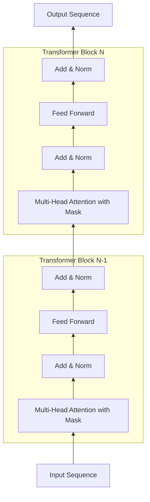

# Transformer大模型实战 带掩码的多头注意力层

关键词：Transformer, 大模型, 多头注意力, 掩码, 自然语言处理, 深度学习

## 1. 背景介绍 
### 1.1 问题的由来
近年来,随着深度学习技术的飞速发展,自然语言处理(NLP)领域取得了突破性的进展。尤其是Transformer模型的提出,更是开启了NLP的新纪元。Transformer模型以其强大的并行计算能力和捕捉长距离依赖关系的能力,在机器翻译、文本分类、问答系统等诸多NLP任务上取得了state-of-the-art的表现。

然而,标准的Transformer模型在某些场景下仍然存在局限性。比如在生成类任务中,我们往往需要Transformer能够根据上下文依次生成序列,而不是一次性并行生成。此时就需要在Transformer中引入掩码机制,控制模型在生成每个token时,只能看到该token之前的信息。这种带掩码的Transformer模型,在GPT、BERT等大模型中被广泛使用,展现出了惊人的性能。

### 1.2 研究现状
目前业界对Transformer模型的研究可谓如火如荼。GPT-3、Switch Transformer、GShard等大模型不断刷新着NLP任务的性能上限。微软、OpenAI、Google等科技巨头纷纷投入巨资,力图在Transformer大模型的军备竞赛中占据一席之地。

同时,学术界也在Transformer的架构改进上做了大量工作。比如引入稀疏注意力机制以提升训练效率,使用Mixture-of-Experts(MoE)方法扩大模型容量等。这些研究极大地推动了Transformer模型的发展。

### 1.3 研究意义
Transformer大模型代表了NLP乃至整个AI领域的重要发展方向。研究并掌握Transformer的内部机制,对于我们设计和优化更强大的NLP模型具有重要意义。特别是对于生成类任务,引入掩码机制是Transformer模型的关键改进之一。深入理解带掩码的多头注意力层的原理和实现,将助力我们开发出支持auto-regressive生成的Transformer模型,如GPT系列。这对于机器创作、对话生成、文本续写等应用场景具有重大价值。

### 1.4 本文结构
本文将重点介绍和实践带掩码的多头注意力层在Transformer模型中的应用。第2部分介绍多头注意力机制的核心概念。第3部分阐述带掩码的多头注意力层的算法原理和实现步骤。第4部分给出其数学模型和公式推导。第5部分提供基于PyTorch的代码实践。第6部分讨论其实际应用场景。第7部分推荐相关学习资源。第8部分总结全文并展望未来。

## 2. 核心概念与联系
Transformer模型的核心是注意力机制(Attention Mechanism)。与RNN系列模型通过迭代的方式聚合上下文信息不同,注意力机制允许模型在单次计算中,就直接"注意"到输入序列中的任意位置,捕捉长距离依赖。

多头注意力(Multi-Head Attention)是在此基础上的改进。它将输入序列映射到多个独立的子空间中,分别计算注意力,再将结果拼接起来。这种机制增强了模型的表示能力,使其能够从不同的角度、不同的粒度来理解输入序列。

在生成类任务中,我们需要控制Transformer模型在生成每个token时,只能访问该token之前的信息,即施加因果掩码(Causal Mask)。这实际上是在注意力计算时,对未来位置的注意力分数施加一个负无穷大的偏置,使其在softmax后的注意力权重变为0,从而屏蔽了未来信息。这就是带掩码的多头注意力层的核心思想。

下图展示了带掩码的多头注意力层在Transformer模型中的位置和数据流动:

## 3. 核心算法原理 & 具体操作步骤
### 3.1 算法原理概述
带掩码的多头注意力层的计算过程可以分为以下几个步骤:

1. 将输入序列X分别乘以三个权重矩阵WQ、WK、WV,得到查询矩阵Q、键矩阵K、值矩阵V。
2. 将Q、K、V按照头的维度进行分割,得到多个子查询矩阵Qi、子键矩阵Ki、子值矩阵Vi。
3. 对每个头i,计算Qi与Ki的点积注意力分数,再除以根号dk进行缩放。
4. 对注意力分数施加因果掩码,将未来位置的注意力分数置为负无穷大。
5. 对施加掩码后的注意力分数进行softmax运算,得到注意力权重。
6. 将注意力权重与Vi相乘,得到每个头的输出。
7. 将所有头的输出拼接起来,再乘以输出权重矩阵WO,得到最终的多头注意力输出。

其中,因果掩码的施加是实现auto-regressive生成的关键。

### 3.2 算法步骤详解

**输入**:
- X: 输入序列,形状为(batch_size, seq_len, d_model)
- WQ, WK, WV: 查询、键、值的权重矩阵,形状为(d_model, d_model) 
- WO: 输出的权重矩阵,形状为(d_model, d_model)

**输出**:
- attn_output: 多头注意力的输出序列,形状为(batch_size, seq_len, d_model)

**步骤**:
1. 查询、键、值的计算:
$$
\begin{aligned}
Q &= XW^Q \\
K &= XW^K \\
V &= XW^V
\end{aligned}
$$

2. 头的分割:
$$
\begin{aligned}
Q_i &= Q[i \cdot \frac{d_{model}}{h} : (i+1) \cdot \frac{d_{model}}{h}] \\
K_i &= K[i \cdot \frac{d_{model}}{h} : (i+1) \cdot \frac{d_{model}}{h}] \\ 
V_i &= V[i \cdot \frac{d_{model}}{h} : (i+1) \cdot \frac{d_{model}}{h}]
\end{aligned}
$$
其中$i = 1,2,...,h$, $h$为头数, $d_{model}$为隐藏层维度。

3. 注意力分数的计算与缩放:
$$
scores_i = \frac{Q_iK_i^T}{\sqrt{d_k}}
$$
其中$d_k = \frac{d_{model}}{h}$为每个头的维度。

4. 因果掩码的施加:
$$
\begin{equation}
masked\_scores_i = 
\begin{cases}
    scores_i, & \text{允许注意} \\
    -\infty,  & \text{不允许注意}
\end{cases}
\end{equation}
$$

5. 注意力权重的计算:
$$
weights_i = softmax(masked\_scores_i)
$$

6. 头输出的计算:  
$$
head_i = weights_i V_i
$$

7. 多头注意力输出的计算:
$$
\begin{aligned}
MultiHead(Q, K, V) &= Concat(head_1, head_2, ..., head_h)W^O \\
attn\_output &= MultiHead(Q, K, V)
\end{aligned}
$$

### 3.3 算法优缺点

优点:
- 引入掩码机制,使Transformer模型能够实现auto-regressive的生成过程,在机器翻译、对话生成等任务上取得了显著的性能提升。
- 多头注意力增强了模型的表示能力,使其能够从多个角度理解输入序列。
- 相比RNN系列模型,Transformer模型可以更充分地利用GPU并行计算的优势,大大提升了训练和推理效率。

缺点:  
- 计算和内存消耗大。注意力矩阵的计算复杂度为$O(n^2)$,这在处理长序列时会带来巨大的计算和内存开销。
- 位置编码是固定的,缺乏灵活性。传统的Transformer使用正余弦位置编码,但这种编码方式不能很好地建模相对位置关系。
- 难以捕捉局部结构。Transformer中的注意力计算是全局的,这使其难以高效地建模局部结构和短距离依赖。

### 3.4 算法应用领域
带掩码的多头注意力机制在以下领域得到了广泛应用:

- 语言模型与文本生成:如GPT系列模型,通过因果掩码实现auto-regressive的文本生成。
- 机器翻译:如Google的Transformer机器翻译系统,在WMT翻译任务上取得了state-of-the-art的性能。 
- 对话系统:如微软的DialoGPT,利用因果掩码生成连贯的多轮对话。
- 文本摘要:如BART模型,通过因果掩码实现abstractive summarization。
- 语音识别:如Speech-Transformer模型,将因果掩码应用于语音序列的建模。

此外,带掩码的多头注意力机制还被应用于图像生成、视频字幕生成、推荐系统等诸多领域,展现出了广阔的应用前景。

## 4. 数学模型和公式 & 详细讲解 & 举例说明
### 4.1 数学模型构建
我们以生成类任务为例,构建带掩码的多头注意力层的数学模型。假设输入序列为$X = (x_1, x_2, ..., x_n)$,其中$x_i \in \mathbb{R}^{d_{model}}$为第$i$个token的嵌入向量。我们的目标是建立一个auto-regressive的生成模型,在生成每个token $x_i$ 时,只能访问其之前的token $x_{<i}$。

首先,我们定义查询矩阵$Q$、键矩阵$K$、值矩阵$V$:
$$
\begin{aligned}
Q &= XW^Q \\
K &= XW^K \\
V &= XW^V
\end{aligned}
$$
其中$W^Q, W^K, W^V \in \mathbb{R}^{d_{model} \times d_{model}}$为可学习的权重矩阵。

接着,我们将$Q$、$K$、$V$按照头的维度进行分割,得到$h$个子查询矩阵$Q_i$、子键矩阵$K_i$、子值矩阵$V_i$,其中$i = 1, 2, ..., h$:
$$
\begin{aligned}
Q_i &= Q[i \cdot \frac{d_{model}}{h} : (i+1) \cdot \frac{d_{model}}{h}] \\
K_i &= K[i \cdot \frac{d_{model}}{h} : (i+1) \cdot \frac{d_{model}}{h}] \\ 
V_i &= V[i \cdot \frac{d_{model}}{h} : (i+1) \cdot \frac{d_{model}}{h}]
\end{aligned}
$$

对于每个头$i$,我们计算其注意力分数矩阵$scores_i$:
$$
scores_i = \frac{Q_iK_i^T}{\sqrt{d_k}}
$$
其中$d_k = \frac{d_{model}}{h}$为每个头的维度。除以$\sqrt{d_k}$是为了缩放点积结果,避免softmax函数的梯度消失。

为了实现因果掩码,我们定义掩码矩阵$M \in \mathbb{R}^{n \times n}$:
$$
\begin{equation}
M_{ij} = 
\begin{cases}
    0, & i \leq j \\
    -\infty, & i > j
\end{cases}
\end{equation}
$$
其中$M_{ij}$表示位置$i$对位置$j$的注意力分数。当$i \leq j$时,表示允许位置$i$注意位置$j$;当$i > j$时,表示不允许位置$i$注意位置$j$(因为位置$j$在位置$i$的未来)。

我们将掩码矩