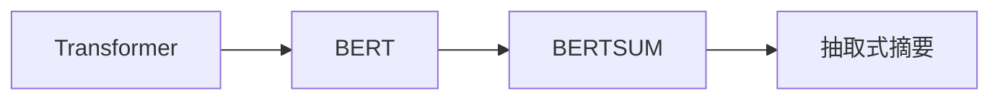

# Transformer大模型实战 训练BERTSUM 模型

作者：禅与计算机程序设计艺术 / Zen and the Art of Computer Programming 

关键词：Transformer、BERT、BERTSUM、文本摘要、预训练模型、迁移学习、自然语言处理

## 1. 背景介绍
### 1.1  问题的由来
随着互联网的飞速发展,海量的文本信息正以指数级的速度增长。如何从海量的文本数据中快速获取关键信息,成为了自然语言处理领域的一个重要研究课题。文本摘要技术应运而生,它能够自动地从原始文本中提取关键信息,生成简洁、连贯的摘要,为用户快速获取文本主旨提供了有力的工具。

### 1.2  研究现状 
传统的文本摘要方法主要包括基于统计的方法和基于图的方法。基于统计的方法通过统计词频、句子位置等特征来评估句子的重要性,但无法考虑语义信息。基于图的方法将文本表示为图结构,通过迭代计算节点的重要性得到摘要,但鲁棒性不足。近年来,深度学习在自然语言处理领域取得了突破性进展。2017年,Google提出了Transformer模型[1],引入了自注意力机制,在机器翻译任务上取得了显著效果。此后,各种Transformer的变体如雨后春笋般涌现。2018年,Devlin等人在Transformer的基础上提出了BERT(Bidirectional Encoder Representations from Transformers)模型[2],通过预训练得到通用的语言表示,再结合下游任务的少量标注数据进行微调,在多个自然语言处理任务上取得了SOTA的效果。这种"预训练+微调"的范式成为了当前自然语言处理的主流范式。Liu等人在BERT的基础上提出了BERTSUM模型[3],将其应用于文本摘要任务,在CNN/DailyMail、NYT等数据集上取得了最好的效果。

### 1.3  研究意义
探索如何将预训练的语言模型应用于文本摘要任务,对于提升文本摘要的效果具有重要意义。本文将详细介绍如何使用BERTSUM模型进行抽取式摘要,分享从理论到实践的完整流程,帮助读者快速掌握使用预训练模型解决文本摘要问题的方法。

### 1.4  本文结构
本文将从以下几个方面展开:
- 介绍Transformer、BERT等相关概念和原理
- 详细讲解BERTSUM模型的网络结构和训练方法  
- 分享BERTSUM模型的数学原理和公式推导
- 提供基于PyTorch的BERTSUM模型实现代码
- 讨论BERTSUM模型的应用场景和局限性
- 总结文本摘要技术的发展趋势和挑战

## 2. 核心概念与联系

在讲解BERTSUM模型之前,我们先来了解几个核心概念:

- Transformer: 一种基于自注意力机制的神经网络模型,摒弃了传统的RNN/CNN等结构,通过Self-Attention学习文本中词与词之间的依赖关系,并行计算效率高。Transformer引入了Multi-head Attention,可以捕捉词之间的多种语义关系。

- BERT: 基于Transformer的双向语言表示模型。传统语言模型只能从左到右或从右到左单向建模,BERT采用Masked LM和Next Sentence Prediction两个预训练任务,从而得到深层次的双向语言表示。BERT在大规模无标注语料上预训练,学习到语言的通用表示,再在下游任务的少量标注数据上微调,可以显著提升模型效果。

- 文本摘要: 自动地从冗长的文本中提取关键信息,生成简洁、连贯、完整的摘要的任务。根据生成方式可分为抽取式和生成式两类。抽取式摘要通过从原文中抽取关键句子形成摘要,生成式摘要通过理解原文后"以己之言"生成摘要。本文关注的BERTSUM模型属于抽取式摘要。

它们的关系如下图所示:



Transformer是一种强大的通用的序列建模架构,BERT在此基础上通过预训练得到了优质的语言表示,BERTSUM则将BERT应用于抽取式摘要任务。

## 3. 核心算法原理 & 具体操作步骤
### 3.1  算法原理概述
BERTSUM模型的核心思想是:先用BERT对文本进行编码,得到每个句子的向量表示,然后通过一个简单的分类器预测每个句子是否属于摘要。整个过程可以分为以下几个步骤:

1. 将输入文档切分成句子
2. 将每个句子通过BERT编码为固定长度的向量
3. 用sigmoid分类器预测每个句子属于摘要的概率
4. 根据概率排序,取Top-k个句子作为最终的摘要

相比传统方法,BERTSUM的优势在于:

1. 利用BERT学习到的上下文相关的句子表示,捕捉句子的深层语义信息
2. 端到端的摘要提取过程,无需对句子进行复杂的特征工程
3. 通过在大规模语料上的预训练,缓解了标注数据不足的问题

### 3.2  算法步骤详解

接下来我们详细讲解BERTSUM的算法步骤。

#### Step 1: 句子切分

首先,我们需要将输入的文档切分成句子。一般可以根据句号、问号、感叹号等标点符号进行切分。为了将句子转换为BERT的输入格式,我们需要:

1. 在句首添加[CLS]标记,在句尾添加[SEP]标记  
2. 将句子中的词转换为WordPiece分词
3. 将词映射为BERT词表中的id
4. 添加位置编码和句子类型编码

经过处理,一个句子的表示如下:

```
[CLS] 词1 词2 ... 词n [SEP]
```

#### Step 2: BERT编码

接下来,将切分好的句子输入到BERT中,经过多层Transformer Block的计算,得到每个句子的向量表示。我们取[CLS]标记对应的隐层状态作为整个句子的语义表示,记为$\mathbf{h}_i \in \mathbb{R}^H$,其中$H$为隐层大小。

#### Step 3: 摘要句预测

将每个句子的BERT编码向量$\mathbf{h}_i$输入到一个sigmoid分类器中:

$$
\hat{y}_i = \sigma(\mathbf{w}^T \mathbf{h}_i + b)
$$

其中$\mathbf{w} \in \mathbb{R}^H$和$b \in \mathbb{R}$分别是分类器的权重和偏置,$\sigma$是sigmoid激活函数。$\hat{y}_i \in (0,1)$表示第$i$个句子属于摘要的概率。

模型的训练目标是最小化以下交叉熵损失:

$$
\mathcal{L} = -\frac{1}{N}\sum_{i=1}^N y_i \log(\hat{y}_i) + (1-y_i)\log(1-\hat{y}_i)
$$

其中$y_i \in \{0,1\}$表示第$i$个句子的真实标签,$N$为句子总数。

#### Step 4: 摘要生成

对于一篇新的文档,我们首先用Steps 1-3的方法计算每个句子属于摘要的概率$\hat{y}_i$,然后根据概率排序,取Top-k个句子作为最终的摘要。

以上就是BERTSUM模型的主要算法步骤。

### 3.3  算法优缺点

BERTSUM相比传统方法的优点在于:

1. 利用预训练语言模型学习高质量的句子表示  
2. 端到端的摘要提取,无需复杂特征工程
3. 预训练缓解标注数据不足问题

但BERTSUM也存在一些局限性:

1. 只能提取原文中的句子,无法生成新句子
2. 难以处理词汇重复、语义冗余等问题  
3. 生成的摘要可能不够连贯流畅

### 3.4  算法应用领域

BERTSUM作为一种优秀的抽取式摘要算法,可应用于以下场景:

1. 新闻摘要:从冗长的新闻文本中提取关键信息,生成简明扼要的新闻摘要。
2. 论文摘要:自动生成科技论文的摘要,帮助研究者快速把握论文主旨。
3. 电影/书籍/商品评论摘要:归纳总结大量用户评论的核心观点。
4. 会议记录摘要:提取会议记录中的重点内容,生成会议纪要。
5. 法律文书摘要:归纳冗长法律文书的关键信息,提高工作效率。

## 4. 数学模型和公式 & 详细讲解 & 举例说明
### 4.1  数学模型构建

BERTSUM的数学模型可以用下面的公式表示:

给定一篇文档$\mathcal{D}$,包含$N$个句子$\{s_1,\dots,s_N\}$。令$\mathbf{h}_i$表示第$i$个句子经过BERT编码后的向量表示。我们要预测一个二值标签序列$\mathbf{y} \in \{0,1\}^N$,其中$y_i=1$表示第$i$个句子属于摘要。

我们用一个sigmoid分类器来预测每个句子的标签:

$$
p(y_i=1|\mathbf{h}_i) = \sigma(\mathbf{w}^T \mathbf{h}_i + b)
$$

其中$\mathbf{w} \in \mathbb{R}^H$和$b \in \mathbb{R}$是分类器的参数。

整个序列的似然概率为:

$$
p(\mathbf{y}|\mathbf{h}_1,\dots,\mathbf{h}_N) = \prod_{i=1}^N p(y_i|\mathbf{h}_i)
$$

模型的优化目标是最大化上述似然概率,等价于最小化以下交叉熵损失:

$$
\mathcal{L} = -\frac{1}{N}\sum_{i=1}^N y_i \log(\hat{y}_i) + (1-y_i)\log(1-\hat{y}_i)
$$

其中$\hat{y}_i = p(y_i=1|\mathbf{h}_i)$是第$i$个句子属于摘要的预测概率。

### 4.2  公式推导过程

接下来我们详细推导BERTSUM模型的关键公式。

首先是sigmoid函数的定义:

$$
\sigma(x) = \frac{1}{1+e^{-x}}
$$

它可以将实数映射到(0,1)区间,常用于二分类任务。

将其应用于线性函数$\mathbf{w}^T \mathbf{h}_i + b$,得到句子属于摘要的概率:

$$
\begin{aligned}
p(y_i=1|\mathbf{h}_i) &= \sigma(\mathbf{w}^T \mathbf{h}_i + b) \\
&= \frac{1}{1+e^{-(\mathbf{w}^T \mathbf{h}_i + b)}}
\end{aligned}
$$

由于标签$y_i$取值为0或1,句子不属于摘要的概率为:

$$
\begin{aligned}
p(y_i=0|\mathbf{h}_i) &= 1 - p(y_i=1|\mathbf{h}_i) \\
&= 1 - \sigma(\mathbf{w}^T \mathbf{h}_i + b) \\
&= \sigma(-(\mathbf{w}^T \mathbf{h}_i + b))
\end{aligned}
$$

将二者结合可得:

$$
p(y_i|\mathbf{h}_i) = \sigma((\mathbf{w}^T \mathbf{h}_i + b) \cdot (2y_i-1))
$$

对数似然函数为:

$$
\begin{aligned}
\log p(\mathbf{y}|\mathbf{h}_1,\dots,\mathbf{h}_N) &= \log \prod_{i=1}^N p(y_i|\mathbf{h}_i) \\
&= \sum_{i=1}^N \log p(y_i|\mathbf{h}_i) \\
&= \sum_{i=1}^N \log \sigma((\mathbf{w}^T \mathbf{h}_i + b) \cdot (2y_i-1)) \\
&= -\sum_{i=1}^N \log(1+e^{-(\mathbf{w}^T \mathbf{h}_i + b) \cdot (2y_i-1)})
\end{