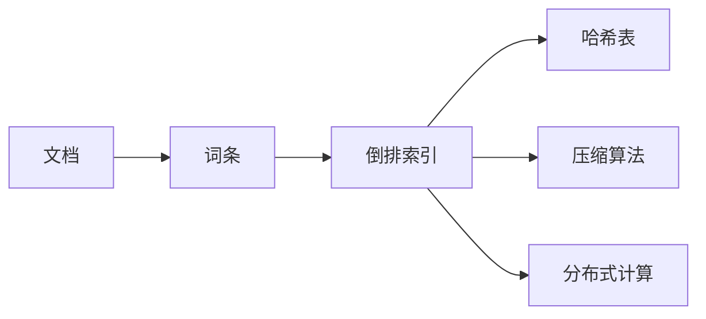

# 【AI大数据计算原理与代码实例讲解】倒排索引

作者：禅与计算机程序设计艺术 / Zen and the Art of Computer Programming

关键词：倒排索引、搜索引擎、大数据检索、数据结构、分布式计算

## 1. 背景介绍
### 1.1 问题的由来
在大数据时代，海量的数据正以前所未有的速度增长。面对如此庞大的数据量，如何高效地检索和查询数据成为了一个巨大的挑战。传统的数据检索方式已经无法满足实时性和准确性的要求。因此，倒排索引应运而生，成为了解决大数据检索问题的利器。

### 1.2 研究现状
目前，倒排索引技术已经被广泛应用于各种搜索引擎和大数据检索系统中。无论是互联网巨头们的搜索引擎，还是企业内部的数据检索平台，都离不开倒排索引的支持。各大IT公司和研究机构也在不断地优化和改进倒排索引算法，以提高检索效率和准确性。

### 1.3 研究意义
深入研究倒排索引技术，对于优化大数据检索性能、提升用户搜索体验具有重要意义。通过理解倒排索引的核心原理和算法，我们可以设计出更加高效、智能的搜索引擎和数据检索系统，从海量数据中快速准确地找到所需信息，为企业决策和科学研究提供有力支撑。

### 1.4 本文结构
本文将从以下几个方面深入探讨倒排索引技术：

1. 介绍倒排索引的核心概念和基本原理
2. 详细讲解倒排索引的核心算法和操作步骤
3. 构建倒排索引的数学模型，并推导相关公式
4. 通过代码实例和详细解释，演示倒排索引的具体实现
5. 分析倒排索引在实际应用场景中的作用
6. 推荐倒排索引相关的学习资源和开发工具
7. 总结倒排索引技术的发展趋势和面临的挑战
8. 附录：回答倒排索引相关的常见问题

## 2. 核心概念与联系

在讨论倒排索引之前，我们首先需要了解几个核心概念：

- 文档(Document)：可以被检索的基本单位，如网页、文本文件等。
- 词条(Term)：文档中出现的关键词，是倒排索引的基本元素。
- 倒排索引(Inverted Index)：记录每个词条出现在哪些文档中的数据结构。
- 正排索引(Forward Index)：记录每个文档包含哪些词条的数据结构。

倒排索引和正排索引是一对互逆的概念，可以相互转换。倒排索引以词条为中心，记录每个词条出现在哪些文档中；而正排索引以文档为中心，记录每个文档包含哪些词条。

在搜索引擎中，倒排索引扮演着至关重要的角色。当用户输入查询词时，搜索引擎会通过倒排索引快速找到包含查询词的文档，并根据相关性算法对结果进行排序，最终返回给用户。

倒排索引与其他数据结构和算法也有着密切的联系，例如：

- 哈希表(Hash Table)：倒排索引通常使用哈希表来存储词条和文档的映射关系，以支持快速查找。
- 压缩算法(Compression Algorithm)：为了节省存储空间，倒排索引通常会对文档ID和词频等信息进行压缩存储。
- 分布式计算(Distributed Computing)：面对海量数据，倒排索引的构建和查询需要分布在多台机器上并行处理。

下图展示了倒排索引与其他概念之间的关系：



## 3. 核心算法原理 & 具体操作步骤
### 3.1 算法原理概述
倒排索引的核心是建立词条到文档的映射关系。具体来说，就是对每个文档进行分词，提取出关键词，然后记录每个关键词出现在哪些文档中。

倒排索引的构建过程可以分为以下几个步骤：

1. 文档集合的预处理
2. 文档分词
3. 词条规范化
4. 构建倒排索引
5. 索引压缩

### 3.2 算法步骤详解

**步骤1：文档集合的预处理**

在构建倒排索引之前，需要对原始的文档集合进行预处理，主要包括：

- 文档格式转换：将不同格式的文档统一转换为纯文本格式。
- 文档编码统一：将不同编码的文档统一转换为UTF-8编码。
- 文档去重：对重复的文档进行过滤，只保留一份。

**步骤2：文档分词**

对预处理后的文档进行分词，将文档切分成一个个独立的词条。分词的基本原则是：

- 去除停用词：过滤掉文档中的虚词、连词等无意义的词。
- 提取关键词：识别文档中的重要词汇，如专有名词、术语等。
- 词干提取：将词条还原为词干形式，如将"running"还原为"run"。

常见的分词算法有：基于字典的分词、基于统计的分词、基于规则的分词等。

**步骤3：词条规范化**

对提取出的词条进行规范化处理，包括：

- 大小写转换：将所有词条转换为小写形式。
- 同义词处理：将同义词归并为同一个词条。
- 词形还原：将词条的变形还原为原形，如将复数形式还原为单数形式。

**步骤4：构建倒排索引**

根据词条和文档的对应关系，构建倒排索引。倒排索引通常采用以下数据结构：

- 词典(Term Dictionary)：记录所有词条，并为每个词条分配一个唯一的ID。
- 倒排列表(Posting List)：记录每个词条出现在哪些文档中，以及出现的频率、位置等信息。

构建倒排索引的伪代码如下：

```
for each document d in collection:
    for each term t in d:
        if t not in term_dictionary:
            term_dictionary.add(t)
            posting_list[t] = new List()
        posting_list[t].add(d)
```

**步骤5：索引压缩**

为了节省存储空间，需要对倒排索引进行压缩。常见的索引压缩技术有：

- 可变字节编码(Variable Byte Encoding)：对文档ID和词频等数值型数据进行编码压缩。
- 差值编码(Delta Encoding)：对有序的文档ID列表进行差值编码压缩。
- 位图索引(Bitmap Index)：对倒排列表进行位图压缩，适用于低频词条。

### 3.3 算法优缺点

倒排索引的优点包括：

- 查询效率高：通过倒排索引可以快速找到包含查询词的文档，避免了全文扫描。
- 可扩展性强：可以方便地添加新的文档和更新索引，支持增量更新。
- 灵活性好：支持多种查询方式，如布尔查询、短语查询、通配符查询等。

倒排索引的缺点包括：

- 存储空间大：倒排索引需要额外的存储空间来维护词条和文档的映射关系。
- 构建时间长：对大规模文档集合构建倒排索引需要花费大量的时间和计算资源。
- 动态更新困难：对倒排索引进行实时更新比较困难，通常需要重新构建索引。

### 3.4 算法应用领域

倒排索引在以下领域有广泛的应用：

- 搜索引擎：如Google、Bing等，利用倒排索引实现网页搜索。
- 企业搜索：如Elasticsearch、Solr等，为企业提供文档检索和数据分析服务。
- 推荐系统：利用倒排索引实现基于内容的推荐，如根据用户阅读历史推荐相似文章。
- 问答系统：利用倒排索引实现基于知识库的问答，快速找到与问题相关的答案片段。

## 4. 数学模型和公式 & 详细讲解 & 举例说明
### 4.1 数学模型构建
为了更好地理解倒排索引的原理，我们可以构建一个简单的数学模型。假设有以下定义：

- 文档集合 $D=\{d_1,d_2,...,d_n\}$，其中 $d_i$ 表示第 $i$ 个文档。
- 词条集合 $T=\{t_1,t_2,...,t_m\}$，其中 $t_j$ 表示第 $j$ 个词条。
- 倒排列表 $P=\{p_1,p_2,...,p_m\}$，其中 $p_j$ 表示包含词条 $t_j$ 的文档列表。

那么，倒排索引可以表示为一个矩阵 $M$：

$$
M=
\begin{bmatrix}
    w_{11} & w_{12} & \cdots & w_{1m} \\
    w_{21} & w_{22} & \cdots & w_{2m} \\
    \vdots & \vdots & \ddots & \vdots \\
    w_{n1} & w_{n2} & \cdots & w_{nm}
\end{bmatrix}
$$

其中，$w_{ij}$ 表示词条 $t_j$ 在文档 $d_i$ 中的权重，通常可以用TF-IDF来计算：

$$
w_{ij} = tf_{ij} \times idf_j
$$

- $tf_{ij}$ 表示词条 $t_j$ 在文档 $d_i$ 中的词频。
- $idf_j$ 表示词条 $t_j$ 的逆文档频率，计算公式为：

$$
idf_j = \log \frac{N}{df_j}
$$

- $N$ 表示文档集合的总数。
- $df_j$ 表示包含词条 $t_j$ 的文档数。

### 4.2 公式推导过程
对于一个查询 $q$，我们可以将其表示为一个向量：

$$
q = (q_1, q_2, ..., q_m)
$$

其中，$q_j$ 表示查询中词条 $t_j$ 的权重，可以用TF-IDF或其他方法计算。

那么，文档 $d_i$ 对查询 $q$ 的相关性得分可以用向量空间模型(Vector Space Model)来计算：

$$
score(q,d_i) = \frac{\sum_{j=1}^m q_j \times w_{ij}}{\sqrt{\sum_{j=1}^m q_j^2} \times \sqrt{\sum_{j=1}^m w_{ij}^2}}
$$

这个公式实际上是计算查询向量 $q$ 和文档向量 $d_i$ 的余弦相似度(Cosine Similarity)。分母部分是对向量进行归一化，使得得分在0到1之间。

### 4.3 案例分析与讲解
下面我们通过一个简单的例子来说明倒排索引的构建和查询过程。

假设有以下三个文档：

- $d_1$: "The quick brown fox jumps over the lazy dog"
- $d_2$: "Quick fox jumps over lazy dog"
- $d_3$: "Lazy dog is jumped over by quick brown fox"

对这三个文档进行分词和规范化处理，得到以下词条：

- $t_1$: "quick"
- $t_2$: "fox" 
- $t_3$: "jump"
- $t_4$: "over"
- $t_5$: "lazy"
- $t_6$: "dog"

构建倒排索引，得到以下倒排列表：

- $p_1 = \{d_1, d_2, d_3\}$
- $p_2 = \{d_1, d_2, d_3\}$
- $p_3 = \{d_1, d_2, d_3\}$
- $p_4 = \{d_1, d_2, d_3\}$
- $p_5 = \{d_1, d_2, d_3\}$
- $p_6 = \{d_1, d_2, d_3\}$

可以看到，每个词条都出现在所有三个文档中。

现在，假设用户输入查询 "quick fox"，我们可以通过倒排列表 $p_1$ 和 $p_2$ 快速找到包含这两个词条的文档，即 $\{d_1, d_2, d_3\}$。