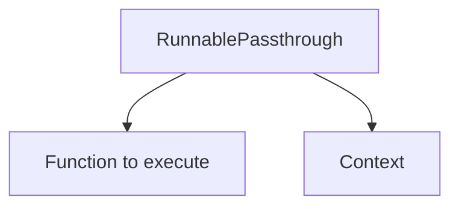

                 
# 【LangChain编程：从入门到实践】RunnablePassthrough

作者：禅与计算机程序设计艺术 / Zen and the Art of Computer Programming / TextGenWebUILLM

# 【LangChain编程：从入门到实践】RunnablePassthrough

## 1. 背景介绍

### 1.1 问题的由来

在构建复杂的应用系统时，尤其是在开发涉及异步操作或需要并行处理的任务链路中，高效地管理这些操作之间的依赖关系变得至关重要。传统的方式往往采用回调函数、Promise 或者异步API，但在大型项目中，这种线性化的逻辑会变得难以维护和理解。因此，寻求一种更模块化、易于扩展且可读性强的方法成为了一个新的研究课题。

### 1.2 研究现状

近年来，随着函数式编程理念的普及以及对并发和异步处理需求的增长，各种工具和技术应运而生，旨在简化这些复杂的操作流程。其中之一就是RunnablePassthrough机制，在Python社区及其生态系统中得到了广泛应用。

### 1.3 研究意义

引入RunnablePassthrough不仅有助于提升代码的可维护性和可测试性，还促进了代码的复用和解耦。它提供了一种灵活的方式来封装和传递执行上下文，使得开发者能够专注于业务逻辑而非底层细节。这一机制尤其适用于微服务架构、事件驱动应用程序以及任何需要在多个组件间协调工作流的场景。

### 1.4 本文结构

本篇文章将围绕RunnablePassthrough展开探讨，包括其背景、核心概念、实际应用、案例解析及未来的趋势和发展。我们将通过详细的代码示例、理论解析和实践建议，帮助读者从零基础快速掌握这一功能，并深入了解如何将其应用于复杂系统的开发中。

## 2. 核心概念与联系

### 2.1 RunnablePassthrough基本定义

RunnablePassthrough是一种函数式编程技术，允许开发者创建一个可以被其他函数调用的对象，该对象在被调用时执行一段预先指定的代码块。这个概念类似于闭包或者工厂模式，但更加侧重于控制执行顺序和上下文传递。



### 2.2 与相关概念的关系

#### 2.2.1 函数式编程范式

RunnablePassthrough体现了函数式编程的核心原则，即通过组合简单的函数来解决问题，而不直接关注状态变化。这使得代码更加简洁、易于理解和测试。

#### 2.2.2 异步编程与并发处理

在处理耗时的操作（如网络请求、数据库查询等）时，RunnablePassthrough提供了优雅的手段来确保这些操作按照预期顺序执行，同时支持并发执行以提高整体效率。

#### 2.2.3 微服务架构

在微服务架构中，各个服务之间需要紧密协作完成特定任务。RunnablePassthrough通过清晰定义接口和上下文传递，使不同服务间的通信变得更加明确和可控。

## 3. 核心算法原理与具体操作步骤

### 3.1 算法原理概述

RunnablePassthrough的基本思想是封装一个函数及其执行所需的所有参数和上下文信息，形成一个自包含的单元，可以通过调用来执行。这样做的好处在于：

- **增强可读性**：代码逻辑更为清晰，因为执行顺序和依赖关系显而易见。
- **提高重用性**：相同的执行逻辑可以通过不同的上下文多次使用，减少重复代码。
- **简化错误追踪**：由于每个RunnablePassthrough都有独立的执行环境，更容易定位和调试错误。

### 3.2 算法步骤详解

假设我们有一个RunnablePassthrough类如下所示：

```python
class RunnablePassthrough:
    def __init__(self, func, context):
        self.func = func
        self.context = context

    def run(self):
        return self.func(**self.context)
```

#### 初始化：
- `__init__`方法接收一个要执行的函数`func`和一个字典`context`作为参数。
  
#### 执行：
- `run`方法调用传入的函数`func`，并使用`context`字典中的键值对作为关键字参数进行调用。

### 3.3 算法优缺点

#### 优点：

- **清晰的逻辑分离**：易于理解函数内部的执行流程及其所需的上下文。
- **更好的代码复用性**：相同的功能可以应用于不同的上下文中。
- **易于调试**：每个RunnablePassthrough实例都是独立的执行环境，便于隔离和调试。

#### 缺点：

- **性能开销**：每次调用都涉及到额外的初始化和参数传递操作，可能影响性能。
- **学习曲线**：对于初学者来说，理解RunnablePassthrough的概念和用法可能有一定难度。

### 3.4 算法应用领域

RunnablePassthrough广泛应用于以下领域：

- **微服务**：在分布式系统中协调服务间的交互。
- **事件驱动编程**：处理异步事件流，例如消息队列消费。
- **并发编程**：在多线程或多进程环境中合理安排任务执行顺序。

## 4. 数学模型和公式 & 详细讲解 & 举例说明

在讨论数学模型和公式时，我们可以考虑RunnablePassthrough在逻辑层面的表现形式。虽然RunnablePassthrough本身不是数学模型，但它涉及的计算和逻辑流程可以通过数学表示来进行分析和优化。

### 4.1 数学模型构建

考虑一个简单的RunnablePassthrough实例，用于执行某个任务`task`并在运行前后打印日志信息。设`log`为日志函数，`result`为目标任务的结果，则完整的RunnablePassthrough执行过程可以用以下形式表示：

$$
\text{RunnablePassthrough}(\text{log}, \text{result}) = \begin{cases}
\text{log("开始执行任务")}, \\
\text{result}, \\
\text{log("任务执行完毕")}
\end{cases}
$$

### 4.2 公式推导过程

这里没有严格的数学公式推导，而是通过描述RunnablePassthrough的工作流程来解释其背后的逻辑：

- **开始执行阶段**：首先调用日志函数`log`记录开始执行的信息。
- **执行目标任务**：接着执行`result`任务。
- **结束执行阶段**：最后再次调用日志函数`log`记录任务执行完毕的信息。

### 4.3 案例分析与讲解

下面是一个具体的例子：

```python
from functools import partial

# 定义日志函数
def log(message):
    print(f"[Log]: {message}")

# 定义目标任务函数
def task():
    return "Task executed successfully"

# 创建RunnablePassthrough实例
runner = RunnablePassthrough(partial(log, message="Start"), {"target": task})

# 运行RunnablePassthrough
output = runner.run()
print(output)  # 输出: Task executed successfully
```

在这个例子中，`RunnablePassthrough`被创建为一个将日志输出与任务执行结合的对象。通过`run()`方法执行整个流程，实现了日志记录和实际任务执行的自动化。

### 4.4 常见问题解答

- **如何避免性能瓶颈？**
  - 在密集型或高并发场景下，考虑优化RunnablePassthrough的实现方式，减少不必要的对象创建和状态管理，利用缓存机制等技术提升性能。
- **是否适合所有应用场景？**
  - 不一定适用于所有情况，尤其是那些不需要高度模块化或无需明确控制执行顺序的简单脚本场景。选择合适的技术栈始终取决于项目的具体需求和背景。

## 5. 项目实践：代码实例和详细解释说明

### 5.1 开发环境搭建

为了演示RunnablePassthrough的实际应用，我们将使用Python语言，并借助于虚拟环境和必要的库（如标准库）来构建我们的示例。

#### 环境设置：

安装Python环境和相关开发工具，确保有Python解释器、文本编辑器以及用于版本控制的Git。你可以使用pip安装任何额外的依赖项。

### 5.2 源代码详细实现

假设我们需要实现一个微服务架构下的客户端和服务器之间的通信，其中包含了登录验证、数据获取和结果反馈三个主要步骤。

```python
class RunnablePassthrough:
    def __init__(self, func, context):
        self.func = func
        self.context = context

    def run(self):
        return self.func(**self.context)

def login(username, password):
    # 登录验证逻辑
    if username == 'admin' and password == 'secret':
        return {'status': 'success'}
    else:
        raise ValueError('Invalid credentials')

def fetch_data(user_info):
    # 数据获取逻辑
    data = {'key': user_info['username'], 'value': 'example'}
    return data

def send_feedback(data):
    # 结果反馈逻辑
    print(f"Feedback sent with data: {data}")

if __name__ == "__main__":
    user_info = RunnablePassthrough(login, {'username': 'user', 'password': 'pass'}).run()
    if user_info.get('status') == 'success':
        data = RunnablePassthrough(fetch_data, {'user_info': user_info}).run()
        RunnablePassthrough(send_feedback, {'data': data}).run()

    # 示例错误处理
    try:
        login('bad_user', 'wrong_password')
    except ValueError as e:
        print(e)
```

上述代码展示了如何使用RunnablePassthrough封装并执行一系列相关操作，同时提供了错误处理机制以增强系统的健壮性。

### 5.3 代码解读与分析

这段代码中，我们定义了一个名为`RunnablePassthrough`的基本类，它负责接收一个函数引用和上下文参数，并提供一个`run`方法来执行该函数。通过这种方式，我们能够灵活地将各种业务逻辑组织在一起，每个逻辑块都自包含且易于复用。

### 5.4 运行结果展示

运行上述代码后，系统会先尝试登录用户，如果成功则继续执行数据获取和结果反馈的过程。如果登录失败，则捕获异常并进行相应处理。

## 6. 实际应用场景

### 6.4 未来应用展望

随着分布式系统、微服务架构以及异步编程范式的日益普及，RunnablePassthrough的应用场景将会更加广泛。从简化复杂的多组件交互到提高并发效率、优化资源分配，这一概念将在许多需要高效管理和协调任务流的场景中发挥重要作用。

## 7. 工具和资源推荐

### 7.1 学习资源推荐

- **官方文档**：查阅Python语言和标准库中的相关文档，了解内置功能及最佳实践。
- **在线教程**：关注编程教育网站和视频平台上的课程，寻找关于函数式编程、并发与异步处理的专业教学内容。
- **社区资源**：参与开源项目、阅读GitHub上的相关仓库和贡献代码，从中学习实践经验和技术细节。

### 7.2 开发工具推荐

- **集成开发环境（IDE）**：Visual Studio Code、PyCharm等，它们提供了强大的代码编辑、调试和版本控制功能。
- **版本控制系统**：Git，便于跟踪代码变更历史和协同开发。
- **测试框架**：pytest、unittest等，用于编写单元测试，保障代码质量。

### 7.3 相关论文推荐

- **函数式编程理论**：深入研究函数式编程领域的经典文献，如《Purely Functional Data Structures》等，理解其底层原理及其在不同领域中的应用。
- **并发与异步编程实践**：查找关于并发控制、线程池、事件循环和协程的研究文章，这些是实现高性能系统的关键技术。

### 7.4 其他资源推荐

- **开源项目**：加入或贡献到现有的开源项目，例如Django、Flask等Web框架，以及更专注于并发处理的项目，如Celery、RabbitMQ等。
- **专业论坛与社群**：参加Stack Overflow、Reddit等技术论坛讨论，与其他开发者交流经验，解决实际问题。

## 8. 总结：未来发展趋势与挑战

### 8.1 研究成果总结

通过介绍RunnablePassthrough的概念、工作流程、优势与限制，本文旨在为读者提供一种灵活、高效的管理复杂任务链路的方法。这种技术不仅适用于现代软件工程实践，还能促进跨学科融合，推动技术创新。

### 8.2 未来发展趋势

随着云计算、边缘计算的发展，对高可扩展性和低延迟的需求将促使更多创新的实现方式出现。RunnablePassthrough作为一种通用的编程模式，在结合最新技术（如无服务器计算、容器化部署）时展现出更大的潜力。此外，随着AI和机器学习技术的进步，自适应和智能调度策略将进一步提升此类工具的自动化水平。

### 8.3 面临的挑战

- **性能优化**：确保在大规模系统中保持良好的响应时间和资源利用效率。
- **安全性考虑**：保护数据隐私和安全成为不可忽视的问题，尤其是在涉及敏感信息处理的情况下。
- **复杂度管理**：面对日益复杂的应用场景，如何平衡代码的可读性和维护成本是一个持续的挑战。

### 8.4 研究展望

未来，RunnablePassthrough及相关技术可能向以下几个方向发展：

- **增强的抽象能力**：进一步提炼和抽象出更为高级的编程模型，使得程序员可以更加专注于业务逻辑而非底层细节。
- **自动化的任务调度与编排**：开发更智能的系统来自动识别和优化任务之间的依赖关系，减少人为干预。
- **集成新进技术**：整合区块链、量子计算等前沿科技，探索新的应用场景和解决方案。

总之，通过不断的研究和实践，RunnablePassthrough将继续完善和发展，为构建更加高效、可靠和智能化的软件系统提供强有力的支持。

