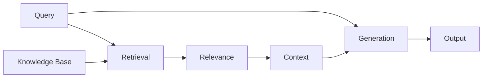
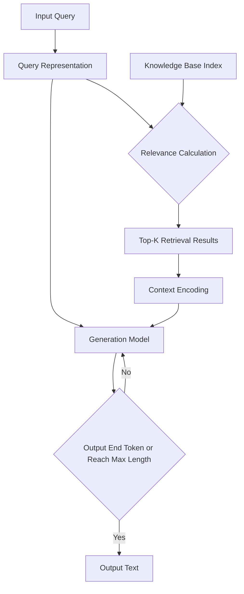

# 【LangChain编程：从入门到实践】检索增强生成实践

作者：禅与计算机程序设计艺术 / Zen and the Art of Computer Programming 

关键词：LangChain, 检索增强, 文本生成, 自然语言处理, 人工智能

## 1. 背景介绍
### 1.1 问题的由来
随着人工智能技术的飞速发展,自然语言处理(NLP)领域取得了巨大的进步。传统的文本生成模型虽然能够生成流畅自然的文本,但往往缺乏事实依据和知识基础,生成的内容难以完全满足实际应用需求。如何让机器不仅能写出通顺的文章,还能根据海量的文本知识进行推理、回答问题,成为了NLP领域亟待解决的难题。

### 1.2 研究现状
近年来,检索增强生成(Retrieval-Augmented Generation,RAG)技术应运而生,为这一问题提供了新的解决思路。RAG通过将大规模语料库中检索到的相关知识融入到生成模型中,使其能够利用丰富的外部信息来完成更加复杂、知识密集型的自然语言任务。微软、Google等科技巨头以及众多学术机构纷纷开展RAG相关研究,取得了一系列突破性进展。

### 1.3 研究意义
RAG技术有望突破传统生成模型的瓶颈,实现更加智能化、个性化的人机交互。它在智能客服、医疗助手、教育辅导等领域具有广阔的应用前景。同时RAG也为认知科学、知识表示等基础研究提供了新的视角。深入探索RAG的理论基础和实现方法,对于推动人工智能走向通用智能具有重要意义。

### 1.4 本文结构
本文将以LangChain为例,全面介绍检索增强生成的理论基础和编程实践。第2节阐述RAG的核心概念;第3节深入分析RAG算法原理;第4节建立RAG的数学模型;第5节给出基于LangChain的代码实现;第6节展望RAG技术的应用前景;第7节推荐相关学习资源;第8节总结全文并探讨RAG未来的机遇与挑战。

## 2. 核心概念与联系
检索增强生成的核心思想是将知识检索与语言生成相结合。传统的生成模型只依赖于自身参数,很难建模海量的世界知识。RAG引入了外部知识库,通过检索获取与输入相关的背景知识,再将其编码为隐空间表示,作为生成模型的附加输入,从而使得生成过程能够利用丰富的先验知识。

RAG涉及的关键概念包括:

- **知识库(Knowledge Base)**: 存储海量结构化或非结构化文本信息的数据集合,为检索提供数据支撑。常见的知识库有维基百科、新闻语料库等。
- **查询(Query)**: 用户输入的自然语言表达,反映了用户的信息需求,是检索的依据。
- **检索(Retrieval)**: 从知识库中找出与查询最相关的若干文档的过程。常用的检索方法有 TF-IDF、BM25等。 
- **相关度(Relevance)**: 衡量文档与查询的语义相似程度。常基于向量空间模型计算余弦相似度。
- **上下文(Context)**: 由检索结果构成的背景知识,为生成模型提供必要的信息。
- **生成(Generation)**: 根据查询和上下文,输出符合要求的目标文本。生成部分一般采用预训练语言模型如GPT、BART等。

这些概念环环相扣,共同组成了RAG的技术框架。下图展示了它们之间的关系:

## 3. 核心算法原理 & 具体操作步骤
### 3.1 算法原理概述
RAG 的整体流程可以分为检索和生成两大步骤。在检索阶段,算法根据输入的查询从知识库中找出最相关的 K 个文档作为上下文。检索结果的质量直接影响到后续生成内容的相关性和可靠性。

得到上下文后,RAG 将其编码为隐空间表示,与查询一起输入到生成模型中,解码出最终的目标文本。生成部分采用了预训练语言模型的思路,通过海量语料的自监督学习,掌握了语言的基本规律,具备了文本生成的能力。同时融入检索结果作为先验知识,可以使生成内容更加合理、有据可依。

### 3.2 算法步骤详解
1. **构建知识库索引**:对原始语料进行预处理(分词、去停用词等),提取文档特征(如 TF-IDF 向量),建立倒排索引,便于后续检索。
2. **查询表示**:将用户输入的自然语言查询映射为低维稠密向量,常用的方法有 Word2Vec、BERT 等。
3. **相关度计算**:遍历知识库中的所有文档,计算其与查询向量的相似度(如余弦相似度),返回得分最高的 K 个文档。
4. **上下文编码**:将 K 个检索结果拼接为上下文,用预训练语言模型的编码器将其转换为隐空间表示。
5. **目标文本生成**:将查询编码和上下文编码一起输入到语言模型的解码器,自回归地预测目标文本的概率分布,选择概率最大的词作为输出。
6. **终止条件判断**:若输出了结束标记或达到最大长度,则停止解码;否则返回步骤5,继续生成下一个词。

算法流程如下图所示:

### 3.3 算法优缺点
RAG 算法的主要优点包括:
- 通过融入外部知识,生成的文本具备更强的信息性和事实准确性。
- 检索部分可以复用现有的成熟技术,实现难度相对较低。
- 端到端可微调,检索和生成可以协同优化,不断提升整体性能。

同时 RAG 也存在一些局限性:
- 生成速度受限于检索效率,在知识库规模较大时难以实时响应。
- 对知识库的质量和覆盖度要求较高,否则生成的内容容易出现错误或不相关的情况。
- 对于复杂推理问题,仅凭借简单的检索可能难以满足。后续还需引入更精细的知识表示和推理机制。

### 3.4 算法应用领域
RAG 技术适用于各类需要利用背景知识的自然语言任务,如:
- 开放域对话:根据话题相关的背景资料丰富对话内容,提升信息量和对话连贯性。
- 问答系统:根据问题从知识库中找出相关线索,组织成完整的答案。
- 文档摘要:从大规模文本集合中筛选出关键信息,归纳生成简明扼要的摘要。
- 内容创作:根据指定主题检索相关素材,辅助创作长文本内容。

## 4. 数学模型和公式 & 详细讲解 & 举例说明
### 4.1 数学模型构建
我们可以用概率图模型来刻画 RAG 的生成过程。记 $q$ 为查询,$c$ 为检索得到的上下文,$y$ 为目标输出。RAG 的目标是学习如下条件概率分布:

$$P(y|q,c) = \prod_{i=1}^n P(y_i|y_{<i},q,c)$$

其中 $y_i$ 表示目标文本的第 $i$ 个词,$y_{<i}$ 为之前生成的 $i-1$ 个词。该公式揭示了 RAG 生成过程的自回归特性,即每个词的生成都依赖于之前的输出。

为了引入检索机制,RAG 进一步假设存在一个潜在变量 $z$ 表示给定查询 $q$ 的理想上下文。检索模型 $P(z|q)$ 和生成模型 $P(y|q,z)$ 可以分别表示为:

$$P(z|q) = \frac{\exp(f(q,z))}{\sum_{z' \in Z} \exp(f(q,z'))}$$

$$P(y|q,z) = \prod_{i=1}^n P(y_i|y_{<i},q,z)$$

其中 $f(q,z)$ 是查询 $q$ 和上下文 $z$ 的相关度评分函数,常基于向量空间模型定义,如:

$$f(q,z) = \frac{q^Tz}{||q|| \cdot ||z||}$$

$Z$ 为所有可能的上下文集合。生成模型 $P(y|q,z)$ 一般基于预训练的语言模型实现。

### 4.2 公式推导过程
根据概率图模型,RAG 的联合概率分布可分解为:

$$P(y,z|q) = P(y|q,z)P(z|q)$$

我们的目标是最大化数据集 $D=\{(q_i,y_i)\}_{i=1}^N$ 的对数似然函数:

$$\mathcal{L}(D) = \sum_{i=1}^N \log P(y_i|q_i) = \sum_{i=1}^N \log \sum_{z \in Z} P(y_i,z|q_i)$$

$$= \sum_{i=1}^N \log \sum_{z \in Z} P(y_i|q_i,z)P(z|q_i)$$

然而直接优化上式中的边缘分布 $\log \sum_{z \in Z} P(y_i,z|q_i)$ 较为困难。一种常用的策略是引入 Evidence Lower Bound(ELBO):

$$\log P(y|q) \geq \mathbb{E}_{z \sim P(z|q)}[\log P(y|q,z)] - \mathrm{KL}[P(z|q)||P(z|q,y)]$$

等号成立当且仅当 $P(z|q)=P(z|q,y)$,即检索分布与后验分布完全吻合。因此我们转化为优化 ELBO 的下界,记作 $\mathcal{L}_{\text{ELBO}}(D)$:

$$\mathcal{L}_{\text{ELBO}}(D) = \sum_{i=1}^N \mathbb{E}_{z \sim P(z|q_i)}[\log P(y_i|q_i,z)] - \sum_{i=1}^N \mathrm{KL}[P(z|q_i)||P(z|q_i,y_i)]$$

其中第一项可以通过采样估计梯度,第二项 KL 散度可以用变分推断的方法近似。

### 4.3 案例分析与讲解
下面我们以一个简单的例子来说明 RAG 的建模过程。假设知识库中只包含三篇文档:

$z_1$: 周杰伦是一位著名的华语歌手。
$z_2$: 周杰伦擅长作曲、作词和唱歌,被誉为"音乐才子"。  
$z_3$: 周杰伦的代表作有《双截棍》、《告白气球》等。

给定一个查询 $q$:"周杰伦最擅长什么?"

首先,我们计算查询 $q$ 与每篇文档的相关度评分 $f(q,z_i)$,假设结果为:

$$f(q,z_1)=0.1, f(q,z_2)=0.6, f(q,z_3)=0.3$$

然后根据相关度评分对文档进行采样,得到一个上下文 $z$,假设采样结果为 $z_2$。

接下来,我们将查询 $q$ 和上下文 $z_2$ 一起输入到生成模型中,得到输出 $y$ 的概率分布:

$$P(y|q,z_2) = P(y_1|q,z_2)P(y_2|y_1,q,z_2)P(y_3|y_1,y_2,q,z_2)...$$

假设生成结果为:"周杰伦最擅长作曲、作词和唱歌。"

最后,我们计算损失函数 $\mathcal{L}_{\text{ELBO}}$ 并进行